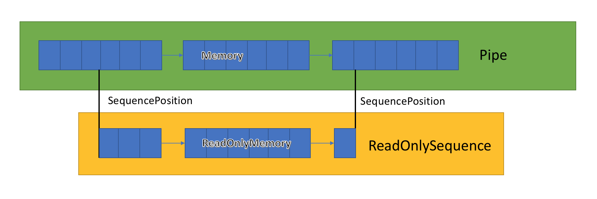

# Work with Buffers in .NET

INTRO NEEDS TO GO HERE

## IBufferWriter\<T\>

<xref:System.Buffers.IBufferWriter%601?displayProperty=fullName> is a contract for synchronous buffered writing. At the lowest level, the interface:

- Is basic and not difficult to use.
- Allows access to a <xref:System.Memory%601> or <xref:System.Span%601>. The `Memory<T>` or `Span<T>` can be written too and you can determine how many `T` items were written.

[!code-csharp[](~/samples/snippets/csharp/buffers/MyClass.cs?name=snippet)]

The preceding method:

- Requests a buffer of at least 5 bytes from the `IBufferWriter<byte>` using `GetSpan(5)`.
- Writes bytes for the ASCII string "Hello" to the returned `Span<byte>`.
- Calls  <xref:System.Buffers.IBufferWriter%601> to indicate how many bytes were written to the buffer.

This method of writing uses the `Memory<T>`/`Span<T>` buffer provided by the `IBufferWriter<T>`. Alternatively, the <xref:System.Buffers.BuffersExtensions.Write%2A> extension method can be used to copy an existing buffer to the `IBufferWriter<T>`. `Write` does the work of calling `GetSpan`/`Advance` as appropriate, so there's no need to call `Advance` after writing:

[!code-csharp[](~/samples/snippets/csharp/buffers/MyClass.cs?name=snippet2)]

<xref:System.Buffers.ArrayBufferWriter%601> is an implementation of `IBufferWriter<T>` whose backing store is a single contiguous array.

### IBufferWriter common problems

- `GetSpan` and `GetMemory` return a buffer with at least the requested amount of memory. Don't assume exact buffer sizes.
- There's no guarantee that successive calls will return the same buffer or the same-sized buffer.
- A new buffer must be requested after calling `Advance` to continue writing more data. A previously acquired buffer cannot be written to.

## ReadOnlySequence\<T\>



<xref:System.Buffers.ReadOnlySequence%601> is a struct that can represent a contiguous or noncontiguous sequence of `T`. It can be constructed from:

1. A `T[]`
1. A `ReadOnlyMemory<T>`
1. A pair of linked list node <xref:System.Buffers.ReadOnlySequenceSegment%601> and index to represent the start and end position of the sequence.

The third representation is the most interesting one as it has performance implications on various operations on the `ReadOnlySequence<T>`:

|Representation|Operation|Complexity|
---|---|---
|`T[]`/`ReadOnlyMemory<T>`|`Length`|`O(1)`
|`T[]`/`ReadOnlyMemory<T>`|`GetPosition(long)`|`O(1)`
|`T[]`/`ReadOnlyMemory<T>`|`Slice(int, int)`|`O(1)`
|`T[]`/`ReadOnlyMemory<T>`|`Slice(SequencePostion,  SequencePostion)`|`O(1)`
|`ReadOnlySequenceSegment<T>`|`Length`|`O(1)`
|`ReadOnlySequenceSegment<T>`|`GetPosition(long)`|`O(number of segments)`
|`ReadOnlySequenceSegment<T>`|`Slice(int, int)`|`O(number of segments)`
|`ReadOnlySequenceSegment<T>`|`Slice(SequencePostion, SequencePostion)`|`O(1)`

Because of this mixed representation, the `ReadOnlySequence<T>` exposes indexes as `SequencePosition` instead of an integer. A `SequencePosition`:

- Is an opaque value that represents an index into the `ReadOnlySequence<T>` where it originated.
- Consists of two parts, an integer and an object. What these two values represent are tied to the implementation of `ReadOnlySequence<T>`.

### Access data

The `ReadOnlySequence<T>` exposes data as an enumerable of `ReadOnlyMemory<T>`. Enumerating each of the segments can be done using a basic foreach:

[!code-csharp[](~/samples/snippets/csharp/buffers/MyClass.cs?name=snippet3)]

The preceding method searches each segment for a specific byte. If you need to keep track of each segment's `SequencePosition`, 
<xref:System.Buffers.ReadOnlySequence%601.TryGet%2A?displayProperty=nameWithType> is more appropriate. The next sample changes the preceding code to return a `SequencePosition` instead of an integer. Returning a `SequencePosition` has the benefit of allowing the caller to avoid a second scan to get the data at a specific index.

[!code-csharp[](~/samples/snippets/csharp/buffers/MyClass.cs?name=snippet4)]

The combination of `SequencePosition` and `TryGet` acts like an enumerator. The position field is modified at the start of each iteration to be start of each segment within the `ReadOnlySequence<T>`.

The preceding method exists as an extension method on `ReadOnlySequence<T>`. <xref:System.Buffers.BuffersExtensions.PositionOf*> can be used to simplify the preceding code:

```csharp
SequencePosition? FindIndexOf(in ReadOnlySequence<byte> buffer, byte data) => buffer.PositionOf(data);
```

#### Process a ReadOnlySequence\<T\>

Processing a `ReadOnlySequence<T>` can be challenging since data may be split across multiple segments within the sequence. For the best performance, split code into two paths:

- A fast path, that deals with the single segment case.
- A slow path that deals with the data split across segments.

There are a few approaches that can be used to process data in multi-segmented sequences:

- Use the [`SequenceReader<T>`](#sequencereadert).
- Parse data segment by segment, keeping track of the `SequencePosition` and index within the segment parsed. This avoids unnecessary allocations but may be inefficient, especially for small buffers.
- Copy the `ReadOnlySequence<T>` to a contiguous array and treat it like a single buffer:
  - If the `ReadOnlySequence<T>` has a length less than 256, it may be reasonable to copy the data into a stack-allocated buffer using the [stackalloc](../../csharp/language-reference/operators/stackalloc.md) operator.
  - Copy the `ReadOnlySequence<T>` into a pooled array using <xref:System.Buffers.ArrayPool%601.Shared%2A?displayProperty=nameWithType>.
  - Use [`ReadOnlySequence<T>.ToArray()`](xref:System.Buffers.BuffersExtensions.ToArray%2A). This isn't recommended in hot paths as it allocates a new `T[]` on the heap.

The following examples demonstrate some common cases for processing `ReadOnlySequence<byte>`:

##### Process binary data

The following example parses a 4-byte big-endian integer length from the start of the `ReadOnlySequence<byte>`.

[!code-csharp[](~/samples/snippets/csharp/buffers/MyClass.cs?name=snippet5)]

##### Process text data

The following example:

- Finds the first newline (`\r\n`) in the `ReadOnlySequence<byte>` and returns it via the out 'line' parameter.
- Trims that line, excluding the `\r\n` from the input buffer.

[!code-csharp[](~/samples/snippets/csharp/buffers/MyClass.cs?name=snippet6)]

##### Empty segments

It's valid to store empty segments inside of a `ReadOnlySequence<T>`. Empty segments may occur while enumerating segments explicitly:

[!code-csharp[](~/samples/snippets/csharp/buffers/MyClass.cs?name=snippet7)]

The preceding code creates a `ReadOnlySequence<byte>` with empty segments and shows how those empty segments affect the various APIs:

- `ReadOnlySequence<T>.Slice` with a `SequencePosition` pointing to an empty segment preserves that segment.
- `ReadOnlySequence<T>.Slice` with an int skips over the empty segments.
- Enumerating the `ReadOnlySequence<T>` enumerates the empty segments.

### Potential problems with ReadOnlySequence\<T> and SequencePosition

There are several unusual outcomes when dealing with a `ReadOnlySequence<T>`/`SequencePosition` vs. a normal `ReadOnlySpan<T>`/`ReadOnlyMemory<T>`/`T[]`/`int`:

- `SequencePosition` is a position marker for a specific `ReadOnlySequence<T>`, not an absolute position. Because it's relative to a specific `ReadOnlySequence<T>`, it doesn't have meaning if used outside of the `ReadOnlySequence<T>` where it originated.
- Arithmetic can't be performed on `SequencePosition` without the `ReadOnlySequence<T>`. That means doing basic things like `position++` is written `ReadOnlySequence<T>.GetPosition(position, 1)`.
- `GetPosition(long)` does **not** support negative indexes. That means it's impossible to get the second to last character without walking all segments.
- Two `SequencePosition` can't be compared, making it difficult to:
  - Know if one position is greater than or less than another position.
  - Write some parsing algorithms.
- `ReadOnlySequence<T>` is bigger than an object reference and should be passed by [in](/dotnet/csharp/language-reference/keywords/in-parameter-modifier) or [ref](/dotnet/csharp/language-reference/keywords/ref) where possible. Passing `ReadOnlySequence<T>` by `in` or `ref` reduces copies of the [struct](../../csharp/language-reference/keywords/struct.md).
- Empty segments:
  - Are valid within a `ReadOnlySequence<T>`
  - Can appear when iterating using `ReadOnlySequence<T>.TryGet` 
  - Can appear slicing the sequence using `ReadOnlySequence<T>.Slice()` with `SequencePosition`(s).

## SequenceReader\<T\>

<xref:System.Buffers.SequenceReader%601>:

- Is a new type that was introduced in .NET Core 3.0 to simplify the processing of a `ReadOnlySequence<T>`.
- Unifies the differences between a single segment `ReadOnlySequence<T>` and multi-segment `ReadOnlySequence<T>`.
- Provides helpers for reading binary and text data (`byte` and `char`) that may or may not be split across segments.

There are built-in methods for dealing with processing both binary and delimited data. The following section demonstrates what those same methods look like with the `SequenceReader<T>`:

### Access data

`SequenceReader<T>` has methods for enumerating data inside of the `ReadOnlySequence<T>` directly. The following code is an example of processing a `ReadOnlySequence<byte>` a `byte` at a time:

[!code-csharp[](~/samples/snippets/csharp/buffers/MyClass.cs?name=snippet8)]

The `CurrentSpan` exposes the current segment's `Span`, which is similar to what was done in the method manually.

### Position

The following code is an example implementation of `FindIndexOf` using the `SequenceReader<T>`:

[!code-csharp[](~/samples/snippets/csharp/buffers/MyClass.cs?name=snippet9)]

### Process binary data

The following example parses a 4-byte big-endian integer length from the start of the `ReadOnlySequence<byte>`.

[!code-csharp[](~/samples/snippets/csharp/buffers/MyClass.cs?name=snippet11)]

### Process text data

[!code-csharp[](~/samples/snippets/csharp/buffers/MyClass.cs?name=snippet10)]

### SequenceReader\<T\> problem areas

- `SequenceReader<T>` is a mutable struct, it should always be passed by [reference](../../csharp/language-reference/keywords/ref.md).
- `SequenceReader<T>` is a [ref struct](../../csharp/language-reference/keywords/ref.md#ref-struct-types) so it can only be used in synchronous methods and can't be stored in fields. For more information, see [Write safe and efficient C# code](../../csharp/write-safe-efficient-code.md).
- `SequenceReader<T>` is a forward-only reader, and `Advance` doesn't support negative numbers.
