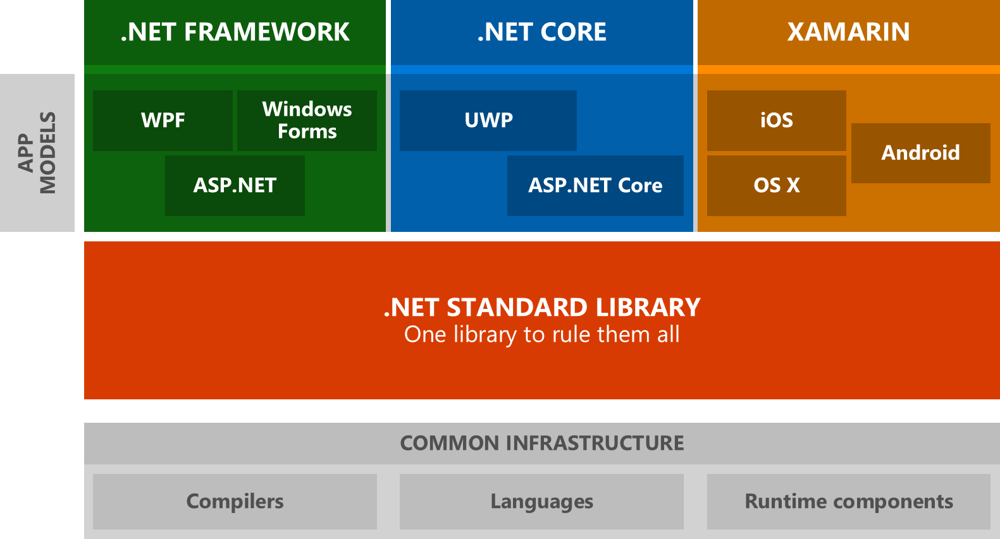
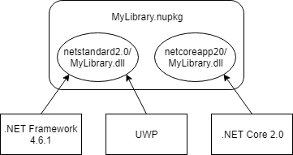

# Cross-platform targeting

Modern .NET supports multiple operating systems and devices. It's important for .NET open-source libraries to support as many developers as possible, whether they're building an ASP.NET website hosted in Azure, or a .NET game in Unity.

## .NET Standard

.NET Standard is the best way to add cross-platform support to a .NET library. [.NET Standard](../net-standard.md) is a specification of .NET APIs that are available on all .NET implementations. Targeting .NET Standard lets you produce libraries that are constrained to use APIs that are in a given version of .NET Standard, which means it's usable by all platforms that implement that version of the .NET Standard.



Targeting .NET Standard, and successfully compiling your project, doesn't guarantee the library will run successfully on all platforms:

1. Platform-specific APIs will fail on other platforms. For example, <xref:Microsoft.Win32.Registry?displayProperty=nameWithType> will succeed on Windows and throw <xref:System.PlatformNotSupportedException> when used on any other OS.
2. APIs can behave differently. For example, reflection APIs have different performance characteristics when an application uses ahead-of-time compilation on iOS or UWP.

> [!TIP]
> The .NET team [offers a Roslyn analyzer](../analyzers/api-analyzer.md) to help you discover possible issues.

**✔️ DO** start with including a `netstandard2.0` target.

> Most general-purpose libraries should not need APIs outside of .NET Standard 2.0. .NET Standard 2.0 is supported by all modern platforms and is the recommended way to support multiple platforms with one target.

**❌ AVOID** including a `netstandard1.x` target.

> .NET Standard 1.x is distributed as a granular set of NuGet packages, which creates a large package dependency graph and results in developers downloading a lot of packages when building. Modern .NET platforms, including .NET Framework 4.6.1, UWP and Xamarin, all support .NET Standard 2.0. You should only target .NET Standard 1.x if you specifically need to target an older platform.

**✔️ DO** include a `netstandard2.0` target if you require a `netstandard1.x` target.

> All platforms supporting .NET Standard 2.0 will use the `netstandard2.0` target and benefit from having a smaller package graph while older platforms will still work and fall back to using the `netstandard1.x` target.

**❌ DO NOT** include a .NET Standard target if the library relies on a platform-specific app model.

> For example, a UWP control toolkit library depends on an app model that is only available on UWP. App model specific APIs will not be available in .NET Standard.

## Multi-targeting

Sometimes you need to access framework-specific APIs from your libraries. The best way to call framework-specific APIs is using multi-targeting, which builds your project for many [.NET target frameworks](../frameworks.md) rather than for just one.

To shield your consumers from having to build for individual frameworks, you should strive to have a .NET Standard output plus one or more framework-specific outputs. With multi-targeting, all assemblies are packaged inside a single NuGet package. Consumers can then reference the same package and NuGet will pick the appropriate implementation. Your .NET Standard library serves as the fallback library that is used everywhere, except for the cases where your NuGet package offers a framework-specific implementation. Multi-targeting allows you to use conditional compilation in your code and call framework-specific APIs.



**✔️ CONSIDER** targeting .NET implementations in addition to .NET Standard.

> Targeting .NET implementations allows you to call platform-specific APIs that are outside of .NET Standard.
>
> Do not drop support for .NET Standard when you do this. Instead, throw from the implementation and offer capability APIs. This way, your library can be used anywhere and supports runtime light-up of features.

**❌ AVOID** using multi-targeting with .NET Standard if your source code is the same for all targets.

> The .NET Standard assembly will automatically be used by NuGet. Targeting individual .NET implementations increases the `*.nupkg` size for no benefit.

**✔️ CONSIDER** adding a target for `net461` when you're offering a `netstandard2.0` target. 

> Using .NET Standard 2.0 from .NET Framework has some issues that were addressed in .NET Framework 4.7.2. You can improve the experience for developers that are still on .NET Framework 4.6.1 - 4.7.1 by offering them a binary that is built for .NET Framework 4.6.1.

**✔️ DO** distribute your library using a NuGet package.

> NuGet will select the best target for the developer and shield them having to pick the appropriate implementation.

**✔️ DO** use a project file's `TargetFrameworks` property when multi-targeting.

```xml
<Project Sdk="Microsoft.NET.Sdk">
  <PropertyGroup>
    <!-- This project will output netstandard2.0 and net461 assemblies -->
    <TargetFrameworks>netstandard2.0;net461</TargetFrameworks>
  </PropertyGroup>
</Project>
```

**✔️ CONSIDER** using [MSBuild.Sdk.Extras](https://github.com/onovotny/MSBuildSdkExtras) when multi-targeting for UWP and Xamarin as it greatly simplifies your project file.

## Older targets

.NET supports targeting versions of the .NET Framework that are long out of support as well as platforms that are no longer commonly used. While there's value in making your library work on as many targets as possible, having to work around missing APIs can add significant overhead. We believe certain frameworks are no longer worth targeting, considering their reach and limitations.

**❌ DO NOT** include a Portable Class Library (PCL) target. For example, `portable-net45+win8+wpa81+wp8`.

> .NET Standard is the modern way to support cross-platform .NET libraries and replaces PCLs.

**❌ DO NOT** include targets for .NET platforms that are no longer supported. For example, `SL4`, `WP`.

>[!div class="step-by-step"]
[Previous](./get-started.md)
[Next](./strong-naming.md)
