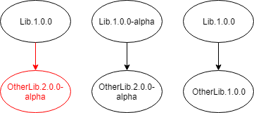

# NuGet

NuGet is a package manager for the .NET ecosystem and is the primary way developers discover and acquire .NET open-source libraries. [NuGet.org](https://www.nuget.org/), a free service provided by Microsoft for hosting NuGet packages, is the primary host for public NuGet packages, but you can publish to custom NuGet services like [MyGet](https://www.myget.org/) and [Azure Artifacts](https://azure.microsoft.com/services/devops/artifacts/).


## Create a NuGet package

A NuGet package (`*.nupkg`) is a zip file that contains .NET assemblies and associated metadata.

There are two main ways to create a NuGet package. The newer and recommended way is to create a package from a SDK-style project (project file whose content starts with `<Project Sdk="Microsoft.NET.Sdk">`). Assemblies and targets are automatically added to the package and remaining metadata is added to the MSBuild file, like package name and version number. Compiling with the [`dotnet pack`](../../core/tools/dotnet-pack.md) command outputs a `*.nupkg` file instead of assemblies.

```xml
<Project Sdk="Microsoft.NET.Sdk">
  <PropertyGroup>
    <TargetFramework>netstandard2.0</TargetFramework>
    <AssemblyName>Contoso.Api</AssemblyName>
    <PackageVersion>1.1.0</PackageVersion>
    <Authors>John Doe</Authors>
  </PropertyGroup>
</Project>
```

The older way of creating a NuGet package is with a `*.nuspec` file and the `nuget.exe` command-line tool. A nuspec file gives you great control but you must carefully specify what assemblies and targets to include in the final NuGet package. It's easy to make a mistake or for someone to forget to update the nuspec when making changes. The advantage of a nuspec is you can use it create NuGet packages for frameworks that don't yet support an SDK-style project file.

**✔️ CONSIDER** using an SDK-style project file to create the NuGet package.

## Package dependencies

NuGet package dependencies are covered in detail in the [Dependencies](./dependencies.md) article.

## Important NuGet package metadata

A NuGet package supports many [metadata properties](/nuget/reference/nuspec). The following table contains the core metadata that every package on NuGet.org should provide:

| MSBuild Property name              | Nuspec name              | Description  |
| ---------------------------------- | ------------------------ | ------------ |
| `PackageId`                        | `id`                       | The package identifier. A prefix from the identifier can be reserved if it meets the [criteria](/nuget/reference/id-prefix-reservation). |
| `PackageVersion`                   | `version`                  | NuGet package version. For more information, see [NuGet package version](./versioning.md#nuget-package-version).             |
| `Title`                            | `title`                    | A human-friendly title of the package. It defaults to the `PackageId`.             |
| `Description`                      | `description`              | A long description of the package displayed in UI.             |
| `Authors`                          | `authors`                  | A comma-separated list of package authors, matching the profile names on nuget.org.             |
| `PackageTags`                      | `tags`                     | A space-delimited list of tags and keywords that describe the package. Tags are used when searching for packages.             |
| `PackageIconUrl`                   | `iconUrl`                  | A URL for an image to use as the icon for the package. URL should be HTTPS and the image should be 64x64 and have a transparent background.             |
| `PackageProjectUrl`                | `projectUrl`               | A URL for the project homepage or source repository.             |
| `PackageLicenseExpression`         | `license`                  | The project license's [SPDX identifier](https://spdx.org/licenses/). Only OSI and FSF approved licenses can use an identifier. Other licenses should use `PackageLicenseFile`. Read more about [`license` metadata](/nuget/reference/nuspec#license). |

> [!IMPORTANT]
> A project without a license defaults to [exclusive copyright](https://choosealicense.com/no-permission/), making it legally impossible for other people to use.

**✔️ CONSIDER** choosing a NuGet package name with a prefix that meets NuGet's prefix reservation [criteria](/nuget/reference/id-prefix-reservation).

**✔️ DO** use an HTTPS href to your package icon.

> Sites like NuGet.org run with HTTPS enabled and displaying a non-HTTPS image will create a mixed content warning.

**✔️ DO** use a package icon image that is 64x64 and has a transparent background for best viewing results.

**✔️ CONSIDER** setting up [SourceLink](./sourcelink.md) to add source control metadata to your assemblies and NuGet package.

> SourceLink automatically adds `RepositoryUrl` and `RepositoryType` metadata to the NuGet package. SourceLink also adds information about the exact source code the package was built from. For example, a package created from a Git repository will have the commit hash added as metadata.

## Pre-release packages

NuGet packages with a version suffix are considered [pre-release](/nuget/create-packages/prerelease-packages). By default, the NuGet Package Manager UI shows stable releases unless a user opts-in to pre-release packages, making pre-release packages ideal for limited user testing.

```xml
<PackageVersion>1.0.1-beta1</PackageVersion>
```

> [!NOTE]
> A stable package cannot depend on a pre-release package. You must either make your own package pre-release or depend on an older stable version.



**✔️ DO** publish a pre-release package when testing, previewing, or experimenting.

**✔️ DO** publish a stable package when its ready so other stable packages can reference it.

## Symbol packages

Symbol files (`*.pdb`) are produced by the .NET compiler alongside assemblies. Symbol files map execution locations to the original source code so you can step through source code as it is running using a debugger. NuGet supports [generating a separate symbol package (`*.snupkg`)](/nuget/create-packages/symbol-packages-snupkg) containing symbol files alongside the main package containing .NET assemblies. The idea of symbol packages is they're hosted on a symbol server and are only downloaded by a tool like Visual Studio on demand.

NuGet.org hosts its own [symbols server repository](/nuget/create-packages/symbol-packages-snupkg#nugetorg-symbol-server). Developers can use the symbols published to the NuGet.org symbol server by adding `https://symbols.nuget.org/download/symbols` to their [symbol sources in Visual Studio](/visualstudio/debugger/specify-symbol-dot-pdb-and-source-files-in-the-visual-studio-debugger).

> [!IMPORTANT]
> The NuGet.org symbol server only supports the new [portable symbol files](https://github.com/dotnet/core/blob/master/Documentation/diagnostics/portable_pdb.md) (`*.pdb`) created by SDK-style projects.
>
> To use the NuGet.org symbol server when debugging a .NET library, developers must have Visual Studio 2017 15.9 or later.

An alternative to creating a symbol package is embedding symbol files in the main NuGet package. The main NuGet package will be larger, but the embedded symbol files means developers don't need to configure the NuGet.org symbol server. If you're building your NuGet package using an SDK-style project, then you can embed symbol files by setting the `AllowedOutputExtensionsInPackageBuildOutputFolder` property:

```xml
<Project Sdk="Microsoft.NET.Sdk">
 <PropertyGroup>
    <!-- Include symbol files (*.pdb) in the built .nupkg -->
    <AllowedOutputExtensionsInPackageBuildOutputFolder>$(AllowedOutputExtensionsInPackageBuildOutputFolder);.pdb</AllowedOutputExtensionsInPackageBuildOutputFolder>
  </PropertyGroup>
</Project>
```

The downside of embedding symbol files is that they increase the package size by about 30% for .NET libraries compiled using SDK-style projects. If package size is a concern, you should publish symbols in a symbol package instead.

**✔️ CONSIDER** publishing symbols as a symbol package (`*.snupkg`) to NuGet.org

> Symbol packages (`*.snupkg`) provide developers a good on-demand debugging experience without bloating the main package size and impacting restore performance for those who don't intend to debug the NuGet package.
>
> The caveat is that they would need to find and configure the NuGet symbol server in their IDE (as a one-time setup) to get symbol files. Visual Studio 2019 plans to provide the NuGet.org symbol server as one of the options out of the box. 


>[!div class="step-by-step"]
>[Previous](strong-naming.md)
>[Next](dependencies.md)
