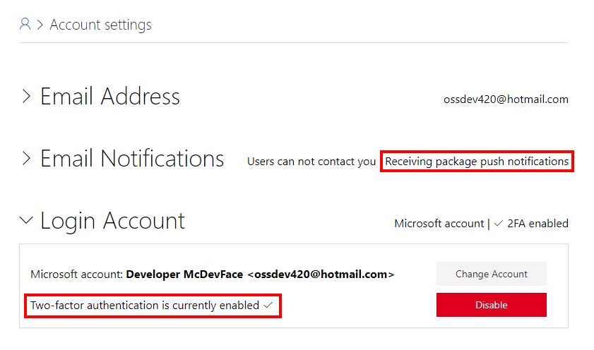

# Publishing a NuGet package

NuGet packages are published and consumed from package repositories. While NuGet.org is the most widely known and used repository, there are many places to publish NuGet packages:

* **[NuGet.org](https://www.nuget.org/)** is the primary online repository for NuGet packages. All packages on NuGet.org are publicly available to everyone. By default, Visual Studio has NuGet.org as a package source and for many developers NuGet.org is the only package repository they'll interact with. NuGet.org is the best place to publish stable packages and pre-release packages that you want community feedback on.

* **[MyGet](https://myget.org/)** is a repository service that supports custom package feeds for open-source projects. A MyGet public custom feed is an ideal place to publish pre-release packages created by your CI service. MyGet also provides private feeds commercially.

* A **[local feed](/nuget/hosting-packages/local-feeds)** allows you to treat a folder like a package repository and makes the `*.nupkg` files in the folder accessible by NuGet. A local feed is useful for testing a NuGet package before publishing it to NuGet.org.

> [!NOTE]
> NuGet.org [does not allow a package to be deleted](/nuget/policies/deleting-packages) once it is uploaded. A package can be unlisted so that it is not publicly visible in the UI but the `*.nupkg` can still be downloaded on restore. Also, nuget.org does not allow duplicate package versions. To correct a NuGet package with an error you have to unlist the incorrect package, increment the version number and publish a new version of the package.

**✔️ DO** [publish stable packages and pre-release packages](/nuget/create-packages/publish-a-package) you want community feedback on to NuGet.org.

**✔️ CONSIDER** publishing pre-release packages to a MyGet feed from a continuous integration build.

**✔️ CONSIDER** testing packages in your development environment using a local feed or MyGet. Check the package works then publish it to NuGet.org.

## NuGet.org security

It's important that bad actors can't access your NuGet account and upload a malicious version of your library. NuGet.org offers two-factor authentication and email notifications when a package is published. Enable these features after logging into NuGet.org on the **Account settings** page.

**✔️ DO** use a Microsoft account to sign in to NuGet.

**✔️ DO** enable two-factor authentication for accessing NuGet.

**✔️ DO** enable email notification when a package is published.

>[!div class="step-by-step"]
>[Previous](sourcelink.md)
>[Next](versioning.md)
