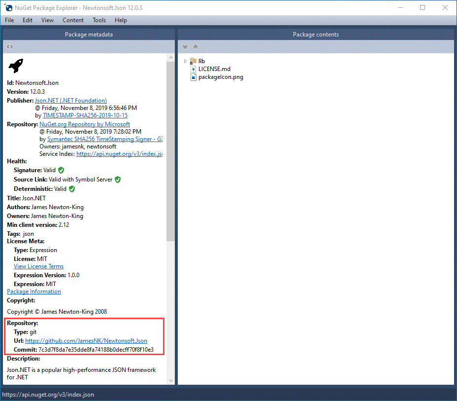

# SourceLink

SourceLink is a technology that enables source code debugging of .NET assemblies from NuGet by developers. SourceLink executes when creating the NuGet package and embeds source control metadata inside assemblies and the package. Developers who download the package and have SourceLink enabled in Visual Studio can step into its source code. SourceLink provides source control metadata to create a great debugging experience.

## SourceLink demo

> [!VIDEO https://www.youtube.com/embed/gyRGhCQPkB4?start=61]

## Using SourceLink

Instructions for using SourceLink can be found on the [dotnet/sourceLink](https://github.com/dotnet/sourcelink/blob/master/README.md) GitHub repository.

You can use [NuGet Package Explorer](https://github.com/NuGetPackageExplorer/NuGetPackageExplorer) to confirm that the SourceLink metadata has been successfully embedded in the package. Check the `Repository` metadata is present with a comment identifier and that .pdb files are located with each target's .dll.

**✔️ CONSIDER** using SourceLink to add source control metadata to your assemblies and NuGet packages.

> [!TIP]
> You can further enhance a developer's debugging experience by adding debugger attributes to your types.
> * <xref:System.Diagnostics.DebuggerDisplayAttribute> can customize how a class or field is displayed in the debugger variable windows.
> * <xref:System.Diagnostics.DebuggerStepThroughAttribute> instructs the debugger to step through the code instead of stepping into the code.
> * <xref:System.Diagnostics.DebuggerBrowsableAttribute> controls whether a member is displayed in the debugger variable windows.

**✔️ CONSIDER** publishing symbol files (`*.pdb`).

> For more information about symbol files and symbol packages, see [Symbol packages](./nuget.md#symbol-packages).

>[!div class="step-by-step"]
>[Previous](dependencies.md)
>[Next](publish-nuget-package.md)
