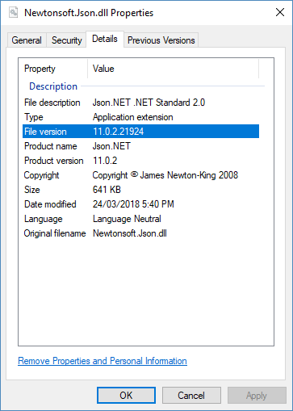

# Versioning

A software library is rarely complete in version 1.0. Good libraries evolve over time, adding features, fixing bugs and improving performance. It is important that you can release new versions of a .NET library, providing additional value with each version, without breaking existing users.

## Breaking changes

For information about handling breaking changes between versions, see [Breaking changes](./breaking-changes.md).

## Version numbers

A .NET library has many ways to specify a version. These versions are the most important:

### NuGet package version

The [NuGet package version](/nuget/reference/package-versioning) is displayed on NuGet.org, the Visual Studio NuGet package manager, and is added to source code when the package is used. The NuGet package version is the version number users will commonly see, and they'll refer to it when they talk about the version of a library they're using. The NuGet package version is used by NuGet and has no effect on runtime behavior.

```xml
<PackageVersion>1.0.0-alpha1</PackageVersion>
```

The NuGet package identifier combined with the NuGet package version is used to identify a package in NuGet. For example, `Newtonsoft.Json` + `11.0.2`. A package with a suffix is a pre-release package and has special behavior that makes it ideal for testing. For more information, see [Pre-release packages](./nuget.md#pre-release-packages).

Because the NuGet package version is the most visible version to developers, it's a good idea to update it using [Semantic Versioning (SemVer)](https://semver.org/). SemVer indicates the significance of changes between release and helps developers make an informed decision when choosing what version to use. For example, going from `1.0` to `2.0` indicates that there are potentially breaking changes.

**✔️ CONSIDER** using [SemVer 2.0.0](https://semver.org/) to version your NuGet package.

**✔️ DO** use the NuGet package version in public documentation as it's the version number that users will commonly see.

**✔️ DO** include a pre-release suffix when releasing a non-stable package.

> Users must opt in to getting pre-release packages, so they will understand that the package is not complete.

### Assembly version

The assembly version is what the CLR uses at runtime to select which version of an assembly to load. Selecting an assembly using versioning only applies to assemblies with a strong name.

```xml
<AssemblyVersion>1.0.0.0</AssemblyVersion>
```

The Windows .NET Framework CLR demands an exact match to load a strong named assembly. For example, `Libary1, Version=1.0.0.0` was compiled with a reference to `Newtonsoft.Json, Version=11.0.0.0`. The .NET Framework will only load that exact version `11.0.0.0`. To load a different version at runtime, a binding redirect must be added to the .NET application's config file.

Strong naming combined with assembly version enables [strict assembly version loading](../../framework/app-domains/assembly-versioning.md). While strong naming a library has a number of benefits, it often results in runtime exceptions that an assembly can't be found and [requires binding redirects](../../framework/configure-apps/redirect-assembly-versions.md) in `app.config`/`web.config` to be fixed. .NET Core assembly loading has been relaxed, and the .NET Core CLR will automatically load assemblies at runtime with a higher version.

**✔️ CONSIDER** only including a major version in the AssemblyVersion.

> e.g. Library 1.0 and Library 1.0.1 both have an AssemblyVersion of `1.0.0.0`, while Library 2.0 has AssemblyVersion of `2.0.0.0`. When the assembly version changes less often, it reduces binding redirects.

**✔️ CONSIDER** keeping the major version number of the AssemblyVersion and the NuGet package version in sync.

> The AssemblyVersion is included in some informational messages displayed to the user, e.g. the assembly name and assembly qualified type names in exception messages. Maintaining a relationship between the versions provides more information to developers about which version they are using.

**❌ DO NOT** have a fixed AssemblyVersion.

> While an unchanging AssemblyVersion avoids the need for binding redirects, it means that only a single version of the assembly can be installed in the Global Assembly Cache (GAC). Also, the applications that reference the assembly in the GAC will break if another application updates the GAC assembly with breaking changes.

### Assembly file version

The assembly file version is used to display a file version in Windows and has no effect on runtime behavior. Setting this version is optional. It's visible in the File Properties dialog in Windows Explorer:

```xml
<FileVersion>11.0.2.21924</FileVersion>
```



**✔️ CONSIDER** including a continuous integration builds number as AssemblyFileVersion revision.

> For example, you are building version 1.0.0 of your project, and the continuous integration build number is 99 so your AssemblyFileVersion is 1.0.0.99.

### Assembly informational version

The assembly informational version is used to record additional version information and has no effect on runtime behavior. Setting this version is optional. If you're using SourceLink, this version will be set on build with the NuGet package version plus a source control version. For example, `1.0.0-beta1+204ff0a` includes the commit hash of the source code the assembly was built from. For more information, see [SourceLink](./sourcelink.md).

```xml
<AssemblyInformationalVersion>The quick brown fox jumped over the lazy dog.</AssemblyInformationalVersion>
```

> [!NOTE]
> An innocuous build warning is raised if this version does not follow the format `Major.Minor.Build.Revision`. The warning can be safely ignored.

**❌ AVOID** setting the assembly informational version yourself.

> Allow SourceLink to automatically generate the version containing NuGet and source control metadata.

>[!div class="step-by-step"]
[Previous](./publish-nuget-package.md)
[Next](./breaking-changes.md)
