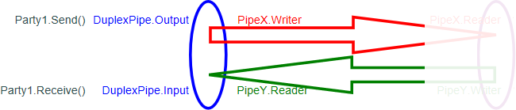
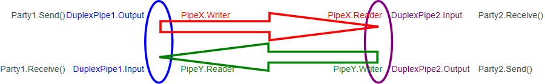
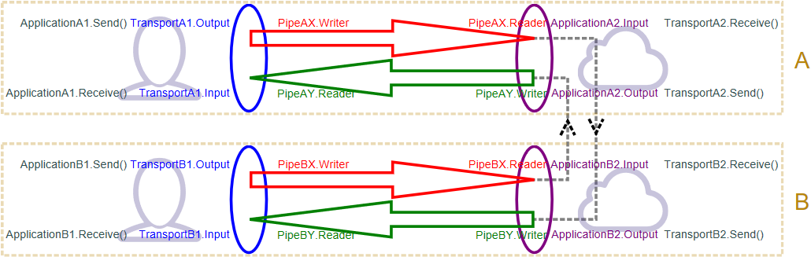

# Pipelines types

## Pipe

We can use <xref:System.Span%601> and <xref:System.Memory%601> to implement various message-passing patterns.
A simple example is a `Pipe`.


A <xref:System.IO.Pipelines.Pipe%601> is a class that [a Producer can use to send data to a Consumer](https://en.wikipedia.org/wiki/Producer–consumer_problem) (one-way).
Conceptually, it looks a lot like a [Stream](https://docs.microsoft.com/dotnet/api/system.io.stream).

Although creating a new Pipe is simple, "closing" it properly is not. You must call `Complete()` on its `Writer` and `Reader`. This will gracefully end the `Receive()` and `Send()` loops (if you have them).

### Simple Pipe sample

```C#
var pipe = new Pipe();

// Producer
pipe.Writer.Write(new ReadOnlySpan<byte>(new byte[] { 0, 1, 2, 3 }));
await pipe.Writer.WriteAsync(new ReadOnlyMemory<byte>(new byte[] { 4, 5, 6, 7 }));

// Consumer
var result = await pipe.Reader.ReadAsync(); // == { 0, 1, 2, 3, 4, 5, 6, 7 }
Console.Out.WriteLine($"{result.Buffer.Length}"); // 8
```

### The `Receive()` loop

Receiving data from a Pipe should be done in a loop with specific patterns.

```C#
private static async Task ReceiveFromPipeLoop(PipeReader pipeReader)
{
    try
    {
        while (true)
        {
            var result = await pipeReader.ReadAsync();
            var buffer = result.Buffer;

            try
            {
                if (!buffer.IsEmpty)
                {
                    Console.Out.WriteLine($"Received {buffer.Length} bytes.");
                }
                else if (result.IsCompleted)
                {
                    break;
                }
            }
            finally
            {
                pipeReader.AdvanceTo(buffer.End);
            }
        }
    }
    finally
    {
        pipeReader.Complete();
    }
}
```

Reading from the Pipe returns a buffer that contains the data. This buffer can also indicate if the Pipe has been canceled or completed (i.e. closed).

Note that this loop can be more complex if you need to buffer the data.

### Pipes in ASP.NET Core

If the Producer acquires the data that it sends through a network connection, it could do (pseudo-code): `var data = await network.ReceiveAsync(); await pipe.Writer.WriteAsync(data);`

However, new APIs have been added to .NET Core 2.1 (especially in the network stacks) so that it can do: `var memory = pipe.Writer.GetMemory(); await network.ReceiveAsync(memory);`
Here, the network connection writes its data straight into the pipe.

In ASP.NET Core, such a Producer can be called a Transport (Refer to the section "Duplex Connection").

## Introducing IDuplexPipe



With a `Pipe`, data flows one-way: One party sends data (the Producer), and the other party receives data (the Consumer).
If you want the data to flow both ways, that is, for both parties to be able to send and receive data from each other, you need DuplexPipes.

A `DuplexPipe` is an endpoint for a party to be a Producer and a Consumer at the same time. It holds the writer of one `Pipe` and the read of another `Pipe`.

A simple example where you would need DuplexPipes is for a [Request/Response pattern](https://en.wikipedia.org/wiki/Request–response).

### Creating a pair of DuplexPipes



A pair is required so each party gets a complementary `DuplexPipe` that represents half of each of the two Pipes.

You typically won't need to implement the <xref:System.IO.Pipelines.IDuplexPipe%601> interface yourself. Instead, you can copy the default implementation provided by [Kestrel](https://github.com/aspnet/AspNetCore/blob/master/src/Servers/Kestrel/Core/src/Internal/DuplexPipe.cs) or by [SignalR](https://github.com/aspnet/AspNetCore/blob/master/src/SignalR/common/Shared/DuplexPipe.cs) (they are identical).

```C#
var pair = DuplexPipe.CreateConnectionPair(PipeOptions.Default, PipeOptions.Default);

// Producer
pair.Transport.Output.Write(new byte[] { 0, 1, 2, 3 });
await pair.Transport.Output.WriteAsync(new ReadOnlyMemory<byte>(new byte[] { 4, 5, 6, 7 }));

// Consumer
var result = await pair.Application.Input.ReadAsync(); // == { 0, 1, 2, 3, 4, 5, 6, 7 }
Console.Out.WriteLine($"{result.Buffer.Length}"); // 8
```

This code is functionally identical to the one in the section "Simple Pipe sample"; however, it illustrates the names changes that occur with DuplexPipe.

### Duplex Connection

When using DuplexPipes to implement a network connection, the convention is to call the parties: Transport and Application.

The Transport is the DuplexPipe used to write (outgoing) data to the network and the Application is the DuplexPipe used by the network connection to write incoming data.

Note: For the Transport party, "Send" and "Receive" can mean two things: The Transport receives data from the network and sends it to the Application. And it receives data from the Application and sends it to the network.
In this tutorial, since we are focused on the pipelines, we use Send and Receive as meaning to/from the Application. However, in actual code, those words may be used for to/from the network.

These parties belong to a network node. So, in a connection between two nodes, Node A and Node B, you will have:



Node A is connected to Node B through their Transports.

Most of the time, Node A will be a computer or smartphone, and Node B will be a Server.
For example: In Kestrel (and other HTTP servers), Node A is the user's browser, Node B is the Kestrel server, and they are connected through a TCP connection. In SignalR, they are instead connected through WebSockets.

## See also

- [Pipelines namespace](xref:System.IO.Pipelines)
- [ASP.NET Core SignalR](https://docs.microsoft.com/aspnet/core/signalr/introduction)
