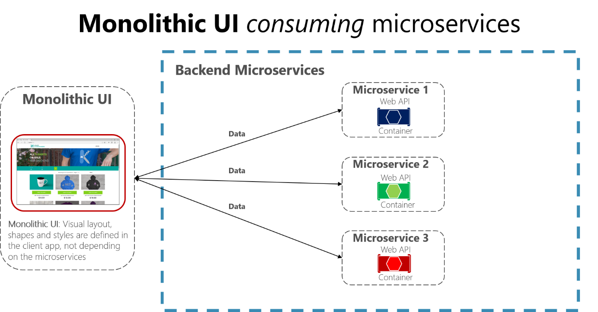

# Asynchronous message-based communication

Asynchronous messaging and event-driven communication are critical when propagating changes across multiple microservices and their related domain models. As mentioned earlier in the discussion microservices and Bounded Contexts (BCs), models (User, Customer, Product, Account, etc.) can mean different things to different microservices or BCs. That means that when changes occur, you need some way to reconcile changes across the different models. A solution is eventual consistency and event-driven communication based on asynchronous messaging.

When using messaging, processes communicate by exchanging messages asynchronously. A client makes a command or a request to a service by sending it a message. If the service needs to reply, it sends a different message back to the client. Since it is a message-based communication, the client assumes that the reply will not be received immediately, and that there might be no response at all.

A message is composed by a header (metadata such as identification or security information) and a body. Messages are usually sent through asynchronous protocols like AMQP.

The preferred infrastructure for this type of communication in the microservices community is a lightweight message broker, which is different than the large brokers and orchestrators used in SOA. In a lightweight message broker, the infrastructure is typically “dumb,” acting only as a message broker, with simple implementations such as RabbitMQ or a scalable service bus in the cloud like Azure Service Bus. In this scenario, most of the “smart” thinking still lives in the endpoints that are producing and consuming messages—that is, in the microservices.

Another rule you should try to follow, as much as possible, is to use only asynchronous messaging between the internal services, and to use synchronous communication (such as HTTP) only from the client apps to the front-end services (API Gateways plus the first level of microservices).

There are two kinds of asynchronous messaging communication: single receiver message-based communication, and multiple receivers message-based communication. In the following sections we provide details about them.

## Single-receiver message-based communication 

Message-based asynchronous communication with a single receiver means there is point-to-point communication that delivers a message to exactly one of the consumers that is reading from the channel, and that the message is processed just once. However, there are special situations. For instance, in a cloud system that tries to automatically recover from failures, the same message could be sent multiple times. Due to network or other failures, the client has to be able to retry sending messages, and the server has to implement an operation to be idempotent in order to process a particular message just once.

Single-receiver message-based communication is especially well suited for sending asynchronous commands from one microservice to another as shown in Figure 4-18 that illustrates this approach.

Once you start sending message-based communication (either with commands or events), you should avoid mixing message-based communication with synchronous HTTP communication.

**Figure 4-18**. A single microservice receiving an asynchronous message

Note that when the commands come from client applications, they can be implemented as HTTP synchronous commands. You should use message-based commands when you need higher scalability or when you are already in a message-based business process.

## Multiple-receivers message-based communication 

As a more flexible approach, you might also want to use a publish/subscribe mechanism so that your communication from the sender will be available to additional subscriber microservices or to external applications. Thus, it helps you to follow the [open/closed principle](https://en.wikipedia.org/wiki/Open/closed_principle) in the sending service. That way, additional subscribers can be added in the future without the need to modify the sender service.

When you use a publish/subscribe communication, you might be using an event bus interface to publish events to any subscriber.

## Asynchronous event-driven communication

When using asynchronous event-driven communication, a microservice publishes an integration event when something happens within its domain and another microservice needs to be aware of it, like a price change in a product catalog microservice. Additional microservices subscribe to the events so they can receive them asynchronously. When that happens, the receivers might update their own domain entities, which can cause more integration events to be published. This publish/subscribe system is usually performed by using an implementation of an event bus. The event bus can be designed as an abstraction or interface, with the API that is needed to subscribe or unsubscribe to events and to publish events. The event bus can also have one or more implementations based on any inter-process and messaging broker, like a messaging queue or service bus that supports asynchronous communication and a publish/subscribe model.

If a system uses eventual consistency driven by integration events, it is recommended that this approach be made completely clear to the end user. The system should not use an approach that mimics integration events, like SignalR or polling systems from the client. The end user and the business owner have to explicitly embrace eventual consistency in the system and realize that in many cases the business does not have any problem with this approach, as long as it is explicit.

As noted earlier in the [Challenges and solutions for distributed data management](#challenges-and-solutions-for-distributed-data-management) section, you can use integration events to implement business tasks that span multiple microservices. Thus you will have eventual consistency between those services. An eventually consistent transaction is made up of a collection of distributed actions. At each action, the related microservice updates a domain entity and publishes another integration event that raises the next action within the same end-to-end business task.

An important point is that you might want to communicate to multiple microservices that are subscribed to the same event. To do so, you can use publish/subscribe messaging based on event-driven communication, as shown in Figure 4-19. This publish/subscribe mechanism is not exclusive to the microservice architecture. It is similar to the way [Bounded Contexts](https://martinfowler.com/bliki/BoundedContext.html) in DDD should communicate, or to the way you propagate updates from the write database to the read database in the [Command and Query Responsibility Segregation (CQRS)](https://martinfowler.com/bliki/CQRS.html) architecture pattern. The goal is to have eventual consistency between multiple data sources across your distributed system.

**Figure 4-19**. Asynchronous event-driven message communication

Your implementation will determine what protocol to use for event-driven, message-based communications. [AMQP](https://en.wikipedia.org/wiki/Advanced_Message_Queuing_Protocol) can help achieve reliable queued communication.

When you use an event bus, you might want to use an abstraction level (like an event bus interface) based on a related implementation in classes with code using the API from a message broker like [RabbitMQ](https://www.rabbitmq.com/) or a service bus like [Azure Service Bus with Topics](https://docs.microsoft.com/azure/service-bus-messaging/service-bus-dotnet-how-to-use-topics-subscriptions). Alternatively, you might want to use a higher-level service bus like NServiceBus, MassTransit, or Brighter to articulate your event bus and publish/subscribe system.

## A note about messaging technologies for production systems

The messaging technologies available for implementing your abstract event bus are at different levels. For instance, products like RabbitMQ (a messaging broker transport) and Azure Service Bus sit at a lower level than other products like, NServiceBus, MassTransit, or Brighter, which can work on top of RabbitMQ and Azure Service Bus. Your choice depends on how many rich features at the application level and out-of-the-box scalability you need for your application. For implementing just a proof-of-concept event bus for your development environment, as we have done in the eShopOnContainers sample, a simple implementation on top of RabbitMQ running on a Docker container might be enough.

However, for mission-critical and production systems that need hyper-scalability, you might want to evaluate Azure Service Bus. For high-level abstractions and features that make the development of distributed applications easier, we recommend that you evaluate other commercial and open-source service buses, such as NServiceBus, MassTransit, and Brighter. Of course, you can build your own service-bus features on top of lower-level technologies like RabbitMQ and Docker. But that plumbing work might cost too much for a custom enterprise application.

## Resiliently publishing to the event bus

A challenge when implementing an event-driven architecture across multiple microservices is how to atomically update state in the original microservice while resiliently publishing its related integration event into the event bus, somehow based on transactions. The following are a few ways to accomplish this, although there could be additional approaches as well.

-   Using a transactional (DTC-based) queue like MSMQ. (However, this is a legacy approach.)

-   Using [transaction log mining](https://www.scoop.it/t/sql-server-transaction-log-mining).

-   Using full [Event Sourcing](https://msdn.microsoft.com/library/dn589792.aspx) pattern.

-   Using the [Outbox pattern](http://gistlabs.com/2014/05/the-outbox/): a transactional database table as a message queue that will be the base for an event-creator component that would create the event and publish it.

Additional topics to consider when using asynchronous communication are message idempotence and message deduplication. These topics are covered in the section [Implementing event-based communication between microservices (integration events)](#implementing_event_based_comms_microserv) later in this guide.

## Additional resources

-   **Event Driven Messaging**
    [*http://soapatterns.org/design\_patterns/event\_driven\_messaging*](http://soapatterns.org/design_patterns/event_driven_messaging)

-   **Publish/Subscribe Channel**
    [*http://www.enterpriseintegrationpatterns.com/patterns/messaging/PublishSubscribeChannel.html*](http://www.enterpriseintegrationpatterns.com/patterns/messaging/PublishSubscribeChannel.html)

-   **Udi Dahan. Clarified CQRS**
    [*http://udidahan.com/2009/12/09/clarified-cqrs/*](http://udidahan.com/2009/12/09/clarified-cqrs/)

-   **Command and Query Responsibility Segregation (CQRS)**
    [*https://docs.microsoft.com/azure/architecture/patterns/cqrs*](https://docs.microsoft.com/azure/architecture/patterns/cqrs)

-   **Communicating Between Bounded Contexts**
    [*https://msdn.microsoft.com/library/jj591572.aspx*](https://msdn.microsoft.com/library/jj591572.aspx)

-   **Eventual consistency**
    [*https://en.wikipedia.org/wiki/Eventual\_consistency*](https://en.wikipedia.org/wiki/Eventual_consistency)

-   **Jimmy Bogard. Refactoring Towards Resilience: Evaluating Coupling**
    [*https://jimmybogard.com/refactoring-towards-resilience-evaluating-coupling/*](https://jimmybogard.com/refactoring-towards-resilience-evaluating-coupling/)

>[!div class="step-by-step"]
[Previous] (communication-in-microservice-architecture.md)
[Next] (maintain-microservice-apis.md)
