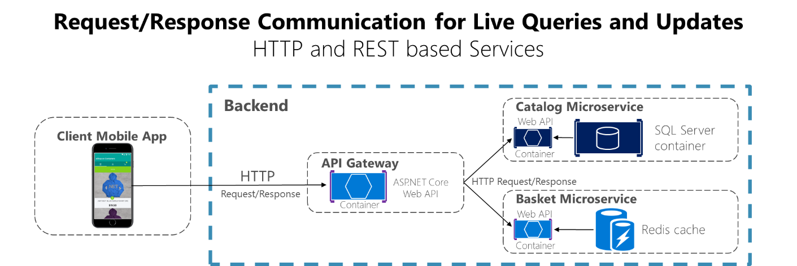
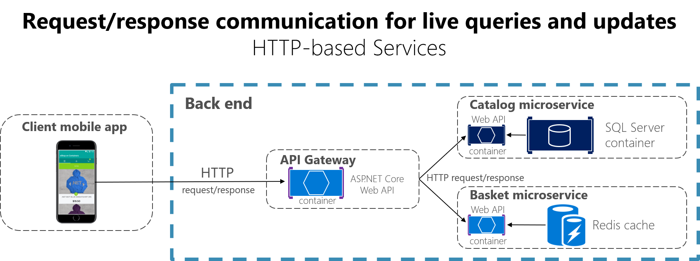

# Communication in a microservice architecture

In a monolithic application running on a single process, components invoke one another using language-level method or function calls. These can be strongly coupled if you are creating objects with code (for example, `new ClassName()`), or can be invoked in a decoupled way if you are using Dependency Injection by referencing abstractions rather than concrete object instances. Either way, the objects are running within the same process. The biggest challenge when changing from a monolithic application to a microservices-based application lies in changing the communication mechanism. A direct conversion from in-process method calls into RPC calls to services will cause a chatty and not efficient communication that will not perform well in distributed environments. The challenges of designing distributed system properly are well enough known that there is even a canon known as the [Fallacies of distributed computing](https://en.wikipedia.org/wiki/Fallacies_of_distributed_computing) that lists assumptions that developers often make when moving from monolithic to distributed designs.

There is not one solution, but several. One solution involves isolating the business microservices as much as possible. You then use asynchronous communication between the internal microservices and replace fine-grained communication that is typical in intra-process communication between objects with coarser-grained communication. You can do this by grouping calls, and by returning data that aggregates the results of multiple internal calls, to the client.

A microservices-based application is a distributed system running on multiple processes or services, usually even across multiple servers or hosts. Each service instance is typically a process. Therefore, services must interact using an inter-process communication protocol such as HTTP, AMQP, or a binary protocol like TCP, depending on the nature of each service.

The microservice community promotes the philosophy of “[smart endpoints and dumb pipes](https://simplicable.com/new/smart-endpoints-and-dumb-pipes).” This slogan encourages a design that is as decoupled as possible between microservices, and as cohesive as possible within a single microservice. As explained earlier, each microservice owns its own data and its own domain logic. But the microservices composing an end-to-end application are usually simply choreographed by using REST communications rather than complex protocols such as WS-\* and flexible event-driven communications instead of centralized business-process-orchestrators.

The two commonly used protocols are HTTP request/response with resource APIs (when querying most of all), and lightweight asynchronous messaging when communicating updates across multiple microservices. These are explained in more detail in the following sections.

## Communication types

Client and services can communicate through many different types of communication, each one targeting a different scenario and goals. Initially, those types of communications can be classified in two axes.

The first axis is defining if the protocol is synchronous or asynchronous:

-   Synchronous protocol. HTTP is a synchronous protocol. The client sends a request and waits for a response from the service. That is independent of the client code execution that could be synchronous (thread is blocked) or asynchronous (thread is not blocked, and the response will reach a callback eventually). The important point here is that the protocol (HTTP/HTTPS) is synchronous and the client code can only continue its task when it receives the HTTP server response.

-   Asynchronous protocol. Other protocols like AMQP (a protocol supported by many operating systems and cloud environments) use asynchronous messages. The client code or message sender usually does not wait for a response. It just sends the message as when sending a message to a RabbitMQ queue or any other message broker.

The second axis is defining if the communication has a single receiver or multiple receivers:

-   Single receiver. Each request must be processed by exactly one receiver or service. An example of this communication is the [Command pattern](https://en.wikipedia.org/wiki/Command_pattern).

-   Multiple receivers. Each request can be processed by zero to multiple receivers. This type of communication must be asynchronous. An example is the [publish/subscribe](https://en.wikipedia.org/wiki/Publish%E2%80%93subscribe_pattern) mechanism used in patterns like [Event-driven architecture](https://microservices.io/patterns/data/event-driven-architecture.html). This is based on an event-bus interface or message broker when propagating data updates between multiple microservices through events; it is usually implemented through a service bus or similar artifact like [Azure Service Bus](https://azure.microsoft.com/services/service-bus/) by using [topics and subscriptions](https://docs.microsoft.com/azure/service-bus-messaging/service-bus-dotnet-how-to-use-topics-subscriptions).

A microservice-based application will often use a combination of these communication styles. The most common type is single-receiver communication with a synchronous protocol like HTTP/HTTPS when invoking a regular Web API HTTP service. Microservices also typically use messaging protocols for asynchronous communication between microservices.

These axes are good to know so you have clarity on the possible communication mechanisms, but they are not the important concerns when building microservices. Neither the asynchronous nature of client thread execution nor the asynchronous nature of the selected protocol are the important points when integrating microservices. What *is* important is being able to integrate your microservices asynchronously while maintaining the independence of microservices, as explained in the following section.

## Asynchronous microservice integration enforces microservice’s autonomy

As mentioned, the important point when building a microservices-based application is the way you integrate your microservices. Ideally, you should try to minimize the communication between the internal microservices. The less communications between microservices, the better. But of course, in many cases you will have to somehow integrate the microservices. When you need to do that, the critical rule here is that the communication between the microservices should be asynchronous. That does not mean that you have to use a specific protocol (for example, asynchronous messaging versus synchronous HTTP). It just means that the communication between microservices should be done only by propagating data asynchronously, but try not to depend on other internal microservices as part of the initial service’s HTTP request/response operation.

If possible, never depend on synchronous communication (request/response) between multiple microservices, not even for queries. The goal of each microservice is to be autonomous and available to the client consumer, even if the other services that are part of the end-to-end application are down or unhealthy. If you think you need to make a call from one microservice to other microservices (like performing an HTTP request for a data query) in order to be able to provide a response to a client application, you have an architecture that will not be resilient when some microservices fail.

Moreover, having HTTP dependencies between microservices, like when creating long request/response cycles with HTTP request chains, as shown in the first part of the Figure 4-15, not only makes your microservices not autonomous but also their performance is impacted as soon as one of the services in that chain is not performing well. 

The more you add synchronous dependencies between microservices, such as query requests, the worse the overall response time gets for the client apps.

**Figure 4-15**. Anti-patterns and patterns in communication between microservices

If your microservice needs to raise an additional action in another microservice, if possible, do not perform that action synchronously and as part of the original microservice request and reply operation. Instead, do it asynchronously (using asynchronous messaging or integration events, queues, etc.). But, as much as possible, do not invoke the action synchronously as part of the original synchronous request and reply operation.

And finally (and this is where most of the issues arise when building microservices), if your initial microservice needs data that is originally owned by other microservices, do not rely on making synchronous requests for that data. Instead, replicate or propagate that data (only the attributes you need) into the initial service’s database by using eventual consistency (typically by using integration events, as explained in upcoming sections).

As noted earlier in the section [Identifying domain-model boundaries for each microservice](#identifying-domain-model-boundaries-for-each-microservice), duplicating some data across several microservices is not an incorrect design—on the contrary, when doing that you can translate the data into the specific language or terms of that additional domain or Bounded Context. For instance, in the [eShopOnContainers](http://aka.ms/MicroservicesArchitecture) application you have a microservice named identity.api that is in charge of most of the user’s data with an entity named User. However, when you need to store data about the user within the Ordering microservice, you store it as a different entity named Buyer. The Buyer entity shares the same identity with the original User entity, but it might have only the few attributes needed by the Ordering domain, and not the whole user profile.

You might use any protocol to communicate and propagate data asynchronously across microservices in order to have eventual consistency. As mentioned, you could use integration events using an event bus or message broker or you could even use HTTP by polling the other services instead. It does not matter. The important rule is to not create synchronous dependencies between your microservices.

The following sections explain the multiple communication styles you can consider using in a microservice-based application.

## Communication styles

There are many protocols and choices you can use for communication, depending on the communication type you want to use. If you are using a synchronous request/response-based communication mechanism, protocols such as HTTP and REST approaches are the most common, especially if you are publishing your services outside the Docker host or microservice cluster. If you are communicating between services internally (within your Docker host or microservices cluster) you might also want to use binary format communication mechanisms (like Service Fabric remoting or WCF using TCP and binary format). Alternatively, you can use asynchronous, message-based communication mechanisms such as AMQP.

There are also multiple message formats like JSON or XML, or even binary formats, which can be more efficient. If your chosen binary format is not a standard, it is probably not a good idea to publicly publish your services using that format. You could use a non-standard format for internal communication between your microservices. You might do this when communicating between microservices within your Docker host or microservice cluster (Docker orchestrators or Azure Service Fabric), or for proprietary client applications that talk to the microservices.

### Request/response communication with HTTP and REST 

When a client uses request/response communication, it sends a request to a service, then the service processes the request and sends back a response. Request/response communication is especially well suited for querying data for a real-time UI (a live user interface) from client apps. Therefore, in a microservice architecture you will probably use this communication mechanism for most queries, as shown in Figure 4-16.

**Figure 4-16**. Using HTTP request/response communication (synchronous or asynchronous)

When a client uses request/response communication, it assumes that the response will arrive in a short time, typically less than a second, or a few seconds at most. For delayed responses, you need to implement asynchronous communication based on [messaging patterns](https://docs.microsoft.com/azure/architecture/patterns/category/messaging) and [messaging technologies](https://en.wikipedia.org/wiki/Message-oriented_middleware), which is a different approach that we explain in the next section.

A popular architectural style for request/response communication is [REST](https://en.wikipedia.org/wiki/Representational_state_transfer). This approach is based on, and tightly coupled to, the [HTTP](https://en.wikipedia.org/wiki/Hypertext_Transfer_Protocol) protocol, embracing HTTP verbs like GET, POST, and PUT. REST is the most commonly used architectural communication approach when creating services. You can implement REST services when you develop ASP.NET Core Web API services.

There is additional value when using HTTP REST services as your interface definition language. For instance, if you use [Swagger metadata](https://swagger.io/) to describe your service API, you can use tools that generate client stubs that can directly discover and consume your services.

### Additional resources

-   **Martin Fowler. Richardson Maturity Model.** A description of the REST model.
    [*https://martinfowler.com/articles/richardsonMaturityModel.html*](https://martinfowler.com/articles/richardsonMaturityModel.html)

-   **Swagger.** The official site.
    [*https://swagger.io/*](https://swagger.io/)

### Push and real-time communication based on HTTP

Another possibility (usually for different purposes than REST) is a real-time and one-to-many communication with higher-level frameworks such as [ASP.NET SignalR](https://www.asp.net/signalr) and protocols such as [WebSockets](https://en.wikipedia.org/wiki/WebSocket).

As Figure 4-17 shows, real-time HTTP communication means that you can have server code pushing content to connected clients as the data becomes available, rather than having the server wait for a client to request new data.

**Figure 4-17**. One-to-one real-time asynchronous message communication

Since communication is in real time, client apps show the changes almost instantly. This is usually handled by a protocol such as WebSockets, using many WebSockets connections (one per client). A typical example is when a service communicates a change in the score of a sports game to many client web apps simultaneously.

>[!div class="step-by-step"]
[Previous] (direct-client-to-microservice-communication-versus-the-api-gateway-pattern.md)
[Next] (asynchronous-message-based-communication.md)
