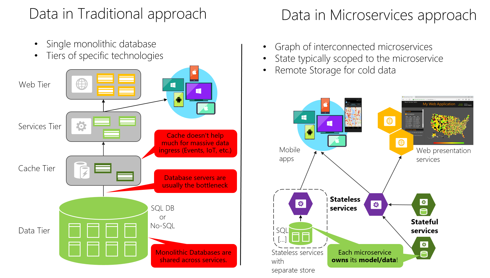

# Data sovereignty per microservice

An important rule for microservices architecture is that each microservice must own its domain data and logic. Just as a full application owns its logic and data, so must each microservice own its logic and data under an autonomous lifecycle, with independent deployment per microservice.

This means that the conceptual model of the domain will differ between subsystems or microservices. Consider enterprise applications, where customer relationship management (CRM) applications, transactional purchase subsystems, and customer support subsystems each call on unique customer entity attributes and data, and where each employs a different Bounded Context (BC).

This principle is similar in [Domain-driven design (DDD)](https://en.wikipedia.org/wiki/Domain-driven_design), where each [Bounded Context](https://martinfowler.com/bliki/BoundedContext.html) or autonomous subsystem or service must own its domain model (data plus logic and behavior). Each DDD Bounded Context correlates to one business microservice (one or several services). This point about the Bounded Context pattern is expanded in the next section.

On the other hand, the traditional (monolithic data) approach used in many applications is to have a single centralized database or just a few databases. This is often a normalized SQL database that's used for the whole application and all its internal subsystems, as shown in Figure 4-7.

**Figure 4-7**. Data sovereignty comparison: monolithic database versus microservices

The centralized database approach initially looks simpler and seems to enable reuse of entities in different subsystems to make everything consistent. But the reality is you end up with huge tables that serve many different subsystems, and that include attributes and columns that aren't needed in most cases. It's like trying to use the same physical map for hiking a short trail, taking a day-long car trip, and learning geography.

A monolithic application with typically a single relational database has two important benefits: [ACID transactions](https://en.wikipedia.org/wiki/ACID) and the SQL language, both working across all the tables and data related to your application. This approach provides a way to easily write a query that combines data from multiple tables.

However, data access becomes much more complex when you move to a microservices architecture. But even when ACID transactions can or should be used within a microservice or Bounded Context, the data owned by each microservice is private to that microservice and can only be accessed via its microservice API. Encapsulating the data ensures that the microservices are loosely coupled and can evolve independently of one another. If multiple services were accessing the same data, schema updates would require coordinated updates to all the services. This would break the microservice lifecycle autonomy. But distributed data structures mean that you can't make a single ACID transaction across microservices. This in turn means you must use eventual consistency when a business process spans multiple microservices. This is much harder to implement than simple SQL joins, because you can't create integrity constraints or use distributed transactions between separate databases, as we'll explain later on. Similarly, many other relational database features aren't available across multiple microservices.

Going even further, different microservices often use different *kinds* of databases. Modern applications store and process diverse kinds of data, and a relational database isn't always the best choice. For some use cases, a NoSQL database such as Azure CosmosDB or MongoDB might have a more convenient data model and offer better performance and scalability than a SQL database like SQL Server or Azure SQL Database. In other cases, a relational database is still the best approach. Therefore, microservices-based applications often use a mixture of SQL and NoSQL databases, which is sometimes called the [polyglot persistence](https://martinfowler.com/bliki/PolyglotPersistence.html) approach.

A partitioned, polyglot-persistent architecture for data storage has many benefits. These include loosely coupled services and better performance, scalability, costs, and manageability. However, it can introduce some distributed data management challenges, as explained in "[Identifying domain-model boundaries](identify-microservice-domain-model-boundaries.md)" later in this chapter.

## The relationship between microservices and the Bounded Context pattern

The concept of microservice derives from the [Bounded Context (BC) pattern](https://martinfowler.com/bliki/BoundedContext.html) in [domain-driven design (DDD)](https://en.wikipedia.org/wiki/Domain-driven_design). DDD deals with large models by dividing them into multiple BCs and being explicit about their boundaries. Each BC must have its own model and database; likewise, each microservice owns its related data. In addition, each BC usually has its own [ubiquitous language](https://martinfowler.com/bliki/UbiquitousLanguage.html) to help communication between software developers and domain experts.

Those terms (mainly domain entities) in the ubiquitous language can have different names in different Bounded Contexts, even when different domain entities share the same identity (that is, the unique ID that's used to read the entity from storage). For instance, in a user-profile Bounded Context, the User domain entity might share identity with the Buyer domain entity in the ordering Bounded Context.

A microservice is therefore like a Bounded Context, but it also specifies that it's a distributed service. It's built as a separate process for each Bounded Context, and it must use the distributed protocols noted earlier, like HTTP/HTTPS, WebSockets, or [AMQP](https://en.wikipedia.org/wiki/Advanced_Message_Queuing_Protocol). The Bounded Context pattern, however, doesn't specify whether the Bounded Context is a distributed service or if it's simply a logical boundary (such as a generic subsystem) within a monolithic-deployment application.

It's important to highlight that defining a service for each Bounded Context is a good place to start. But you don't have to constrain your design to it. Sometimes you must design a Bounded Context or business microservice composed of several physical services. But ultimately, both patterns -Bounded Context and microservice- are closely related.

DDD benefits from microservices by getting real boundaries in the form of distributed microservices. But ideas like not sharing the model between microservices are what you also want in a Bounded Context.

### Additional resources

- **Chris Richardson. Pattern: Database per service** \
  <https://microservices.io/patterns/data/database-per-service.html>

- **Martin Fowler. BoundedContext** \
  <https://martinfowler.com/bliki/BoundedContext.html>

- **Martin Fowler. PolyglotPersistence** \
  <https://martinfowler.com/bliki/PolyglotPersistence.html>

- **Alberto Brandolini. Strategic Domain Driven Design with Context Mapping** \
  <https://www.infoq.com/articles/ddd-contextmapping>

>[!div class="step-by-step"]
>[Previous](microservices-architecture.md)
>[Next](logical-versus-physical-architecture.md)
