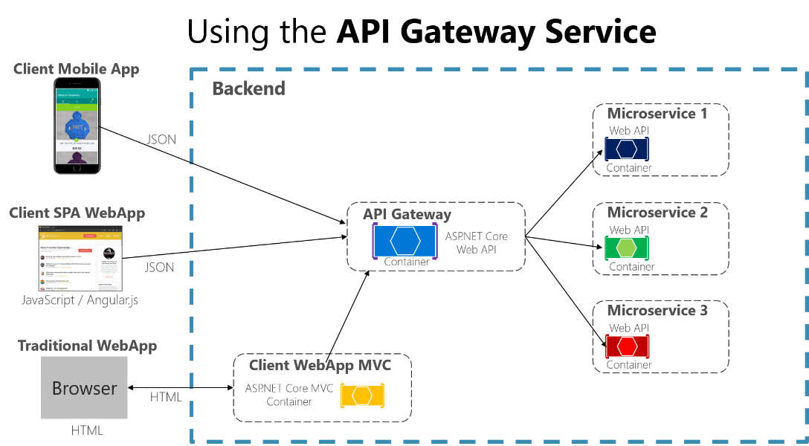
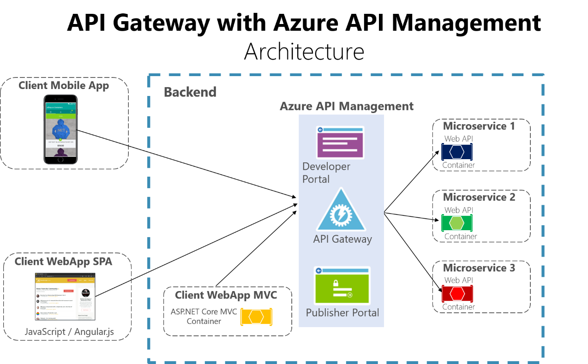

# Direct client-to-microservice communication versus the API Gateway pattern

In a microservices architecture, each microservice exposes a set of (typically) fine‑grained endpoints. This fact can impact the client‑to‑microservice communication, as explained in this section.

## Direct client-to-microservice communication

A possible approach is to use a direct client-to-microservice communication architecture. In this approach, a client app can make requests directly to some of the microservices, as shown in Figure 4-12.

**Figure 4-12**. Using a direct client-to-microservice communication architecture

In this approach. each microservice has a public endpoint, sometimes with a different TCP port for each microservice. An example of a URL for a particular service could be the following URL in Azure:

<http://eshoponcontainers.westus.cloudapp.azure.com:88/>

In a production environment based on a cluster, that URL would map to the load balancer used in the cluster, which in turn distributes the requests across the microservices. In production environments, you could have an Application Delivery Controller (ADC) like [Azure Application Gateway](https://docs.microsoft.com/azure/application-gateway/application-gateway-introduction) between your microservices and the Internet. This acts as a transparent tier that not only performs load balancing, but secures your services by offering SSL termination. This improves the load of your hosts by offloading CPU-intensive SSL termination and other routing duties to the Azure Application Gateway. In any case, a load balancer and ADC are transparent from a logical application architecture point of view.

A direct client-to-microservice communication architecture could be good enough for a small microservice-based application, especially if the client app is a server-side web application like an ASP.NET MVC app. However, when you build large and complex microservice-based applications (for example, when handling dozens of microservice types), and especially when the client apps are remote mobile apps or SPA web applications, that approach faces a few issues.

Consider the following questions when developing a large application based on microservices:

-   *How can client apps minimize the number of requests to the backend and reduce chatty communication to multiple microservices?*

Interacting with multiple microservices to build a single UI screen increases the number of roundtrips across the Internet. This increases latency and complexity on the UI side. Ideally, responses should be efficiently aggregated in the server side—this reduces latency, since multiple pieces of data come back in parallel and some UI can show data as soon as it is ready.

-   *How can you handle cross-cutting concerns such as authorization, data transformations, and dynamic request dispatching?*

Implementing security and cross-cutting concerns like security and authorization on every microservice can require significant development effort. A possible approach is to have those services within the Docker host or internal cluster, in order to restrict direct access to them from the outside, and to implement those cross-cutting concerns in a centralized place, like an API Gateway.

-   *How can client apps communicate with services that use non-Internet-friendly protocols?*

Protocols used on the server side (like AMQP or binary protocols) are usually not supported in client apps. Therefore, requests must be performed through protocols like HTTP/HTTPS and translated to the other protocols afterwards. A *man-in-the-middle* approach can help in this situation.

-   *How can you shape a façade especially made for mobile apps?*

The API of multiple microservices might not be well designed for the needs of different client applications. For instance, the needs of a mobile app might be different than the needs of a web app. For mobile apps, you might need to optimize even further so that data responses can be more efficient. You might do this by aggregating data from multiple microservices and returning a single set of data, and sometimes eliminating any data in the response that is not needed by the mobile app. And, of course, you might compress that data. Again, a façade or API in between the mobile app and the microservices can be convenient for this scenario.

## Using an API Gateway

When you design and build large or complex microservice-based applications with multiple client apps, a good approach to consider can be an [API Gateway](https://microservices.io/patterns/apigateway.html). This is a service that provides a single entry point for certain groups of microservices. It is similar to the [Facade pattern](https://en.wikipedia.org/wiki/Facade_pattern) from object‑oriented design, but in this case, it is part of a distributed system. 
The API Gateway pattern is also sometimes known as the “backend for frontend” [(BFF)](https://samnewman.io/patterns/architectural/bff/) because you build it while thinking about the needs of the client app.

Figure 4-13 shows how a custom API Gateway can fit into a microservice-based architecture.
It is important to highlight that in that diagram, you would be using a single custom API Gateway service facing multiple and different client apps. That fact can be an important risk because your API Gateway service will be growing and evolving based on many different requirements from the client apps. Eventually, it will be bloated because of those different needs and effectively it could be pretty similar to a monolithic application or monolithic service. That is why it is very much recommended to split the API Gateway in multiple services or multiple smaller API Gateways, one per form-factor type, for instance.

**Figure 4-13**. Using an API Gateway implemented as a custom Web API service

In this example, the API Gateway would be implemented as a custom Web API service running as a container.

As mentioned, you should implement several API Gateways so that you can have a different façade for the needs of each client app. Each API Gateway can provide a different API tailored for each client app, possibly even based on the client form factor by implementing specific adapter code which underneath calls multiple internal microservices.

Since a custom API Gateway is usually a data aggregator, you need to be careful with it. Usually it isn't a good idea to have a single API Gateway aggregating all the internal microservices of your application. If it does, it acts as a monolithic aggregator or orchestrator and violates microservice autonomy by coupling all the microservices. Therefore, the API Gateways should be segregated based on business boundaries and not act as an aggregator for the whole application.

Sometimes a granular API Gateway can also be a microservice by itself, and even have a domain or business name and related data. Having the API Gateway’s boundaries dictated by the business or domain will help you to get a better design.

Granularity in the API Gateway tier can be especially useful for more advanced composite UI applications based on microservices, because the concept of a fine-grained API Gateway is similar to a UI composition service. We discuss this later in the [Creating composite UI based on microservices](#creating-composite-ui-based-on-microservices-including-visual-ui-shape-and-layout-generated-by-multiple-microservices).

Therefore, for many medium- and large-size applications, using a custom-built API Gateway is usually a good approach, but not as a single monolithic aggregator or unique central custom API Gateway.

Another approach is to use a product like [Azure API Management](https://azure.microsoft.com/services/api-management/) as shown in Figure 4-14. This approach not only solves your API Gateway needs, but provides features like gathering insights from your APIs. If you are using an API management solution, an API Gateway is only a component within that full API management solution.

**Figure 4-14**. Using Azure API Management for your API Gateway

In this case, when using a product like Azure API Management, the fact that you might have a single API Gateway is not so risky because these kinds of API Gateways are "thinner", meaning that you don't implement custom C# code that could evolve towards a monolithic component. 

This type of product acts more like a reverse proxy for ingress communication, where you can also filter the APIs from the internal microservices plus apply authorization to the published APIs in this single tier.

The insights available from an API Management system help you get an understanding of how your APIs are being used and how they are performing. They do this by letting you view near real-time analytics reports and identifying trends that might impact your business. Plus, you can have logs about request and response activity for further online and offline analysis.

With Azure API Management, you can secure your APIs using a key, a token, and IP filtering. These features let you enforce flexible and fine-grained quotas and rate limits, modify the shape and behavior of your APIs using policies, and improve performance with response caching.

In this guide and the reference sample application (eShopOnContainers), we are limiting the architecture to a simpler and custom-made containerized architecture in order to focus on plain containers without using PaaS products like Azure API Management. But for large microservice-based applications that are deployed into Microsoft Azure, we encourage you to review and adopt Azure API Management as the base for your API Gateways.

## Drawbacks of the API Gateway pattern

-   The most important drawback is that when you implement an API Gateway, you are coupling that tier with the internal microservices. Coupling like this might introduce serious difficulties for your application. Clemens Vaster, architect at the Azure Service Bus team, refers to this potential difficulty as “the new ESB” in his "[Messaging and Microservices](https://www.youtube.com/watch?v=rXi5CLjIQ9k)" session at GOTO 2016.

-   Using a microservices API Gateway creates an additional possible single point of failure.

-   An API Gateway can introduce increased response time due to the additional network call. However, this extra call usually has less impact than having a client interface that is too chatty directly calling the internal microservices.

-   If not scaled out properly, the API Gateway can become a bottleneck.

-   An API Gateway requires additional development cost and future maintenance if it includes custom logic and data aggregation. Developers must update the API Gateway in order to expose each microservice’s endpoints. Moreover, implementation changes in the internal microservices might cause code changes at the API Gateway level. However, if the API Gateway is just applying security, logging, and versioning (as when using Azure API Management), this additional development cost might not apply.

-   If the API Gateway is developed by a single team, there can be a development bottleneck. This is another reason why a better approach is to have several fined-grained API Gateways that respond to different client needs. You could also segregate the API Gateway internally into multiple areas or layers that are owned by the different teams working on the internal microservices.

## Additional resources

-   **Charles Richardson. Pattern: API Gateway / Backend for Front-End**
    [*https://microservices.io/patterns/apigateway.html*](https://microservices.io/patterns/apigateway.html)

-   **Azure API Management**
    [*https://azure.microsoft.com/services/api-management/*](https://azure.microsoft.com/services/api-management/)

-   **Udi Dahan. Service Oriented Composition**\
    [*http://udidahan.com/2014/07/30/service-oriented-composition-with-video/*](http://udidahan.com/2014/07/30/service-oriented-composition-with-video/)

-   **Clemens Vasters. Messaging and Microservices at GOTO 2016** (video)
    [*https://www.youtube.com/watch?v=rXi5CLjIQ9k*](https://www.youtube.com/watch?v=rXi5CLjIQ9k)

>[!div class="step-by-step"]
[Previous] (identify-microservice-domain-model-boundaries.md)
[Next] (communication-in-microservice-architecture.md)
