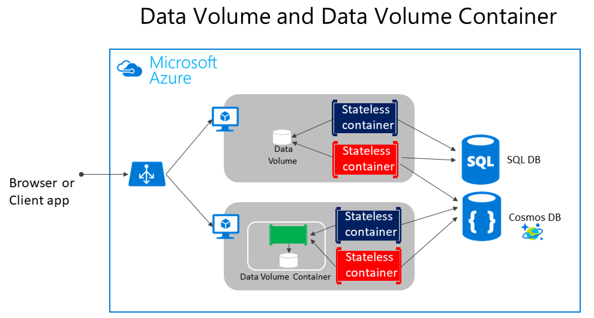

# State and data in Docker applications

In most cases, you can think of a container as an instance of a process. A process does not maintain persistent state. While a container can write to its local storage, assuming that an instance will be around indefinitely would be like assuming that a single location in memory will be durable. Container images, like processes, should be assumed to have multiple instances or that they will eventually be killed; if they’re managed with a container orchestrator, it should be assumed that they might get moved from one node or VM to another.

Docker provides a feature named the *overlay file system*. This implements a copy-on-write task that stores updated information to the root file system of the container. That information is in addition to the original image on which the container is based. If the container is deleted from the system, those changes are lost. Therefore, while it is possible to save the state of a container within its local storage, designing a system around this would conflict with the premise of container design, which by default is stateless.

The following solutions are used to manage persistent data in Docker applications:

-   [Data volumes](https://docs.docker.com/engine/tutorials/dockervolumes/) that mount to the host.

-   [Data volume containers](https://docs.docker.com/engine/tutorials/dockervolumes/#creating-and-mounting-a-data-volume-container) that provide shared storage across containers using an external container.

-   [Volume plugins](https://docs.docker.com/engine/tutorials/dockervolumes/) that mount volumes to remote services, providing long-term persistence.

-   [Azure Storage](https://docs.microsoft.com/azure/storage/), which provides geo-distributable storage, providing a good long-term persistence solution for containers.

-   Remote relational databases like [Azure SQL Database](https://azure.microsoft.com/services/sql-database/) or NoSQL databases like [Azure Cosmos DB](https://docs.microsoft.com/azure/cosmos-db/introduction), or cache services like [Redis](https://redis.io/).

The following provides more detail about these options.

**Data volumes** are directories mapped from the host OS to directories in containers. When code in the container has access to the directory, that access is actually to a directory on the host OS. This directory is not tied to the lifetime of the container itself, and the directory can be accessed from code running directly on the host OS or by another container that maps the same host directory to itself. Thus, data volumes are designed to persist data independently of the life of the container. If you delete a container or an image from the Docker host, the data persisted in the data volume is not deleted. The data in a volume can be accessed from the host OS as well.

**Data volume containers** are an evolution of regular data volumes. A data volume container is a simple container that has one or more data volumes within it. The data volume container provides access to containers from a central mount point. This method of data access is convenient because it abstracts the location of the original data. Other than that, its behavior is similar to that of a regular data volume, so data is persisted in this dedicated container independently of the lifecycle of the application’s containers.

As shown in Figure 4-5, regular Docker volumes can be stored outside of the containers themselves but within the physical boundaries of the host server or VM. However, Docker containers cannot access a volume from one host server or VM to another. In other words, with these volumes, it is not possible to manage data shared between containers that run on different Docker hosts

**Figure 4-5**. Data volumes and external data sources for container-based applications

In addition, when Docker containers are managed by an orchestrator, containers might “move” between hosts, depending on the optimizations performed by the cluster. Therefore, it is not recommended that you use data volumes for business data. But they are a good mechanism to work with trace files, temporal files, or similar that will not impact business data consistency.

**Volume plugins** like [Flocker](https://clusterhq.com/flocker/) provide data access across all hosts in a cluster. While not all volume plugins are created equally, volume plugins typically provide externalized persistent reliable storage from immutable containers.

**Remote data sources and cache** tools like Azure SQL Database, Azure Cosmos DB, or a remote cache like Redis can be used in containerized applications the same way they are used when developing without containers. This is a proven way to store business application data.

**Azure Storage.** Business data usually will need to be placed in external resources or databases, like Azure Storage. Azure Storage, in concrete, provides the following services in the cloud:

-   Blob storage stores unstructured object data. A blob can be any type of text or binary data, such as document or media files (images, audio, and video files). Blob storage is also referred to as Object storage.

-   File storage offers shared storage for legacy applications using standard SMB protocol. Azure virtual machines and cloud services can share file data across application components via mounted shares. On-premises applications can access file data in a share via the File service REST API.

-   Table storage stores structured datasets. Table storage is a NoSQL key-attribute data store, which allows rapid development and fast access to large quantities of data.

**Relational databases and NoSQL databases.** There are many choices for external databases, from relational databases like SQL Server, PostgreSQL, Oracle, or NoSQL databases like Azure Cosmos DB, MongoDB, etc. These databases are not going to be explained as part of this guide since they are in a completely different subject.

>[!div class="step-by-step"]
[Previous] (containerize-monolithic-applications.md)
[Next] (service-oriented-architecture.md)
