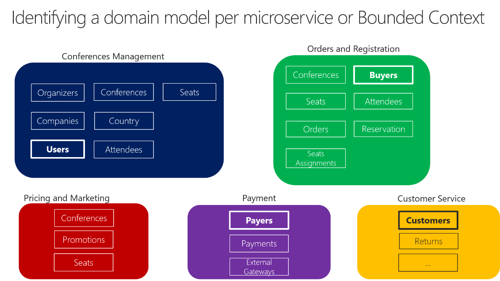
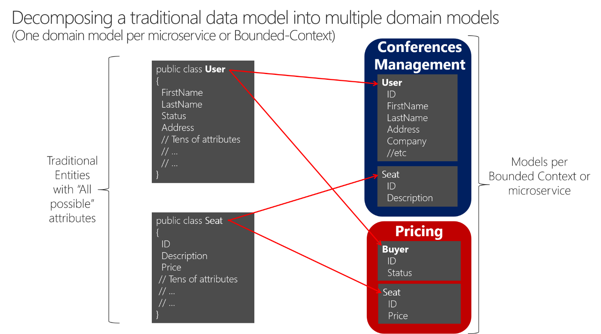

# Identify domain-model boundaries for each microservice

The goal when identifying model boundaries and size for each microservice is not to get to the most granular separation possible, although you should tend toward small microservices if possible. Instead, your goal should be to get to the most meaningful separation guided by your domain knowledge. The emphasis is not on the size, but instead on business capabilities. In addition, if there is clear cohesion needed for a certain area of the application based on a high number of dependencies, that indicates the need for a single microservice, too. Cohesion is a way to identify how to break apart or group together microservices. Ultimately, while you gain more knowledge about the domain, you should adapt the size of your microservice, iteratively. Finding the right size is not a one-shot process.

[Sam Newman](https://samnewman.io/), a recognized promoter of microservices and author of the book [Building Microservices](https://samnewman.io/books/building_microservices/), highlights that you should design your microservices based on the Bounded Context (BC) pattern (part of domain-driven design), as introduced earlier. Sometimes, a BC could be composed of several physical services, but not vice versa.

A domain model with specific domain entities applies within a concrete BC or microservice. A BC delimits the applicability of a domain model and gives developer team members a clear and shared understanding of what must be cohesive and what can be developed independently. These are the same goals for microservices.

Another tool that informs your design choice is [Conway’s law](https://en.wikipedia.org/wiki/Conway%27s_law), which states that an application will reflect the social boundaries of the organization that produced it. But sometimes the opposite is true—the company’s organization is formed by the software. You might need to reverse Conway’s law and build the boundaries the way you want the company to be organized, leaning toward business process consulting.

In order to identify bounded contexts, a DDD pattern that can be used for this is the [Context Mapping pattern](https://www.infoq.com/articles/ddd-contextmapping). With Context Mapping, you identify the various contexts in the application and their boundaries. It is common to have a different context and boundary for each small subsystem, for instance. The Context Map is a way to define and make explicit those boundaries between domains. A BC is autonomous and includes the details of a single domain—details like the domain entities—and defines integration contracts with other BCs. This is similar to the definition of a microservice: it is autonomous, it implements certain domain capability, and it must provide interfaces. This is why Context Mapping and the Bounded Context pattern are good approaches for identifying the domain model boundaries of your microservices.

When designing a large application, you will see how its domain model can be fragmented — a domain expert from the catalog domain will name entities differently in the catalog and inventory domains than a shipping domain expert, for instance. Or the user domain entity might be different in size and number of attributes when dealing with a CRM expert who wants to store every detail about the customer than for an ordering domain expert who just needs partial data about the customer. It is very hard to disambiguate all domain terms across all the domains related to a large application. But the most important thing is that you should not try to unify the terms; instead, accept the differences and richness provided by each domain. If you try to have a unified database for the whole application, attempts at a unified vocabulary will be awkward and will not sound right to any of the multiple domain experts. Therefore, BCs (implemented as microservices) will help you to clarify where you can use certain domain terms and where you will need to split the system and create additional BCs with different domains.

You will know that you got the right boundaries and sizes of each BC and domain model if you have few strong relationships between domain models, and you do not usually need to merge information from multiple domain models when performing typical application operations.

Perhaps the best answer to the question of how big a domain model for each microservice should be is the following: it should have an autonomous BC, as isolated as possible, that enables you to work without having to constantly switch to other contexts (other microservice’s models). In Figure 4-10 you can see how multiple microservices (multiple BCs) each have their own model and how their entities can be defined, depending on the specific requirements for each of the identified domains in your application.

**Figure 4-10**. Identifying entities and microservice model boundaries

Figure 4-10 illustrates a sample scenario related to an online conference management system. You have identified several BCs that could be implemented as microservices, based on domains that domain experts defined for you. As you can see, there are entities that are present just in a single microservice model, like Payments in the Payment microservice. Those will be easy to implement.

However, you might also have entities that have a different shape but share the same identity across the multiple domain models from the multiple microservices. For example, the User entity is identified in the Conferences Management microservice. That same user, with the same identity, is the one named Buyers in the Ordering microservice, or the one named Payer in the Payment microservice, and even the one named Customer in the Customer Service microservice. This is because, depending on the [ubiquitous language](https://martinfowler.com/bliki/UbiquitousLanguage.html) that each domain expert is using, a user might have a different perspective even with different attributes. The user entity in the microservice model named Conferences Management might have most of its personal data attributes. However, that same user in the shape of Payer in the microservice Payment or in the shape of Customer in the microservice Customer Service might not need the same list of attributes.

A similar approach is illustrated in Figure 4-11.

**Figure 4-11**. Decomposing traditional data models into multiple domain models

You can see how the user is present in the Conferences Management microservice model as the User entity and is also present in the form of the Buyer entity in the Pricing microservice, with alternate attributes or details about the user when it is actually a buyer. Each microservice or BC might not need all the data related to a User entity, just part of it, depending on the problem to solve or the context. For instance, in the Pricing microservice model, you do not need the address or the ID of the user, just ID (as identity) and Status, which will have an impact on discounts when pricing the seats per buyer.

The Seat entity has the same name but different attributes in each domain model. However, Seat shares identity based on the same ID, as happens with User and Buyer.

Basically, there is a shared concept of a user that exists in multiple services (domains), which all share the identity of that user. But in each domain model there might be additional or different details about the user entity. Therefore, there needs to be a way to map a user entity from one domain (microservice) to another.

There are several benefits to not sharing the same user entity with the same number of attributes across domains. One benefit is to reduce duplication, so that microservice models do not have any data that they do not need. Another benefit is having a master microservice that owns a certain type of data per entity so that updates and queries for that type of data are driven only by that microservice.

>[!div class="step-by-step"]
[Previous] (distributed-data-management.md)
[Next] (direct-client-to-microservice-communication-versus-the-api-gateway-pattern.md)
