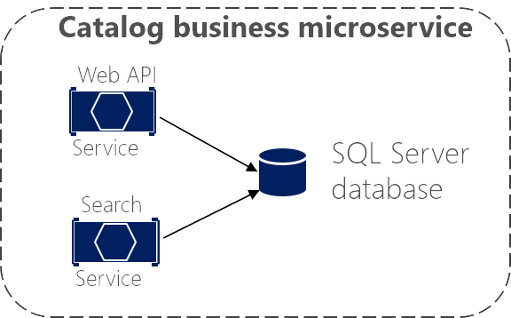

# Logical architecture versus physical architecture

It's useful at this point to stop and discuss the distinction between logical architecture and physical architecture, and how this applies to the design of microservice-based applications.

To begin, building microservices doesn't require the use of any specific technology. For instance, Docker containers aren't mandatory to create a microservice-based architecture. Those microservices could also be run as plain processes. Microservices is a logical architecture.

Moreover, even when a microservice could be physically implemented as a single service, process, or container (for simplicity's sake, that is the approach taken in the initial version of [eShopOnContainers](https://aka.ms/MicroservicesArchitecture)), this parity between business microservice and physical service or container isn't necessarily required in all cases when you build a large and complex application composed of many dozens or even hundreds of services.

This is where there is a difference between an application's logical architecture and physical architecture. The logical architecture and logical boundaries of a system do not necessarily map one-to-one to the physical or deployment architecture. It can happen, but it often doesn't.

Although you might have identified certain business microservices or Bounded Contexts, it doesn't mean that the best way to implement them is always by creating a single service (such as an ASP.NET Web API) or single Docker container for each business microservice. Having a rule saying each business microservice has to be implemented using a single service or container is too rigid.

Therefore, a business microservice or Bounded Context is a logical architecture that might coincide (or not) with physical architecture. The important point is that a business microservice or Bounded Context must be autonomous by allowing code and state to be independently versioned, deployed, and scaled.

As Figure 4-8 shows, the catalog business microservice could be composed of several services or processes. These could be multiple ASP.NET Web API services or any other kind of services using HTTP or any other protocol. More importantly, the services could share the same data, as long as these services are cohesive with respect to the same business domain.

**Figure 4-8**. Business microservice with several physical services

The services in the example share the same data model because the Web API service targets the same data as the Search service. So, in the physical implementation of the business microservice, you are splitting that functionality so you can scale each of those internal services up or down as needed. Maybe the Web API service usually needs more instances than the Search service, or vice versa.

In short, the logical architecture of microservices doesn't always have to coincide with the physical deployment architecture. In this guide, whenever we mention a microservice, we mean a business or logical microservice that could map to one or more (physical) services. In most cases, this will be a single service, but it might be more.

>[!div class="step-by-step"]
[Previous](data-sovereignty-per-microservice.md)
[Next](distributed-data-management.md)