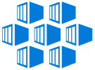

# Orchestrating microservices and multi-container applications for high scalability and availability

Using orchestrators for production-ready applications is essential if your application is based on microservices or simply split across multiple containers. As introduced previously, in a microservice-based approach, each microservice owns its model and data so that it will be autonomous from a development and deployment point of view. But even if you have a more traditional application that's composed of multiple services (like SOA), you'll also have multiple containers or services comprising a single business application that need to be deployed as a distributed system. These kinds of systems are complex to scale out and manage; therefore, you absolutely need an orchestrator if you want to have a production-ready and scalable multi-container application.

Figure 4-23 illustrates deployment into a cluster of an application composed of multiple microservices (containers).

**Figure 4-23**. A cluster of containers

It looks like a logical approach. But how are you handling load-balancing, routing, and orchestrating these composed applications?

The plain Docker Engine in single Docker hosts meets the needs of managing single image instances on one host, but it falls short when it comes to managing multiple containers deployed on multiple hosts for more complex distributed applications. In most cases, you need a management platform that will automatically start containers, scale-out containers with multiple instances per image, suspend them or shut them down when needed, and ideally also control how they access resources like the network and data storage.

To go beyond the management of individual containers or very simple composed apps and move toward larger enterprise applications with microservices, you must turn to orchestration and clustering platforms.

From an architecture and development point of view, if you're building large enterprise composed of microservices-based applications, it's important to understand the following platforms and products that support advanced scenarios:

**Clusters and orchestrators.** When you need to scale out applications across many Docker hosts, as when a large microservice-based application, it's critical to be able to manage all those hosts as a single cluster by abstracting the complexity of the underlying platform. That's what the container clusters and orchestrators provide. Examples of orchestrators are Azure Service Fabric and Kubernetes. Kubernetes is available in Azure through Azure Kubernetes Service.

**Schedulers.** *Scheduling* means to have the capability for an administrator to launch containers in a cluster so they also provide a UI. A cluster scheduler has several responsibilities: to use the cluster's resources efficiently, to set the constraints provided by the user, to efficiently load-balance containers across nodes or hosts, and to be robust against errors while providing high availability.

The concepts of a cluster and a scheduler are closely related, so the products provided by different vendors often provide both sets of capabilities. The following list shows the most important platform and software choices you have for clusters and schedulers. These orchestrators are generally offered in public clouds like Azure.

## Software platforms for container clustering, orchestration, and scheduling

### Kubernetes

> [*Kubernetes*](https://kubernetes.io/) is an open-source product that provides functionality that ranges from cluster infrastructure and container scheduling to orchestrating capabilities. It lets you automate deployment, scaling, and operations of application containers across clusters of hosts.
>
> *Kubernetes* provides a container-centric infrastructure that groups application containers into logical units for easy management and discovery.
>
> *Kubernetes* is mature in Linux, less mature in Windows.

### Azure Kubernetes Service (AKS)

> [Azure Kubernetes Service (AKS)](https://azure.microsoft.com/services/kubernetes-service/) is a managed Kubernetes container orchestration service in Azure that simplifies Kubernetes cluster’s management, deployment, and operations.

### Azure Service Fabric

> [Service Fabric](https://docs.microsoft.com/azure/service-fabric/service-fabric-overview) is a Microsoft microservices platform for building applications. It's an [orchestrator](https://docs.microsoft.com/azure/service-fabric/service-fabric-cluster-resource-manager-introduction) of services and creates clusters of machines. Service Fabric can deploy services as containers or as plain processes. It can even mix services in processes with services in containers within the same application and cluster.
>
> *Service Fabric* clusters can be deployed in Azure, on-premises or in any cloud. However, deployment in Azure is simplified with a managed approach.
>
> *Service Fabric* provides additional and optional prescriptive [Service Fabric programming models](https://docs.microsoft.com/azure/service-fabric/service-fabric-choose-framework) like [stateful services](https://docs.microsoft.com/azure/service-fabric/service-fabric-reliable-services-introduction) and [Reliable Actors](https://docs.microsoft.com/azure/service-fabric/service-fabric-reliable-actors-introduction).
>
> *Service Fabric* is mature in Windows (years evolving in Windows), less mature in Linux.
>
> Both Linux and Windows containers are supported in Service Fabric since 2017.

### Azure Service Fabric Mesh

> [*Azure Service Fabric Mesh*](https://docs.microsoft.com/azure/service-fabric-mesh/service-fabric-mesh-overview) offers the same reliability, mission-critical performance and scale than Service Fabric, but offering a fully managed and serverless platform. You don't need to manage a cluster, VMs, storage or networking configuration. You just focus on your application's development.
>
> *Service Fabric Mesh* supports both Windows and Linux containers allowing you to develop with any programming language and framework of your choice.

## Using container-based orchestrators in Microsoft Azure

Several cloud vendors offer Docker containers support plus Docker clusters and orchestration support, including Microsoft Azure, Amazon EC2 Container Service, and Google Container Engine. Microsoft Azure provides Docker cluster and orchestrator support through Azure Kubernetes Service (AKS) and Azure Service Fabric and Azure Service Fabric Mesh.

## Using Azure Kubernetes Service

A Kubernetes cluster pools multiple Docker hosts and exposes them as a single virtual Docker host, so you can deploy multiple containers into the cluster and scale-out with any number of container instances. The cluster will handle all the complex management plumbing, like scalability, health, and so forth.

AKS provides a way to simplify the creation, configuration, and management of a cluster of virtual machines in Azure that are preconfigured to run containerized applications. Using an optimized configuration of popular open-source scheduling and orchestration tools, AKS enables you to use your existing skills or draw on a large and growing body of community expertise to deploy and manage container-based applications on Microsoft Azure.

Azure Kubernetes Service optimizes the configuration of popular Docker clustering open-source tools and technologies specifically for Azure. You get an open solution that offers portability for both your containers and your application configuration. You select the size, the number of hosts, and the orchestrator tools, and AKS handles everything else.

**Figure 4-24**. Kubernetes cluster's simplified structure and topology

In figure 4-24 you can see the structure of a Kubernetes cluster where a master node (VM) controls most of the coordination of the cluster and you can deploy containers to the rest of the nodes which are managed as a single pool from an application point of view and allows you to scale to thousands or even tens of thousands of containers.

## Development environment for Kubernetes

In the development environment, [Docker announced in July 2018](https://blog.docker.com/2018/07/kubernetes-is-now-available-in-docker-desktop-stable-channel/) that Kubernetes can also run in a single development machine (Windows 10 or macOS) by simply installing [Docker Desktop](https://docs.docker.com/install/). You can later deploy to the cloud (AKS) for further integration tests, as shown in figure 4-25.

 

**Figure 4-25**. Running Kubernetes in dev machine and the cloud

## Getting started with Azure Kubernetes Service (AKS) 

To begin using AKS, you deploy an AKS cluster from the Azure portal or by using th CLI. For more information on deploying an Azure Container Service cluster, see [Deploy an Azure Kubernetes Service (AKS) cluster](https://docs.microsoft.com/azure/aks/kubernetes-walkthrough-portal).

There are no fees for any of the software installed by default as part of AKS. All default options are implemented with open-source software. AKS is available for multiple virtual machines in Azure. You're charged only for the compute instances you choose, as well as the other underlying infrastructure resources consumed, such as storage and networking. There are no incremental charges for AKS itself.

For further implementation information on deployment to Kubernetes based on kubectl and original .yaml files, check the post on [Setting eShopOnContainers up in AKS (Azure Kubernetes Service)](https://github.com/dotnet-architecture/eShopOnContainers/wiki/10.-Setting-the-solution-up-in-AKS-(Azure-Kubernetes-Service)).

## Deploying with Helm charts into Kubernetes clusters

When deploying an application to a Kubernetes cluster, you can use the original kubectl.exe CLI tool using deployment files based on the native format (.yaml files), as already mentioned in the previous section. However, for more complex Kubernetes applications such as when deploying complex microservice-based applications, it's recommended to use [Helm](https://helm.sh/).

Helm Charts helps you define, version, install, share, upgrade or rollback even the most complex Kubernetes application.

Going further, Helm usage is also recommended because additional Kubernetes environments in Azure, such as [Azure Dev Spaces](https://docs.microsoft.com/azure/dev-spaces/azure-dev-spaces) are also based on Helm charts.

Helm is maintained by the [Cloud Native Computing Foundation (CNCF)](https://www.cncf.io/) - in collaboration with Microsoft, Google, Bitnami and the Helm contributor community.

For further implementation information on Helm charts and Kubernetes check the post on [Using Helm Charts to deploy eShopOnContainers to AKS](https://github.com/dotnet-architecture/eShopOnContainers/wiki/10.1-Deploying-to-AKS-using-Helm-Charts).

## Use Azure Dev Spaces for your Kubernetes application lifecycle

[Azure Dev Spaces](https://docs.microsoft.com/azure/dev-spaces/azure-dev-spaces) provides a rapid, iterative Kubernetes development experience for teams. With minimal dev machine setup, you can iteratively run and debug containers directly in Azure Kubernetes Service (AKS). Develop on Windows, Mac, or Linux using familiar tools like Visual Studio, Visual Studio Code, or the command line.

As mentioned, Azure Dev Spaces uses Helm charts when deploying the container-based applications.

Azure Dev Spaces helps development teams be more productive on Kubernetes because it allows you to rapidly iterate and debug code directly in a global Kubernetes cluster in Azure by simply using Visual Studio 2017 or Visual Studio Code. That Kubernetes cluster in Azure is a shared managed Kubernetes cluster, so your team can collaboratively work together. You can develop your code in isolation, then deploy to the global cluster and do end-to-end testing with other components without replicating or mocking up dependencies.

As shown in figure 4-26, the most differential feature in Azure Dev Spaces is capability of creating 'spaces' that can run integrated to the rest of the global deployment in the cluster.

**Figure 4-26**. Using multiple spaces in Azure Dev Spaces

Basically you can set up a shared dev space in Azure. Each developer can focus on just their part of the application, and can iteratively develop pre-commit code in a dev space that already contains all the other services and cloud resources that their scenarios depend on. Dependencies are always up-to-date, and developers are working in a way that mirrors production.

Azure Dev Spaces provides the concept of a space, which allows you to work in isolation, and without the fear of breaking your team members. This feature is based on URL pre-fixes, so if using any dev space prefix in the URL, for every container's request, it will run a special version of the container is deployed for that space it it exists. Otherwise, it will run the global/consolidated version.

You can see the [eShopOnContainers wiki page on Azure Dev Spaces](https://github.com/dotnet-architecture/eShopOnContainers/wiki/10.2-Using-Azure-Dev-Spaces-and-AKS), to get a practical view on a concrete example.

For further information check the article on [Team Development with Azure Dev Spaces](https://docs.microsoft.com/azure/dev-spaces/team-development-netcore).

## Additional resources

- **Getting started with Azure Kubernetes Service (AKS)** \
  [*https://docs.microsoft.com/azure/aks/kubernetes-walkthrough-portal*](https://docs.microsoft.com/azure/aks/kubernetes-walkthrough-portal)

- **Azure Dev Spaces** \
  [*https://docs.microsoft.com/azure/dev-spaces/azure-dev-spaces*](https://docs.microsoft.com/azure/dev-spaces/azure-dev-spaces)

- **Kubernetes** The official site. \
  [*https://kubernetes.io/*](https://kubernetes.io/)

>[!div class="step-by-step"]
>[Previous](resilient-high-availability-microservices.md)
>[Next](using-azure-service-fabric.md)
