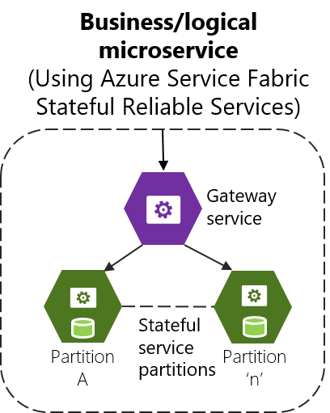
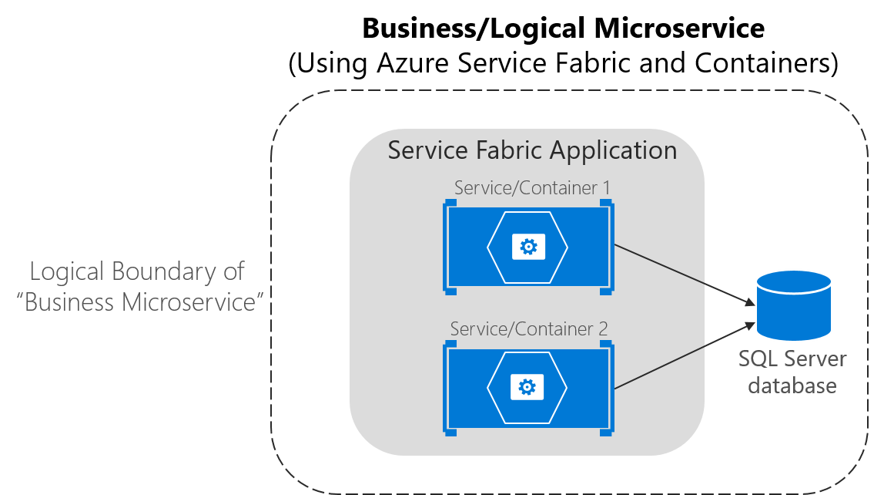

# Using Azure Service Fabric

Azure Service Fabric arose from Microsoft’s transition from delivering box products, which were typically monolithic in style, to delivering services. The experience of building and operating large services at scale, such as Azure SQL Database, Azure Cosmos DB, Azure Service Bus, or Cortana’s Backend, shaped Service Fabric. The platform evolved over time as more and more services adopted it. Importantly, Service Fabric had to run not only in Azure but also in standalone Windows Server deployments.

The aim of Service Fabric is to solve the hard problems of building and running a service and utilizing infrastructure resources efficiently, so that teams can solve business problems using a microservices approach.

Service Fabric provides two broad areas to help you build applications that use a microservices approach:

-   A platform that provides system services to deploy, scale, upgrade, detect, and restart failed services, discover service location, manage state, and monitor health. These system services in effect enable many of the characteristics of microservices described previously.

-   Programming APIs, or frameworks, to help you build applications as microservices: [reliable actors and reliable services](https://docs.microsoft.com/azure/service-fabric/service-fabric-choose-framework). Of course, you can choose any code to build your microservice, but these APIs make the job more straightforward, and they integrate with the platform at a deeper level. This way you can get health and diagnostics information, or you can take advantage of reliable state management.

Service Fabric is agnostic with respect to how you build your service, and you can use any technology. However, it provides built-in programming APIs that make it easier to build microservices.

As shown in Figure 4-26, you can create and run microservices in Service Fabric either as simple processes or as Docker containers. It is also possible to mix container-based microservices with process-based microservices within the same Service Fabric cluster.

**Figure 4-26**. Deploying microservices as processes or as containers in Azure Service Fabric

Service Fabric clusters based on Linux and Windows hosts can run Docker Linux containers and Windows Containers, respectively.

For up-to-date information about containers support in Azure Service Fabric, see [Service Fabric and containers](https://docs.microsoft.com/azure/service-fabric/service-fabric-containers-overview).

Service Fabric is a good example of a platform where you can define a different logical architecture (business microservices or Bounded Contexts) than the physical implementation that were introduced in the [Logical architecture versus physical architecture](#logical-architecture-versus-physical-architecture) section. For example, if you implement [Stateful Reliable Services](https://docs.microsoft.com/azure/service-fabric/service-fabric-reliable-services-introduction) in [Azure Service Fabric](https://docs.microsoft.com/azure/service-fabric/service-fabric-overview), which are introduced in the section [Stateless versus stateful microservices](#stateless-versus-stateful-microservices) later, you can have a business microservice concept with multiple physical services.

As shown in Figure 4-27, and thinking from a logical/business microservice perspective, when implementing a Service Fabric Stateful Reliable Service, you usually will need to implement two tiers of services. The first is the back-end stateful reliable service, which handles multiple partitions (each partition is a stateful service). The second is the front-end service, or Gateway service, in charge of routing and data aggregation across multiple partitions or stateful service instances. That Gateway service also handles client-side communication with retry loops accessing the backend service.
It is called a Gateway service if you implement your custom service, or alternatevely you can also use the out-of-the-box Service Fabric [Reverse Proxy service](https://docs.microsoft.com/azure/service-fabric/service-fabric-reverseproxy).

**Figure 4-27**. Business microservice with several stateful service instances and a custom gateway front-end

In any case, when you use Service Fabric Stateful Reliable Services, you also have a logical or business microservice (Bounded Context) that is usually composed of multiple physical services. Each of them, the Gateway service and Partition service could be implemented as ASP.NET Web API services, as shown in Figure 4-26.

In Service Fabric, you can group and deploy groups of services as a [Service Fabric Application](https://docs.microsoft.com/azure/service-fabric/service-fabric-application-model), which is the unit of packaging and deployment for the orchestrator or cluster. Therefore, the Service Fabric Application could be mapped to this autonomous business and logical microservice boundary or Bounded Context, as well, so you could deploy these services autonomously.

## Service Fabric and containers

With regard to containers in Service Fabric, you can also deploy services in container images within a Service Fabric cluster. As Figure 4-28 shows, most of the time there will only be one container per service.

**Figure 4-28**. Business microservice with several services (containers) in Service Fabric

However, so-called “sidecar” containers (two containers that must be deployed together as part of a logical service) are also possible in Service Fabric. The important thing is that a business microservice is the logical boundary around several cohesive elements. In many cases, it might be a single service with a single data model, but in some other cases you might have physical several services as well.

As of mid-2017, in Service Fabric you cannot deploy SF Reliable Stateful Services on containers—you can only deploy stateless services and actor services in containers. But note that you can mix services in processes and services in containers in the same Service Fabric application, as shown in Figure 4-29.

**Figure 4-29**. Business microservice mapped to a Service Fabric application with containers and stateful services

For more information about container support in Azure Service Fabric, see [Service Fabric and containers](https://docs.microsoft.com/azure/service-fabric/service-fabric-containers-overview).

## Stateless versus stateful microservices

As mentioned earlier, each microservice (logical Bounded Context) must own its domain model (data and logic). In the case of stateless microservices, the databases will be external, employing relational options like SQL Server, or NoSQL options like MongoDB or Azure Cosmos DB.

But the services themselves can also be stateful in Service Fabric, which means that the data resides within the microservice. This data might exist not just on the same server, but within the microservice process, in memory and persisted on hard drives and replicated to other nodes. Figure 4-30 shows the different approaches.

**Figure 4-30**. Stateless versus stateful microservices

A stateless approach is perfectly valid and is easier to implement than stateful microservices, since the approach is similar to traditional and well-known patterns. But stateless microservices impose latency between the process and data sources. They also involve more moving pieces when you are trying to improve performance with additional cache and queues. The result is that you can end up with complex architectures that have too many tiers.

In contrast, [stateful microservices](https://docs.microsoft.com/azure/service-fabric/service-fabric-reliable-services-introduction#when-to-use-reliable-services-apis) can excel in advanced scenarios, because there is no latency between the domain logic and data. Heavy data processing, gaming back ends, databases as a service, and other low-latency scenarios all benefit from stateful services, which enable local state for faster access.

Stateless and stateful services are complementary. For instance, you can see in Figure 4-30, in the right diagram, that a stateful service could be split into multiple partitions. To access those partitions, you might need a stateless service acting as a gateway service that knows how to address each partition based on partition keys.

Stateful services do have drawbacks. They impose a level of complexity that allows to scale out. Functionality that would usually be implemented by external database systems must be addressed for tasks such as data replication across stateful microservices and data partitioning. However, this is one of the areas where an orchestrator like [Azure Service Fabric](https://docs.microsoft.com/azure/service-fabric/service-fabric-reliable-services-platform-architecture) with its [stateful reliable services](https://docs.microsoft.com/azure/service-fabric/service-fabric-reliable-services-introduction#when-to-use-reliable-services-apis) can help the most—by simplifying the development and lifecycle of stateful microservices using the [Reliable Services API](https://docs.microsoft.com/azure/service-fabric/service-fabric-work-with-reliable-collections) and [Reliable Actors](https://docs.microsoft.com/azure/service-fabric/service-fabric-reliable-actors-introduction).

Other microservice frameworks that allow stateful services, that support the Actor pattern, and that improve fault tolerance and latency between business logic and data are Microsoft [Orleans](https://github.com/dotnet/orleans), from Microsoft Research, and [Akka.NET](https://getakka.net/). Both frameworks are currently improving their support for Docker.

Note that Docker containers are themselves stateless. If you want to implement a stateful service, you need one of the additional prescriptive and higher-level frameworks noted earlier. 

>[!div class="step-by-step"]
[Previous] (scalable-available-multi-container-microservice-applications.md)
[Next] (../docker-application-development-process/index.md)
