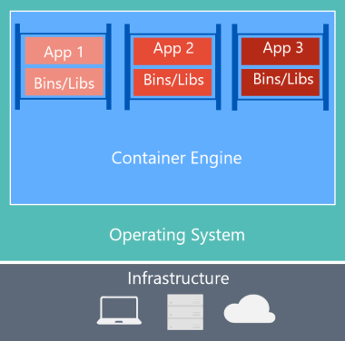

# What is Docker?

[Docker](https://www.docker.com/) is an [open-source project](https://github.com/docker/docker) for automating the deployment of applications as portable, self-sufficient containers that can run on the cloud or on-premises. Docker is also a [company](https://www.docker.com/) that promotes and evolves this technology. Docker works in collaboration with cloud, Linux, and Windows vendors, including Microsoft.

**Figure 2-2**. Docker deploys containers at all layers of the hybrid cloud

Docker image containers run natively on Linux and Windows. Windows images run only on Windows hosts and Linux images run only on Linux hosts. The host is a server or a VM.

You can develop on Windows, Linux, or macOS. The development computer runs a Docker host where Docker images are deployed, including the app and its dependencies. On Linux or macOS, you use a Docker host that is Linux based and can create images only for Linux containers.(On macOS you can edit code or run the Docker CLI, but as of the time of this writing, containers do not run directly on macOS.) On Windows you can create images for either Linux or Windows Containers.

On Windows or macOS, [Docker Community Edition (CE)](https://www.docker.com/community-edition) hosts containers in a development environment and provides additional developer tools. [Docker Enterprise Edition (EE)](https://www.docker.com/enterprise-edition) is used by IT teams who build, ship, and run large business-critical applications. ~Both products install the necessary VM (the Docker host) to host the containers.~ 

[Windows Containers](https://msdn.microsoft.com/en-us/virtualization/windowscontainers/about/about_overview) work with two types of runtimes:

-   Windows Server Containers provide application isolation through process and namespace isolation technology. A Windows Server Container shares a kernel with the container host and with all containers running on the host.

-   Hyper-V Containers expand on the isolation provided by Windows Server Containers by running each container in a highly optimized virtual machine. In this configuration, the kernel of the container host is not shared with the Hyper-V Containers, providing better isolation. Hyper-V Containers allow untrusted and *hostile multi-tenant* applications to run on the same host. Hyper-V Containers have a bit less efficiency in startup times and density than Windows Server Containers.

The images for these containers are created and function the same way. They differ in how the container is created. For details, see [Hyper-V Containers](https://msdn.microsoft.com/en-us/virtualization/windowscontainers/about/about_overview).

## Comparing Docker containers with virtual machines

Figure 2-3 shows a comparison between VMs and Docker containers.

  ------------------------------------------------------------------------------------------------------------------------------------------------------------------------------------- --------------------------------------------------------------------------------------------------------------------------------------------------------------------------------------------------------------------------------------------------------------------------------------------------------------
  **Virtual Machines**                                                                                                                                                                  **Docker Containers**
                                                                                                                                                                                        
                                                                                                                                  
                                                                                                                                                                                        
  Virtual machines include the application, the required libraries or binaries, and a full guest operating system. Full virtualization requires more resources than containerization. Containers include the application and all its dependencies. However, containers share the OS kernel with other containers. Containers run as isolated processes in user space on the host operating system. Except in Hyper-V containers, where each container runs inside of a special virtual machine per container.
  ------------------------------------------------------------------------------------------------------------------------------------------------------------------------------------- --------------------------------------------------------------------------------------------------------------------------------------------------------------------------------------------------------------------------------------------------------------------------------------------------------------

**Figure 2-3**. Comparison of traditional virtual machines to Docker containers

Because containers require far fewer resources (for example, they do not need a full OS), they start fast and are easy to deploy. Low resource usage allows higher density. You can run more services on the same hardware unit and reduce costs.

Running on the same kernel results in less isolation than VMs provide.

The main goal of an image is that it makes the environment (dependencies) the same across different deployments. This means that you can debug it on your machine and then deploy it to another machine with the same environment guaranteed.

A container image is a way to package an app or service and deploy it in a reliable and reproducible way. You could say that Docker is not only a technology, but also a philosophy and a process.

Docker developers don't say, "It works on my machine, why not in production?" They say, "It runs on Docker". Docker-packaged apps can be executed on any supported Docker environment. Docker packaged apps run consistently on all deployment targets (Dev, QA, staging, production).

>[!div class="step-by-step"]
[Previous] (index.md)
[Next] (docker-terminology.md)
