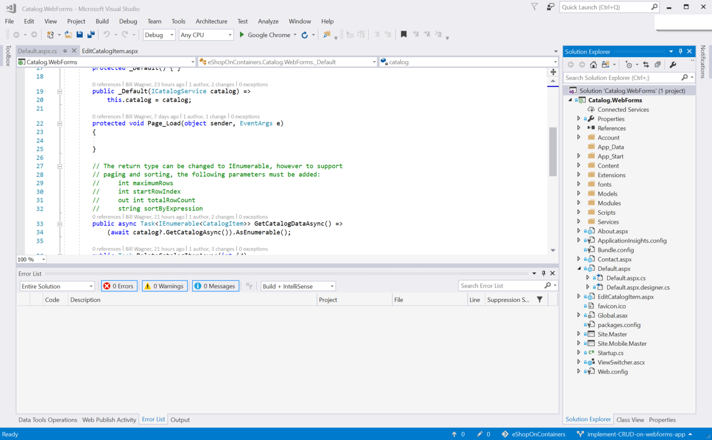
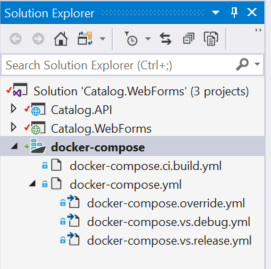
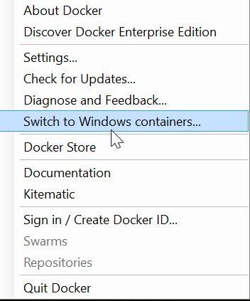

# Migrating Legacy Monolithic .NET Framework Applications to Windows Containers

*Windows Containers can be used as a way to improve development and test environments, and to deploy applications that are based on legacy .NET Framework technologies like Web* *Forms. Using containers for legacy applications in this way is referred to as a “lift and shift” scenario.*

Earlier sections of this guide have championed a microservices architecture where business applications are distributed among different containers, each running a small, focused service. That goal has many benefits. In new development, that approach is strongly recommended. Enterprise-critical applications will also benefit enough to justify the cost of a rearchitecture and reimplementation.

But not every application will benefit enough to justify the cost. That does not mean that those applications cannot be used in container scenarios.

In this section, we will explore an application for eShopOnContainers, shown in Figure 7-1. This application would be used by members of the eShopOnContainers enterprise team to view and edit the product catalog.


**Figure 7-1**. ASP.NET Web Forms application (legacy technology) on a Windows Container

This is a Web Forms application that is used to browse and modify the catalog entries. The Web Forms dependency means this application will not run on .NET Core unless it is rewritten without Web Forms and instead uses ASP.NET Core MVC. You will see how you can run applications like these in containers without changes. You will also see how you can make minimal changes to work in a hybrid mode where some functionality has been moved into a separate microservice, but most functionality remains in the monolithic application.

## Benefits of containerizing a monolithic application

The Catalog.WebForms application is available in the eShopOnContainers GitHub repository (<https://github.com/dotnet/eShopOnContainers>). This application is a standalone web application accessing a high-availability data store. Even so, there are advantages to running the application in a container. You create an image for the application. From that point forward, every deployment runs in the same environment. Every container uses the same OS version, has the same version of dependencies installed, uses the same framework, and is built using the same process. You can see the application loaded in Visual Studio 2017 in Figure 7-2.



**Figure 7-2**. Catalog management Web Forms application in Visual Studio 2017

In addition, developers can all run the application in this consistent environment. Issues that only appear with certain versions will appear immediately for developers rather than surfacing in a staging or production environment. Differences between the development environments among the development team matter less once applications run in containers.

Finally, containerized applications have a flatter scale-out curve. You have learned how containerized apps enable more containers in a VM or more containers in a physical machine. This translates to higher density and fewer required resources.

For all these reasons, consider running legacy monolithic apps in a Docker container using a “lift-and-shift” operation. The phrase “lift and shift” describes the scope of the task: you *lift* the entire application from a physical or virtual machine, and *shift* it into a container. In ideal situations, you do not need to make any changes to the application code to run it in a container.

## Possible migration paths

As a monolithic application, the Catalog.Webforms application is one web application containing all the code, including the data access libraries. The database runs on a separate high-availability machine. That configuration is simulated in the sample code by using a mock catalog service: you can run the Catalog.WebForms application against that fake data to simulate a pure lift-and-shift scenario. This demonstrates the simplest migration path, where you move existing assets to run in a container without any code changes at all. This path is appropriate for applications that are complete and that have minimal interaction with functionality that you are moving to microservices.

However, the eShopOnContainers website is already accessing the data storage using microservices for different scenarios. Some small additional changes can be made to the catalog editor to leverage the catalog microservice instead of accessing the catalog data storage directly.

These changes demonstrate the continuum for your own applications. You can do anything from moving an existing application without change into containers, to making small changes that enable existing applications to access some of the new microservices, to completely rewriting an application to fully participate in a new microservice-based architecture. The right path depends on both the cost of the migration and the benefits from any migration.

## Application tour

You can load the Catalog.WebForms solution and run the application as a standalone application. In this configuration, instead of a persistent storage database, the application uses a fake service to return data. The application uses Autofac (<https://autofac.org/>) as an inversion of control (IOC) container. Using Dependency Injection (DI), you can configure the application to use the fake data or the live catalog data service. (We will explain more about DI shortly.) The startup code reads a useFake setting from the web.config files, and configures the Autofac container to inject either the fake data service or the live catalog service. If you run the application with useFake set to false in the web.config file, you see the Web Forms application displaying the catalog data.

Most of the techniques used in this application should be very familiar to anyone who has used Web Forms. However, the catalog microservice introduces two techniques that might be unfamiliar: Dependency Injection (DI), which was mentioned earlier, and working with asynchronous data stores in Web Forms.

DI inverts the typical object-oriented strategy of writing classes that allocate all needed resources. Instead, classes request their dependencies from a service container. The advantage of DI is that you can replace external services with fakes (mocks) to support testing or other environments.

The DI container uses the web.config appSettings configuration to control whether to use the fake catalog data or the live data from the running service. The application registers an HttpModule object that builds the container and registers a pre-request handler to inject dependencies. You can see that code in the Modules/AutoFacHttpModule.cs file, which looks like the following example:

```cs
private static IContainer CreateContainer()
{
  // Configure AutoFac:
  // Register Containers:

  var settings = WebConfigurationManager.AppSettings;
  var useFake = settings["usefake"];
  bool fake = useFake == "true";
  var builder = new ContainerBuilder();

  if (fake)
  {
    builder.RegisterType<CatalogMockService>()
    .As<ICatalogService>();
  }
  else
  {
    builder.RegisterType<CatalogService>()
    .As<ICatalogService>();
    builder.RegisterType<RequestProvider>()
    .As<IRequestProvider>();
  }

  var container = builder.Build();
  return container;
}

private void InjectDependencies()
{
  if (HttpContext.Current.CurrentHandler is Page page)
  {
    // Get the code-behind class that we may have written
    var pageType = page.GetType().BaseType;

    // Determine if there is a constructor to inject, and grab it
    var ctor = (from c in pageType.GetConstructors()
                where c.GetParameters().Length > 0
                select c).FirstOrDefault();

    if (ctor != null)
    {
      // Resolve the parameters for the constructor
      var args = (from parm in ctor.GetParameters()
                  select Container.Resolve(parm.ParameterType))
                  .ToArray();

      // Execute the constructor method with the arguments resolved
      ctor.Invoke(page, args);
    }

    // Use the Autofac method to inject any
    // properties that can be filled by Autofac
    Container.InjectProperties(page);
  }
}
```

The application’s pages (Default.aspx.cs and EditPage.aspx.cs) define constructors that take these dependencies. Note that the default constructor is still present and accessible. The infrastructure needs the following code.

```cs
protected _Default() { }

public _Default(ICatalogService catalog) => this.catalog = catalog;
```

The catalog APIs are all asynchronous methods. Web Forms now supports these for all data controls. The Catalog.WebForms application uses model binding for the list and edit pages; controls on the pages define SelectMethod, UpdateMethod, InsertMethod, and DeleteMethod properties that specify Task-returning asynchronous operations. Web Forms controls understand when the methods bound to a control are asynchronous. The only restriction you encounter when using asynchronous select methods is that you cannot support paging. The paging signature requires an out parameter, and asynchronous methods cannot have out parameters. This same technique is used on other pages that require data from the catalog service.

The default configuration for the catalog Web Forms application uses a mock implementation of the catalog.api service. This mock uses a hard-coded dataset for its data, which simplifies some tasks by removing the dependency on the catalog.api service in development environments.

## Lifting and shifting

Visual Studio provides great support for containerizing an application. You right-click the project node and then select **Add** and **Docker Support**. The Docker project template adds a new project to the solution called **docker-compose**. The project contains the Docker assets that compose (or build) the images you need, and starts running the necessary containers, as shown in Figure 7-3.

In the simplest lift-and-shift scenarios, the application will be the single service that you use for the Web Forms application. The template also changes your startup project to point to the **docker-compose** project. Pressing Ctrl+F5 or F5 now creates the Docker image and launches the Docker container.



**Figure 7-3**. The **docker-compose** project in the Web Forms solution

Before you run the solution, you must make sure that you configure Docker to use Windows Containers. To do that, you right-click the Docker taskbar icon in Windows and select **Switch to Windows Containers**, as shown in Figure 7-4.



**Figure 7-4**. Switching to Windows Containers from the Docker taskbar icon in Windows

If the menu item says **Switch to Linux containers**, you are already running Docker with Windows Containers.

Running the solution restarts the Docker host. When you build, you build the application and the Docker image for the Web Forms project. The first time you do this, it takes considerable time. This is because the build process pulls down the base Windows Server image and the additional image for ASP.NET. Subsequent build and run cycles will be much faster.

Let’s take a deeper look at the files added by the Docker project template. It created several files for you. Visual Studio uses these files to create the Docker image and launch a container. You can use the same files from the CLI to run Docker commands manually.

The following Dockerfile example shows the basic settings for building a Docker image based on the Windows ASP.NET image that runs an ASP.NET site.

```
FROM microsoft/aspnet

ARG source

WORKDIR /inetpub/wwwroot

COPY ${source:-obj/Docker/publish} .
```

This Dockerfile will look very similar to those created for running an ASP.NET Core application in Linux containers. However, there are a few important differences. The most important difference is that the base image is microsoft/aspnet, which is the current Windows Server image that includes the .NET Framework. Other differences are that the directories copied from your source directory are different.

The other files in the **docker-compose** project are the Docker assets needed to build and configure the containers. Visual Studio puts the various docker-compose.yml files under one node to highlight how they are used. The base docker-compose file contains the directives that are common to all configurations. The docker-compose.override.yml file contains environment variables and related overrides for a developer configuration. The variants with .vs.debug and .vs.release provide environment settings that enable Visual Studio to attach to and manage the running container.

While Visual Studio integration is part of adding Docker support to your solution, you can also build and run from the command line, using the docker-compose up command, as you saw in previous sections.

## Getting data from the existing catalog .NET Core microservice

You can configure the Web Forms application to use the eShopOnContainers catalog microservice to get data instead of using fake data. To do this, you edit the web.config file and set the value of the useFake key to false. The DI container will use the class that accesses the live catalog microservice instead of the class that returns the hard-coded data. No other code changes are needed.

Accessing the live catalog service does mean you need to update the **docker-compose** project to build the catalog service image and launch the catalog service container. Docker CE for Windows supports both Linux containers and Windows Containers, but not at the same time. To run the catalog microservice, you need to build an image that runs the catalog microservice on top of a Windows-based container. This approach requires a different Dockerfile for the microservices project than you have seen in earlier sections. The Dockerfile.windows file contains the configuration settings to build the catalog API container image so that it runs on a Windows container—for example, to use a Windows Nano Docker image.

The catalog microservice relies on the SQL Server database. Therefore, you need to use a Windows-based SQL Server Docker image as well.

After these changes, the docker-compose project does more to start the application. The project now starts the SQL Server using the Windows based SQL Server image. It starts the catalog microservice in a Windows container. And it starts the Web Forms catalog editor container, also in a Windows container. If any of the images need building, the images are created first.

## Development and production environments

There are a couple of differences between the development configuration and a production configuration. In the development environment, you run the Web Forms application, the catalog microservice, and SQL Server in Windows Containers, as part of the same Docker host. In earlier sections, we mentioned SQL Server images deployed in the same Docker host as the other .NET Core-based services on a Linux-based Docker host. The advantage of running the multiple microservices in the same Docker host (or cluster) is that there is less network communication and the communication between containers has lower latency.

In the development environment, you must run all the containers in the same OS. Docker CE for Windows does not support running Windows- and Linux-based containers at the same time. In production, you can decide if you want to run the catalog microservice in a Windows container in a single Docker host (or cluster), or have the Web Forms application communicate with an instance of the catalog microservice running in a Linux container on a different Docker host. It depends on how you want to optimize for network latency. In most cases, you want the microservices that your applications depend on running in the same Docker host (or swarm) for ease of deployment and lower communication latency. In those configurations, the only costly communications is between the microservice instances and the high-availability servers for the persistent data storage.

>[!div class="step-by-step"]
[Previous] (../net-core-single-containers-linux-windows-server-hosts/index.md)
[Next] (../multi-container-microservice-net-applications/index.md)
