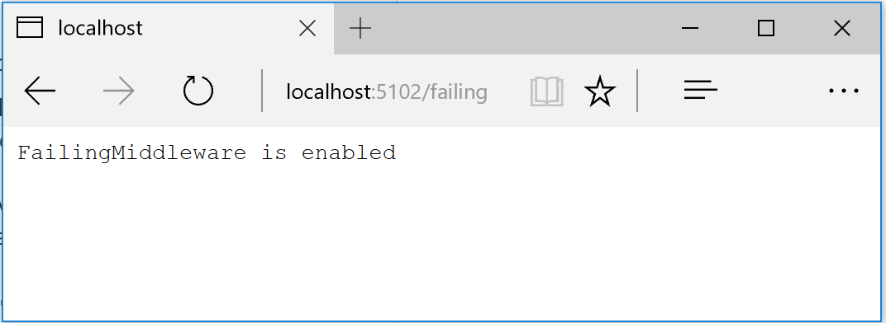
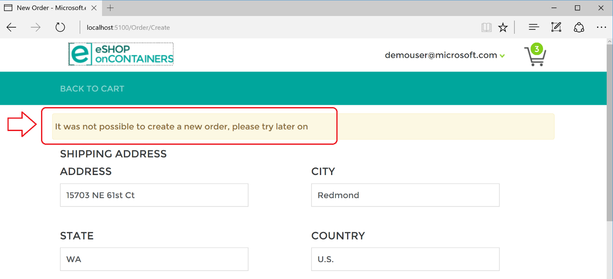

# Implementing the Circuit Breaker pattern

As noted earlier, you should handle faults that might take a variable amount of time to recover from, as might happen when you try to connect to a remote service or resource. Handling this type of fault can improve the stability and resiliency of an application.

In a distributed environment, calls to remote resources and services can fail due to transient faults, such as slow network connections and timeouts, or if resources are being slow or are temporarily unavailable. These faults typically correct themselves after a short time, and a robust cloud application should be prepared to handle them by using a strategy like the Retry pattern.

However, there can also be situations where faults are due to unanticipated events that might take much longer to fix. These faults can range in severity from a partial loss of connectivity to the complete failure of a service. In these situations, it might be pointless for an application to continually retry an operation that is unlikely to succeed. Instead, the application should be coded to accept that the operation has failed and handle the failure accordingly.

The Circuit Breaker pattern has a different purpose than the Retry pattern. The Retry pattern enables an application to retry an operation in the expectation that the operation will eventually succeed. The Circuit Breaker pattern prevents an application from performing an operation that is likely to fail. An application can combine these two patterns by using the Retry pattern to invoke an operation through a circuit breaker. However, the retry logic should be sensitive to any exceptions returned by the circuit breaker, and it should abandon retry attempts if the circuit breaker indicates that a fault is not transient.

## Implementing a Circuit Breaker pattern with Polly

As when implementing retries, the recommended approach for circuit breakers is to take advantage of proven .NET libraries like Polly.

The eShopOnContainers application uses the Polly Circuit Breaker policy when implementing HTTP retries. In fact, the application applies both policies to the ResilientHttpClient utility class. Whenever you use an object of type ResilientHttpClient for HTTP requests (from eShopOnContainers), you will be applying both those policies, but you could add additional policies, too.

The only addition here to the code used for HTTP call retries is the code where you add the Circuit Breaker policy to the list of policies to use, as shown at the end of the following code:

```csharp
public ResilientHttpClient CreateResilientHttpClient()
    => new ResilientHttpClient(CreatePolicies(), _logger);

private Policy[] CreatePolicies()
    => new Policy[]
    {
        Policy.Handle<HttpRequestException>()
            .WaitAndRetryAsync(
            // number of retries
            6,
            // exponential backofff
            retryAttempt => TimeSpan.FromSeconds(Math.Pow(2, retryAttempt)),
            // on retry
            (exception, timeSpan, retryCount, context) =>
            {
                var msg = $"Retry {retryCount} implemented with Polly RetryPolicy " +
                    $"of {context.PolicyKey} " +
                    $"at {context.ExecutionKey}, " +
                    $"due to: {exception}.";
                _logger.LogWarning(msg);
                _logger.LogDebug(msg);
            }),
            Policy.Handle<HttpRequestException>()
                .CircuitBreakerAsync(
                    // number of exceptions before breaking circuit
                    5,
                    // time circuit opened before retry
                    TimeSpan.FromMinutes(1),
                    (exception, duration) =>
                    {
                        // on circuit opened
                        _logger.LogTrace("Circuit breaker opened");
                    },
                    () =>
                    {
                        // on circuit closed
                        _logger.LogTrace("Circuit breaker reset");
                    })
    };
}
```

The code adds a policy to the HTTP wrapper. That policy defines a circuit breaker that opens when the code detects the specified number of consecutive exceptions (exceptions in a row), as passed in the exceptionsAllowedBeforeBreaking parameter (5 in this case). When the circuit is open, HTTP requests do not work, but an exception is raised.

Circuit breakers should also be used to redirect requests to a fallback infrastructure if you might have issues in a particular resource that is deployed in a different environment than the client application or service that is performing the HTTP call. That way, if there is an outage in the datacenter that impacts only your backend microservices but not your client applications, the client applications can redirect to the fallback services. Polly is planning a new policy to automate this [failover policy](https://github.com/App-vNext/Polly/wiki/Polly-Roadmap#failover-policy) scenario.

Of course, all those features are for cases where you are managing the failover from within the .NET code, as opposed to having it managed automatically for you by Azure, with location transparency.

## Using the ResilientHttpClient utility class from eShopOnContainers

You use the ResilientHttpClient utility class in a way similar to how you use the .NET HttpClient class. In the following example from the eShopOnContainers MVC web application (the OrderingService agent class used by OrderController), the ResilientHttpClient object is injected through the httpClient parameter of the constructor. Then the object is used to perform HTTP requests.

```csharp
public class OrderingService : IOrderingService
{
    private IHttpClient _apiClient;
    private readonly string _remoteServiceBaseUrl;
    private readonly IOptionsSnapshot<AppSettings> _settings;
    private readonly IHttpContextAccessor _httpContextAccesor;

    public OrderingService(IOptionsSnapshot<AppSettings> settings,
        IHttpContextAccessor httpContextAccesor,
        IHttpClient httpClient)
    {
        _remoteServiceBaseUrl = $"{settings.Value.OrderingUrl}/api/v1/orders";
        _settings = settings;
        _httpContextAccesor = httpContextAccesor;
        _apiClient = httpClient;
    }

    async public Task<List<Order>> GetMyOrders(ApplicationUser user)
    {
        var context = _httpContextAccesor.HttpContext;
        var token = await context.Authentication.GetTokenAsync("access_token");
        _apiClient.Inst.DefaultRequestHeaders.Authorization = new
            System.Net.Http.Headers.AuthenticationHeaderValue("Bearer", token);
        var ordersUrl = _remoteServiceBaseUrl;
        var dataString = await _apiClient.GetStringAsync(ordersUrl);
        var response = JsonConvert.DeserializeObject<List<Order>>(dataString);
        return response;
    }

    // Other methods ...
    async public Task CreateOrder(Order order)
    {
        var context = _httpContextAccesor.HttpContext;
        var token = await context.Authentication.GetTokenAsync("access_token");
        _apiClient.Inst.DefaultRequestHeaders.Authorization = new
            System.Net.Http.Headers.AuthenticationHeaderValue("Bearer", token);
        _apiClient.Inst.DefaultRequestHeaders.Add("x-requestid",
            order.RequestId.ToString());
        var ordersUrl = $"{_remoteServiceBaseUrl}/new";
        order.CardTypeId = 1;
        order.CardExpirationApiFormat();
        SetFakeIdToProducts(order);
        var response = await _apiClient.PostAsync(ordersUrl, order);
        response.EnsureSuccessStatusCode();
    }
}
```

Whenever the \_apiClient member object is used, it internally uses the wrapper class with Polly policiesؙ—the Retry policy, the Circuit Breaker policy, and any other policy that you might want to apply from the Polly policies collection.

## Testing retries in eShopOnContainers

Whenever you start the eShopOnContainers solution in a Docker host, it needs to start multiple containers. Some of the containers are slower to start and initialize, like the SQL Server container. This is especially true the first time you deploy the eShopOnContainers application into Docker, because it needs to set up the images and the database. The fact that some containers start slower than others can cause the rest of the services to initially throw HTTP exceptions, even if you set dependencies between containers at the docker-compose level, as explained in previous sections. Those docker-compose dependencies between containers are just at the process level. The container’s entry point process might be started, but SQL Server might not be ready for queries. The result can be a cascade of errors, and the application can get an exception when trying to consume that particular container.

You might also see this type of error on startup when the application is deploying to the cloud. In that case, orchestrators might be moving containers from one node or VM to another (that is, starting new instances) when balancing the number of containers across the cluster’s nodes.

The way eShopOnContainers solves this issue is by using the Retry pattern we illustrated earlier. It is also why, when starting the solution, you might get log traces or warnings like the following:

> "**Retry 1 implemented with Polly's RetryPolicy**, due to: System.Net.Http.HttpRequestException: An error occurred while sending the request. ---&gt; System.Net.Http.CurlException: Couldn't connect to server\\n at System.Net.Http.CurlHandler.ThrowIfCURLEError(CURLcode error)\\n at \[...\].

## Testing the circuit breaker in eShopOnContainers

There are a few ways you can open the circuit and test it with eShopOnContainers.

One option is to lower the allowed number of retries to 1 in the circuit breaker policy and redeploy the whole solution into Docker. With a single retry, there is a good chance that an HTTP request will fail during deployment, the circuit breaker will open, and you get an error.

Another option is to use custom middleware that is implemented in the `Basket` microservice. When this middleware is enabled, it catches all HTTP requests and returns status code 500. You can enable the middleware by making a GET request to the failing URI, like the following:

-   GET /failing

This request returns the current state of the middleware. If the middleware is enabled, the request return status code 500. If the middleware is disabled, there is no response.

-   GET /failing?enable

This request enables the middleware.

-   GET /failing?disable

This request disables the middleware.

For instance, once the application is running, you can enable the middleware by making a request using the following URI in any browser. Note that the ordering microservice uses port 5103.

http://localhost:5103/failing?enable

You can then check the status using the URI [http://localhost:5103/failing](http://localhost:5103/failing), as shown in Figure 10-4.



**Figure 10-4**. Checking the state of the “Failing” ASP.NET middleware – In this case, disabled. 

At this point, the Basket microservice responds with status code 500 whenever you call invoke it.

Once the middleware is running, you can try making an order from the MVC web application. Because the requests fails, the circuit will open.

In the following example, you can see that the MVC web application has a catch block in the logic for placing an order. If the code catches an open-circuit exception, it shows the user a friendly message telling them to wait.

```csharp
public class CartController : Controller
{
    //…
    public async Task<IActionResult> Index()
    {
        try
        {
            //… Other code
        }
        catch (BrokenCircuitException)
        {
            // Catches error when Basket.api is in circuit-opened mode                 
            HandleBrokenCircuitException();
        }
        return View();
    }       

    private void HandleBrokenCircuitException()
    {
        TempData["BasketInoperativeMsg"] = "Basket Service is inoperative, please try later on. (Business message due to Circuit-Breaker)";
    }
}
```

Here’s a summary. The Retry policy tries several times to make the HTTP request and gets HTTP errors. When the number of tries reaches the maximum number set for the Circuit Breaker policy (in this case, 5), the application throws a BrokenCircuitException. The result is a friendly message, as shown in Figure 10-5.



**Figure 10-5**. Circuit breaker returning an error to the UI

You can implement different logic for when to open the circuit. Or you can try an HTTP request against a different back-end microservice if there is a fallback datacenter or redundant back-end system.

Finally, another possibility for the CircuitBreakerPolicy is to use Isolate (which forces open and holds open the circuit) and Reset (which closes it again). These could be used to build a utility HTTP endpoint that invokes Isolate and Reset directly on the policy. Such an HTTP endpoint could also be used, suitably secured, in production for temporarily isolating a downstream system, such as when you want to upgrade it. Or it could trip the circuit manually to protect a downstream system you suspect to be faulting.

## Adding a jitter strategy to the retry policy

A regular Retry policy can impact your system in cases of high concurrency and scalability and under high contention. To overcome peaks of similar retries coming from many clients in case of partial outages, a good workaround is to add a jitter strategy to the retry algorithm/policy. This can improve the overall performance of the end-to-end system by adding randomness to the exponential backoff. This spreads out the spikes when issues arise. When you use Polly, code to implement jitter could look like the following example:

```csharp
Random jitterer = new Random();
Policy.Handle<HttpResponseException>() // etc
    .WaitAndRetry(5, // exponential back-off plus some jitter
        retryAttempt => TimeSpan.FromSeconds(Math.Pow(2, retryAttempt))
            + TimeSpan.FromMilliseconds(jitterer.Next(0, 100))
    );
```

## Additional resources

-   **Retry pattern**
    [*https://docs.microsoft.com/azure/architecture/patterns/retry*](https://docs.microsoft.com/azure/architecture/patterns/retry)

-   **Connection Resiliency** (Entity Framework Core)
    [*https://docs.microsoft.com/ef/core/miscellaneous/connection-resiliency*](https://docs.microsoft.com/ef/core/miscellaneous/connection-resiliency)

-   **Polly** (.NET resilience and transient-fault-handling library)
    [*https://github.com/App-vNext/Polly*](https://github.com/App-vNext/Polly)

-   **Circuit Breaker pattern**
    [*https://docs.microsoft.com/azure/architecture/patterns/circuit-breaker*](https://docs.microsoft.com/azure/architecture/patterns/circuit-breaker)

-   **Marc Brooker. Jitter: Making Things Better With Randomness**
    https://brooker.co.za/blog/2015/03/21/backoff.html


>[!div class="step-by-step"]
[Previous] (implement-http-call-retries-exponential-backoff-polly.md)
[Next] (monitor-app-health.md)
