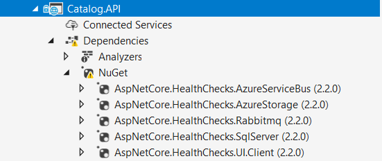
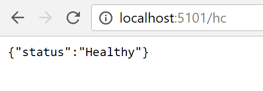
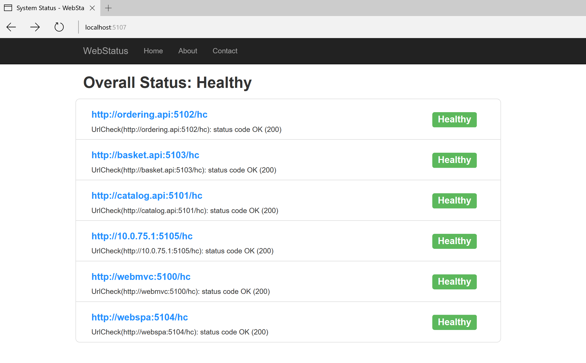

# Health monitoring

Health monitoring can allow near-real-time information about the state of your containers and microservices. Health monitoring is critical to multiple aspects of operating microservices and is especially important when orchestrators perform partial application upgrades in phases, as explained later.

Microservices-based applications often use heartbeats or health checks to enable their performance monitors, schedulers, and orchestrators to keep track of the multitude of services. If services cannot send some sort of “I’m alive” signal, either on demand or on a schedule, your application might face risks when you deploy updates, or it might simply detect failures too late and not be able to stop cascading failures that can end up in major outages.

In the typical model, services send reports about their status, and that information is aggregated to provide an overall view of the state of health of your application. If you are using an orchestrator, you can provide health information to your orchestrator’s cluster, so that the cluster can act accordingly. If you invest in high-quality health reporting that is customized for your application, you can detect and fix issues for your running application much more easily.

## Implementing health checks in ASP.NET Core services

When developing an ASP.NET Core microservice or web application, you can use a library named `HealthChecks` from the ASP.NET team. Early release is available at this [GitHub repo](https://github.com/dotnet-architecture/HealthChecks).

This library is easy to use and provides features that let you validate that any specific external resource needed for your application (like a SQL Server database or remote API) is working properly. When you use this library, you can also decide what it means that the resource is healthy, as we explain later.

In order to use this library, you need to first use the library in your microservices. Second, you need a front-end application that queries for the health reports. That front end application could be a custom reporting application, or it could be an orchestrator itself that can react accordingly to the health states.

### Using the HealthChecks library in your back end ASP.NET microservices

You can see how the HealthChecks library is used in the eShopOnContainers sample application. To begin, you need to define what constitutes a healthy status for each microservice. In the sample application, the microservices are healthy if the microservice API is accessible via HTTP and if its related SQL Server database is also available.

In the future, you will be able to install the HealthChecks library as a NuGet package. But as of this writing, you need to download and compile the code as part of your solution. Clone the code available at https://github.com/dotnet-architecture/HealthChecks and copy the following folders to your solution:

  - src/common
  - src/Microsoft.AspNetCore.HealthChecks
  - src/Microsoft.Extensions.HealthChecks
  - src/Microsoft.Extensions.HealthChecks.SqlServer

You could also use additional checks like the ones for Azure (Microsoft.Extensions.HealthChecks.AzureStorage), but since this version of eShopOnContainers does not have any dependency on Azure, you do not need it. You do not need the ASP.NET health checks, because eShopOnContainers is based on ASP.NET Core.

Figure 10-6 shows the HealthChecks library in Visual Studio, ready to be used as a building block by any microservices.



**Figure 10-6**. ASP.NET Core HealthChecks library source code in a Visual Studio solution

As introduced earlier, the first thing to do in each microservice project is to add a reference to the three HealthChecks libraries. After that, you add the health check actions that you want to perform in that microservice. These actions are basically dependencies on other microservices (HttpUrlCheck) or databases (currently SqlCheck\* for SQL Server databases). You add the action within the Startup class of each ASP.NET microservice or ASP.NET web application.

Each service or web application should be configured by adding all its HTTP or database dependencies as one AddHealthCheck method. For example, the MVC web application from eShopOnContainers depends on many services, therefore has several AddCheck methods added to the health checks.

For instance, in the following code you can see how the catalog microservice adds a dependency on its SQL Server database.

```csharp
// Startup.cs from Catalog.api microservice
//
public class Startup
{
    public void ConfigureServices(IServiceCollection services)
    {
        // Add framework services
        services.AddHealthChecks(checks =>
        {
            checks.AddSqlCheck("CatalogDb", Configuration["ConnectionString"]);
        });
        // Other services
    }
}
```

However, the MVC web application of eShopOnContainers has multiple dependencies on the rest of the microservices. Therefore, it calls one AddUrlCheck method for each microservice, as shown in the following example:

```csharp
// Startup.cs from the MVC web app
public class Startup
{
    public void ConfigureServices(IServiceCollection services)
    {
        services.AddMvc();
        services.Configure<AppSettings>(Configuration);
        services.AddHealthChecks(checks =>
        {
            checks.AddUrlCheck(Configuration["CatalogUrl"]);
            checks.AddUrlCheck(Configuration["OrderingUrl"]);
            checks.AddUrlCheck(Configuration["BasketUrl"]);
            checks.AddUrlCheck(Configuration["IdentityUrl"]);
        });
    }
}
```

Thus, a microservice will not provide a “healthy” status until all its checks are healthy as well.

If the microservice does not have a dependency on a service or on SQL Server, you should just add a Healthy("Ok") check. The following code is from the eShopOnContainers basket.api microservice. (The basket microservice uses the Redis cache, but the library does not yet include a Redis health check provider.)

```csharp
services.AddHealthChecks(checks =>
{
    checks.AddValueTaskCheck("HTTP Endpoint", () => new
        ValueTask<IHealthCheckResult>(HealthCheckResult.Healthy("Ok")));
});
```

For a service or web application to expose the health check endpoint, it has to enable the UseHealthChecks(\[*url\_for\_health\_checks*\]) extension method. This method goes at the WebHostBuilder level in the main method of the Program class of your ASP.NET Core service or web application, right after UseKestrel as shown in the code below.

```csharp
namespace Microsoft.eShopOnContainers.WebMVC
{
    public class Program
    {
        public static void Main(string[] args)
        {
            var host = new WebHostBuilder()
                .UseKestrel()
                .UseHealthChecks("/hc")
                .UseContentRoot(Directory.GetCurrentDirectory())
                .UseIISIntegration()
                .UseStartup<Startup>()
                .Build();
            host.Run();
        }
    }
}
```

The process works like this: each microservice exposes the endpoint /hc. That endpoint is created by the HealthChecks library ASP.NET Core middleware. When that endpoint is invoked, it runs all the health checks that are configured in the AddHealthChecks method in the Startup class.

The UseHealthChecks method expects a port or a path. That port or path is the endpoint to use to check the health state of the service. For instance, the catalog microservice uses the path /hc.

### Caching health check responses

Since you do not want to cause a Denial of Service (DoS) in your services, or you simply do not want to impact service performance by checking resources too frequently, you can cache the returns and configure a cache duration for each health check.

By default, the cache duration is internally set to 5 minutes, but you can change that cache duration on each health check, as in the following code:

```csharp
checks.AddUrlCheck(Configuration["CatalogUrl"],1); // 1 min as cache duration
```

### Querying your microservices to report about their health status

When you have configured health checks as described here, once the microservice is running in Docker, you can directly check from a browser if it is healthy. (This does require that you are publishing the container port out of the Docker host, so you can access the container through localhost or through the external Docker host IP.) Figure 10-7 shows a request in a browser and the corresponding response.



**Figure 10-7**. Checking health status of a single service from a browser

In that test, you can see that the catalog.api microservice (running on port 5101) is healthy, returning HTTP status 200 and status information in JSON. It also means that internally the service also checked the health of its SQL Server database dependency and that health check was reported itself as healthy.

## Using watchdogs

A watchdog is a separate service that can watch health and load across services, and report health about the microservices by querying with the HealthChecks library introduced earlier. This can help prevent errors that would not be detected based on the view of a single service. Watchdogs also are a good place to host code that can perform remediation actions for known conditions without user interaction.

The eShopOnContainers sample contains a web page that displays sample health check reports, as shown in Figure 10-8. This is the simplest watchdog you could have, since all it does is shows the state of the microservices and web applications in eShopOnContainers. Usually a watchdog also takes actions when it detects unhealthy states.



**Figure 10-8**. Sample health check report in eShopOnContainers

In summary, the ASP.NET middleware of the ASP.NET Core HealthChecks library provides a single health check endpoint for each microservice. This will execute all the health checks defined within it and return an overall health state depending on all those checks.

The HealthChecks library is extensible through new health checks of future external resources. For example, we expect that in the future the library will have health checks for Redis cache and for other databases. The library allows health reporting by multiple service or application dependencies, and you can then take actions based on those health checks.

## Health checks when using orchestrators

To monitor the availability of your microservices, orchestrators like Docker Swarm, Kubernetes, and Service Fabric periodically perform health checks by sending requests to test the microservices. When an orchestrator determines that a service/container is unhealthy, it stops routing requests to that instance. It also usually creates a new instance of that container.

For instance, most orchestrators can use health checks to manage zero-downtime deployments. Only when the status of a service/container changes to healthy will the orchestrator start routing traffic to service/container instances.

Health monitoring is especially important when an orchestrator performs an application upgrade. Some orchestrators (like Azure Service Fabric) update services in phases—for example, they might update one-fifth of the cluster surface for each application upgrade. The set of nodes that is upgraded at the same time is referred to as an *upgrade domain*. After each upgrade domain has been upgraded and is available to users, that upgrade domain must pass health checks before the deployment moves to the next upgrade domain.

Another aspect of service health is reporting metrics from the service. This is an advanced capability of the health model of some orchestrators, like Service Fabric. Metrics are important when using an orchestrator because they are used to balance resource usage. Metrics also can be an indicator of system health. For example, you might have an application that has many microservices, and each instance reports a requests-per-second (RPS) metric. If one service is using more resources (memory, processor, etc.) than another service, the orchestrator could move service instances around in the cluster to try to maintain even resource utilization.

Note that if you are using Azure Service Fabric, it provides its own [Health Monitoring model](https://docs.microsoft.com/azure/service-fabric/service-fabric-health-introduction), which is more advanced than simple health checks.

## Advanced monitoring: visualization, analysis, and alerts

The final part of monitoring is visualizing the event stream, reporting on service performance, and alerting when an issue is detected. You can use different solutions for this aspect of monitoring.

You can use simple custom applications showing the state of your services, like the custom page we showed when we explained [ASP.NET Core HealthChecks](https://github.com/aspnet/HealthChecks). Or you could use more advanced tools like Azure Application Insights and Operations Management Suite to raise alerts based on the stream of events.

Finally, if you were storing all the event streams, you can use Microsoft Power BI or a third-party solution like Kibana or Splunk to visualize the data.

## Additional resources

-   **ASP.NET Core HealthChecks** (early release)
    [*https://github.com/aspnet/HealthChecks/*](https://github.com/aspnet/HealthChecks/)

-   **Introduction to Service Fabric health monitoring**
    [*https://docs.microsoft.com/azure/service-fabric/service-fabric-health-introduction*](https://docs.microsoft.com/azure/service-fabric/service-fabric-health-introduction)

-   **Azure Application Insights**
    [*https://azure.microsoft.com/services/application-insights/*](https://azure.microsoft.com/services/application-insights/)

-   **Microsoft Operations Management Suite**
    [*https://www.microsoft.com/en-us/cloud-platform/operations-management-suite*](https://www.microsoft.com/en-us/cloud-platform/operations-management-suite)

>[!div class="step-by-step"]
[Previous] (implement-circuit-breaker-pattern.md)
[Next] (../secure-net-microservices-web-applications/index.md)
