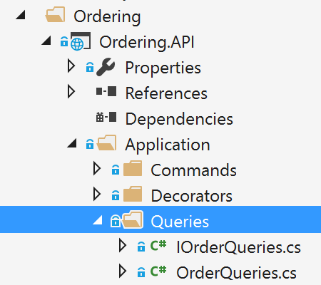
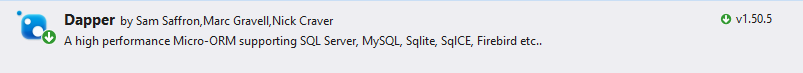
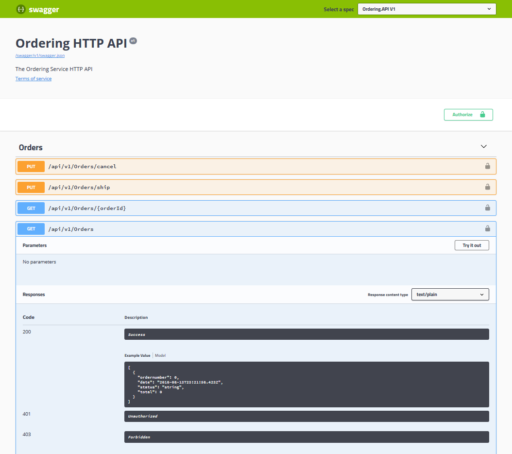

# Implementing reads/queries in a CQRS microservice

For reads/queries, the ordering microservice from the eShopOnContainers reference application implements the queries independently from the DDD model and transactional area. This was done primarily because the demands for queries and for transactions are drastically different. Writes execute transactions that must be compliant with the domain logic. Queries, on the other hand, are idempotent and can be segregated from the domain rules.

The approach is simple, as shown in Figure 9-3. The API interface is implemented by the Web API controllers using any infrastructure, such as a micro Object Relational Mapper (ORM) like Dapper, and returning dynamic ViewModels depending on the needs of the UI applications.


**Figure 9-3**. The simplest approach for queries in a CQRS microservice

This is the simplest possible approach for queries. The query definitions query the database and return a dynamic ViewModel built on the fly for each query. Since the queries are idempotent, they won't change the data no matter how many times you run a query. Therefore, you don't need to be restricted by any DDD pattern used in the transactional side, like aggregates and other patterns, and that is why queries are separated from the transactional area. You simply query the database for the data that the UI needs and return a dynamic ViewModel that does not need to be statically defined anywhere (no classes for the ViewModels) except in the SQL statements themselves.

Since this is a simple approach, the code required for the queries side (such as code using a micro ORM like [Dapper](https://github.com/StackExchange/Dapper)) can be implemented [within the same Web API project](https://github.com/dotnet-architecture/eShopOnContainers/blob/master/src/Services/Ordering/Ordering.API/Application/Queries/OrderQueries.cs). Figure 9-4 shows this. The queries are defined in the **Ordering.API** microservice project within the eShopOnContainers solution.



**Figure 9-4**. Queries in the Ordering microservice in eShopOnContainers

## Using ViewModels specifically made for client apps, independent from domain model constraints

Since the queries are performed to obtain the data needed by the client applications, the returned type can be specifically made for the clients, based on the data returned by the queries. These models, or Data Transfer Objects (DTOs), are called ViewModels.

The returned data (ViewModel) can be the result of joining data from multiple entities or tables in the database, or even across multiple aggregates defined in the domain model for the transactional area. In this case, because you are creating queries independent of the domain model, the aggregates boundaries and constraints are completely ignored and you're free to query any table and column you might need. This approach provides great flexibility and productivity for the developers creating or updating the queries.

The ViewModels can be static types defined in classes. Or they can be created dynamically based on the queries performed (as is implemented in the ordering microservice), which is very agile for developers.

## Using Dapper as a micro ORM to perform queries

You can use any micro ORM, Entity Framework Core, or even plain ADO.NET for querying. In the sample application, Dapper was selected for the ordering microservice in eShopOnContainers as a good example of a popular micro ORM. It can run plain SQL queries with great performance, because it's a very light framework. Using Dapper, you can write a SQL query that can access and join multiple tables.

Dapper is an open-source project (original created by Sam Saffron), and is part of the building blocks used in [Stack Overflow](https://stackoverflow.com/). To use Dapper, you just need to install it through the [Dapper NuGet package](https://www.nuget.org/packages/Dapper), as shown in the following figure:



You also need to add a using statement so your code has access to the Dapper extension methods.

When you use Dapper in your code, you directly use the <xref:System.Data.SqlClient.SqlConnection> class available in the <xref:System.Data.SqlClient> namespace. Through the QueryAsync method and other extension methods that extend the <xref:System.Data.SqlClient.SqlConnection> class, you can simply run queries in a straightforward and performant way.

## Dynamic versus static ViewModels

When returning ViewModels from the server-side to client apps, you can think about those ViewModels as DTOs that can be different to the internal domain entities of your entity model because the ViewModels hold the data the way the client app needs. Therefore, in many cases, you can aggregate data coming from multiple domain entities and compose the ViewModels precisely according to how the client app needs that data.

Those ViewModels or DTOs can be defined explicitly (as data holder classes) like the [OrderSummary](https://github.com/dotnet-architecture/eShopOnContainers/blob/dev/src/Services/Ordering/Ordering.API/Application/Queries/OrderViewModel.cs) class shown in a later code snippet, or you could just return dynamic ViewModels or dynamic DTOs simply based on the attributes returned by your queries, as a `dynamic` type.

### ViewModel as dynamic type

As shown in the following code, a ViewModel can be directly returned by the queries by returning a dynamic type that internally is based on the attributes returned by a query. That means that the subset of attributes to be returned is based on the query itself. Therefore, if you add a new column to the query or join, that data is dynamically added to the returned ViewModel.

```csharp
using Dapper;
using Microsoft.Extensions.Configuration;
using System.Data.SqlClient;
using System.Threading.Tasks;
using System.Dynamic;
using System.Collections.Generic;

public class OrderQueries : IOrderQueries
{
    public async Task<IEnumerable<dynamic>> GetOrdersAsync()
    {
        using (var connection = new SqlConnection(_connectionString))
        {
            connection.Open();
            return await connection.QueryAsync<dynamic>(
@"SELECT o.[Id] as ordernumber,
o.[OrderDate] as [date],os.[Name] as [status],
SUM(oi.units*oi.unitprice) as total
FROM [ordering].[Orders] o
LEFT JOIN[ordering].[orderitems] oi ON o.Id = oi.orderid
LEFT JOIN[ordering].[orderstatus] os on o.OrderStatusId = os.Id
GROUP BY o.[Id], o.[OrderDate], os.[Name]");
        }
    }
}
```

The important point is that by using a dynamic type, the returned collection of data is dynamically assembled as the ViewModel.

*Pros:* This approach reduces the need to modify static ViewModel classes whenever you update the SQL sentence of a query, making this design approach pretty agile when coding, straightforward, and quick to evolve in regard to future changes.

*Cons:* In the long term, dynamic types can impact negatively the clarity and impact the compatibility of a service with client apps. In addition, middleware software like Swagger cannot provide the same level of documentation on returned types if using dynamic types.

### ViewModel as predefined DTO classes

*Pros:* Having static predefined ViewModel classes, like "contracts" based on explicit DTO classes, is definitely better for public APIs but also for long term microservices, even if they are only used by the same application.

If you want to specify response types for swagger, you need to use explicit DTO classes as the return type. Therefore, predefined DTO classes allow you to offer richer information from Swagger. That improves the API documentation and compatibility when consuming an API.

*Cons:* As mentioned earlier, when updating the code, it takes some more steps to update the DTO classes.

*Tip based on our experience:* In the queries implemented at the Ordering microservice in eShopOnContainers, we started developing by using dynamic ViewModels as it was very straightforward and agile on the early development stages. But, once the development was stabilized, we chose to refactor the APIs and use static or pre-defined DTOs for the ViewModels, because it is clearer for the microservice’s consumers to know explicit DTO types, used as "contracts".

In the following example, you can see how the query is returning data by using an explicit ViewModel DTO class: the OrderSummary class.

```csharp
using Dapper;
using Microsoft.Extensions.Configuration;
using System.Data.SqlClient;
using System.Threading.Tasks;
using System.Dynamic;
using System.Collections.Generic;

public class OrderQueries : IOrderQueries
{
  public async Task<IEnumerable<OrderSummary>> GetOrdersAsync()
    {
        using (var connection = new SqlConnection(_connectionString))
        {
            connection.Open();
            var result = await connection.QueryAsync<dynamic>(
                  @"SELECT o.[Id] as ordernumber, 
                  o.[OrderDate] as [date],os.[Name] as [status], 
                  SUM(oi.units*oi.unitprice) as total
                  FROM [ordering].[Orders] o
                  LEFT JOIN[ordering].[orderitems] oi ON  o.Id = oi.orderid 
                  LEFT JOIN[ordering].[orderstatus] os on o.OrderStatusId = os.Id
                  GROUP BY o.[Id], o.[OrderDate], os.[Name]
                  ORDER BY o.[Id]");
        }
    } 
}
```

#### Describing response types of Web APIs

Developers consuming web APIs and microservices are most concerned with what is returned — specifically response types and error codes (if not standard). These are handled in the XML comments and data annotations.

Without proper documentation in the Swagger UI, the consumer lacks knowledge of what types are being returned or what HTTP codes can be returned. That problem is fixed by adding the <xref:Microsoft.AspNetCore.Mvc.ProducesResponseTypeAttribute?displayProperty=nameWithType>, so Swagger can generate richer information about the API return model and values, as shown in the following code:

```csharp
namespace Microsoft.eShopOnContainers.Services.Ordering.API.Controllers
{
    [Route("api/v1/[controller]")]
    [Authorize]
    public class OrdersController : Controller
    {
       //Additional code...
       [Route("")]
       [HttpGet]
       [ProducesResponseType(typeof(IEnumerable<OrderSummary>),
                             (int)HttpStatusCode.OK)]
       public async Task<IActionResult> GetOrders()
       {
           var orderTask = _orderQueries.GetOrdersAsync();
           var orders = await orderTask;
           return Ok(orders);
        }
    }
}
```

However, the `ProducesResponseType` attribute cannot use dynamic as a type but requires to use explicit types, like the `OrderSummary` ViewModel DTO, shown in the following example:

```csharp
public class OrderSummary
{
    public int ordernumber { get; set; }
    public DateTime date { get; set; }
    public string status { get; set; }
    public double total { get; set; }
}
```

This is another reason why explicit returned types are better than dynamic types, in the long term.
When using the `ProducesResponseType` attribute, you can also specify what is the expected outcome in regards possible HTTP errors/codes, like 200,400, etc.

In the following image, you can see how Swagger UI shows the ResponseType information.



**Figure 9-5**. Swagger UI showing response types and possible HTTP status codes from a Web API

You can see in the image above some example values based on the ViewModel types plus the possible HTTP status codes that can be returned.

## Additional resources

-   **Dapper**
    [*https://github.com/StackExchange/dapper-dot-net*](https://github.com/StackExchange/dapper-dot-net)

-   **Julie Lerman. Data Points - Dapper, Entity Framework and Hybrid Apps (MSDN Mag. article)**

    *https://msdn.microsoft.com/magazine/mt703432.aspx*

-   **ASP.NET Core Web API Help Pages using Swagger**

    *https://docs.microsoft.com/aspnet/core/tutorials/web-api-help-pages-using-swagger?tabs=visual-studio*

>[!div class="step-by-step"]
[Previous] (eshoponcontainers-cqrs-ddd-microservice.md)
[Next] (ddd-oriented-microservice.md)
