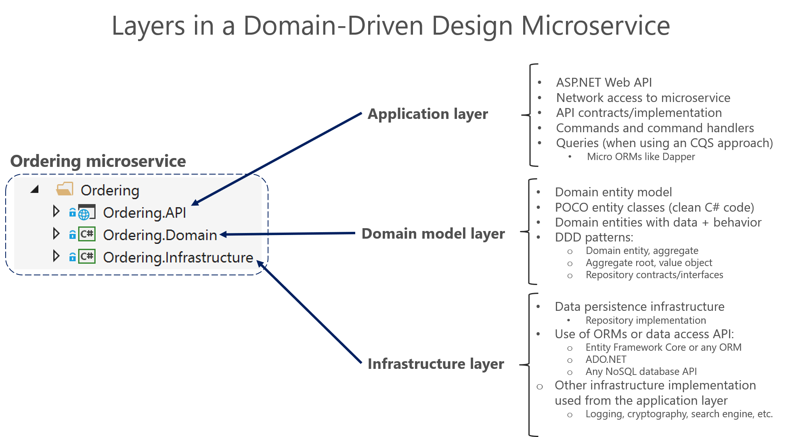

# Designing a DDD-oriented microservice

Domain-driven design (DDD) advocates modeling based on the reality of business as relevant to your use cases. In the context of building applications, DDD talks about problems as domains. It describes independent problem areas as Bounded Contexts (each Bounded Context correlates to a microservice), and emphasizes a common language to talk about these problems. It also suggests many technical concepts and patterns, like domain entities with rich models (no [anemic-domain model](https://martinfowler.com/bliki/AnemicDomainModel.html)), value objects, aggregates and aggregate root (or root entity) rules to support the internal implementation. This section introduces the design and implementation of those internal patterns.

Sometimes these DDD technical rules and patterns are perceived as obstacles that have a steep learning curve for implementing DDD approaches. But the important part is not the patterns themselves, but organizing the code so it is aligned to the business problems, and using the same business terms (ubiquitous language). In addition, DDD approaches should be applied only if you are implementing complex microservices with significant business rules. Simpler responsibilities, like a CRUD service, can be managed with simpler approaches.

Where to draw the boundaries is the key task when designing and defining a microservice. DDD patterns help you understand the complexity in the domain. For the domain model for each Bounded Context, you identify and define the entities, value objects, and aggregates that model your domain. You build and refine a domain model that is contained within a boundary that defines your context. And that is very explicit in the form of a microservice. The components within those boundaries end up being your microservices, although in some cases a BC or business microservices can be composed of several physical services. DDD is about boundaries and so are microservices.

## Keep the microservice context boundaries relatively small

Determining where to place boundaries between Bounded Contexts balances two competing goals. First, you want to initially create the smallest possible microservices, although that should not be the main driver; you should create a boundary around things that need cohesion. Second, you want to avoid chatty communications between microservices. These goals can contradict one another. You should balance them by decomposing the system into as many small microservices as you can until you see communication boundaries growing quickly with each additional attempt to separate a new Bounded Context. Cohesion is key within a single bounded context.

It is similar to the [Inappropriate Intimacy code smell](https://sourcemaking.com/refactoring/smells/inappropriate-intimacy) when implementing classes. If two microservices need to collaborate a lot with each other, they should probably be the same microservice.

Another way to look at this is autonomy. If a microservice must rely on another service to directly service a request, it is not truly autonomous.

## Layers in DDD microservices

Most enterprise applications with significant business and technical complexity are defined by multiple layers. The layers are a logical artifact, and are not related to the deployment of the service. They exist to help developers manage the complexity in the code. Different layers (like the domain model layer versus the presentation layer, etc.) might have different types, which mandates translations between those types.

For example, an entity could be loaded from the database. Then part of that information, or an aggregation of information including additional data from other entities, can be sent to the client UI through a REST Web API. The point here is that the domain entity is contained within the domain model layer and should not be propagated to other areas that it does not belong to, like to the presentation layer.

Additionally, you need to have always-valid entities (see the [Designing validations in the domain model layer](#designing-validations-in-the-domain-model-layer) section) controlled by aggregate roots (root entities). Therefore, entities should not be bound to client views, because at the UI level some data might still not be validated. This is what the ViewModel is for. The ViewModel is a data model exclusively for presentation layer needs. The domain entities do not belong directly to the ViewModel. Instead, you need to translate between ViewModels and domain entities and vice versa.

When tackling complexity, it is important to have a domain model controlled by aggregate roots that make sure that all the invariants and rules related to that group of entities (aggregate) are performed through a single entry-point or gate, the aggregate root.

Figure 9-5 shows how a layered design is implemented in the eShopOnContainers application.

**Figure 9-5**. DDD layers in the ordering microservice in eShopOnContainers

You want to design the system so that each layer communicates only with certain other layers. That may be easier to enforce if layers are implemented as different class libraries, because you can clearly identify what dependencies are set between libraries. For instance, the domain model layer should not take a dependency on any other layer (the domain model classes should be Plain Old CLR Objects, or [POCO](https://en.wikipedia.org/wiki/Plain_Old_CLR_Object), classes). As shown in Figure 9-6, the **Ordering.Domain** layer library has dependencies only on the .NET Core libraries or NuGet packages, but not on any other custom library, such as data library or persistence library.

**Figure 9-6**. Layers implemented as libraries allow better control of dependencies between layers

### The domain model layer

Eric Evans's excellent book [Domain Driven Design](https://domainlanguage.com/ddd/) says the following about the domain model layer and the application layer.

**Domain Model Layer**: Responsible for representing concepts of the business, information about the business situation, and business rules. State that reflects the business situation is controlled and used here, even though the technical details of storing it are delegated to the infrastructure. This layer is the heart of business software.

The domain model layer is where the business is expressed. When you implement a microservice domain model layer in .NET, that layer is coded as a class library with the domain entities that capture data plus behavior (methods with logic).

Following the [Persistence Ignorance](http://deviq.com/persistence-ignorance/) and the [Infrastructure Ignorance](https://ayende.com/blog/3137/infrastructure-ignorance) principles, this layer must completely ignore data persistence details. These persistence tasks should be performed by the infrastructure layer. Therefore, this layer should not take direct dependencies on the infrastructure, which means that an important rule is that your domain model entity classes should be [POCO](https://en.wikipedia.org/wiki/Plain_Old_CLR_Object)s.

Domain entities should not have any direct dependency (like deriving from a base class) on any data access infrastructure framework like Entity Framework or NHibernate. Ideally, your domain entities should not derive from or implement any type defined in any infrastructure framework.

Most modern ORM frameworks like Entity Framework Core allow this approach, so that your domain model classes are not coupled to the infrastructure. However, having POCO entities is not always possible when using certain NoSQL databases and frameworks, like Actors and Reliable Collections in Azure Service Fabric.

Even when it is important to follow the Persistence Ignorance principle for you Domain model, you should not ignore persistence concerns. It is still very important to understand the physical data model and how it maps to your entity object model. Otherwise you can create impossible designs.

Also, this does not mean you can take a model designed for a relational database and directly move it to a NoSQL or document-oriented database. In some entity models, the model might fit, but usually it does not. There are still constraints that your entity model must adhere to, based both on the storage technology and ORM technology.

### The application layer

Moving on to the application layer, we can again cite Eric Evans's book [Domain Driven Design](https://domainlanguage.com/ddd/):

**Application Layer:** Defines the jobs the software is supposed to do and directs the expressive domain objects to work out problems. The tasks this layer is responsible for are meaningful to the business or necessary for interaction with the application layers of other systems. This layer is kept thin. It does not contain business rules or knowledge, but only coordinates tasks and delegates work to collaborations of domain objects in the next layer down. It does not have state reflecting the business situation, but it can have state that reflects the progress of a task for the user or the program.

A microservice’s application layer in .NET is commonly coded as an ASP.NET Core Web API project. The project implements the microservice’s interaction, remote network access, and the external Web APIs used from the UI or client apps. It includes queries if using a CQRS approach, commands accepted by the microservice, and even the event-driven communication between microservices (integration events). The ASP.NET Core Web API that represents the application layer must not contain business rules or domain knowledge (especially domain rules for transactions or updates); these should be owned by the domain model class library. The application layer must only coordinate tasks and must not hold or define any domain state (domain model). It delegates the execution of business rules to the domain model classes themselves (aggregate roots and domain entities), which will ultimately update the data within those domain entities.

Basically, the application logic is where you implement all use cases that depend on a given front end. For example, the implementation related to a Web API service.

The goal is that the domain logic in the domain model layer, its invariants, the data model, and related business rules must be completely independent from the presentation and application layers. Most of all, the domain model layer must not directly depend on any infrastructure framework.

### The infrastructure layer

The infrastructure layer is how the data that is initially held in domain entities (in memory) is persisted in databases or another persistent store. An example is using Entity Framework Core code to implement the Repository pattern classes that use a DBContext to persist data in a relational database.

In accordance with the previously mentioned [Persistence Ignorance](http://deviq.com/persistence-ignorance/) and [Infrastructure Ignorance](https://ayende.com/blog/3137/infrastructure-ignorance) principles, the infrastructure layer must not “contaminate” the domain model layer. You must keep the domain model entity classes agnostic from the infrastructure that you use to persist data (EF or any other framework) by not taking hard dependencies on frameworks. Your domain model layer class library should have only your domain code, just [POCO](https://en.wikipedia.org/wiki/Plain_Old_CLR_Object) entity classes implementing the heart of your software and completely decoupled from infrastructure technologies.

Thus, your layers or class libraries and projects should ultimately depend on your domain model layer (library), not vice versa, as shown in Figure 9-7.

**Figure 9-7**. Dependencies between layers in DDD

This layer design should be independent for each microservice. As noted earlier, you can implement the most complex microservices following DDD patterns, while implementing simpler data-driven microservices (simple CRUD in a single layer) in a simpler way.

#### Additional resources

-   **DevIQ. Persistence Ignorance principle**
    [*http://deviq.com/persistence-ignorance/*](http://deviq.com/persistence-ignorance/)

-   **Oren Eini. Infrastructure Ignorance**
    [*https://ayende.com/blog/3137/infrastructure-ignorance*](https://ayende.com/blog/3137/infrastructure-ignorance)

-   **Angel Lopez. Layered Architecture In Domain-Driven Design**
    [*https://ajlopez.wordpress.com/2008/09/12/layered-architecture-in-domain-driven-design/*](https://ajlopez.wordpress.com/2008/09/12/layered-architecture-in-domain-driven-design/)

>[!div class="step-by-step"]
[Previous] (cqrs-microservice-reads.md)
[Next] (microservice-domain-model.md)
