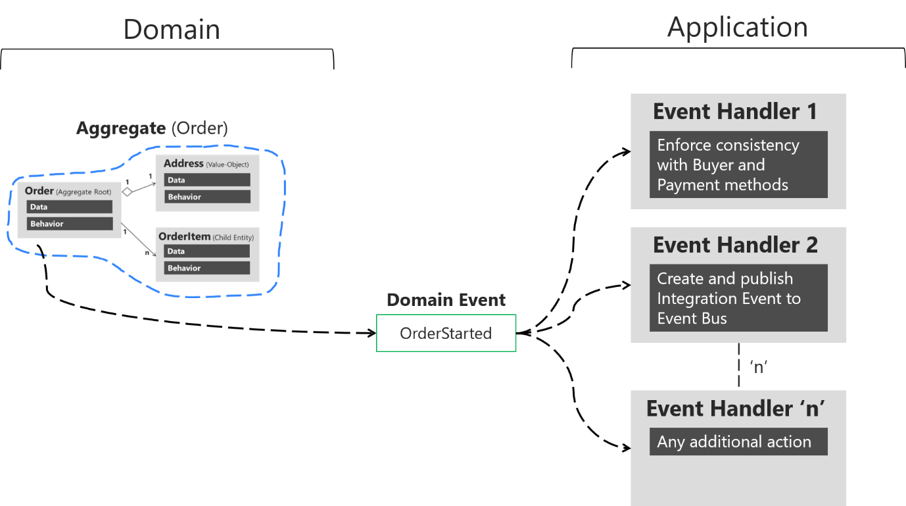
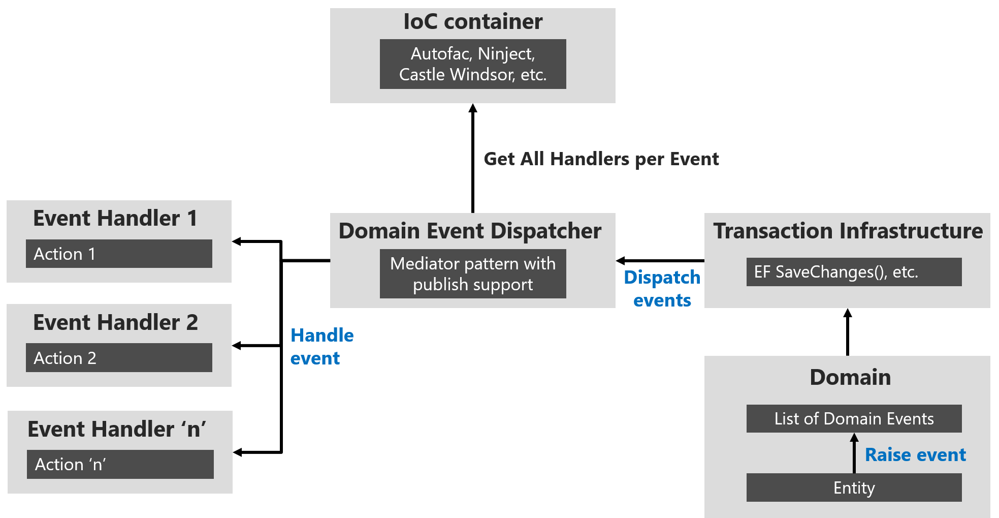

# Domain events: design and implementation

Use domain events to explicitly implement side effects of changes within your domain. In other words, and using DDD terminology, use domain events to explicitly implement side effects across multiple aggregates. Optionally, for better scalability and less impact in database locks, use eventual consistency between aggregates within the same domain.

## What is a domain event?

An event is something that has happened in the past. A domain event is, logically, something that happened in a particular domain, and something you want other parts of the same domain (in-process) to be aware of and potentially react to.

An important benefit of domain events is that side effects after something happened in a domain can be expressed explicitly instead of implicitly. Those side effects must be consistent so either all the operations related to the business task happen, or none of them. In addition, domain events enable a better separation of concerns among classes within the same domain.

For example, if you're just using Entity Framework and entities or even aggregates, if there have to be side effects provoked by a use case, those will be implemented as an implicit concept in the coupled code after something happened. But, if you just see that code, you might not know if that code (the side effect) is part of the main operation or if it really is a side effect. On the other hand, using domain events makes the concept explicit and part of the ubiquitous language. For example, in the eShopOnContainers application, creating an order is not just about the order; it updates or creates a buyer aggregate based on the original user, because the user is not a buyer until there is an order in place. If you use domain events, you can explicitly express that domain rule based in the ubiquitous language provided by the domain experts.

Domain events are somewhat similar to messaging-style events, with one important difference. With real messaging, message queuing, message brokers, or a service bus using AMPQ, a message is always sent asynchronously and communicated across processes and machines. This is useful for integrating multiple Bounded Contexts, microservices, or even different applications. However, with domain events, you want to raise an event from the domain operation you are currently running, but you want any side effects to occur within the same domain.

The domain events and their side effects (the actions triggered afterwards that are managed by event handlers) should occur almost immediately, usually in-process, and within the same domain. Thus, domain events could be synchronous or asynchronous. Integration events, however, should always be asynchronous.

## Domain events versus integration events

Semantically, domain and integration events are the same thing: notifications about something that just happened. However, their implementation must be different. Domain events are just messages pushed to a domain event dispatcher, which could be implemented as an in-memory mediator based on an IoC container or any other method.

On the other hand, the purpose of integration events is to propagate committed transactions and updates to additional subsystems, whether they are other microservices, Bounded Contexts or even external applications. Hence, they should occur only if the entity is successfully persisted, since in many scenarios if this fails, the entire operation effectively never happened.

In addition, and as mentioned, integration events must be based on asynchronous communication between multiple microservices (other Bounded Contexts) or even external systems/applications. Thus, the event bus interface needs some infrastructure that allows inter-process and distributed communication between potentially remote services. It can be based on a commercial service bus, queues, a shared database used as a mailbox, or any other distributed and ideally push based messaging system.

## Domain events as a preferred way to trigger side effects across multiple aggregates within the same domain

If executing a command related to one aggregate instance requires additional domain rules to be run on one or more additional aggregates, you should design and implement those side effects to be triggered by domain events. As shown in Figure 9-14, and as one of the most important use cases, a domain event should be used to propagate state changes across multiple aggregates within the same domain model.


**Figure 9-14**. Domain events to enforce consistency between multiple aggregates within the same domain

In the figure, when the user initiates an order, the OrderStarted domain event triggers creation of a Buyer object in the ordering microservice, based on the original user info from the identity microservice (with information provided in the CreateOrder command). The domain event is generated by the order aggregate when it is created in the first place.

Alternately, you can have the aggregate root subscribed for events raised by members of its aggregates (child entities). For instance, each OrderItem child entity can raise an event when the item price is higher than a specific amount, or when the product item amount is too high. The aggregate root can then receive those events and perform a global calculation or aggregation.

It is important to understand that this event-based communication is not implemented directly within the aggregates; you need to implement domain event handlers. Handling the domain events is an application concern. The domain model layer should only focus on the domain logic—things that a domain expert would understand, not application infrastructure like handlers and side-effect persistence actions using repositories. Therefore, the application layer level is where you should have domain event handlers triggering actions when a domain event is raised.

Domain events can also be used to trigger any number of application actions, and what is more important, must be open to increase that number in the future in a decoupled way. For instance, when the order is started, you might want to publish a domain event to propagate that info to other aggregates or even to raise application actions like notifications.

The key point is the open number of actions to be executed when a domain event occurs. Eventually, the actions and rules in the domain and application will grow. The complexity or number of side-effect actions when something happens will grow, but if your code were coupled with “glue” (that is, just instantiating objects with the new keyword in C\#), then every time you needed to add a new action you would need to change the original code. This could result in new bugs, because with each new requirement you would need to change the original code flow. This goes against the [Open/Closed principle](https://en.wikipedia.org/wiki/Open/closed_principle) from [SOLID](https://en.wikipedia.org/wiki/SOLID_(object-oriented_design)). Not only that, the original class that was orchestrating the operations would grow and grow, which goes against the [Single Responsibility Principle (SRP)](https://en.wikipedia.org/wiki/Single_responsibility_principle).

On the other hand, if you use domain events, you can create a fine-grained and decoupled implementation by segregating responsibilities using this approach:

1.  Send a command (for example, CreateOrder).
2.  Receive the command in a command handler.
    -   Execute a single aggregate’s transaction.
    -   (Optional) Raise domain events for side effects (for example, OrderStartedDomainEvent).
1.  Handle domain events (within the current process) that will execute an open number of side effects in multiple aggregates or application actions. For example:
    -   Verify or create buyer and payment method.
    -   Create and send a related integration event to the event bus to propagate states across microservices or trigger external actions like sending an email to the buyer.
    -   Handle other side effects.

As shown in Figure 9-15, starting from the same domain event, you can handle multiple actions related to other aggregates in the domain or additional application actions you need to perform across microservices connecting with integration events and the event bus.



**Figure 9-15**. Handling multiple actions per domain

The event handlers are typically in the application layer, because you will use infrastructure objects like repositories or an application API for the microservice’s behavior. In that sense, event handlers are similar to command handlers, so both are part of the application layer. The important difference is that a command should be processed just once. A domain event could be processed zero or *n* times, because it can be received by multiple receivers or event handlers with a different purpose for each handler.

The possibility of an open number of handlers per domain event allows you to add many more domain rules without impacting your current code. For instance, implementing the following business rule that has to happen right after an event might be as easy as adding a few event handlers (or even just one):

When the total amount purchased by a customer in the store, across any number of orders, exceeds $6,000, apply a 10% off discount to every new order and notify the customer with an email about that discount for future orders.

## Implementing domain events

In C#, a domain event is simply a data-holding structure or class, like a DTO, with all the information related to what just happened in the domain, as shown in the following example:

```csharp
public class OrderStartedDomainEvent : INotification
{
    public string UserId { get; }
    public int CardTypeId { get; }
    public string CardNumber { get; }
    public string CardSecurityNumber { get; }
    public string CardHolderName { get; }
    public DateTime CardExpiration { get; }
    public Order Order { get; }

    public OrderStartedDomainEvent(Order order,
                                   int cardTypeId, string cardNumber,
                                   string cardSecurityNumber, string cardHolderName,
                                   DateTime cardExpiration)
    {
        Order = order;
        CardTypeId = cardTypeId;
        CardNumber = cardNumber;
        CardSecurityNumber = cardSecurityNumber;
        CardHolderName = cardHolderName;
        CardExpiration = cardExpiration;
    }
}
```

This is essentially a class that holds all the data related to the OrderStarted event.

In terms of the ubiquitous language of the domain, since an event is something that happened in the past, the class name of the event should be represented as a past-tense verb, like OrderStartedDomainEvent or OrderShippedDomainEvent. That is how the domain event is implemented in the ordering microservice in eShopOnContainers.

As noted earlier, an important characteristic of events is that since an event is something that happened in the past, it should not change. Therefore it must be an immutable class. You can see in the previous code that the properties are read-only from outside of the object. The only way to update the object is through the constructor when you create the event object.

### Raising domain events

The next question is how to raise a domain event so it reaches its related event handlers. You can use multiple approaches.

Udi Dahan originally proposed (for example, in several related posts, such as [Domain Events – Take 2](http://udidahan.com/2008/08/25/domain-events-take-2/)) using a static class for managing and raising the events. This might include a static class named DomainEvents that would raise domain events immediately when it is called, using syntax like DomainEvents.Raise(Event myEvent). Jimmy Bogard wrote a blog post ([Strengthening your domain: Domain Events](https://lostechies.com/jimmybogard/2010/04/08/strengthening-your-domain-domain-events/)) that recommends a similar approach.

However, when the domain events class is static, it also dispatches to handlers immediately. This makes testing and debugging more difficult, because the event handlers with side-effects logic are executed immediately after the event is raised. When you are testing and debugging, you want to focus on and just what is happening in the current aggregate classes; you do not want to suddenly be redirected to other event handlers for side effects related to other aggregates or application logic. This is why other approaches have evolved, as explained in the next section.

#### The deferred approach for raising and dispatching events

Instead of dispatching to a domain event handler immediately, a better approach is to add the domain events to a collection and then to dispatch those domain events *right before* or *right* *after* committing the transaction (as with SaveChanges in EF). (This approach was described by Jimmy Bogard in this post [A better domain events pattern](https://lostechies.com/jimmybogard/2014/05/13/a-better-domain-events-pattern/).)

Deciding if you send the domain events right before or right after committing the transaction is important, since it determines whether you will include the side effects as part of the same transaction or in different transactions. In the latter case, you need to deal with eventual consistency across multiple aggregates. This topic is discussed in the next section.

The deferred approach is what eShopOnContainers uses. First, you add the events happening in your entities into a collection or list of events per entity. That list should be part of the entity object, or even better, part of your base entity class, as shown in the following example of the Entity base class:

```csharp
public abstract class Entity
{
     //... 
    private List<INotification> _domainEvents;
    public List<INotification> DomainEvents => _domainEvents;

    public void AddDomainEvent(INotification eventItem)
    {
        _domainEvents = _domainEvents ?? new List<INotification>();
        _domainEvents.Add(eventItem);
    }

    public void RemoveDomainEvent(INotification eventItem)
    {
        if (_domainEvents is null) return;
        _domainEvents.Remove(eventItem);
    }
    // ...
}
```

When you want to raise an event, you just add it to the event collection from code at any method of the aggregate-root entity.

The following code, part of the [Order agregate-root at eShopOnContainers](https://github.com/dotnet-architecture/eShopOnContainers/blob/dev/src/Services/Ordering/Ordering.Domain/AggregatesModel/OrderAggregate/Order.cs), shows an example:

```csharp
var orderStartedDomainEvent = new OrderStartedDomainEvent(this, //Order object
                                                          cardTypeId, cardNumber,
                                                          cardSecurityNumber,
                                                          cardHolderName,
                                                          cardExpiration);
this.AddDomainEvent(orderStartedDomainEvent);
```

Notice that the only thing that the AddDomainEvent method is doing is adding an event to the list. No event is dispatched yet, and no event handler is invoked yet.

You actually want to dispatch the events later on, when you commit the transaction to the database. If you are using Entity Framework Core, that means in the SaveChanges method of your EF DbContext, as in the following code:

```csharp
// EF Core DbContext
public class OrderingContext : DbContext, IUnitOfWork
{
    // ...
    public async Task<bool> SaveEntitiesAsync(CancellationToken cancellationToken = default(CancellationToken))
    {
        // Dispatch Domain Events collection.
        // Choices:
        // A) Right BEFORE committing data (EF SaveChanges) into the DB. This makes
        // a single transaction including side effects from the domain event
        // handlers that are using the same DbContext with Scope lifetime
        // B) Right AFTER committing data (EF SaveChanges) into the DB. This makes
        // multiple transactions. You will need to handle eventual consistency and
        // compensatory actions in case of failures.        
        await _mediator.DispatchDomainEventsAsync(this);

        // After this line runs, all the changes (from the Command Handler and Domain
        // event handlers) performed through the DbContext will be commited
        var result = await base.SaveChangesAsync();
    }
}
```

With this code, you dispatch the entity events to their respective event handlers.

The overall result is that you have decoupled the raising of a domain event (a simple add into a list in memory) from dispatching it to an event handler. In addition, depending on what kind of dispatcher you are using, you could dispatch the events synchronously or asynchronously.

Be aware that transactional boundaries come into significant play here. If your unit of work and transaction can span more than one aggregate (as when using EF Core and a relational database), this can work well. But if the transaction cannot span aggregates, such as when you are using a NoSQL database like Azure DocumentDB, you have to implement additional steps to achieve consistency. This is another reason why persistence ignorance is not universal; it depends on the storage system you use.

### Single transaction across aggregates versus eventual consistency across aggregates

The question of whether to perform a single transaction across aggregates versus relying on eventual consistency across those aggregates is a controversial one. Many DDD authors like Eric Evans and Vaughn Vernon advocate the rule that one transaction = one aggregate and therefore argue for eventual consistency across aggregates. For example, in his book *Domain-Driven Design*, Eric Evans says this:

Any rule that spans Aggregates will not be expected to be up-to-date at all times. Through event processing, batch processing, or other update mechanisms, other dependencies can be resolved within some specific time. (page 128)

Vaughn Vernon says the following in [Effective Aggregate Design. Part II: Making Aggregates Work Together](https://dddcommunity.org/wp-content/uploads/files/pdf_articles/Vernon_2011_2.pdf):

Thus, if executing a command on one aggregate instance requires that additional business rules execute on one or more aggregates, use eventual consistency \[...\] There is a practical way to support eventual consistency in a DDD model. An aggregate method publishes a domain event that is in time delivered to one or more asynchronous subscribers.

This rationale is based on embracing fine-grained transactions instead of transactions spanning many aggregates or entities. The idea is that in the second case, the number of database locks will be substantial in large-scale applications with high scalability needs. Embracing the fact that high-scalable applications need not have instant transactional consistency between multiple aggregates helps with accepting the concept of eventual consistency. Atomic changes are often not needed by the business, and it is in any case the responsibility of the domain experts to say whether particular operations need atomic transactions or not. If an operation always needs an atomic transaction between multiple aggregates, you might ask whether your aggregate should be larger or was not correctly designed.

However, other developers and architects like Jimmy Bogard are okay with spanning a single transaction across several aggregates—but only when those additional aggregates are related to side effects for the same original command. For instance, in [A better domain events pattern](https://lostechies.com/jimmybogard/2014/05/13/a-better-domain-events-pattern/), Bogard says this:

Typically, I want the side effects of a domain event to occur within the same logical transaction, but not necessarily in the same scope of raising the domain event \[...\] Just before we commit our transaction, we dispatch our events to their respective handlers.

If you dispatch the domain events right *before* committing the original transaction, it is because you want the side effects of those events to be included in the same transaction. For example, if the EF DbContext SaveChanges method fails, the transaction will roll back all changes, including the result of any side effect operations implemented by the related domain event handlers. This is because the DbContext life scope is by default defined as "scoped." Therefore, the DbContext object is shared across multiple repository objects being instantiated within the same scope or object graph. This coincides with the HttpRequest scope when developing Web API or MVC apps.

In reality, both approaches (single atomic transaction and eventual consistency) can be right. It really depends on your domain or business requirements and what the domain experts tell you. It also depends on how scalable you need the service to be (more granular transactions have less impact with regard to database locks). And it depends on how much investment you are willing to make in your code, since eventual consistency requires more complex code in order to detect possible inconsistencies across aggregates and the need to implement compensatory actions. Take into account that if you commit changes to the original aggregate and afterwards, when the events are being dispatched, there is an issue and the event handlers cannot commit their side effects, you will have inconsistencies between aggregates.

A way to allow compensatory actions would be to store the domain events in additional database tables so they can be part of the original transaction. Afterwards, you could have a batch process that detects inconsistencies and runs compensatory actions by comparing the list of events with the current state of the aggregates. The compensatory actions are part of a complex topic that will require deep analysis from your side, which includes discussing it with the business user and domain experts.

In any case, you can choose the approach you need. But the initial deferred approach—raising the events before committing, so you use a single transaction—is the simplest approach when using EF Core and a relational database. It is easier to implement and valid in many business cases. It is also the approach used in the ordering microservice in eShopOnContainers.

But how do you actually dispatch those events to their respective event handlers? What is the \_mediator object that you see in the previous example? That has to do with the techniques and artifacts you can use to map between events and their event handlers.

### The domain event dispatcher: mapping from events to event handlers

Once you're able to dispatch or publish the events, you need some kind of artifact that will publish the event, so that every related handler can get it and process side effects based on that event.

One approach is a real messaging system or even an event bus, possibly based on a service bus as opposed to in-memory events. However, for the first case, real messaging would be overkill for processing domain events, since you just need to process those events within the same process (that is, within the same domain and application layer).

Another way to map events to multiple event handlers is by using types registration in an IoC container so that you can dynamically infer where to dispatch the events. In other words, you need to know what event handlers need to get a specific event. Figure 9-16 shows a simplified approach for that.



**Figure 9-16**. Domain event dispatcher using IoC

You can build all the plumbing and artifacts to implement that approach by yourself. However, you can also use available libraries like [MediatR](https://github.com/jbogard/MediatR), which underneath the covers uses your IoC container. You can therefore directly use the predefined interfaces and the mediator object’s publish/dispatch methods.

In code, you first need to register the event handler types in your IoC container, as shown in the following example at [eShopOnContainers Ordering microservice](https://github.com/dotnet-architecture/eShopOnContainers/blob/dev/src/Services/Ordering/Ordering.API/Infrastructure/AutofacModules/MediatorModule.cs):

```csharp
public class MediatorModule : Autofac.Module
{
    protected override void Load(ContainerBuilder builder)
    {
        // Other registrations ...
        // Register the DomainEventHandler classes (they implement IAsyncNotificationHandler<>)
        // in assembly holding the Domain Events
        builder.RegisterAssemblyTypes(typeof(ValidateOrAddBuyerAggregateWhenOrderStartedDomainEventHandler)
                                       .GetTypeInfo().Assembly)
                                         .AsClosedTypesOf(typeof(IAsyncNotificationHandler<>));
        // Other registrations ...
    }
}
```

The code first identifies the assembly that contains the domain event handlers by locating the assembly that holds any of the handlers (using typeof(ValidateOrAddBuyerAggregateWhenXxxx), but you could have chosen any other event handler to locate the assembly). Since all the event handlers implement the IAsyncNotificationHandler interface, the code then just searches for those types and registers all the event handlers.

### How to subscribe to domain events

When you use MediatR, each event handler must use an event type that is provided on the generic parameter of the INotificationHandler interface, as you can see in the following code:

```csharp
public class ValidateOrAddBuyerAggregateWhenOrderStartedDomainEventHandler
  : IAsyncNotificationHandler<OrderStartedDomainEvent>
```

Based on the relationship between event and event handler, which can be considered the subscription, the MediatR artifact can discover all the event handlers for each event and trigger each of those event handlers.

### How to handle domain events

Finally, the event handler usually implements application layer code that uses infrastructure repositories to obtain the required additional aggregates and to execute side-effect domain logic. The following [domain event handler code at eShopOnContainers](https://github.com/dotnet-architecture/eShopOnContainers/blob/dev/src/Services/Ordering/Ordering.API/Application/DomainEventHandlers/OrderStartedEvent/ValidateOrAddBuyerAggregateWhenOrderStartedDomainEventHandler.cs), shows an implementation example.

```csharp
public class ValidateOrAddBuyerAggregateWhenOrderStartedDomainEventHandler
                   : INotificationHandler<OrderStartedDomainEvent>
{
    private readonly ILoggerFactory _logger;
    private readonly IBuyerRepository<Buyer> _buyerRepository;
    private readonly IIdentityService _identityService;

    public ValidateOrAddBuyerAggregateWhenOrderStartedDomainEventHandler(
        ILoggerFactory logger,
        IBuyerRepository<Buyer> buyerRepository,
        IIdentityService identityService)
    {
        // ...Parameter validations...
    }

    public async Task Handle(OrderStartedDomainEvent orderStartedEvent)
    {
        var cardTypeId = (orderStartedEvent.CardTypeId != 0) ? orderStartedEvent.CardTypeId : 1;        
        var userGuid = _identityService.GetUserIdentity();
        var buyer = await _buyerRepository.FindAsync(userGuid);
        bool buyerOriginallyExisted = (buyer == null) ? false : true;

        if (!buyerOriginallyExisted)
        {
            buyer = new Buyer(userGuid);
        }

        buyer.VerifyOrAddPaymentMethod(cardTypeId,
                                       $"Payment Method on {DateTime.UtcNow}",
                                       orderStartedEvent.CardNumber,
                                       orderStartedEvent.CardSecurityNumber,
                                       orderStartedEvent.CardHolderName,
                                       orderStartedEvent.CardExpiration,
                                       orderStartedEvent.Order.Id);

        var buyerUpdated = buyerOriginallyExisted ? _buyerRepository.Update(buyer) 
                                                                      : _buyerRepository.Add(buyer);

        await _buyerRepository.UnitOfWork
                .SaveEntitiesAsync();

        // Logging code using buyerUpdated info, etc.
    }
}
```

The previous domain event handler code is considered application layer code because it uses infrastructure repositories, as explained in the next section on the infrastructure-persistence layer. Event handlers could also use other infrastructure components.

#### Domain events can generate integration events to be published outside of the microservice boundaries

Finally, it is important to mention that you might sometimes want to propagate events across multiple microservices. That is considered an integration event, and it could be published through an event bus from any specific domain event handler.

## Conclusions on domain events

As stated, use domain events to explicitly implement side effects of changes within your domain. To use DDD terminology, use domain events to explicitly implement side effects across one or multiple aggregates. Additionally, and for better scalability and less impact on database locks, use eventual consistency between aggregates within the same domain.

## Additional resources

-   **Greg Young. What is a Domain Event?**
    [*http://codebetter.com/gregyoung/2010/04/11/what-is-a-domain-event/*](http://codebetter.com/gregyoung/2010/04/11/what-is-a-domain-event/)

-   **Jan Stenberg. Domain Events and Eventual Consistency**
    [*https://www.infoq.com/news/2015/09/domain-events-consistency*](https://www.infoq.com/news/2015/09/domain-events-consistency)

-   **Jimmy Bogard. A better domain events pattern**
    [*https://lostechies.com/jimmybogard/2014/05/13/a-better-domain-events-pattern/*](https://lostechies.com/jimmybogard/2014/05/13/a-better-domain-events-pattern/)

-   **Vaughn Vernon. Effective Aggregate Design Part II: Making Aggregates Work Together**
    [*http://dddcommunity.org/wp-content/uploads/files/pdf\_articles/Vernon\_2011\_2.pdf*](https://dddcommunity.org/wp-content/uploads/files/pdf_articles/Vernon_2011_2.pdf)

-   **Jimmy Bogard. Strengthening your domain: Domain Events**
    *<https://lostechies.com/jimmybogard/2010/04/08/strengthening-your-domain-domain-events/> *

-   **Tony Truong. Domain Events Pattern Example**
    [*https://www.tonytruong.net/domain-events-pattern-example/*](https://www.tonytruong.net/domain-events-pattern-example/)

-   **Udi Dahan. How to create fully encapsulated Domain Models**
    [*http://udidahan.com/2008/02/29/how-to-create-fully-encapsulated-domain-models/*](http://udidahan.com/2008/02/29/how-to-create-fully-encapsulated-domain-models/)

-   **Udi Dahan. Domain Events – Take 2**
    [*http://udidahan.com/2008/08/25/domain-events-take-2/*](http://udidahan.com/2008/08/25/domain-events-take-2/%20)

-   **Udi Dahan. Domain Events – Salvation**
    [*http://udidahan.com/2009/06/14/domain-events-salvation/*](http://udidahan.com/2009/06/14/domain-events-salvation/)

-   **Jan Kronquist. Don't publish Domain Events, return them!**
    [*https://blog.jayway.com/2013/06/20/dont-publish-domain-events-return-them/*](https://blog.jayway.com/2013/06/20/dont-publish-domain-events-return-them/)

-   **Cesar de la Torre. Domain Events vs. Integration Events in DDD and microservices architectures**
    [*https://blogs.msdn.microsoft.com/cesardelatorre/2017/02/07/domain-events-vs-integration-events-in-domain-driven-design-and-microservices-architectures/*](https://blogs.msdn.microsoft.com/cesardelatorre/2017/02/07/domain-events-vs-integration-events-in-domain-driven-design-and-microservices-architectures/)


>[!div class="step-by-step"]
[Previous] (client-side-validation.md)
[Next] (infrastructure-persistence-layer-design.md)
