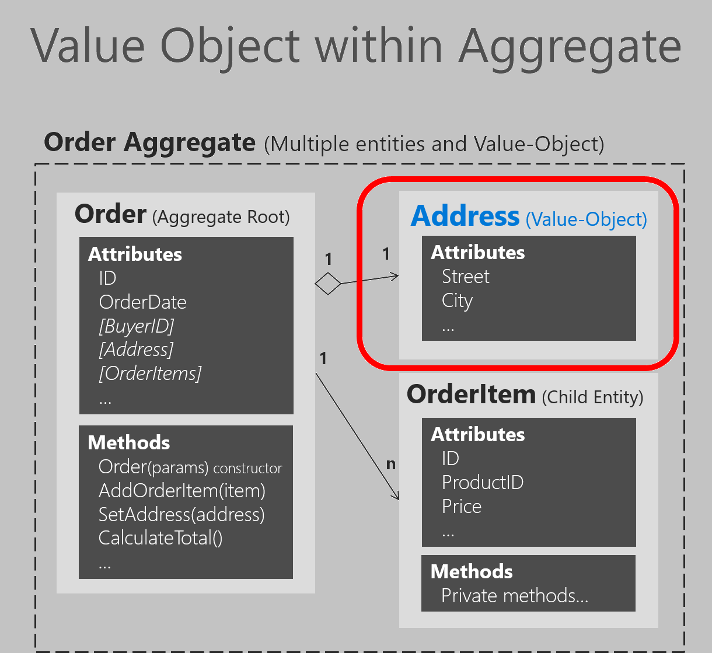

# Implementing value objects

As discussed in earlier sections about entities and aggregates, identity is fundamental for entities. However, there are many objects and data items in a system that do not require an identity and identity tracking, such as value objects.

A value object can reference other entities. For example, in an application that generates a route that describes how to get from one point to another, that route would be a value object. It would be a snapshot of points on a specific route, but this suggested route would not have an identity, even though internally it might refer to entities like City, Road, etc.

Figure 9-13 shows the Address value object within the Order aggregate.



**Figure 9-13**. Address value object within the Order aggregate

As shown in Figure 9-13, an entity is usually composed of multiple attributes. For example, the `Order` entity can be modeled as an entity with an identity and composed internally of a set of attributes such as OrderId, OrderDate, OrderItems, etc. But the address, which is simply a complex value composed of country, street, city, etc. and has no identity in this domain,  must be modeled and treated as a value object.

## Important characteristics of value objects

There are two main characteristics for value objects:

-   They have no identity.

-   They are immutable.

The first characteristic was already discussed. Immutability is an important requirement. The values of a value object must be immutable once the object is created. Therefore, when the object is constructed, you must provide the required values, but you must not allow them to change during the object’s lifetime.

Value objects allow you to perform certain tricks for performance, thanks to their immutable nature. This is especially true in systems where there may be thousands of value object instances, many of which have the same values. Their immutable nature allows them to be reused; they can be interchangeable objects, since their values are the same and they have no identity. This type of optimization can sometimes make a difference between software that runs slowly and software with good performance. Of course, all these cases depend on the application environment and deployment context.

## Value object implementation in C\#

In terms of implementation, you can have a value object base class that has basic utility methods like equality based on comparison between all the attributes (since a value object must not be based on identity) and other fundamental characteristics. The following example shows a value object base class used in the ordering microservice from eShopOnContainers.

```csharp
public abstract class ValueObject
{
    protected static bool EqualOperator(ValueObject left, ValueObject right)
    {
        if (ReferenceEquals(left, null) ^ ReferenceEquals(right, null))
        {
            return false;
        }
        return ReferenceEquals(left, null) || left.Equals(right);
    }

    protected static bool NotEqualOperator(ValueObject left, ValueObject right)
    {
        return !(EqualOperator(left, right));
    }

    protected abstract IEnumerable<object> GetAtomicValues();

    public override bool Equals(object obj)
    {
        if (obj == null || obj.GetType() != GetType())
        {
            return false;
        }

        ValueObject other = (ValueObject)obj;
        IEnumerator<object> thisValues = GetAtomicValues().GetEnumerator();
        IEnumerator<object> otherValues = other.GetAtomicValues().GetEnumerator();
        while (thisValues.MoveNext() && otherValues.MoveNext())
        {
            if (ReferenceEquals(thisValues.Current, null) ^
                ReferenceEquals(otherValues.Current, null))
            {
                return false;
            }

            if (thisValues.Current != null &&
                !thisValues.Current.Equals(otherValues.Current))
            {
                return false;
            }
        }
        return !thisValues.MoveNext() && !otherValues.MoveNext();
    }

    public override int GetHashCode()
    {
        return GetAtomicValues()
         .Select(x => x != null ? x.GetHashCode() : 0)
         .Aggregate((x, y) => x ^ y);
    }        
    // Other utilility methods
}
```

You can use this class when implementing your actual value object, as with the Address value object shown in the following example:

```csharp
public class Address : ValueObject
{
    public String Street { get; }
    public String City { get; }
    public String State { get; }
    public String Country { get; }
    public String ZipCode { get; }

    private Address() { }

    public Address(string street, string city, string state, string country, string zipcode)
    {
        Street = street;
        City = city;
        State = state;
        Country = country;
        ZipCode = zipcode;
    }

    protected override IEnumerable<object> GetAtomicValues()
    {
        // Using a yield return statement to return each element one at a time
        yield return Street;
        yield return City;
        yield return State;
        yield return Country;
        yield return ZipCode;
    }
}
```

## How to persist value objects in the database with EF Core 2.0

You just saw how to define a value object in your domain model. But, how can you actually persist it into the database through Entity Framework (EF) Core which usually targets entities with identity?

### Background and older approaches using EF Core 1.1

As background, a limitation when using EF Core 1.0 and 1.1 was that you cannot use  [complex types](xref:System.ComponentModel.DataAnnotations.Schema.ComplexTypeAttribute) as defined in EF 6.x in the traditional .NET Framework. Therefore, if using EF Core 1.0 or 1.1, you needed to store your value object as an EF entity with an ID field. Then, so it looked more like a value object with no identity, you could hide its ID so you make clear that the identity of a value object is not important in the domain model. You could hide that ID by using the ID as a [shadow property](https://docs.microsoft.com/ef/core/modeling/shadow-properties ). Since that configuration for hiding the ID in the model is set up in the EF infrastructure level, it would be kind of transparent for your domain model.

In the initial version of eShopOnContainers (.NET Core 1.1), the hidden ID needed by EF Core infrastructure was implemented in the following way in the DbContext level, using Fluent API at the infrastructure project. Therefore, the ID was hidden from the domain model point of view, but still present in the infrastructure.

```csharp
// Old approach with EF Core 1.1
// Fluent API within the OrderingContext:DbContext in the Infrastructure project
void ConfigureAddress(EntityTypeBuilder<Address> addressConfiguration) 
{
    addressConfiguration.ToTable("address", DEFAULT_SCHEMA); 

    addressConfiguration.Property<int>("Id")  // Id is a shadow property
        .IsRequired();
    addressConfiguration.HasKey("Id");   // Id is a shadow property
}
```

However, the persistence of that value object into the database was performed like a regular entity in a different table.

With EF Core 2.0, there are new and better ways to persist value objects.

## Persist value objects as owned entity types in EF Core 2.0

Even with some gaps between the canonical value object pattern in DDD and the owned entity type in EF Core, it's currently the best way to persist value objects with EF Core 2.0. You can see limitations at the end of this section.

The owned entity type feature was added to EF Core since version 2.0.

An owned entity type allows you to map types that do not have their own identity explicitely defined in the domain model and are used as properties, such as a value object, within any of your entities. An owned entity type shares the same CLR type with another entity type. The entity containing the defining navigation is the owner entity. When querying the owner, the owned types are included by default.

Just by looking at the domain model, an owned type looks like it doesn’t have any identity.
However, under the covers, owned types do have identity, but the owner navigation property is part of this identity.

The identity of instances of own types is not completely their own. It consists of three components:

- The identity of the owner

- The navigation property pointing to them

- In the case of collections of owned types, an independent component (not yet supported in EF Core 2.0).

For example, in the Ordering domain model at eShopOnContainers, as part of the Order entity, the Address value object is implemented as an owned entity type within the owner entity, which is the Order entity. Address is a type with no identity property defined in the domain model. It is used as a property of the Order type to specify the shipping address for a particular order.

By convention, a shadow primary key is created for the owned type and it will be mapped to the same table as the owner by using table splitting. This allows to use owned types similarly to how complex types are used in EF6 in the traditional .NET Framework.

It is important to note that owned types are never discovered by convention in EF Core, so you have to declare them explicitly.

In eShopOnContainers, at the OrderingContext.cs, within the OnModelCreating() method, there are multiple infrastructure configuration being applied. One of them is related to the Order entity.

```csharp
// Part of the OrderingContext.cs class at the Ordering.Infrastructure project
// 
protected override void OnModelCreating(ModelBuilder modelBuilder)
{
    modelBuilder.ApplyConfiguration(new ClientRequestEntityTypeConfiguration());
    modelBuilder.ApplyConfiguration(new PaymentMethodEntityTypeConfiguration());
    modelBuilder.ApplyConfiguration(new OrderEntityTypeConfiguration());
    modelBuilder.ApplyConfiguration(new OrderItemEntityTypeConfiguration());
    //...Additional type configurations
}
```

In the following code, the persistence infrastructure is defined for the Order entity:

```csharp
// Part of the OrderEntityTypeConfiguration.cs class 
// 
public void Configure(EntityTypeBuilder<Order> orderConfiguration)
{
    orderConfiguration.ToTable("orders", OrderingContext.DEFAULT_SCHEMA);
    orderConfiguration.HasKey(o => o.Id);
    orderConfiguration.Ignore(b => b.DomainEvents);
    orderConfiguration.Property(o => o.Id)
        .ForSqlServerUseSequenceHiLo("orderseq", OrderingContext.DEFAULT_SCHEMA);

    //Address value object persisted as owned entity in EF Core 2.0
    orderConfiguration.OwnsOne(o => o.Address);

    orderConfiguration.Property<DateTime>("OrderDate").IsRequired();
    
    //...Additional validations, constraints and code...
    //...
}
```

In the previous code, the `orderConfiguration.OwnsOne(o => o.Address)` method specifies that the `Address` property is an owned entity of the `Order` type.

By default, EF Core conventions name the database columns for the properties of the owned entity type as `EntityProperty_OwnedEntityProperty`. Therefore, the internal properties of `Address` will appear in the `Orders` table with the names `Address_Street`, `Address_City` (and so on for `State`, `Country` and `ZipCode`).

You can append the `Property().HasColumnName()` fluent method to rename those columns. In the case where `Address` is a public property, the mappings would be like the following:

```csharp
orderConfiguration.OwnsOne(p => p.Address)
                            .Property(p=>p.Street).HasColumnName("ShippingStreet");

orderConfiguration.OwnsOne(p => p.Address)
                            .Property(p=>p.City).HasColumnName("ShippingCity");
```

It is possible to chain the `OwnsOne` method in a fluent mapping. In the following hypothetical example, `OrderDetails` owns `BillingAddress` and `ShippingAddress`, which are both `Address` types. Then `OrderDetails` is owned by the `Order` type.

```csharp
orderConfiguration.OwnsOne(p => p.OrderDetails, cb =>
    {
        cb.OwnsOne(c => c.BillingAddress);
        cb.OwnsOne(c => c.ShippingAddress);
    });
//...
//...
public class Order
{
    public int Id { get; set; }
    public OrderDetails OrderDetails { get; set; }
}

public class OrderDetails
{
    public Address BillingAddress { get; set; }
    public Address ShippingAddress { get; set; }
}

public class Address
{
    public string Street { get; set; }
    public string City { get; set; }
}
```

### Additional details on owned entity types

•	Owned types are defined when you configure a navigation property to a particular type using the OwnsOne fluent API.

•	The definition of an owned type in our metadata model is a composite of: the owner type, the navigation property, and the CLR type of the owned type.

•	The identity (key) of an owned type instance in our stack is a composite of the identity of the owner type and the definition of the owned type.

#### Owned entities capabilities:

•	Owned type can reference other entities, either owned (nested owned types) or non-owned (regular reference navigation properties to other entities).

•	You can map the same CLR type as different owned types in the same owner entity through separate navigation properties.

•	Table splitting is setup by convention, but you can opt out by mapping the owned type to a different table using ToTable.

•	Eager loading is performed automatically on owned types, i.e. no need to call Include() on the query.

#### Owned entities limitations:

•	You cannot create a DbSet<T> of an owned type (by design).

•	You cannot call ModelBuilder.Entity<T>() on owned types (currently by design).

•	No collections of owned types yet (but they will be supported in versions after EF Core 2.0).

•	No support for configuring them via an attribute.

•	No support for optional (i.e. nullable) owned types that are mapped with the owner in the same table (i.e. using table splitting). This is because we don't have a separate sentinel for the null.

•	No inheritance mapping support for owned types, but you should be able to map two leaf types of the same inheritance hierarchies as different owned types. EF Core will not reason about the fact that they are part of the same hierarchy.

#### Main differences with EF6's complex types

•	Table splitting is optional, i.e. they can optionally be mapped to a separate table and still be owned types.

•	They can reference other entities (i.e. they can act as the dependent side on relationships to other non-owned types).


## Additional resources

-   **Martin Fowler. ValueObject pattern**
    [*https://martinfowler.com/bliki/ValueObject.html*](https://martinfowler.com/bliki/ValueObject.html)

-   **Eric Evans. Domain-Driven Design: Tackling Complexity in the Heart of Software.** (Book; includes a discussion of value objects)
    [*https://www.amazon.com/Domain-Driven-Design-Tackling-Complexity-Software/dp/0321125215/*](https://www.amazon.com/Domain-Driven-Design-Tackling-Complexity-Software/dp/0321125215/)

-   **Vaughn Vernon. Implementing Domain-Driven Design.** (Book; includes a discussion of value objects)
    [*https://www.amazon.com/Implementing-Domain-Driven-Design-Vaughn-Vernon/dp/0321834577/*](https://www.amazon.com/Implementing-Domain-Driven-Design-Vaughn-Vernon/dp/0321834577/)

-   **Shadow Properties**
    [*https://docs.microsoft.com/ef/core/modeling/shadow-properties*](https://docs.microsoft.com/ef/core/modeling/shadow-properties)

-   **Complex types and/or value objects**. Discussion in the EF Core GitHub repo (Issues tab)
    [*https://github.com/aspnet/EntityFramework/issues/246*](https://github.com/aspnet/EntityFramework/issues/246)

-   **ValueObject.cs.** Base value object class in eShopOnContainers.
    [*https://github.com/dotnet/eShopOnContainers/blob/master/src/Services/Ordering/Ordering.Domain/SeedWork/ValueObject.cs*](https://github.com/dotnet/eShopOnContainers/blob/master/src/Services/Ordering/Ordering.Domain/SeedWork/ValueObject.cs)

-   **Address class.** Sample value object class in eShopOnContainers.
    [*https://github.com/dotnet/eShopOnContainers/blob/master/src/Services/Ordering/Ordering.Domain/AggregatesModel/OrderAggregate/Address.cs*](https://github.com/dotnet/eShopOnContainers/blob/master/src/Services/Ordering/Ordering.Domain/AggregatesModel/OrderAggregate/Address.cs)


>[!div class="step-by-step"]
[Previous] (seedwork-domain-model-base-classes-interfaces.md)
[Next] (enumeration-classes-over-enum-types.md)
