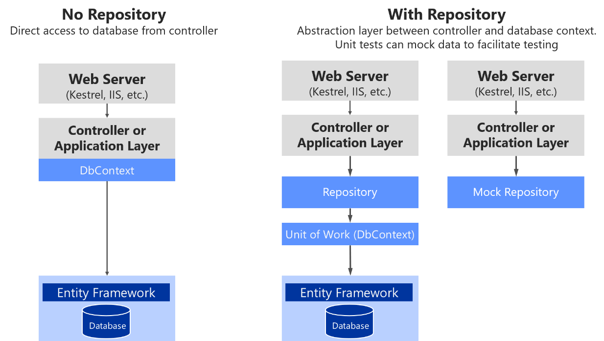

# Implementing the infrastructure persistence layer with Entity Framework Core

When you use relational databases such as SQL Server, Oracle, or PostgreSQL, a recommended approach is to implement the persistence layer based on Entity Framework (EF). EF supports LINQ and provides strongly typed objects for your model, as well as simplified persistence into your database.

Entity Framework has a long history as part of the .NET Framework. When you use .NET Core, you should also use Entity Framework Core, which runs on Windows or Linux in the same way as .NET Core. EF Core is a complete rewrite of Entity Framework, implemented with a much smaller footprint and important improvements in performance.

## Introduction to Entity Framework Core

Entity Framework (EF) Core is a lightweight, extensible, and cross-platform version of the popular Entity Framework data access technology. It was introduced with .NET Core in mid-2016.

Since an introduction to EF Core is already available in Microsoft documentation, here we simply provide links to that information.

#### Additional resources

-   **Entity Framework Core**
    [*https://docs.microsoft.com/ef/core/*](https://docs.microsoft.com/ef/core/)

-   **Getting started with ASP.NET Core and Entity Framework Core using Visual Studio**
    [*https://docs.microsoft.com/aspnet/core/data/ef-mvc/*](https://docs.microsoft.com/aspnet/core/data/ef-mvc/)

-   **DbContext Class**
    [*https://docs.microsoft.com/ef/core/api/microsoft.entityframeworkcore.dbcontext*](https://docs.microsoft.com/ef/core/api/microsoft.entityframeworkcore.dbcontext)

-   **Compare EF Core & EF6.x**
    [*https://docs.microsoft.com/ef/efcore-and-ef6/index*](https://docs.microsoft.com/ef/efcore-and-ef6/index)

## Infrastructure in Entity Framework Core from a DDD perspective

From a DDD point of view, an important capability of EF is the ability to use POCO domain entities, also known in EF terminology as POCO *code-first entities*. If you use POCO domain entities, your domain model classes are persistence-ignorant, following the [Persistence Ignorance](http://deviq.com/persistence-ignorance/) and the [Infrastructure Ignorance](https://ayende.com/blog/3137/infrastructure-ignorance) principles.

Per DDD patterns, you should encapsulate domain behavior and rules within the entity class itself, so it can control invariants, validations, and rules when accessing any collection. Therefore, it is not a good practice in DDD to allow public access to collections of child entities or value objects. Instead, you want to expose methods that control how and when your fields and property collections can be updated, and what behavior and actions should occur when that happens.

Since EF Core 1.1, to satisfy those DDD requirements, you can have plain fields in your entities instead of public properties. If you do not want an entity field to be externally accessible, you can just create the attribute or field instead of a property. You can also use private property setters.

In a similar way, you can now have read-only access to collections by using a public property typed as  `IReadOnlyCollection<T>`, which is backed by a private field member for the collection (like a `List<T>`) in your entity that relies on EF for persistence. Previous versions of Entity Framework required collection properties to support `ICollection<T>`, which meant that any developer using the parent entity class could add or remove items through its property collections. That possibility would be against the recommended patterns in DDD.

You can use a private collection while exposing a read-only `IReadOnlyCollection<T>` object, as shown in the following code example:

```csharp
public class Order : Entity
{
    // Using private fields, allowed since EF Core 1.1
    private DateTime _orderDate;
    // Other fields ...

    private readonly List<OrderItem> _orderItems; 
    public IReadOnlyCollection<OrderItem> OrderItems => _orderItems;

    protected Order() { }

    public Order(int buyerId, int paymentMethodId, Address address)
    {
        // Initializations ...
    }

    public void AddOrderItem(int productId, string productName,
                             decimal unitPrice, decimal discount,
                             string pictureUrl, int units = 1)
    {
        // Validation logic...

        var orderItem = new OrderItem(productId, productName, 
                                      unitPrice, discount,
                                      pictureUrl, units);
        _orderItems.Add(orderItem);
    }
}
```

Note that the `OrderItems` property can only be accessed as read-only using `IReadOnlyCollection<OrderItem>`. This type is read-only so it is protected against regular external updates. 

EF Core provides a way to map the domain model to the physical database without "contaminating" the domain model. It is pure .NET POCO code, because the mapping action is implemented in the persistence layer. In that mapping action, you need to configure the fields-to-database mapping. In the following example of an OnModelCreating method, the highlighted code tells EF Core to access the OrderItems property through its field.

```csharp
// At OrderingContext.cs from eShopOnContainers
protected override void OnModelCreating(ModelBuilder modelBuilder)
{
   // ...
   modelBuilder.ApplyConfiguration(new OrderEntityTypeConfiguration());
   // Other entities’ configuration ...
}

// At OrderEntityTypeConfiguration.cs from eShopOnContainers
class OrderEntityTypeConfiguration : IEntityTypeConfiguration<Order>
{
    public void Configure(EntityTypeBuilder<Order> orderConfiguration)
    {
        orderConfiguration.ToTable("orders", OrderingContext.DEFAULT_SCHEMA);
        // Other configuration

        var navigation = 
              orderConfiguration.Metadata.FindNavigation(nameof(Order.OrderItems));

        //EF access the OrderItem collection property through its backing field
        navigation.SetPropertyAccessMode(PropertyAccessMode.Field);

        // Other configuration
    }
}
```

When you use fields instead of properties, the OrderItem entity is persisted just as if it had a List&lt;OrderItem&gt; property. However, it exposes a single accessor, the `AddOrderItem` method for adding new items to the order. As a result, behavior and data are tied together and will be consistent throughout any application code that uses the domain model.

## Implementing custom repositories with Entity Framework Core

At the implementation level, a repository is simply a class with data persistence code coordinated by a unit of work (DBContext in EF Core) when performing updates, as shown in the following class:

```csharp
// using statements...
namespace Microsoft.eShopOnContainers.Services.Ordering.Infrastructure.Repositories
{
    public class BuyerRepository : IBuyerRepository
    {
        private readonly OrderingContext _context;
        public IUnitOfWork UnitOfWork
        {
            get
            {
                return _context;
            }
        }

        public BuyerRepository(OrderingContext context)
        {
            _context = context ?? throw new ArgumentNullException(nameof(context));
        }

        public Buyer Add(Buyer buyer)
        {
            return _context.Buyers.Add(buyer).Entity; 
        }

        public async Task<Buyer> FindAsync(string BuyerIdentityGuid)
        {
            var buyer = await _context.Buyers
                .Include(b => b.Payments)
                .Where(b => b.FullName == BuyerIdentityGuid)
                .SingleOrDefaultAsync();

            return buyer;
        }
    }
}
```

Note that the IBuyerRepository interface comes from the domain model layer as a contract. However, the repository implementation is done at the persistence and infrastructure layer.

The EF DbContext comes through the constructor through Dependency Injection. It is shared between multiple repositories within the same HTTP request scope, thanks to its default lifetime (ServiceLifetime.Scoped) in the IoC container (which can also be explicitly set with services.AddDbContext&lt;&gt;).

### Methods to implement in a repository (updates or transactions versus queries)

Within each repository class, you should put the persistence methods that update the state of entities contained by its related aggregate. Remember there is one-to-one relationship between an aggregate and its related repository. Take into account that an aggregate root entity object might have embedded child entities within its EF graph. For example, a buyer might have multiple payment methods as related child entities.

Since the approach for the ordering microservice in eShopOnContainers is also based on CQS/CQRS, most of the queries are not implemented in custom repositories. Developers have the freedom to create the queries and joins they need for the presentation layer without the restrictions imposed by aggregates, custom repositories per aggregate, and DDD in general. Most of the custom repositories suggested by this guide have several update or transactional methods but just the query methods needed to get data to be updated. For example, the BuyerRepository repository implements a FindAsync method, because the application needs to know whether a particular buyer exists before creating a new buyer related to the order.

However, the real query methods to get data to send to the presentation layer or client apps are implemented, as mentioned, in the CQRS queries based on flexible queries using Dapper.

### Using a custom repository versus using EF DbContext directly

The Entity Framework DbContext class is based on the Unit of Work and Repository patterns, and can be used directly from your code, such as from an ASP.NET Core MVC controller. That is the way you can create the simplest code, as in the CRUD catalog microservice in eShopOnContainers. In cases where you want the simplest code possible, you might want to directly use the DbContext class, as many developers do.

However, implementing custom repositories provides several benefits when implementing more complex microservices or applications. The Unit of Work and Repository patterns are intended to encapsulate the infrastructure persistence layer so it is decoupled from the application and domain model layers. Implementing these patterns can facilitate the use of mock repositories simulating access to the database.

In Figure 9-18 you can see the differences between not using repositories (directly using the EF DbContext) versus using repositories which make it easier to mock those repositories.



**Figure 9-18**. Using custom repositories versus a plain DbContext

There are multiple alternatives when mocking. You could mock just repositories or you could mock a whole unit of work. Usually mocking just the repositories is enough, and the complexity to abstract and mock a whole unit of work is usually not needed.

Later, when we focus on the application layer, you will see how Dependency Injection works in ASP.NET Core and how it is implemented when using repositories.

In short, custom repositories allow you to test code more easily with unit tests that are not impacted by the data tier state. If you run tests that also access the actual database through the Entity Framework, they are not unit tests but integration tests, which are a lot slower.

If you were using DbContext directly, the only choice you would have would be to run unit tests by using an in-memory SQL Server with predictable data for unit tests. You would not be able to control mock objects and fake data in the same way at the repository level. Of course, you could always test the MVC controllers.

## EF DbContext and IUnitOfWork instance lifetime in your IoC container

The DbContext object (exposed as an IUnitOfWork object) might need to be shared among multiple repositories within the same HTTP request scope. For example, this is true when the operation being executed must deal with multiple aggregates, or simply because you are using multiple repository instances. It is also important to mention that the IUnitOfWork interface is part of your domain layer, not an EF Core type.

In order to do that, the instance of the DbContext object has to have its service lifetime set to ServiceLifetime.Scoped. This is the default lifetime when registering a DbContext with services.AddDbContext in your IoC container from the ConfigureServices method of the Startup.cs file in your ASP.NET Core Web API project. The following code illustrates this.

```csharp
public IServiceProvider ConfigureServices(IServiceCollection services)
{
    // Add framework services.
    services.AddMvc(options =>
    {
        options.Filters.Add(typeof(HttpGlobalExceptionFilter));
    }).AddControllersAsServices();

    services.AddEntityFrameworkSqlServer()
      .AddDbContext<OrderingContext>(options =>
      {
          options.UseSqlServer(Configuration["ConnectionString"],
                               sqlOptions => sqlOptions.MigrationsAssembly(typeof(Startup).GetTypeInfo().
                                                                                    Assembly.GetName().Name));
      },
      ServiceLifetime.Scoped // Note that Scoped is the default choice
                             // in AddDbContext. It is shown here only for
                             // pedagogic purposes.
      );
}
```

The DbContext instantiation mode should not be configured as ServiceLifetime.Transient or ServiceLifetime.Singleton.

## The repository instance lifetime in your IoC container

In a similar way, repository’s lifetime should usually be set as scoped (InstancePerLifetimeScope in Autofac). It could also be transient (InstancePerDependency in Autofac), but your service will be more efficient in regards memory when using the scoped lifetime.

```csharp
// Registering a Repository in Autofac IoC container
builder.RegisterType<OrderRepository>()
    .As<IOrderRepository>()
    .InstancePerLifetimeScope();
```

Note that using the singleton lifetime for the repository could cause you serious concurrency problems when your DbContext is set to scoped (InstancePerLifetimeScope) lifetime (the default lifetimes for a DBContext).

#### Additional resources

-   **Implementing the Repository and Unit of Work Patterns in an ASP.NET MVC Application**
    [*https://www.asp.net/mvc/overview/older-versions/getting-started-with-ef-5-using-mvc-4/implementing-the-repository-and-unit-of-work-patterns-in-an-asp-net-mvc-application*](https://www.asp.net/mvc/overview/older-versions/getting-started-with-ef-5-using-mvc-4/implementing-the-repository-and-unit-of-work-patterns-in-an-asp-net-mvc-application)

-   **Jonathan Allen. Implementation Strategies for the Repository Pattern with Entity Framework, Dapper, and Chain**
    [*https://www.infoq.com/articles/repository-implementation-strategies*](https://www.infoq.com/articles/repository-implementation-strategies)

-   **Cesar de la Torre. Comparing ASP.NET Core IoC container service lifetimes with Autofac IoC container instance scopes**
    [*https://blogs.msdn.microsoft.com/cesardelatorre/2017/01/26/comparing-asp-net-core-ioc-service-life-times-and-autofac-ioc-instance-scopes/*](https://blogs.msdn.microsoft.com/cesardelatorre/2017/01/26/comparing-asp-net-core-ioc-service-life-times-and-autofac-ioc-instance-scopes/)

## Table mapping

Table mapping identifies the table data to be queried from and saved to the database. Previously you saw how domain entities (for example, a product or order domain) can be used to generate a related database schema. EF is strongly designed around the concept of *conventions*. Conventions address questions like “What will the name of a table be?” or “What property is the primary key?” Conventions are typically based on conventional names—for example, it is typical for the primary key to be a property that ends with Id.

By convention, each entity will be set up to map to a table with the same name as the DbSet&lt;TEntity&gt; property that exposes the entity on the derived context. If no DbSet&lt;TEntity&gt; value is provided for the given entity, the class name is used.

### Data Annotations versus Fluent API

There are many additional EF Core conventions, and most of them can be changed by using either data annotations or Fluent API, implemented within the OnModelCreating method.

Data annotations must be used on the entity model classes themselves, which is a more intrusive way from a DDD point of view. This is because you are contaminating your model with data annotations related to the infrastructure database. On the other hand, Fluent API is a convenient way to change most conventions and mappings within your data persistence infrastructure layer, so the entity model will be clean and decoupled from the persistence infrastructure.

### Fluent API and the OnModelCreating method

As mentioned, in order to change conventions and mappings, you can use the OnModelCreating method in the DbContext class. 

The ordering microservice in eShopOnContainers implements explicit mapping and configuration, when needed, as shown in the following code.

```csharp
// At OrderingContext.cs from eShopOnContainers
protected override void OnModelCreating(ModelBuilder modelBuilder)
{
   // ...
   modelBuilder.ApplyConfiguration(new OrderEntityTypeConfiguration());
   // Other entities’ configuration ...
}

// At OrderEntityTypeConfiguration.cs from eShopOnContainers
class OrderEntityTypeConfiguration : IEntityTypeConfiguration<Order>
{
    public void Configure(EntityTypeBuilder<Order> orderConfiguration)
    {
            orderConfiguration.ToTable("orders", OrderingContext.DEFAULT_SCHEMA);

            orderConfiguration.HasKey(o => o.Id);

            orderConfiguration.Ignore(b => b.DomainEvents);

            orderConfiguration.Property(o => o.Id)
                .ForSqlServerUseSequenceHiLo("orderseq", OrderingContext.DEFAULT_SCHEMA);

            //Address Value Object persisted as owned entity type supported since EF Core 2.0
            orderConfiguration.OwnsOne(o => o.Address);

            orderConfiguration.Property<DateTime>("OrderDate").IsRequired();
            orderConfiguration.Property<int?>("BuyerId").IsRequired(false);
            orderConfiguration.Property<int>("OrderStatusId").IsRequired();
            orderConfiguration.Property<int?>("PaymentMethodId").IsRequired(false);
            orderConfiguration.Property<string>("Description").IsRequired(false);

            var navigation = orderConfiguration.Metadata.FindNavigation(nameof(Order.OrderItems));
            
            // DDD Patterns comment:
            //Set as field (New since EF 1.1) to access the OrderItem collection property through its field
            navigation.SetPropertyAccessMode(PropertyAccessMode.Field);

            orderConfiguration.HasOne<PaymentMethod>()
                .WithMany()
                .HasForeignKey("PaymentMethodId")
                .IsRequired(false)
                .OnDelete(DeleteBehavior.Restrict);

            orderConfiguration.HasOne<Buyer>()
                .WithMany()
                .IsRequired(false)
                .HasForeignKey("BuyerId");

            orderConfiguration.HasOne(o => o.OrderStatus)
                .WithMany()
                .HasForeignKey("OrderStatusId");
    }
}
```

You could set all the Fluent API mappings within the same OnModelCreating method, but it is advisable to partition that code and have multiple configuration classes, one per entity, as shown in the example. Especially for particularly large models, it is advisable to have separate configuration classes for configuring different entity types.

The code in the example shows a few explicit declarations and mapping. However, EF Core conventions do many of those mappings automatically, so the actual code you would need in your case might be smaller.


### The Hi/Lo algorithm in EF Core

An interesting aspect of code in the preceding example is that it uses the [Hi/Lo algorithm](https://vladmihalcea.com/the-hilo-algorithm/) as the key generation strategy.

The Hi/Lo algorithm is useful when you need unique keys. As a summary, the Hi-Lo algorithm assigns unique identifiers to table rows while not depending on storing the row in the database immediately. This lets you start using the identifiers right away, as happens with regular sequential database IDs.

The Hi/Lo algorithm describes a mechanism for generating safe IDs on the client side rather than in the database. *Safe* in this context means without collisions. This algorithm is interesting for these reasons:

-   It does not break the Unit of Work pattern.

-   It does not require round trips the way sequence generators do in other DBMSs.

-   It generates a human readable identifier, unlike techniques that use GUIDs.

EF Core supports [HiLo](https://stackoverflow.com/questions/282099/whats-the-hi-lo-algorithm) with the ForSqlServerUseSequenceHiLo method, as shown in the preceding example.

### Mapping fields instead of properties

With this feature, available since EF Core 1.1, you can directly map columns to fields. It is possible to not use properties in the entity class, and just to map columns from a table to fields. A common use for that would be private fields for any internal state that do not need to be accessed from outside the entity. 

You can do this with single fields or also with collections, like a `List<>` field. This point was mentioned earlier when we discussed modeling the domain model classes, but here you can see how that mapping is performed with the `PropertyAccessMode.Field` configuration highlighted in the previous code.

### Using shadow properties in EF Core, hidden at the infrastructure level

Shadow properties in EF Core are properties that do not exist in your entity class model. The values and states of these properties are maintained purely in the [ChangeTracker](https://docs.microsoft.com/ef/core/api/microsoft.entityframeworkcore.changetracking.changetracker) class at the infrastructure level.


## Implementing the Specification pattern

As introduced earlier in the design section, the Specification pattern (its full name would be Query-specification pattern) is a Domain-Driven Design pattern designed as the place where you can put the definition of a query with optional sorting and paging logic. The Specification pattern defines a query in an object. For example, in order to encapsulate a paged query that searches for some products you can create a PagedProduct specification that takes the necessary input parameters (pageNumber, pageSize, filter, etc.). Then, any Repository’s method (usually a List() overload) would accept an ISpecification and run the expected query based on that specification.

An example of a generic Specification interface is the following code from [eShopOnweb](https://github.com/dotnet-architecture/eShopOnWeb). 

```csharp
// GENERIC SPECIFICATION INTERFACE
// https://github.com/dotnet-architecture/eShopOnWeb 

public interface ISpecification<T>
{
    Expression<Func<T, bool>> Criteria { get; }
    List<Expression<Func<T, object>>> Includes { get; }
    List<string> IncludeStrings { get; }
}
```

Then, the implementation of a generic specification base class is the following.

```csharp
// GENERIC SPECIFICATION IMPLEMENTATION (BASE CLASS)
// https://github.com/dotnet-architecture/eShopOnWeb
 
public abstract class BaseSpecification<T> : ISpecification<T>
{
    public BaseSpecification(Expression<Func<T, bool>> criteria)
    {
        Criteria = criteria;
    }
    public Expression<Func<T, bool>> Criteria { get; }

    public List<Expression<Func<T, object>>> Includes { get; } = 
                                           new List<Expression<Func<T, object>>>();

    public List<string> IncludeStrings { get; } = new List<string>();
 
    protected virtual void AddInclude(Expression<Func<T, object>> includeExpression)
    {
        Includes.Add(includeExpression);
    }
    
    // string-based includes allow for including children of children
    // e.g. Basket.Items.Product
    protected virtual void AddInclude(string includeString)
    {
        IncludeStrings.Add(includeString);
    }
}
```

The following specification loads a single basket entity given either the basket’s ID or the ID of the buyer to whom the basket belongs. It will [eager load](https://docs.microsoft.com/en-us/ef/core/querying/related-data) the basket’s Items collection.

```csharp
// SAMPLE QUERY SPECIFICATION IMPLEMENTATION

public class BasketWithItemsSpecification : BaseSpecification<Basket>
{
    public BasketWithItemsSpecification(int basketId)
        : base(b => b.Id == basketId)
    {
        AddInclude(b => b.Items);
    }
    public BasketWithItemsSpecification(string buyerId)
        : base(b => b.BuyerId == buyerId)
    {
        AddInclude(b => b.Items);
    }
}
```

And finally, you can see below how a generic EF Repository can use such a specification to filter and eager-load data related to a given entity type T.

```csharp
// GENERIC EF REPOSITORY WITH SPECIFICATION
// https://github.com/dotnet-architecture/eShopOnWeb

public IEnumerable<T> List(ISpecification<T> spec)
{
    // fetch a Queryable that includes all expression-based includes
    var queryableResultWithIncludes = spec.Includes
        .Aggregate(_dbContext.Set<T>().AsQueryable(),
            (current, include) => current.Include(include));
 
    // modify the IQueryable to include any string-based include statements
    var secondaryResult = spec.IncludeStrings
        .Aggregate(queryableResultWithIncludes,
            (current, include) => current.Include(include));
 
    // return the result of the query using the specification's criteria expression
    return secondaryResult
                    .Where(spec.Criteria)
                    .AsEnumerable();
}
```
In addition to encapsulating filtering logic, the specification can specify the shape of the data to be returned, including which properties to populate. 

Although we don't recommended to return IQueryable from a repository, it’s perfectly fine to use them within the repository to build up a set of results. You can see this approach used in the List method above, which uses intermediate IQueryable expressions to build up the query’s list of includes before executing the query with the specification’s criteria on the last line.


#### Additional resources

-   **Table Mapping**
    [*https://docs.microsoft.com/ef/core/modeling/relational/tables*](https://docs.microsoft.com/ef/core/modeling/relational/tables)

-   **Use HiLo to generate keys with Entity Framework Core**
    [*http://www.talkingdotnet.com/use-hilo-to-generate-keys-with-entity-framework-core/*](http://www.talkingdotnet.com/use-hilo-to-generate-keys-with-entity-framework-core/)

-   **Backing Fields**
    [*https://docs.microsoft.com/ef/core/modeling/backing-field*](https://docs.microsoft.com/ef/core/modeling/backing-field)

-   **Steve Smith. Encapsulated Collections in Entity Framework Core**
    [*https://ardalis.com/encapsulated-collections-in-entity-framework-core*](https://ardalis.com/encapsulated-collections-in-entity-framework-core)

-   **Shadow Properties**
    [*https://docs.microsoft.com/ef/core/modeling/shadow-properties*](https://docs.microsoft.com/ef/core/modeling/shadow-properties)

-   **The Specification pattern**
    [*http://deviq.com/specification-pattern/*](http://deviq.com/specification-pattern/)
    

>[!div class="step-by-step"]
[Previous] (infrastructure-persistence-layer-design.md)
[Next] (nosql-database-persistence-infrastructure.md)
