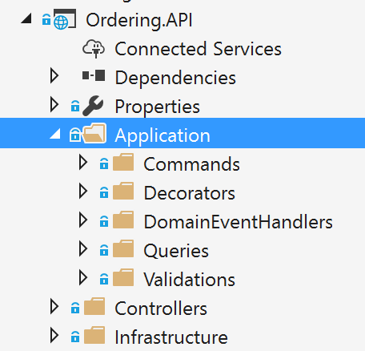
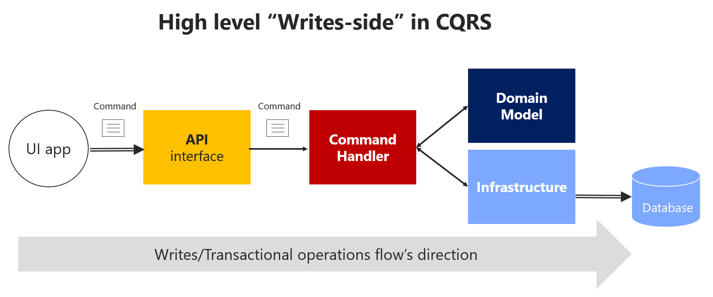
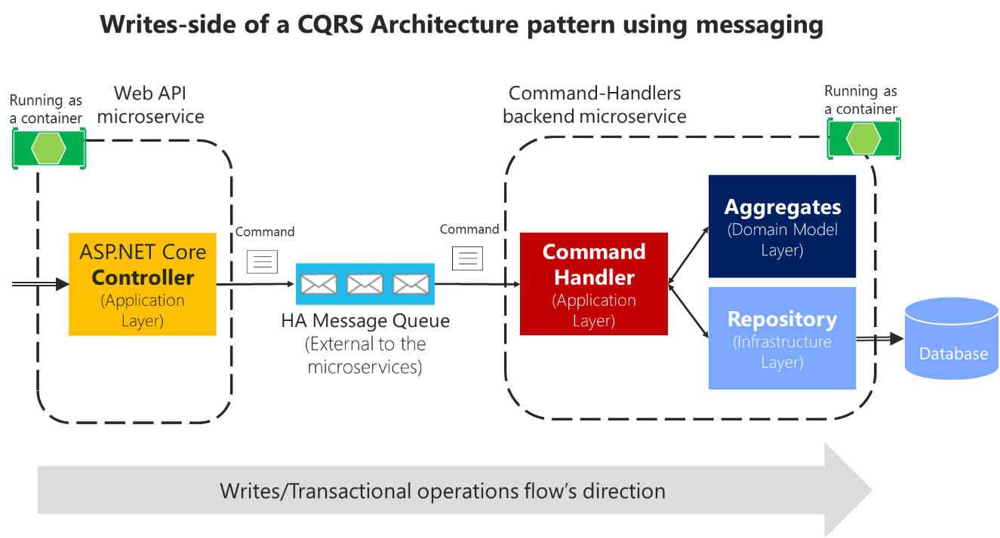

# Implementing the microservice application layer using the Web API

## Using Dependency Injection to inject infrastructure objects into your application layer

As mentioned previously, the application layer can be implemented as part of the artifact you are building, such as within a Web API project or an MVC web app project. In the case of a microservice built with ASP.NET Core, the application layer will usually be your Web API library. If you want to separate what is coming from ASP.NET Core (its infrastructure plus your controllers) from your custom application layer code, you could also place your application layer in a separate class library, but that is optional.

For instance, the application layer code of the ordering microservice is directly implemented as part of the **Ordering.API** project (an ASP.NET Core Web API project), as shown in Figure 9-23.



**Figure 9-23**. The application layer in the Ordering.API ASP.NET Core Web API project

ASP.NET Core includes a simple [built-in IoC container](https://docs.microsoft.com/aspnet/core/fundamentals/dependency-injection) (represented by the IServiceProvider interface) that supports constructor injection by default, and ASP.NET makes certain services available through DI. ASP.NET Core uses the term *service* for any of the types you register that will be injected through DI. You configure the built-in container's services in the ConfigureServices method in your application's Startup class. Your dependencies are implemented in the services that a type needs.

Typically, you want to inject dependencies that implement infrastructure objects. A very typical dependency to inject is a repository. But you could inject any other infrastructure dependency that you may have. For simpler implementations, you could directly inject your Unit of Work pattern object (the EF DbContext object), because the DBContext is also the implementation of your infrastructure persistence objects.

In the following example, you can see how .NET Core is injecting the required repository objects through the constructor. The class is a command handler, which we will cover in the next section.

```csharp
public class CreateOrderCommandHandler
    : IAsyncRequestHandler<CreateOrderCommand, bool>
{
    private readonly IOrderRepository _orderRepository;
    private readonly IIdentityService _identityService;
    private readonly IMediator _mediator;

    // Using DI to inject infrastructure persistence Repositories
    public CreateOrderCommandHandler(IMediator mediator, 
                                     IOrderRepository orderRepository, 
                                     IIdentityService identityService)
    {
        _orderRepository = orderRepository ?? 
                          throw new ArgumentNullException(nameof(orderRepository));
        _identityService = identityService ?? 
                          throw new ArgumentNullException(nameof(identityService));
        _mediator = mediator ?? 
                                 throw new ArgumentNullException(nameof(mediator));
    }

    public async Task<bool> Handle(CreateOrderCommand message)
    {
        // Create the Order AggregateRoot
        // Add child entities and value objects through the Order aggregate root
        // methods and constructor so validations, invariants, and business logic 
        // make sure that consistency is preserved across the whole aggregate
        var address = new Address(message.Street, message.City, message.State, 
                                  message.Country, message.ZipCode);
        var order = new Order(message.UserId, address, message.CardTypeId, 
                              message.CardNumber, message.CardSecurityNumber, 
                              message.CardHolderName, message.CardExpiration);
            
        foreach (var item in message.OrderItems)
        {
            order.AddOrderItem(item.ProductId, item.ProductName, item.UnitPrice,
                               item.Discount, item.PictureUrl, item.Units);
        }

        _orderRepository.Add(order);

        return await _orderRepository.UnitOfWork
            .SaveEntitiesAsync();
    }
}
```

The class uses the injected repositories to execute the transaction and persist the state changes. It does not matter whether that class is a command handler, an ASP.NET Core Web API controller method, or a [DDD Application Service](https://lostechies.com/jimmybogard/2008/08/21/services-in-domain-driven-design/). It is ultimately a simple class that uses repositories, domain entities, and other application coordination in a fashion similar to a command handler. Dependency Injection works the same way for all the mentioned classes, as in the example using DI based on the constructor.

### Registering the dependency implementation types and interfaces or abstractions

Before you use the objects injected through constructors, you need to know where to register the interfaces and classes that produce the objects injected into your application classes through DI. (Like DI based on the constructor, as shown previously.)

#### Using the built-in IoC container provided by ASP.NET Core

When you use the built-in IoC container provided by ASP.NET Core, you register the types you want to inject in the ConfigureServices method in the Startup.cs file, as in the following code:

```csharp
// Registration of types into ASP.NET Core built-in container
public void ConfigureServices(IServiceCollection services)
{
    // Register out-of-the-box framework services.
    services.AddDbContext<CatalogContext>(c =>
    {
        c.UseSqlServer(Configuration["ConnectionString"]);
    },
    ServiceLifetime.Scoped
    );
    services.AddMvc();
    // Register custom application dependencies.
    services.AddScoped<IMyCustomRepository, MyCustomSQLRepository>();
}
```

The most common pattern when registering types in an IoC container is to register a pair of types—an interface and its related implementation class. Then when you request an object from the IoC container through any constructor, you request an object of a certain type of interface. For instance, in the previous example, the last line states that when any of your constructors have a dependency on IMyCustomRepository (interface or abstraction), the IoC container will inject an instance of the MyCustomSQLServerRepository implementation class.

#### Using the Scrutor library for automatic types registration

When using DI in .NET Core, you might want to be able to scan an assembly and automatically register its types by convention. This feature is not currently available in ASP.NET Core. However, you can use the [Scrutor](https://github.com/khellang/Scrutor) library for that. This approach is convenient when you have dozens of types that need to be registered in your IoC container.

#### Additional resources

-   **Matthew King. Registering services with Scrutor**
    [*https://mking.net/blog/registering-services-with-scrutor*](https://mking.net/blog/registering-services-with-scrutor)

<!-- -->

-   **Kristian Hellang. Scrutor.** GitHub repo.
    [*https://github.com/khellang/Scrutor*](https://github.com/khellang/Scrutor)

#### Using Autofac as an IoC container

You can also use additional IoC containers and plug them into the ASP.NET Core pipeline, as in the ordering microservice in eShopOnContainers, which uses [Autofac](https://autofac.org/). When using Autofac you typically register the types via modules, which allow you to split the registration types between multiple files depending on where your types are, just as you could have the application types distributed across multiple class libraries.

For example, the following is the [Autofac application module](https://github.com/dotnet-architecture/eShopOnContainers/blob/master/src/Services/Ordering/Ordering.API/Infrastructure/AutofacModules/ApplicationModule.cs) for the [Ordering.API Web API](https://github.com/dotnet-architecture/eShopOnContainers/tree/master/src/Services/Ordering/Ordering.API) project with the types you will want to inject.

```csharp
public class ApplicationModule : Autofac.Module
{
    public string QueriesConnectionString { get; }
    public ApplicationModule(string qconstr)
    {
        QueriesConnectionString = qconstr;
    }

    protected override void Load(ContainerBuilder builder)
    {
        builder.Register(c => new OrderQueries(QueriesConnectionString))
            .As<IOrderQueries>()
            .InstancePerLifetimeScope();
        builder.RegisterType<BuyerRepository>()
            .As<IBuyerRepository>()
            .InstancePerLifetimeScope();
        builder.RegisterType<OrderRepository>()
            .As<IOrderRepository>()
            .InstancePerLifetimeScope();
        builder.RegisterType<RequestManager>()
            .As<IRequestManager>()
            .InstancePerLifetimeScope();
   }
}
```

The registration process and concepts are very similar to the way you can register types with the built-in ASP.NET Core iOS container, but the syntax when using Autofac is a bit different.

In the example code, the abstraction IOrderRepository is registered along with the implementation class OrderRepository. This means that whenever a constructor is declaring a dependency through the IOrderRepository abstraction or interface, the IoC container will inject an instance of the OrderRepository class.

The instance scope type determines how an instance is shared between requests for the same service or dependency. When a request is made for a dependency, the IoC container can return the following:

-   A single instance per lifetime scope (referred to in the ASP.NET Core IoC container as *scoped*).

-   A new instance per dependency (referred to in the ASP.NET Core IoC container as *transient*).

-   A single instance shared across all objects using the IoC container (referred to in the ASP.NET Core IoC container as *singleton*).

#### Additional resources

-   **Introduction to Dependency Injection in ASP.NET Core**
    [*https://docs.microsoft.com/aspnet/core/fundamentals/dependency-injection*](https://docs.microsoft.com/aspnet/core/fundamentals/dependency-injection)

-   **Autofac.** Official documentation.
    [*http://docs.autofac.org/en/latest/*](http://docs.autofac.org/en/latest/)

-   **Comparing ASP.NET Core IoC container service lifetimes with Autofac IoC container instance scopes - Cesar de la Torre.**
    [*https://blogs.msdn.microsoft.com/cesardelatorre/2017/01/26/comparing-asp-net-core-ioc-service-life-times-and-autofac-ioc-instance-scopes/*](https://blogs.msdn.microsoft.com/cesardelatorre/2017/01/26/comparing-asp-net-core-ioc-service-life-times-and-autofac-ioc-instance-scopes/)

## Implementing the Command and Command Handler patterns

In the DI-through-constructor example shown in the previous section, the IoC container was injecting repositories through a constructor in a class. But exactly where were they injected? In a simple Web API (for example, the catalog microservice in eShopOnContainers), you inject them at the MVC controllers level, in a controller constructor. However, in the initial code of this section (the [CreateOrderCommandHandler](https://github.com/dotnet-architecture/eShopOnContainers/blob/master/src/Services/Ordering/Ordering.API/Application/Commands/CreateOrderCommandHandler.cs) class from the Ordering.API service in eShopOnContainers), the injection of dependencies is done through the constructor of a particular command handler. Let us explain what a command handler is and why you would want to use it.

The Command pattern is intrinsically related to the CQRS pattern that was introduced earlier in this guide. CQRS has two sides. The first area is queries, using simplified queries with the [Dapper](https://github.com/StackExchange/dapper-dot-net) micro ORM, which was explained previously. The second area is commands, which are the starting point for transactions, and the input channel from outside the service.

As shown in Figure 9-24, the pattern is based on accepting commands from the client side, processing them based on the domain model rules, and finally persisting the states with transactions.



**Figure 9-24**. High-level view of the commands or “transactional side” in a CQRS pattern

### The command class

A command is a request for the system to perform an action that changes the state of the system. Commands are imperative, and should be processed just once.

Since commands are imperatives, they are typically named with a verb in the imperative mood (for example, "create" or "update"), and they might include the aggregate type, such as CreateOrderCommand. Unlike an event, a command is not a fact from the past; it is only a request, and thus may be refused.

Commands can originate from the UI as a result of a user initiating a request, or from a process manager when the process manager is directing an aggregate to perform an action.

An important characteristic of a command is that it should be processed just once by a single receiver. This is because a command is a single action or transaction you want to perform in the application. For example, the same order creation command should not be processed more than once. This is an important difference between commands and events. Events may be processed multiple times, because many systems or microservices might be interested in the event.

In addition, it is important that a command be processed only once in case the command is not idempotent. A command is idempotent if it can be executed multiple times without changing the result, either because of the nature of the command, or because of the way the system handles the command.

It is a good practice to make your commands and updates idempotent when it makes sense under your domain’s business rules and invariants. For instance, to use the same example, if for any reason (retry logic, hacking, etc.) the same CreateOrder command reaches your system multiple times, you should be able to identify it and ensure that you do not create multiple orders. To do so, you need to attach some kind of identity in the operations and identify whether the command or update was already processed.

You send a command to a single receiver; you do not publish a command. Publishing is for integration events that state a fact—that something has happened and might be interesting for event receivers. In the case of events, the publisher has no concerns about which receivers get the event or what they do it. But integration events are a different story already introduced in previous sections.

A command is implemented with a class that contains data fields or collections with all the information that is needed in order to execute that command. A command is a special kind of Data Transfer Object (DTO), one that is specifically used to request changes or transactions. The command itself is based on exactly the information that is needed for processing the command, and nothing more.

The following example shows the simplified CreateOrderCommand class. This is an immutable command that is used in the ordering microservice in eShopOnContainers.

```csharp
// DDD and CQRS patterns comment
// Note that we recommend that you implement immutable commands
// In this case, immutability is achieved by having all the setters as private
// plus being able to update the data just once, when creating the object
// through the constructor.
// References on immutable commands:
// http://cqrs.nu/Faq
// https://docs.spine3.org/motivation/immutability.html
// http://blog.gauffin.org/2012/06/griffin-container-introducing-command-support/
// https://msdn.microsoft.com/library/bb383979.aspx
[DataContract]
public class CreateOrderCommand
    :IAsyncRequest<bool>
{
    [DataMember]
    private readonly List<OrderItemDTO> _orderItems;
    [DataMember]
    public string City { get; private set; }
    [DataMember]
    public string Street { get; private set; }
    [DataMember]
    public string State { get; private set; }
    [DataMember]
    public string Country { get; private set; }
    [DataMember]
    public string ZipCode { get; private set; }
    [DataMember]
    public string CardNumber { get; private set; }
    [DataMember]
    public string CardHolderName { get; private set; }
    [DataMember]
    public DateTime CardExpiration { get; private set; }
    [DataMember]
    public string CardSecurityNumber { get; private set; }
    [DataMember]
    public int CardTypeId { get; private set; }
    [DataMember]
    public IEnumerable<OrderItemDTO> OrderItems => _orderItems;

    public CreateOrderCommand()
    {
        _orderItems = new List<OrderItemDTO>();
    }

    public CreateOrderCommand(List<OrderItemDTO> orderItems, string city,
        string street,
        string state, string country, string zipcode,
        string cardNumber, string cardHolderName, DateTime cardExpiration,
        string cardSecurityNumber, int cardTypeId) : this()
    {
        _orderItems = orderItems;
        City = city;
        Street = street;
        State = state;
        Country = country;
        ZipCode = zipcode;
        CardNumber = cardNumber;
        CardHolderName = cardHolderName;
        CardSecurityNumber = cardSecurityNumber;
        CardTypeId = cardTypeId;
        CardExpiration = cardExpiration;
    }

    public class OrderItemDTO
    {
        public int ProductId { get; set; }
        public string ProductName { get; set; }
        public decimal UnitPrice { get; set; }
        public decimal Discount { get; set; }
        public int Units { get; set; }
        public string PictureUrl { get; set; }
    }
}
```

Basically, the command class contains all the data you need for performing a business transaction by using the domain model objects. Thus, commands are simply data structures that contain read-only data, and no behavior. The command’s name indicates its purpose. In many languages like C\#, commands are represented as classes, but they are not true classes in the real object-oriented sense.

As an additional characteristic, commands are immutable, because the expected usage is that they are processed directly by the domain model. They do not need to change during their projected lifetime. In a C\# class, immutability can be achieved by not having any setters or other methods that change internal state.

For example, the command class for creating an order is probably similar in terms of data to the order you want to create, but you probably do not need the same attributes. For instance, CreateOrderCommand does not have an order ID, because the order has not been created yet.

Many command classes can be simple, requiring only a few fields about some state that needs to be changed. That would be the case if you are just changing the status of an order from “in process” to “paid” or “shipped” by using a command similar to the following:

```csharp
[DataContract]
public class UpdateOrderStatusCommand
    :IAsyncRequest<bool>
{
    [DataMember]
    public string Status { get; private set; }

    [DataMember]
    public string OrderId { get; private set; }

    [DataMember]
    public string BuyerIdentityGuid { get; private set; }
}
```

Some developers make their UI request objects separate from their command DTOs, but that is just a matter of preference. It is a tedious separation with not much added value, and the objects are almost exactly the same shape. For instance, in eShopOnContainers, some commands come directly from the client side.

### The Command Handler class

You should implement a specific command handler class for each command. That is how the pattern works, and it is where you will use the command object, the domain objects, and the infrastructure repository objects. The command handler is in fact the heart of the application layer in terms of CQRS and DDD. However, all the domain logic should be contained within the domain classes—within the aggregate roots (root entities), child entities, or [domain services](https://lostechies.com/jimmybogard/2008/08/21/services-in-domain-driven-design/), but not within the command handler, which is a class from the application layer.

A command handler receives a command and obtains a result from the aggregate that is used. The result should be either successful execution of the command, or an exception. In the case of an exception, the system state should be unchanged.

The command handler usually takes the following steps:

-   It receives the command object, like a DTO (from the [mediator](https://en.wikipedia.org/wiki/Mediator_pattern) or other infrastructure object).

-   It validates that the command is valid (if not validated by the mediator).

-   It instantiates the aggregate root instance that is the target of the current command.

-   It executes the method on the aggregate root instance, getting the required data from the command.

-   It persists the new state of the aggregate to its related database. This last operation is the actual transaction.

Typically, a command handler deals with a single aggregate driven by its aggregate root (root entity). If multiple aggregates should be impacted by the reception of a single command, you could use domain events to propagate states or actions across multiple aggregates.

The important point here is that when a command is being processed, all the domain logic should be inside the domain model (the aggregates), fully encapsulated and ready for unit testing. The command handler just acts as a way to get the domain model from the database, and as the final step, to tell the infrastructure layer (repositories) to persist the changes when the model is changed. The advantage of this approach is that you can refactor the domain logic in an isolated, fully encapsulated, rich, behavioral domain model without changing code in the application or infrastructure layers, which are the plumbing level (command handlers, Web API, repositories, etc.).

When command handlers get complex, with too much logic, that can be a code smell. Review them, and if you find domain logic, refactor the code to move that domain behavior to the methods of the domain objects (the aggregate root and child entity).

As an example of a command handler class, the following code shows the same CreateOrderCommandHandler class that you saw at the beginning of this chapter. In this case, we want to highlight the Handle method and the operations with the domain model objects/aggregates.

```csharp
public class CreateOrderCommandHandler
    : IAsyncRequestHandler<CreateOrderCommand, bool>
{
    private readonly IOrderRepository _orderRepository;
    private readonly IIdentityService _identityService;
    private readonly IMediator _mediator;

    // Using DI to inject infrastructure persistence Repositories
    public CreateOrderCommandHandler(IMediator mediator, 
                                     IOrderRepository orderRepository, 
                                     IIdentityService identityService)
    {
        _orderRepository = orderRepository ?? 
                          throw new ArgumentNullException(nameof(orderRepository));
        _identityService = identityService ?? 
                          throw new ArgumentNullException(nameof(identityService));
        _mediator = mediator ?? 
                                 throw new ArgumentNullException(nameof(mediator));
    }

    public async Task<bool> Handle(CreateOrderCommand message)
    {
        // Create the Order AggregateRoot
        // Add child entities and value objects through the Order aggregate root
        // methods and constructor so validations, invariants, and business logic 
        // make sure that consistency is preserved across the whole aggregate
        var address = new Address(message.Street, message.City, message.State, 
                                  message.Country, message.ZipCode);
        var order = new Order(message.UserId, address, message.CardTypeId, 
                              message.CardNumber, message.CardSecurityNumber, 
                              message.CardHolderName, message.CardExpiration);
            
        foreach (var item in message.OrderItems)
        {
            order.AddOrderItem(item.ProductId, item.ProductName, item.UnitPrice,
                               item.Discount, item.PictureUrl, item.Units);
        }

        _orderRepository.Add(order);

        return await _orderRepository.UnitOfWork
            .SaveEntitiesAsync();
    }
}
```

These are additional steps a command handler should take:

-   Use the command’s data to operate with the aggregate root’s methods and behavior.

-   Internally within the domain objects, raise domain events while the transaction is executed, but that is transparent from a command handler point of view.

-   If the aggregate’s operation result is successful and after the transaction is finished, raise integration events command handler. (These might also be raised by infrastructure classes like repositories.)

#### Additional resources

-   **Mark Seemann. At the Boundaries, Applications are Not Object-Oriented**
    [*http://blog.ploeh.dk/2011/05/31/AttheBoundaries,ApplicationsareNotObject-Oriented/*](http://blog.ploeh.dk/2011/05/31/AttheBoundaries,ApplicationsareNotObject-Oriented/)

-   **Commands and events**
    [*http://cqrs.nu/Faq/commands-and-events*](http://cqrs.nu/Faq/commands-and-events)

-   **What does a command handler do?**
    [*http://cqrs.nu/Faq/command-handlers*](http://cqrs.nu/Faq/command-handlers)

-   **Jimmy Bogard. Domain Command Patterns – Handlers**
    [*https://jimmybogard.com/domain-command-patterns-handlers/*](https://jimmybogard.com/domain-command-patterns-handlers/)

-   **Jimmy Bogard. Domain Command Patterns – Validation**
    [*https://jimmybogard.com/domain-command-patterns-validation/*](https://jimmybogard.com/domain-command-patterns-validation/)

## The Command process pipeline: how to trigger a command handler

The next question is how to invoke a command handler. You could manually call it from each related ASP.NET Core controller. However, that approach would be too coupled and is not ideal.

The other two main options, which are the recommended options, are:

-   Through an in-memory Mediator pattern artifact.

-   With an asynchronous message queue, in between controllers and handlers.

### Using the Mediator pattern (in-memory) in the command pipeline

As shown in Figure 9-25, in a CQRS approach you use an intelligent mediator, similar to an in-memory bus, which is smart enough to redirect to the right command handler based on the type of the command or DTO being received. The single black arrows between components represent the dependencies between objects (in many cases, injected through DI) with their related interactions.


**Figure 9-25**. Using the Mediator pattern in process in a single CQRS microservice

The reason that using the Mediator pattern makes sense is that in enterprise applications, the processing requests can get complicated. You want to be able to add an open number of cross-cutting concerns like logging, validations, audit, and security. In these cases, you can rely on a mediator pipeline (see [Mediator pattern](https://en.wikipedia.org/wiki/Mediator_pattern)) to provide a means for these extra behaviors or cross-cutting concerns.

A mediator is an object that encapsulates the “how” of this process: it coordinates execution based on state, the way a command handler is invoked, or the payload you provide to the handler. With a mediator component you can apply cross-cutting concerns in a centralized and transparent way by applying decorators (or [pipeline behaviors](https://github.com/jbogard/MediatR/wiki/Behaviors) since [MediatR 3](https://www.nuget.org/packages/MediatR/3.0.0)). For more information, see the [Decorator pattern](https://en.wikipedia.org/wiki/Decorator_pattern).

Decorators and behaviors are similar to [Aspect Oriented Programming (AOP)](https://en.wikipedia.org/wiki/Aspect-oriented_programming), only applied to a specific process pipeline managed by the mediator component. Aspects in AOP that implement cross-cutting concerns are applied based on *aspect weavers* injected at compilation time or based on object call interception. Both typical AOP approaches are sometimes said to work "like magic," because it is not easy to see how AOP does its work. When dealing with serious issues or bugs, AOP can be difficult to debug. On the other hand, these decorators/behaviors are explicit and applied only in the context of the mediator, so debugging is much more predictable and easy.

For example, in the eShopOnContainers ordering microservice, we implemented two sample behaviors, a [LogBehavior](https://github.com/dotnet-architecture/eShopOnContainers/blob/dev/src/Services/Ordering/Ordering.API/Application/Behaviors/LoggingBehavior.cs) class and a [ValidatorBehavior](https://github.com/dotnet-architecture/eShopOnContainers/blob/dev/src/Services/Ordering/Ordering.API/Application/Behaviors/ValidatorBehavior.cs) class. The implementation of the behaviors is explained in the next section by showing how eShopOnContainers implements [MediatR 3](https://www.nuget.org/packages/MediatR/3.0.0) [behaviors](https://github.com/jbogard/MediatR/wiki/Behaviors).

### Using message queues (out-of-proc) in the command’s pipeline

Another choice is to use asynchronous messages based on brokers or message queues, as shown in Figure 9-26. That option could also be combined with the mediator component right before the command handler.



**Figure 9-26**. Using message queues (out of process and inter-process communication) with CQRS commands

Using message queues to accept the commands can further complicate your command’s pipeline, because you will probably need to split the pipeline into two processes connected through the external message queue. Still, it should be used if you need to have improved scalability and performance based on asynchronous messaging. Consider that in the case of Figure 9-26, the controller just posts the command message into the queue and returns. Then the command handlers process the messages at their own pace. That is a great benefit of queues: the message queue can act as a buffer in cases when hyper scalability is needed, such as for stocks or any other scenario with a high volume of ingress data.

However, because of the asynchronous nature of message queues, you need to figure out how to communicate with the client application about the success or failure of the command’s process. As a rule, you should never use “fire and forget” commands. Every business application needs to know if a command was processed successfully, or at least validated and accepted.

Thus, being able to respond to the client after validating a command message that was submitted to an asynchronous queue adds complexity to your system, as compared to an in-process command process that returns the operation’s result after running the transaction. Using queues, you might need to return the result of the command process through other operation result messages, which will require additional components and custom communication in your system.

Additionally, async commands are one-way commands, which in many cases might not be needed, as is explained in the following interesting exchange between Burtsev Alexey and Greg Young in an [online conversation](https://groups.google.com/forum/#!msg/dddcqrs/xhJHVxDx2pM/WP9qP8ifYCwJ):

\[Burtsev Alexey\] I find lots of code where people use async command handling or one way command messaging without any reason to do so (they are not doing some long operation, they are not executing external async code, they do not even cross application boundary to be using message bus). Why do they introduce this unnecessary complexity? And actually, I haven't seen a CQRS code example with blocking command handlers so far, though it will work just fine in most cases.

\[Greg Young\] \[...\] an asynchronous command doesn't exist; it's actually another event. If I must accept what you send me and raise an event if I disagree, it's no longer you telling me to do something. It's you telling me something has been done. This seems like a slight difference at first, but it has many implications.

Asynchronous commands greatly increase the complexity of a system, because there is no simple way to indicate failures. Therefore, asynchronous commands are not recommended other than when scaling requirements are needed or in special cases when communicating the internal microservices through messaging. In those cases, you must design a separate reporting and recovery system for failures.

In the initial version of eShopOnContainers, we decided to use synchronous command processing, started from HTTP requests and driven by the Mediator pattern. That easily allows you to return the success or failure of the process, as in the [CreateOrderCommandHandler](https://github.com/dotnet-architecture/eShopOnContainers/blob/master/src/Services/Ordering/Ordering.API/Application/Commands/CreateOrderCommandHandler.cs) implementation.

In any case, this should be a decision based on your application’s or microservice’s business requirements.

## Implementing the command process pipeline with a mediator pattern (MediatR)

As a sample implementation, this guide proposes using the in-process pipeline based on the Mediator pattern to drive command ingestion and route commands, in memory, to the right command handlers. The guide also proposes applying [behaviors](https://github.com/jbogard/MediatR/wiki/Behaviors) in order to separate cross-cutting concerns.

For implementation in .NET Core, there are multiple open-source libraries available that implement the Mediator pattern. The library used in this guide is the [MediatR](https://github.com/jbogard/MediatR) open-source library (created by Jimmy Bogard), but you could use another approach. MediatR is a small and simple library that allows you to process in-memory messages like a command, while applying decorators or behaviors.

Using the Mediator pattern helps you to reduce coupling and to isolate the concerns of the requested work, while automatically connecting to the handler that performs that work—in this case, to command handlers.

Another good reason to use the Mediator pattern was explained by Jimmy Bogard when reviewing this guide:

I think it might be worth mentioning testing here – it provides a nice consistent window into the behavior of your system. Request-in, response-out. We’ve found that aspect quite valuable in building consistently behaving tests.

First, let’s look at a sample WebAPI controller where you actually would use the mediator object. If you were not using the mediator object, you would need to inject all the dependencies for that controller, things like a logger object and others. Therefore, the constructor would be quite complicated. On the other hand, if you use the mediator object, the constructor of your controller can be a lot simpler, with just a few dependencies instead of many dependencies if you had one per cross-cutting operation, as in the following example:

```csharp
public class MyMicroserviceController : Controller
{
    public MyMicroserviceController(IMediator mediator, 
                                    IMyMicroserviceQueries microserviceQueries)
    // ...
```

You can see that the mediator provides a clean and lean Web API controller constructor. In addition, within the controller methods, the code to send a command to the mediator object is almost one line:

```csharp
[Route("new")]
[HttpPost] 
public async Task<IActionResult> ExecuteBusinessOperation([FromBody]RunOpCommand 
                                                               runOperationCommand) 
{
    var commandResult = await _mediator.SendAsync(runOperationCommand); 

    return commandResult ? (IActionResult)Ok() : (IActionResult)BadRequest();
}
```

### Implementing idempotent Commands

In eShopOnContainers, a more advanced example than the above is submitting a CreateOrderCommand object from the Ordering microservice. But since the Ordering business process is a bit more complex and, in our case, it actually starts in the Basket microservice, this action of submitting the CreateOrderCommand object is performed from an integration-event handler named [UserCheckoutAcceptedIntegrationEvent.cs](https://github.com/dotnet-architecture/eShopOnContainers/blob/dev/src/Services/Ordering/Ordering.API/Application/IntegrationEvents/EventHandling/UserCheckoutAcceptedIntegrationEventHandler.cs) instead of a simple WebAPI controller called from the client App as in the previous simpler example. 

Nevertheless, the action of submitting the Command to MediatR is pretty similar, as shown in the following code.

```csharp
var createOrderCommand = new CreateOrderCommand(eventMsg.Basket.Items,     
                                                eventMsg.UserId, eventMsg.City, 
                                                eventMsg.Street, eventMsg.State,
                                                eventMsg.Country, eventMsg.ZipCode,
                                                eventMsg.CardNumber, 
                                                eventMsg.CardHolderName, 
                                                eventMsg.CardExpiration,
                                                eventMsg.CardSecurityNumber,  
                                                eventMsg.CardTypeId);

var requestCreateOrder = new IdentifiedCommand<CreateOrderCommand,bool>(createOrderCommand, 
                                                                        eventMsg.RequestId);
result = await _mediator.Send(requestCreateOrder);
```

However, this case is also a little bit more advanced because we’re also implementing idempotent commands. The CreateOrderCommand process should be idempotent, so if the same message comes duplicated through the network, because of any reason, like retries, the same business order will be processed just once.

This is implemented by wrapping the business command (in this case CreateOrderCommand) and embeding it into a generic IdentifiedCommand which is tracked by an ID of every message coming through the network that has to be idempotent.

In the code below, you can see that the IdentifiedCommand is nothing more than a DTO with and ID plus the wrapped business command object.

```csharp
public class IdentifiedCommand<T, R> : IRequest<R>
    where T : IRequest<R>
{
    public T Command { get; }
    public Guid Id { get; }
    public IdentifiedCommand(T command, Guid id)
    {
        Command = command;
        Id = id;
    }
}
```

Then the CommandHandler for the IdentifiedCommand named [IdentifiedCommandHandler.cs](https://github.com/dotnet-architecture/eShopOnContainers/blob/dev/src/Services/Ordering/Ordering.API/Application/Commands/IdentifiedCommandHandler.cs) will basically check if the ID coming as part of the message already exists in a table. If it already exists, that command won’t be processed again, so it behaves as an idempotent command. That infrastructure code is performed by the `_requestManager.ExistAsync` method call below.

```csharp
// IdentifiedCommandHandler.cs
public class IdentifiedCommandHandler<T, R> : 
                                   IAsyncRequestHandler<IdentifiedCommand<T, R>, R>
                                   where T : IRequest<R>
{
    private readonly IMediator _mediator;
    private readonly IRequestManager _requestManager;

    public IdentifiedCommandHandler(IMediator mediator, 
                                    IRequestManager requestManager)
    {
        _mediator = mediator;
        _requestManager = requestManager;
    }

    protected virtual R CreateResultForDuplicateRequest()
    {
        return default(R);
    }

    public async Task<R> Handle(IdentifiedCommand<T, R> message)
    {
        var alreadyExists = await _requestManager.ExistAsync(message.Id);
        if (alreadyExists)
        {
            return CreateResultForDuplicateRequest();
        }
        else
        {
            await _requestManager.CreateRequestForCommandAsync<T>(message.Id);

            // Send the embeded business command to mediator 
            // so it runs its related CommandHandler 
            var result = await _mediator.Send(message.Command);
                
            return result;
        }
    }
}
```

Since the IdentifiedCommand acts like a business command’s envelope, when the business command needs to be processed because it is not a repeated Id, then it takes that inner business command and re-submits it to Mediator, as in the last part of the code shown above when running `_mediator.Send(message.Command)`, from the [IdentifiedCommandHandler.cs](https://github.com/dotnet-architecture/eShopOnContainers/blob/dev/src/Services/Ordering/Ordering.API/Application/Commands/IdentifiedCommandHandler.cs).

When doing that, it will link and run the business command handler, in this case, the CreateOrderCommandHandler which is running transactions against the Ordering database, as shown in the following code.

```csharp
// CreateOrderCommandHandler.cs
public class CreateOrderCommandHandler
                                   : IAsyncRequestHandler<CreateOrderCommand, bool>
{
    private readonly IOrderRepository _orderRepository;
    private readonly IIdentityService _identityService;
    private readonly IMediator _mediator;

    // Using DI to inject infrastructure persistence Repositories
    public CreateOrderCommandHandler(IMediator mediator, 
                                     IOrderRepository orderRepository, 
                                     IIdentityService identityService)
    {
        _orderRepository = orderRepository ?? 
                          throw new ArgumentNullException(nameof(orderRepository));
        _identityService = identityService ?? 
                          throw new ArgumentNullException(nameof(identityService));
        _mediator = mediator ?? 
                                 throw new ArgumentNullException(nameof(mediator));
    }

    public async Task<bool> Handle(CreateOrderCommand message)
    {
        // Add/Update the Buyer AggregateRoot
        var address = new Address(message.Street, message.City, message.State,
                                  message.Country, message.ZipCode);
        var order = new Order(message.UserId, address, message.CardTypeId,  
                              message.CardNumber, message.CardSecurityNumber, 
                              message.CardHolderName, message.CardExpiration);
            
        foreach (var item in message.OrderItems)
        {
            order.AddOrderItem(item.ProductId, item.ProductName, item.UnitPrice,
                               item.Discount, item.PictureUrl, item.Units);
        }

        _orderRepository.Add(order);

        return await _orderRepository.UnitOfWork
            .SaveEntitiesAsync();
    }
}
```

### Registering the types used by MediatR

In order for MediatR to be aware of your command handler classes, you need to register the mediator classes and the command handler classes in your IoC container. By default, MediatR uses Autofac as the IoC container, but you can also use the built-in ASP.NET Core IoC container or any other container supported by MediatR.

The following code shows how to register Mediator’s types and commands when using Autofac modules.

```csharp
public class MediatorModule : Autofac.Module
{
    protected override void Load(ContainerBuilder builder)
    {
        builder.RegisterAssemblyTypes(typeof(IMediator).GetTypeInfo().Assembly)
            .AsImplementedInterfaces();

        // Register all the Command classes (they implement IAsyncRequestHandler)
        // in assembly holding the Commands
        builder.RegisterAssemblyTypes(
                              typeof(CreateOrderCommand).GetTypeInfo().Assembly).
                                   AsClosedTypesOf(typeof(IAsyncRequestHandler<,>));
        // Other types registration
        //...
    }
}
```

This is where “the magic happens” with MediatR. 

Because each command handler implements the generic IAsyncRequestHandler&lt;T&gt; interface, when registering the assemblies, the code registers with RegisteredAssemblyTypes all the types maked as RequestHandlers while relating the CommandHandlers with their Commands, thanks to the relationship stated at the CommandHandler class, as in the following example:

```csharp
public class CreateOrderCommandHandler
  : IAsyncRequestHandler<CreateOrderCommand, bool>
{
```

That is the code that correlates commands with command handlers. The handler is just a simple class, but it inherits from RequestHandler&lt;T&gt;, and MediatR makes sure it is invoked with the correct payload.

## Applying cross-cutting concerns when processing commands with the Behaviors in MeadiatR

There is one more thing: being able to apply cross-cutting concerns to the mediator pipeline. You can also see at the end of the Autofac registration module code how it registers a behavior type, specifically, a custom LoggingBehavior class and a ValidatorBehavior class. But you could add other custom behaviours, too.

```csharp
public class MediatorModule : Autofac.Module
{
    protected override void Load(ContainerBuilder builder)
    {
        builder.RegisterAssemblyTypes(typeof(IMediator).GetTypeInfo().Assembly)
            .AsImplementedInterfaces();

        // Register all the Command classes (they implement IAsyncRequestHandler)
        // in assembly holding the Commands
        builder.RegisterAssemblyTypes(
                              typeof(CreateOrderCommand).GetTypeInfo().Assembly).
                                   AsClosedTypesOf(typeof(IAsyncRequestHandler<,>));
        // Other types registration
        //...        
        builder.RegisterGeneric(typeof(LoggingBehavior<,>)).
                                                   As(typeof(IPipelineBehavior<,>));
        builder.RegisterGeneric(typeof(ValidatorBehavior<,>)).
                                                   As(typeof(IPipelineBehavior<,>));
    }
}
```

That [LoggingBehavior](https://github.com/dotnet-architecture/eShopOnContainers/blob/dev/src/Services/Ordering/Ordering.API/Application/Behaviors/LoggingBehavior.cs) class can be implemented as the following code, which logs information about the command handler being executed and whether it was successful or not.

```csharp
public class LoggingBehavior<TRequest, TResponse> 
         : IPipelineBehavior<TRequest, TResponse>
{
    private readonly ILogger<LoggingBehavior<TRequest, TResponse>> _logger;
    public LoggingBehavior(ILogger<LoggingBehavior<TRequest, TResponse>> logger) =>
                                                                  _logger = logger;

    public async Task<TResponse> Handle(TRequest request,
                                        RequestHandlerDelegate<TResponse> next)
    {
        _logger.LogInformation($"Handling {typeof(TRequest).Name}");
        var response = await next();
        _logger.LogInformation($"Handled {typeof(TResponse).Name}");
        return response;
    }
}
```

Just by implementing this decorator class and by decorating the pipeline with it, all the commands processed through MediatR will be logging information about the execution.

The eShopOnContainers ordering microservice also applies a second behavior for basic validations, the [ValidatorBehavior](https://github.com/dotnet-architecture/eShopOnContainers/blob/dev/src/Services/Ordering/Ordering.API/Application/Behaviors/ValidatorBehavior.cs) class that relies on the [FluentValidation](https://github.com/JeremySkinner/FluentValidation) library, as shown in the following code:

```csharp
public class ValidatorDecorator<TRequest, TResponse>
    : IAsyncRequestHandler<TRequest, TResponse>
    where TRequest : IAsyncRequest<TResponse>
{
    private readonly IAsyncRequestHandler<TRequest, TResponse> _inner;
    private readonly IValidator<TRequest>[] _validators;

    public ValidatorDecorator(
        IAsyncRequestHandler<TRequest, TResponse> inner,
        IValidator<TRequest>[] validators)
    {
        _inner = inner;
        _validators = validators;
    }

    public async Task<TResponse> Handle(TRequest message)
    {
        var failures = _validators
            .Select(v => v.Validate(message))
            .SelectMany(result => result.Errors)
            .Where(error => error != null)
            .ToList();
            if (failures.Any())
            {
                throw new OrderingDomainException(
                $"Command Validation Errors for type {typeof(TRequest).Name}",
                new ValidationException("Validation exception", failures));
            }
            var response = await _inner.Handle(message);
        return response;
    }
}
```

Then, based on the [FluentValidation](https://github.com/JeremySkinner/FluentValidation) library, we created validation for the data passed with CreateOrderCommand, as in the following code:

```csharp
public class ValidatorBehavior<TRequest, TResponse> 
         : IPipelineBehavior<TRequest, TResponse>
{
    private readonly IValidator<TRequest>[] _validators;
    public ValidatorBehavior(IValidator<TRequest>[] validators) =>
                                                         _validators = validators;

    public async Task<TResponse> Handle(TRequest request,
                                        RequestHandlerDelegate<TResponse> next)
    {
        var failures = _validators
            .Select(v => v.Validate(request))
            .SelectMany(result => result.Errors)
            .Where(error => error != null)
            .ToList();

        if (failures.Any())
        {
            throw new OrderingDomainException(
                $"Command Validation Errors for type {typeof(TRequest).Name}",
                        new ValidationException("Validation exception", failures));
        }

        var response = await next();
        return response;
    }
}
```

Then, based on the FluentValidation library, we created validation for the data passed with CreateOrderCommand, as in the following code:

```csharp
public class CreateOrderCommandValidator : AbstractValidator<CreateOrderCommand>
{
    public CreateOrderCommandValidator()
    {
        RuleFor(command => command.City).NotEmpty();
        RuleFor(command => command.Street).NotEmpty();
        RuleFor(command => command.State).NotEmpty();
        RuleFor(command => command.Country).NotEmpty();
        RuleFor(command => command.ZipCode).NotEmpty();
        RuleFor(command => command.CardNumber).NotEmpty().Length(12, 19); 
        RuleFor(command => command.CardHolderName).NotEmpty();
        RuleFor(command => command.CardExpiration).NotEmpty().Must(BeValidExpirationDate).WithMessage("Please specify a valid card expiration date"); 
        RuleFor(command => command.CardSecurityNumber).NotEmpty().Length(3); 
        RuleFor(command => command.CardTypeId).NotEmpty();
        RuleFor(command => command.OrderItems).Must(ContainOrderItems).WithMessage("No order items found"); 
    }

    private bool BeValidExpirationDate(DateTime dateTime)
    {
        return dateTime >= DateTime.UtcNow;
    }

    private bool ContainOrderItems(IEnumerable<OrderItemDTO> orderItems)
    {
        return orderItems.Any();
    }
}

```

You could create additional validations. This is a very clean and elegant way to implement your command validations.

In a similar way, you could implement other behaviors for additional aspects or cross-cutting concerns that you want to apply to commands when handling them.

#### Additional resources

##### The mediator pattern

-   **Mediator pattern**
    [*https://en.wikipedia.org/wiki/Mediator\_pattern*](https://en.wikipedia.org/wiki/Mediator_pattern)

##### The decorator pattern

-   **Decorator pattern**
    [*https://en.wikipedia.org/wiki/Decorator\_pattern*](https://en.wikipedia.org/wiki/Decorator_pattern)

##### MediatR (Jimmy Bogard)

-   **MediatR.** GitHub repo.
    [*https://github.com/jbogard/MediatR*](https://github.com/jbogard/MediatR)

-   **CQRS with MediatR and AutoMapper**
    [*https://lostechies.com/jimmybogard/2015/05/05/cqrs-with-mediatr-and-automapper/*](https://lostechies.com/jimmybogard/2015/05/05/cqrs-with-mediatr-and-automapper/)

-   **Put your controllers on a diet: POSTs and commands.**
    [*https://lostechies.com/jimmybogard/2013/12/19/put-your-controllers-on-a-diet-posts-and-commands/*](https://lostechies.com/jimmybogard/2013/12/19/put-your-controllers-on-a-diet-posts-and-commands/)

-   **Tackling cross-cutting concerns with a mediator pipeline**
    [*https://lostechies.com/jimmybogard/2014/09/09/tackling-cross-cutting-concerns-with-a-mediator-pipeline/*](https://lostechies.com/jimmybogard/2014/09/09/tackling-cross-cutting-concerns-with-a-mediator-pipeline/)

-   **CQRS and REST: the perfect match**
    [*https://lostechies.com/jimmybogard/2016/06/01/cqrs-and-rest-the-perfect-match/*](https://lostechies.com/jimmybogard/2016/06/01/cqrs-and-rest-the-perfect-match/)

-   **MediatR Pipeline Examples**
    [*https://lostechies.com/jimmybogard/2016/10/13/mediatr-pipeline-examples/*](https://lostechies.com/jimmybogard/2016/10/13/mediatr-pipeline-examples/)

-   **Vertical Slice Test Fixtures for MediatR and ASP.NET Core**
    *<https://lostechies.com/jimmybogard/2016/10/24/vertical-slice-test-fixtures-for-mediatr-and-asp-net-core/> *

-   **MediatR Extensions for Microsoft Dependency Injection Released**
    [*https://lostechies.com/jimmybogard/2016/07/19/mediatr-extensions-for-microsoft-dependency-injection-released/*](https://lostechies.com/jimmybogard/2016/07/19/mediatr-extensions-for-microsoft-dependency-injection-released/)

##### Fluent validation

-   **Jeremy Skinner. FluentValidation.** GitHub repo.
    [*https://github.com/JeremySkinner/FluentValidation*](https://github.com/JeremySkinner/FluentValidation)

>[!div class="step-by-step"]
[Previous] (microservice-application-layer-web-api-design.md)
[Next] (../implement-resilient-applications/index.md)
