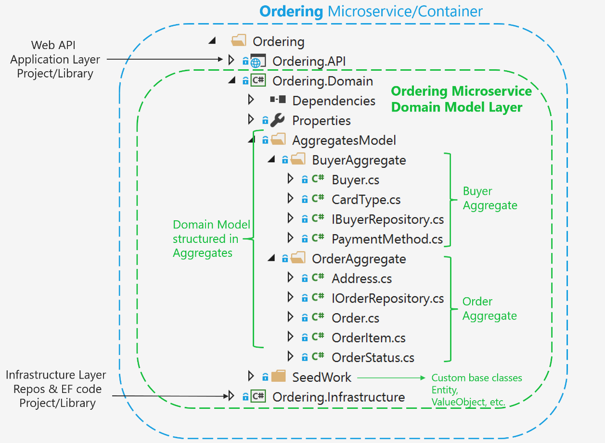
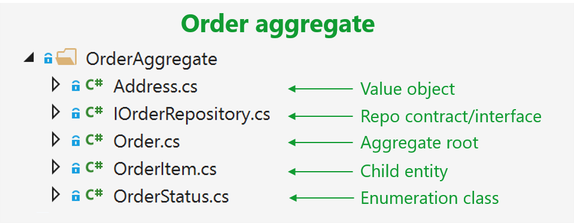

# Implementing a microservice domain model with .NET Core 

In the previous section, the fundamental design principles and patterns for designing a domain model were explained. Now it is time to explore possible ways to implement the domain model by using .NET Core (plain C\# code) and EF Core. Note that your domain model will be composed simply of your code. It will have just the EF Core model requirements, but not real dependencies on EF. You should not have hard dependencies or references to EF Core or any other ORM in your domain model.

## Domain model structure in a custom .NET Standard library

The folder organization used for the eShopOnContainers reference application demonstrates the DDD model for the application. You might find that a different folder organization more clearly communicates the design choices made for your application. As you can see in Figure 9-10, in the ordering domain model there are two aggregates, the order aggregate and the buyer aggregate. Each aggregate is a group of domain entities and value objects, although you could have an aggregate composed of a single domain entity (the aggregate root or root entity) as well.



**Figure 9-10**. Domain model structure for the ordering microservice in eShopOnContainers

Additionally, the domain model layer includes the repository contracts (interfaces) that are the infrastructure requirements of your domain model. In other words, these interfaces express what repositories the infrastructure layer must implement and how. It is critical that the implementation of the repositories be placed outside of the domain model layer, in the infrastructure layer library, so the domain model layer is not “contaminated” by API or classes from infrastructure technologies, like Entity Framework.

You can also see a [SeedWork](https://martinfowler.com/bliki/Seedwork.html) folder that contains custom base classes that you can use as a base for your domain entities and value objects, so you do not have redundant code in each domain’s object class.

## Structuring aggregates in a custom .NET Standard library

An aggregate refers to a cluster of domain objects grouped together to match transactional consistency. Those objects could be instances of entities (one of which is the aggregate root or root entity) plus any additional value objects.

Transactional consistency means that an aggregate is guaranteed to be consistent and up to date at the end of a business action. For example, the order aggregate from the eShopOnContainers ordering microservice domain model is composed as shown in Figure 9-11.



**Figure 9-11**. The order aggregate in Visual Studio solution

If you open any of the files in an aggregate folder, you can see how it is marked as either a custom base class or interface, like entity or value object, as implemented in the [Seedwork](https://github.com/dotnet-architecture/eShopOnContainers/tree/master/src/Services/Ordering/Ordering.Domain/SeedWork) folder.

## Implementing domain entities as POCO classes

You implement a domain model in .NET by creating POCO classes that implement your domain entities. In the following example, the Order class is defined as an entity and also as an aggregate root. Because the Order class derives from the Entity base class, it can reuse common code related to entities. Bear in mind that these base classes and interfaces are defined by you in the domain model project, so it is your code, not infrastructure code from an ORM like EF.

```csharp
// COMPATIBLE WITH ENTITY FRAMEWORK CORE 2.0
// Entity is a custom base class with the ID
public class Order : Entity, IAggregateRoot
{
    private DateTime _orderDate;
    public Address Address { get; private set; }
    private int? _buyerId;

    public OrderStatus OrderStatus { get; private set; }
    private int _orderStatusId;

    private string _description;
    private int? _paymentMethodId;

    private readonly List<OrderItem> _orderItems;
    public IReadOnlyCollection<OrderItem> OrderItems => _orderItems;
  
    public Order(string userId, Address address, int cardTypeId, string cardNumber, string cardSecurityNumber,
            string cardHolderName, DateTime cardExpiration, int? buyerId = null, int? paymentMethodId = null)
    {
        _orderItems = new List<OrderItem>();
        _buyerId = buyerId;
        _paymentMethodId = paymentMethodId;
        _orderStatusId = OrderStatus.Submitted.Id;
        _orderDate = DateTime.UtcNow;
        Address = address;

        // ...Additional code ...
    }

    public void AddOrderItem(int productId, string productName, 
                            decimal unitPrice, decimal discount, 
                            string pictureUrl, int units = 1)
    {
        //...
        // Domain rules/logic for adding the OrderItem to the order
        // ...

        var orderItem = new OrderItem(productId, productName, unitPrice, discount, pictureUrl, units);
        
        _orderItems.Add(orderItem);
  
    }
    // ...
    // Additional methods with domain rules/logic related to the Order aggregate
    // ...
}
```

It is important to note that this is a domain entity implemented as a POCO class. It does not have any direct dependency on Entity Framework Core or any other infrastructure framework. This implementation is as it should be in DDD, just C\# code implementing a domain model.

In addition, the class is decorated with an interface named IAggregateRoot. That interface is an empty interface, sometimes called a *marker interface*, that is used just to indicate that this entity class is also an aggregate root.

A marker interface is sometimes considered as an anti-pattern; however, it is also a clean way to mark a class, especially when that interface might be evolving. An attribute could be the other choice for the marker, but it is quicker to see the base class (Entity) next to the IAggregate interface instead of putting an Aggregate attribute marker above the class. It is a metter of preferences, in any case.

Having an aggregate root means that most of the code related to consistency and business rules of the aggregate’s entities should be implemented as methods in the Order aggregate root class (for example, AddOrderItem when adding an OrderItem object to the aggregate). You should not create or update OrderItems objects independently or directly; the AggregateRoot class must keep control and consistency of any update operation against its child entities.

## Encapsulating data in the Domain Entities

A common problem in entity models is that they expose collection navigation properties as publicly accessible list types. This allows any collaborator developer to manipulate the contents of these collection types, which may bypass important business rules related to the collection, possibly leaving the object in an invalid state. The solution to this is to expose read-only access to related collections and explicitly provide methods that define ways in which clients can manipulate them.

In the previous code, note that many attributes are read-only or private and are only updatable by the class methods, so any update takes into account business domain invariants and logic specified within the class methods.

For example, following DDD patterns, you should *not* do the following from any command handler method or application layer class:

```csharp
// WRONG ACCORDING TO DDD PATTERNS – CODE AT THE APPLICATION LAYER OR
// COMMAND HANDLERS
// Code in command handler methods or Web API controllers
//... (WRONG) Some code with business logic out of the domain classes ...
OrderItem myNewOrderItem = new OrderItem(orderId, productId, productName,
    pictureUrl, unitPrice, discount, units);

//... (WRONG) Accessing the OrderItems colletion directly from the application layer // or command handlers
myOrder.OrderItems.Add(myNewOrderItem);
//...
```

In this case, the Add method is purely an operation to add data, with direct access to the OrderItems collection. Therefore, most of the domain logic, rules, or validations related to that operation with the child entities will be spread across the application layer (command handlers and Web API controllers).

If you go around the aggregate root, the aggregate root cannot guarantee its invariants, its validity, or its consistency. Eventually you will have spaghetti code or transactional script code.

To follow DDD patterns, entities must not have public setters in any entity property. Changes in an entity should be driven by explicit methods with explicit ubiquitous language about the change they are performing in the entity.

Furthermore, collections within the entity (like the order items) should be read-only properties (the AsReadOnly method explained later). You should be able to update it only from within the aggregate root class methods or the child entity methods.

As you can see in the code for the Order aggregate root, all setters should be private or at least read-only externally, so that any operation against the entity’s data or its child entities has to be performed through methods in the entity class. This maintains consistency in a controlled and object-oriented way instead of implementing transactional script code.

The following code snippet shows the proper way to code the task of adding an OrderItem object to the Order aggregate.

```csharp
// RIGHT ACCORDING TO DDD--CODE AT THE APPLICATION LAYER OR COMMAND HANDLERS
// The code in command handlers or WebAPI controllers, related only to application stuff
// There is NO code here related to OrderItem object’s business logic
myOrder.AddOrderItem(productId, productName, pictureUrl, unitPrice, discount, units);

// The code related to OrderItem params validations or domain rules should
// be WITHIN the AddOrderItem method.

//...
```

In this snippet, most of the validations or logic related to the creation of an OrderItem object will be under the control of the Order aggregate root—in the AddOrderItem method—especially validations and logic related to other elements in the aggregate. For instance, you might get the same product item as the result of multiple calls to AddOrderItem. In that method, you could examine the product items and consolidate the same product items into a single OrderItem object with several units. Additionally, if there are different discount amounts but the product ID is the same, you would likely apply the higher discount. This principle applies to any other domain logic for the OrderItem object.

In addition, the new OrderItem(params) operation will also be controlled and performed by the AddOrderItem method from the Order aggregate root. Therefore, most of the logic or validations related to that operation (especially anything that impacts the consistency between other child entities) will be in a single place within the aggregate root. That is the ultimate purpose of the aggregate root pattern.

When you use Entity Framework Core 1.1 or later, a DDD entity can be better expressed because it allows [mapping to fields](https://docs.microsoft.com/ef/core/modeling/backing-field) in addition to properties. This is useful when protecting collections of child entities or value objects. With this enhancement, you can use simple private fields instead of properties and you can implement any update to the field collection in public methods and provide read-only access through the AsReadOnly method.

In DDD you want to update the entity only through methods in the entity (or the constructor) in order to control any invariant and the consistency of the data, so properties are defined only with a get accessor. The properties are backed by private fields. Private members can only be accessed from within the class. However, there one exception: EF Core needs to set these fields as well.


### Mapping properties with only get accessors to the fields in the database table

Mapping properties to database table columns is not a domain responsibility but part of the infrastructure and persistence layer. We mention this here just so you are aware of the new capabilities in EF Core 1.1 or later related to how you can model entities. Additional details on this topic are explained in the infrastructure and persistence section.

When you use EF Core 1.0, within the DbContext you need to map the properties that are defined only with getters to the actual fields in the database table. This is done with the HasField method of the PropertyBuilder class.

### Mapping fields without properties

With the feature in EF Core 1.1 or later to map columns to fields, it is also possible to not use properties. Instead, you can just map columns from a table to fields. A common use case for this is private fields for an internal state that does not need to be accessed from outside the entity.

For example, in the preceding OrderAggregate code example, there are several private fields, like the  `_paymentMethodId` field, that have no related property for either a setter or getter. That field could also be calculated within the order’s business logic and used from the order’s methods, but it needs to be persisted in the database as well. So in EF Core (since v1.1) there is a way to map a field without a related property to a column in the database. This is also explained in the [Infrastructure layer](#the-infrastructure-layer) section of this guide.

### Additional resources

-   **Vaughn Vernon. Modeling Aggregates with DDD and Entity Framework.** Note that this is *not* Entity Framework Core.
    [*https://vaughnvernon.co/?p=879*](https://vaughnvernon.co/?p=879)

-   **Julie Lerman. Coding for Domain-Driven Design: Tips for Data-Focused Devs**
    [*https://msdn.microsoft.com/en-us/magazine/dn342868.aspx*](https://msdn.microsoft.com/en-us/magazine/dn342868.aspx)

-   **Udi Dahan. How to create fully encapsulated Domain Models**
    [*http://udidahan.com/2008/02/29/how-to-create-fully-encapsulated-domain-models/*](http://udidahan.com/2008/02/29/how-to-create-fully-encapsulated-domain-models/)


>[!div class="step-by-step"]
[Previous] (microservice-domain-model.md)
[Next] (seedwork-domain-model-base-classes-interfaces.md)
