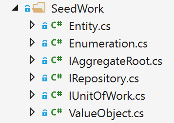

# Seedwork (reusable base classes and interfaces for your domain model)

The solution folder contains a *SeedWork* folder. The *SeedWork* folder contains custom base classes that you can use as a base for your domain entities and value objects. Use these base classes so you do not have redundant code in each domain’s object class. The folder for these types of classes is called *SeedWork* and not something like *Framework*. It's called *SeedWork* because the folder contains just a small subset of reusable classes which cannot really be considered a framework. *Seedwork* is a term introduced by [Michael Feathers](https://www.artima.com/forums/flat.jsp?forum=106&thread=8826) and popularized by [Martin Fowler](https://martinfowler.com/bliki/Seedwork.html) but you could also name that folder Common, SharedKernel, or similar.

Figure 9-12 shows the classes that form the seedwork of the domain model in the ordering microservice. It has a few custom base classes like Entity, ValueObject, and Enumeration, plus a few interfaces. These interfaces (IRepository and IUnitOfWork) inform the infrastructure layer about what needs to be implemented. Those interfaces are also used through Dependency Injection from the application layer.



**Figure 9-12**. A sample set of domain model “seedwork" base classes and interfaces

This is the type of copy and paste reuse that many developers share between projects, not a formal framework. You can have seedworks in any layer or library. However, if the set of classes and interfaces gets big enough, you might want to create a single class library.

## The custom Entity base class

The following code is an example of an Entity base class where you can place code that can be used the same way by any domain entity, such as the entity ID, [equality operators](/cpp/cpp/equality-operators-equal-equal-and-exclpt-equal), a domain event list per entity, etc.

```csharp
// COMPATIBLE WITH ENTITY FRAMEWORK CORE (1.1 and later)
public abstract class Entity
{
    int? _requestedHashCode;
    int _Id;    
    private List<INotification> _domainEvents;
    public virtual int Id 
    {
        get
        {
            return _Id;
        }
        protected set
        {
            _Id = value;
        }
    }

    public List<INotification> DomainEvents => _domainEvents;        
    public void AddDomainEvent(INotification eventItem)
    {
        _domainEvents = _domainEvents ?? new List<INotification>();
        _domainEvents.Add(eventItem);
    }
    public void RemoveDomainEvent(INotification eventItem)
    {
        if (_domainEvents is null) return;
        _domainEvents.Remove(eventItem);
    }

    public bool IsTransient()
    {
        return this.Id == default(Int32);
    }

    public override bool Equals(object obj)
    {
        if (obj == null || !(obj is Entity))
            return false;
        if (Object.ReferenceEquals(this, obj))
            return true;
        if (this.GetType() != obj.GetType())
            return false;
        Entity item = (Entity)obj;
        if (item.IsTransient() || this.IsTransient())
            return false;
        else
            return item.Id == this.Id;
    }

    public override int GetHashCode()
    {
        if (!IsTransient())
        {
            if (!_requestedHashCode.HasValue)
                _requestedHashCode = this.Id.GetHashCode() ^ 31; 
            // XOR for random distribution. See:
            // http://blogs.msdn.com/b/ericlippert/archive/2011/02/28/guidelines-and-rules-for-gethashcode.aspx
            return _requestedHashCode.Value;
        }
        else
            return base.GetHashCode();
    }
    public static bool operator ==(Entity left, Entity right)
    {
        if (Object.Equals(left, null))
            return (Object.Equals(right, null)) ? true : false;
        else
            return left.Equals(right);
    }
    public static bool operator !=(Entity left, Entity right)
    {
        return !(left == right);
    }
}
```

The previous code using a domain event list per entity will be explained in the next sections when focusing on domain events. 

## Repository contracts (interfaces) in the domain model layer

Repository contracts are simply .NET interfaces that express the contract requirements of the repositories to be used for each aggregate. 

The repositories themselves, with EF Core code or any other infrastructure dependencies and code (Linq, SQL, etc.), must not be implemented within the domain model; the repositories should only implement the interfaces you define. 

A pattern related to this practice (placing the repository interfaces in the domain model layer) is the Separated Interface pattern. As [explained](https://www.martinfowler.com/eaaCatalog/separatedInterface.html) by Martin Fowler, “Use Separated Interface to define an interface in one package but implement it in another. This way a client that needs the dependency to the interface can be completely unaware of the implementation.”

Following the Separated Interface pattern enables the application layer (in this case, the Web API project for the microservice) to have a dependency on the requirements defined in the domain model, but not a direct dependency to the infrastructure/persistence layer. In addition, you can use Dependency Injection to isolate the implementation, which is implemented in the infrastructure/ persistence layer using repositories.

For example, the following example with the IOrderRepository interface defines what operations the OrderRepository class will need to implement at the infrastructure layer. In the current implementation of the application, the code just needs to add or update orders to the database, since queries are split following the simplified CQRS approach.

```csharp
// Defined at IOrderRepository.cs
public interface IOrderRepository : IRepository<Order>
{
    Order Add(Order order);
        
    void Update(Order order);

    Task<Order> GetAsync(int orderId);
}

// Defined at IRepository.cs (Part of the Domain Seedwork)
public interface IRepository<T> where T : IAggregateRoot
{
    IUnitOfWork UnitOfWork { get; }
}
```

## Additional resources

-   **Martin Fowler. Separated Interface.**
    [*https://www.martinfowler.com/eaaCatalog/separatedInterface.html*](https://www.martinfowler.com/eaaCatalog/separatedInterface.html)


>[!div class="step-by-step"]
[Previous] (net-core-microservice-domain-model.md)
[Next] (implement-value-objects.md)
