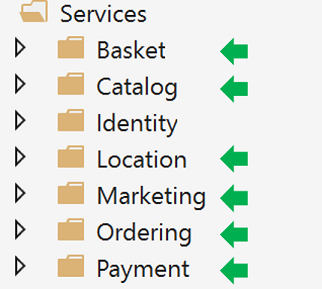
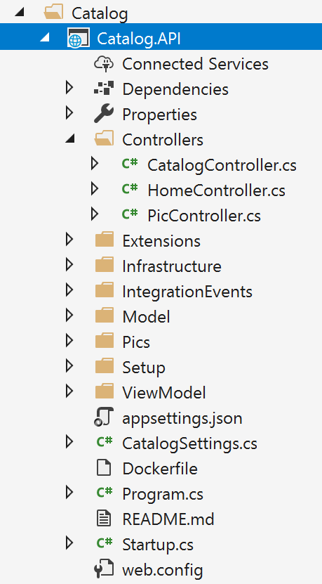
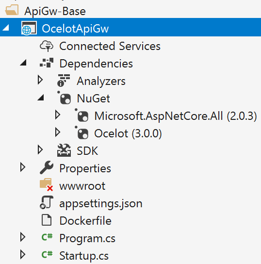
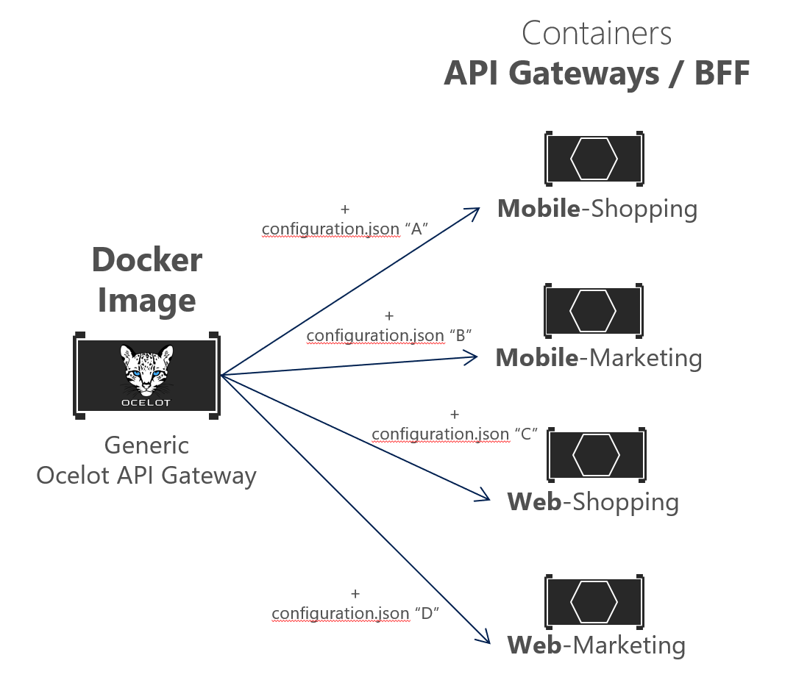
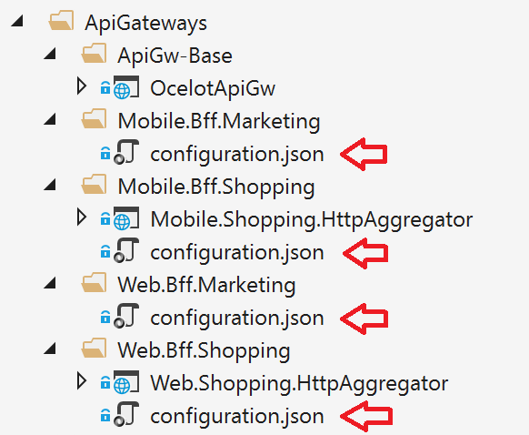
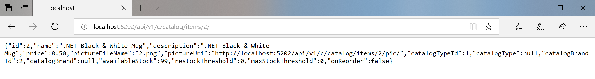
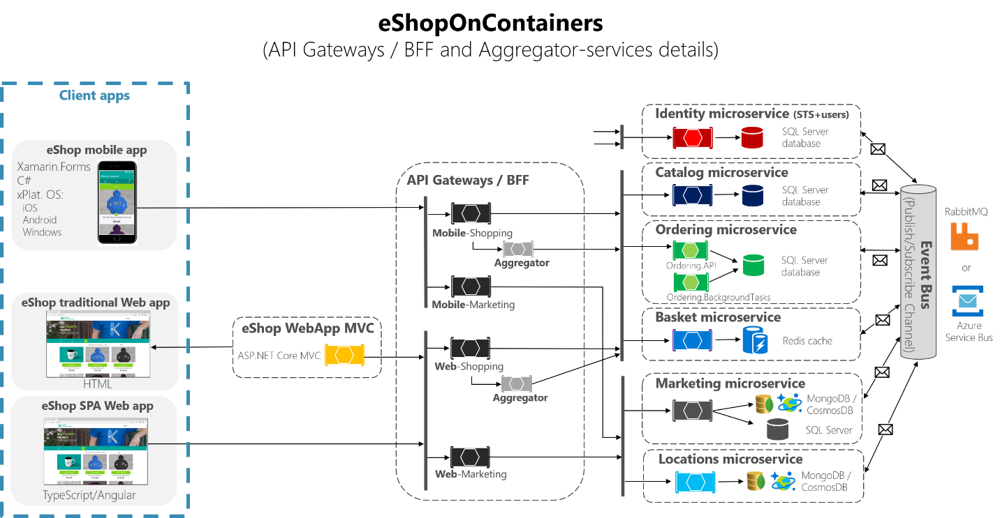
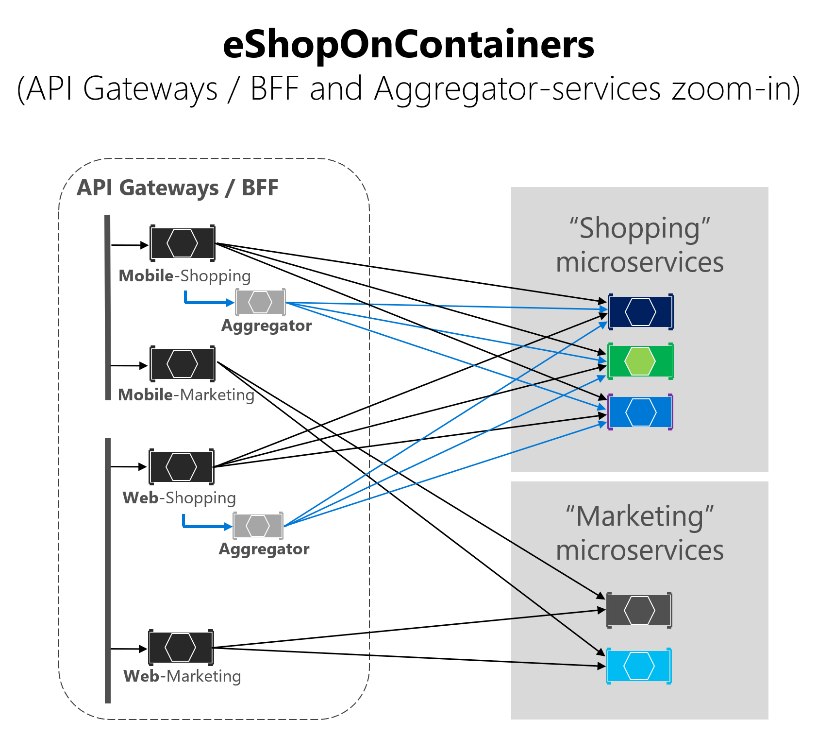
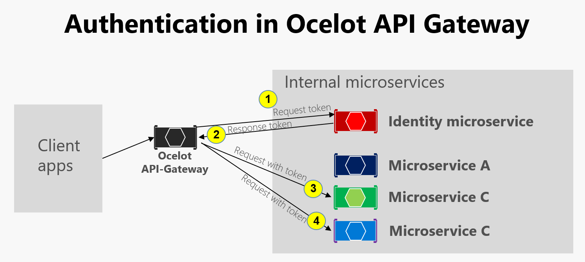
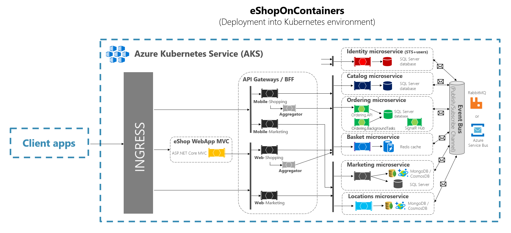

# Implementing API Gateways with Ocelot

The reference microservice application [eShopOnContainers](https://github.com/dotnet-architecture/eShopOnContainers) is using [Ocelot](https://github.com/ThreeMammals/Ocelot) because Ocelot is a simple and lightweight API Gateway that you can deploy anywhere along with your microservices/containers such as in any of the following environments used by eShopOnContainers.

- Docker host, in your local dev PC, on-premises or in the cloud.
- Kubernetes cluster, on-premises or in managed cloud such as Azure Kubernetes Service (AKS).
- Service Fabric cluster, on-premises or in the cloud.
- Service Fabric mesh, as PaaS/Serverless in Azure.

## Architect and design your API Gateways

The following architecture diagram shows how API Gateways are implemented with Ocelot in eShopOnContainers.


**Figure 8-27.** eShopOnContainers architecture with API Gateways

That diagram shows how the whole application is deployed into a single Docker host or development PC with “Docker for Windows” or “Docker for Mac”. However, deploying into any orchestrator would be pretty similar but any container in the diagram could be scaled-out in the orchestrator. 

In addition, the infrastructure assets such as databases, cache, and message brokers should be offloaded from the orchestrator and deployed into high available systems for infrastructure, like Azure SQL Database, Azure Cosmos DB, Azure Redis, Azure Service Bus, or any HA clustering solution on-premises.

As you can also notice in the diagram, having several API Gateways allows multiple development teams to be autonomous (in this case Marketing features vs. Shopping features) when developing and deploying their microservices plus their own related API Gateways. 

If you had a single monolithic API Gateway that would mean a single point to be updated by several development teams, which could couple all the microservices with a single part of the application.

Going much further in the design, sometimes a fine-grained API Gateway can also be limited to a single business microservice depending on the chosen architecture. Having the API Gateway’s boundaries dictated by the business or domain will help you to get a better design. 

For instance, fine granularity in the API Gateway tier can be especially useful for more advanced composite UI applications that are based on microservices, because the concept of a fine-grained API Gateway is similar to a UI composition service. 

For more information about UI composition services, see [Creating composite UI based on microservices](https://docs.microsoft.com/dotnet/standard/microservices-architecture/architect-microservice-container-applications/microservice-based-composite-ui-shape-layout).

As key takeaway, for many medium- and large-size applications, using a custom-built API Gateway product is usually a good approach, but not as a single monolithic aggregator or unique central custom API Gateway unless that API Gateway allows multiple independent configuration areas for the several development teams creating autonomous microservices.

### Sample microservices/containers to reroute through the API Gateways

As an example, `eShopOnContainers` has around six internal microservice-types that have to be published through the API Gateways, as shown in the following image.
 


**Figure 8-28.** Microservice folders in eShopOnContainers solution in Visual Studio

About the Identity service, in the design it is left out of the API Gateway routing because it is the only cross-cutting concern in the system, but with Ocelot it is also possible to include it as part of the rerouting lists.

All those services are currently implemented as ASP.NET Core Web API services, as you can tell because of the code. Let’s focus on one of the microservices like the Catalog microservice code.



**Figure 8-29.** Sample Web API microservice (Catalog microservice)

You can see that the Catalog microservice is a typical ASP.NET Core Web API project with several controllers and methods like in the following code.

```csharp
[HttpGet]
[Route("items/{id:int}")]
[ProducesResponseType((int)HttpStatusCode.BadRequest)]
[ProducesResponseType((int)HttpStatusCode.NotFound)]
[ProducesResponseType(typeof(CatalogItem),(int)HttpStatusCode.OK)]
public async Task<IActionResult> GetItemById(int id)
{
    if (id <= 0)
    {
        return BadRequest();
    }
    var item = await _catalogContext.CatalogItems.
                                          SingleOrDefaultAsync(ci => ci.Id == id);
    //…

    if (item != null)
    {
        return Ok(item);
    }
    return NotFound();
}
```
The HTTP request will end up running that kind of C# code accessing the microservice database plus any additional action.

In regards to the microservice URL, when the containers are deployed in your local development PC (local Docker host), each microservice’s container has always an internal port, usually port 80, specified in its dockerfile, as in the following dockerfile:

```
FROM microsoft/aspnetcore:2.0.5 AS base
WORKDIR /app
EXPOSE 80
```

The port 80 shown in the code is internal within the Docker host, so it cannot be reached by the client apps. 
The client apps can access only to the external ports (if any) published when deploying with `docker-compose`.

Those external ports shouldn't be published when deploying into a production environment. This is precisely why you want to use the API Gateway, to avoid the direct communication between the client apps and the microservices.

However, when developing, you want to access the microservice/container directly and run it through Swagger. That’s why in eShopOnContainers, the external ports are still specified even when they won’t be used by the API Gateway or the client apps.

Here’s an example of the `docker-compose.override.yml` file for the Catalog microservice:

```
catalog.api:
  environment:
    - ASPNETCORE_ENVIRONMENT=Development
    - ASPNETCORE_URLS=http://0.0.0.0:80
    - ConnectionString=YOUR_VALUE
    - ... Other Environment Variables
  ports:
    - "5101:80"   # Important: In a production environment you should remove the external port (5101) kept here for microservice debugging purposes. 
                  # The API Gateway redirects and access through the internal port (80).
```

You can see how in the docker-compose.override.yml configuration the internal port for the Catalog container is port 80, but the port for external access is 5101. But this port shouldn’t be used by the application when using an API Gateway, only to debug, run and test just the Catalog microservice.

Normally, you won’t be deploying with docker-compose into a production environment because the right production deployment environment for microservices is an orchestrator like Kubernetes or Service Fabric. When deploying to those environments you use different configuration files where you won’t publish directly any external port for the microservices but, you'll always use the reverse proxy from the API Gateway.

Run the catalog microservice in your local Docker host either by running the full eShopOnContainers solution from Visual Studio (it’ll run all the services in the docker-compose files) or just starting the Catalog microservice with the following docker-compose command in CMD or PowerShell positioned at the folder where the `docker-compose.yml` and docker-compose.override.yml are placed.

```
docker-compose run --service-ports catalog.api
```

This command only runs the catalog.api service container plus dependencies that are specified in the docker-compose.yml. In this case, the SQL Server container and RabbitMQ container.

Then, you can directly access the Catalog microservice and see its methods through the Swagger UI accessing directly through that “external” port, in this case `http://localhost:5101`. 


**Figure 8-30.** Testing the Catalog microservice with its Swagger UI

At this point, you could set a breakpoint in C# code in Visual Studio, test the microservice with the methods exposed in Swagger UI, and finally clean-up everything with the `docker-compose down` command.

However, this direct-access communication to the microservice, in this case through the external port 5101, is precisely what you want to avoid in your application. And you can avoid that by setting the additional level of indirection of the API Gateway (Ocelot, in this case). That way, the client app won’t directly access the microservice.

## Implementing your API Gateways with Ocelot

Ocelot is basically a set of middlewares that you can apply in a specific order.

Ocelot is designed to work with ASP.NET Core only. It targets netstandard2.0 so it can be used anywhere .NET Standard 2.0 is supported, including .NET Core 2.0 runtime and .NET Framework 4.6.1 runtime and up.

You install Ocelot and its dependencies in your ASP.NET Core project with [Ocelot's NuGet package](https://www.nuget.org/packages/Ocelot/), from Visual Studio.

```
Install-Package Ocelot
```

In eShopOnContainers, its API Gateway implementation is a simple ASP.NET Core WebHost project, and Ocelot’s middlewares handle all the API Gateway features, as shown in the following image:



**Figure 8-31.** The OcelotApiGw base project in eShopOnContainers

This ASP.NET Core WebHost project is made by two simple files, the `Program.cs` and `Startup.cs`.

The Program.cs just needs to create and configure the typical ASP.NET Core BuildWebHost. 

```csharp
namespace OcelotApiGw
{
    public class Program
    {
        public static void Main(string[] args)
        {
            BuildWebHost(args).Run();
        }

        public static IWebHost BuildWebHost(string[] args)
        {
            var builder = WebHost.CreateDefaultBuilder(args);

            builder.ConfigureServices(s => s.AddSingleton(builder))                
                                                          .ConfigureAppConfiguration(
                              ic => ic.AddJsonFile(Path.Combine("configuration",
                                                                "configuration.json")))
                                                                .UseStartup<Startup>();
            var host = builder.Build();
            return host;
        }
    }
}
```

The important point here for Ocelot is the `configuration.json` file that you must provide to the builder through the `AddJsonFile()` method. That `configuration.json` is where you specify all the API Gateway ReRoutes, meaning the external endpoints with specific ports and the correlated internal endpoints, usually using different ports.

```
{
    "ReRoutes": [],
    "GlobalConfiguration": {}
}
```

There are two sections to the configuration. An array of Re-Routes and a GlobalConfiguration. The Re-Routes are the objects that tell Ocelot how to treat an upstream request. The Global configuration allows overrides of Re-Route specific settings. It’s useful if you don’t want to manage lots of Re-Route specific settings.

Here’s a simplified example of [ReRoute configuration](https://github.com/dotnet-architecture/eShopOnContainers/blob/dev/src/ApiGateways/Web.Bff.Shopping/apigw/configuration.json) file from one of the API Gateways from eShopOnContainers.

```
{
  "ReRoutes": [
    {
      "DownstreamPathTemplate": "/api/{version}/{everything}",
      "DownstreamScheme": "http",
      "DownstreamHostAndPorts": [
        {
          "Host": "catalog.api",
          "Port": 80
        }
      ],
      "UpstreamPathTemplate": "/api/{version}/c/{everything}",
      "UpstreamHttpMethod": [ "POST", "PUT", "GET" ]
    },
    {
      "DownstreamPathTemplate": "/api/{version}/{everything}",
      "DownstreamScheme": "http",
      "DownstreamHostAndPorts": [
        {
          "Host": "basket.api",
          "Port": 80
        }
      ],
      "UpstreamPathTemplate": "/api/{version}/b/{everything}",
      "UpstreamHttpMethod": [ "POST", "PUT", "GET" ],
      "AuthenticationOptions": {
        "AuthenticationProviderKey": "IdentityApiKey",
        "AllowedScopes": []
      }
    }
    
  ],
    "GlobalConfiguration": {
      "RequestIdKey": "OcRequestId",
      "AdministrationPath": "/administration"
    }
  }
```

The main functionality of an Ocelot API Gateway is to take incoming HTTP requests and forward them on to a downstream service, currently as another HTTP request. Ocelot’s describes the routing of one request to another as a Re-Route.

For instance, let’s focus on one of the Re-Routes in the configuration.json from above, the configuration for the Basket microservice.

```
{
      "DownstreamPathTemplate": "/api/{version}/{everything}",
      "DownstreamScheme": "http",
      "DownstreamHostAndPorts": [
        {
          "Host": "basket.api",
          "Port": 80
        }
      ],
      "UpstreamPathTemplate": "/api/{version}/b/{everything}",
      "UpstreamHttpMethod": [ "POST", "PUT", "GET" ],
      "AuthenticationOptions": {
        "AuthenticationProviderKey": "IdentityApiKey",
        "AllowedScopes": []
      }
}
```

The DownstreamPathTemplate, Scheme, and DownstreamHostAndPorts make the internal microservice URL that this request will be forwarded to. 

The port is the internal port used by the service. When using containers, the port specified at its dockerfile.

The `Host` is a service name that depends on the service name resolution you are using. When using docker-compose, the services names are provided by the Docker Host, which is using the service names provided in the docker-compose files. If using an orchestrator like Kubernetes or Service Fabric, that name should be resolved by the DNS or name resolution provided by each orchestrator.

DownstreamHostAndPorts is an array that contains the host and port of any downstream services that you wish to forward requests to. Usually this will just contain one entry but sometimes you might want to load balance requests to your downstream services and Ocelot lets you add more than one entry and then select a load balancer. But if using Azure and any orchestrator it is probably a better idea to load balance with the cloud and orchestrator infrastructure.

The UpstreamPathTemplate is the URL that Ocelot will use to identify which DownstreamPathTemplate to use for a given request from the client. Finally, the UpstreamHttpMethod is used so Ocelot can distinguish between different requests (GET, POST, PUT) to the same URL.

At this point, you could have a single Ocelot API Gateway (ASP.NET Core WebHost) using one or [multiple merged configuration.json files](http://ocelot.readthedocs.io/en/latest/features/configuration.html#merging-configuration-files) or you can also store the [configuration in a Consul KV store](http://ocelot.readthedocs.io/en/latest/features/configuration.html#store-configuration-in-consul). 

But as introduced in the architecture and design sections, if you really want to have autonomous microservices, it might be better to split that single monolithic API Gateway into multiple API Gateways and/or BFF (Backend for Frontend). For that purpose, let’s see how to implement that approach with Docker containers.

### Using a single Docker container image to run multiple different API Gateway / BFF container types 

The design in eShopOnContainers implements a single Docker container image with the Ocelot API Gateway but then, when deploying to Docker, it creates different services/containers for each type of API-Gateway/BFF by providing a different configuration.json file for each container.



**Figure 8-32.** Reusing a single Ocelot Docker image across multiple API Gateway types

In eShopOnContainers, the “Generic Ocelot API Gateway Docker Image” is created with the project named 'OcelotApiGw' and the image name “eshop/ocelotapigw” that is specified in the docker-compose.yml file. Then, when deploying to Docker, there will be four API-Gateway containers created from that same Docker image, as shown in the following extract from the docker-compose.yml file.

```
PARTIAL DOCKER-COMPOSE.YML

  mobileshoppingapigw:
    image: eshop/ocelotapigw:${TAG:-latest}
    build:
      context: .
      dockerfile: src/ApiGateways/ApiGw-Base/Dockerfile
 
  mobilemarketingapigw:
    image: eshop/ocelotapigw:${TAG:-latest}
    build:
      context: .
      dockerfile: src/ApiGateways/ApiGw-Base/Dockerfile
 
  webshoppingapigw:
    image: eshop/ocelotapigw:${TAG:-latest}
    build:
      context: .
      dockerfile: src/ApiGateways/ApiGw-Base/Dockerfile

  webmarketingapigw:
    image: eshop/ocelotapigw:${TAG:-latest}
    build:
      context: .
      dockerfile: src/ApiGateways/ApiGw-Base/Dockerfile
```

Additionally, and as you can see in the docker-compose.override.yml file, the only difference between those API Gateway containers is the Ocelot configuration file, which is different for each service container and is specified at runtime through a Docker volume, as shown in the following docker-compose.override.yml file.

```
mobileshoppingapigw:
  environment:
    - ASPNETCORE_ENVIRONMENT=Development
    - IdentityUrl=http://identity.api              
  ports:
    - "5200:80"   
  volumes:
    - ./src/ApiGateways/Mobile.Bff.Shopping/apigw:/app/configuration
 
mobilemarketingapigw:
  environment:
    - ASPNETCORE_ENVIRONMENT=Development
    - IdentityUrl=http://identity.api              
  ports:
    - "5201:80"   
  volumes:
    - ./src/ApiGateways/Mobile.Bff.Marketing/apigw:/app/configuration

webshoppingapigw:
  environment:
    - ASPNETCORE_ENVIRONMENT=Development
    - IdentityUrl=http://identity.api              
  ports:
    - "5202:80"   
  volumes:
    - ./src/ApiGateways/Web.Bff.Shopping/apigw:/app/configuration

webmarketingapigw:
  environment:
    - ASPNETCORE_ENVIRONMENT=Development
    - IdentityUrl=http://identity.api              
  ports:
    - "5203:80"   
  volumes:
    - ./src/ApiGateways/Web.Bff.Marketing/apigw:/app/configuration
```

Because of that previous code, and as shown in the Visual Studio Explorer below, the only file needed to define each specific business/BFF API Gateway is just a configuration.json file, because the four API Gateways are based on the same Docker image.



**Figure 8-33.** The only file needed to define each API Gateway / BFF with Ocelot is a configuration file 

By splitting the API Gateway into multiple API Gateways, different development teams focusing on different subsets of microservices can manage their own API Gateways by using independent Ocelot configuration files. Plus, at the same time they can reuse the same Ocelot Docker image. 

Now, if you run eShopOnContainers with the API Gateways (included by default in VS when opening eShopOnContainers-ServicesAndWebApps.sln solution or if running “docker-compose up”), the following sample routes will be performed. 

For instance, when visiting the upstream URL http://localhost:5202/api/v1/c/catalog/items/2/ served by the webshoppingapigw API Gateway, you get the result from the internal Downstream URL http://catalog.api/api/v1/2 within the Docker host, as in the following browser.



**Figure 8-34.** Accessing a microservice through a URL provided by the API Gateway 

Because of testing or debugging reasons, if you wanted to directly access to the Catalog Docker container (only at the development environment) without passing through the API Gateway, since 'catalog.api' is a DNS resolution internal to the Docker host (service discovery handled by docker-compose service names), the only way to directly access the container is through the external port published in the docker-compose.override.yml, which is provided only for development tests, such as http://localhost:5101/api/v1/Catalog/items/1 in the following browser.


**Figure 8-35.** Direct access to a microservice for testing purposes 

But the application is configured so it accesses all the microservices through the API Gateways, not though the direct port “shortcuts”. 

### The Gateway aggregation pattern in eShopOnContainers

As introduced previously, a flexible way to implement requests aggregation is with custom services, by code. You could also implement request aggregation with the Request Aggregation feature in Ocelot, but it might not be as flexible as you need. Therefore, the selected way to implement aggregation in eShopOnContainers is with an explicit ASP.NET Core Web API services for each aggregator. 

According to that approach, the API Gateway composition diagram is in reality a bit more extended when taking into account the aggregator services that are not shown in the simplified global architecture diagram shown previously. 

In the following diagram, you can also see how the aggregator services work with their related API Gateways.



**Figure 8-36.** eShopOnContainers architecture with aggregator services

The following image is zooming in further, so you can notice how for the “Shopping” business area, the client apps could be improved by reducing chattiness with microservices when using those aggregator services under the realm of the API Gateways. 

 

**Figure 8-37.** Zoom in vision of the Aggregator services

You can notice how when the diagram shows the possible requests coming from the API Gateways it can get pretty complex. Although you can see how the arrows in blue would be simplified, from a client apps perspective, when using the aggregator pattern by reducing chattiness and latency in the communication, ultimately significantly improving the user experience for the remote apps (mobile and SPA apps), especially. 

In the case of the “Marketing” business area and microservices, it is a very simple use case so there was no need to use aggregators, but it could also be possible, if needed.

### Authentication and authorization in Ocelot API Gateways

In an Ocelot API Gateway you can sit the authentication service, such as an ASP.NET Core Web API service using [IdentityServer](http://identityserver.io/) providing the auth token, either out or inside the API Gateway.

Since eShopOnContainers is using multiple API Gateways with boundaries based on BFF and business areas, the Identity/Auth service is left out of the API Gateways, as highlighted in yellow in the following diagram.

 

**Figure 8-38.** Position of the Identity service in eShopOnContainers

However, Ocelot also supports to sit the Identity/Auth microservice within the API Gateway boundary, as in this other diagram.

 

**Figure 8-39.** Authentication in Ocelot API Gateway

Because eShopOnContainers application has split the API Gateway into multiple BFF (Backend for Frontend) and business areas API Gateways, another option would had been to create an additional API Gateway for cross-cutting concerns. That choice would be fair in a more complex microservice based architecture with multiple cross-cutting concerns microservices. Since there's only one cross-cutting concern in eShopOnContainers, it was decided to just handle the security service out of the API Gateway realm, for simplicity’s sake.

In any case, if the app is secured at the API Gateway level, the authentication module of the Ocelot API Gateway is visited at first when trying to use any secured microservice. That re-directs the HTTP request to visit the Identity or auth microservice to get the access token so so you can visit the protected services with the access_token.

The way you secure with authentication any service at the API Gateway level is by setting the AuthenticationProviderKey in its related settings at the configuration.json.

```
    {
      "DownstreamPathTemplate": "/api/{version}/{everything}",
      "DownstreamScheme": "http",
      "DownstreamHostAndPorts": [
        {
          "Host": "basket.api",
          "Port": 80
        }
      ],
      "UpstreamPathTemplate": "/api/{version}/b/{everything}",
      "UpstreamHttpMethod": [],
      "AuthenticationOptions": {
        "AuthenticationProviderKey": "IdentityApiKey",
        "AllowedScopes": []
      }
    }
```

When Ocelot runs, it will look at the Re-Routes AuthenticationOptions.AuthenticationProviderKey and check that there is an Authentication Provider registered with the given key. If there isn't, then Ocelot will not start up. If there is, then the ReRoute will use that provider when it executes.

Because the Ocelot WebHost is configured with the `authenticationProviderKey = "IdentityApiKey"`, that will require authentication whenever that service has any requests without any auth token. 

```csharp
namespace OcelotApiGw
{
    public class Startup
    {
        private readonly IConfiguration _cfg;

        public Startup(IConfiguration configuration) => _cfg = configuration;

        public void ConfigureServices(IServiceCollection services)
        {
            var identityUrl = _cfg.GetValue<string>("IdentityUrl");
            var authenticationProviderKey = "IdentityApiKey";
                         //…
            services.AddAuthentication()
                .AddJwtBearer(authenticationProviderKey, x =>
                {
                    x.Authority = identityUrl;
                    x.RequireHttpsMetadata = false;
                    x.TokenValidationParameters = new Microsoft.IdentityModel.Tokens.TokenValidationParameters()
                    {
                        ValidAudiences = new[] { "orders", "basket", "locations", "marketing", "mobileshoppingagg", "webshoppingagg" }
                    };                   
                });
            //...
```

Then, you also need to set authorization with the [Authorize] attribute on any resource to be accessed like the microservices, such as in the following Basket microservice controller.

```csharp
namespace Microsoft.eShopOnContainers.Services.Basket.API.Controllers
{
    [Route("api/v1/[controller]")]
    [Authorize]
    public class BasketController : Controller
    {   
      //...
    }
}
```

The ValidAudiences such as “basket” are correlated with the audience defined in each microservice with `AddJwtBearer()` at the ConfigureServices() of the Startup class, such as in the code below.

```csharp
// prevent from mapping "sub" claim to nameidentifier.
JwtSecurityTokenHandler.DefaultInboundClaimTypeMap.Clear();

var identityUrl = Configuration.GetValue<string>("IdentityUrl"); 
                
services.AddAuthentication(options =>
{
    options.DefaultAuthenticateScheme = JwtBearerDefaults.AuthenticationScheme;
    options.DefaultChallengeScheme = JwtBearerDefaults.AuthenticationScheme;

}).AddJwtBearer(options =>
{
    options.Authority = identityUrl;
    options.RequireHttpsMetadata = false;
    options.Audience = "basket";
});
```

As next step, if you try to access any secured microservice like the Basket microservice with a Re-Route URL based on the API Gateway like http://localhost:5202/api/v1/b/basket/1 then you’ll get a 401 Unauthorized unless you provide a valid token. On the other hand, if a Re-Route URL is authenticated, Ocelot will invoke whatever downstream scheme is associated with it (the internal microservice URL).

**Authorization at Ocelot’s Re-Routes tier.**  Ocelot supports claims-based authorization evaluated after the authentication. You set the authorization at a route level by adding the following code to the re-route configuration. 

```
"RouteClaimsRequirement": {
    "UserType": "employee"
}
```

In that example, when the authorization middleware is called, Ocelot will find if the user has the claim type 'UserType' in the token and if the value of that claim is 'employee'. If it isn’t, then the user will not be authorized and the response will be 403 forbidden. 

## Using Kubernetes Ingress plus Ocelot API Gateways

When using Kubernetes (like in an Azure Kubernetes Service cluster),, you usually unify all the HTTP requests through the [Kuberentes Ingress tier](https://kubernetes.io/docs/concepts/services-networking/ingress/) based on *Nginx*. 

In Kuberentes, if you don’t use any ingress approach, then your services and pods have IPs only routable by the cluster network. 

But if you use an ingress approach, you'll have a middle tier between the Internet and your services (including your API Gateways), acting as a reverse proxy.

As a definition, an Ingress is a collection of rules that allow inbound connections to reach the cluster services. An ingress is configured to provide services externally reachable URLs, load balance traffic, SSL termination and more. Users request ingress by POSTing the Ingress resource to the API server.

In eShopOnContainers, when developing locally and using just your development machine as the Docker host, you are not using any ingress but only the multiple API Gateways. 

However, when targeting a “production” environment based on Kuberentes, eShopOnCOntainers is using an ingress in front of the API gateways. That way, the clients still call the same base URL but the requests are routed to multiple API Gateways or BFF. 

Note that API Gateways are front-ends or facades surfacing only the services but not the web applications that are usually out of their scope. In addition, the API Gateways might hide certain internal microservices. 

The ingress, however, is just redirecting HTTP requests but not trying to hide any microservice or web app.

Having an ingress Nginx tier in Kuberentes in front of the web applications plus the several Ocelot API Gateways / BFF is the ideal architecture, as shown in the following diagram.

 

**Figure 8-40.** The ingress tier in eShopOnContainers when deployed into Kubernetes

When you deploy eShopOnContainers into Kuberentes, it exposes just a few services or endpoints via _ingress_, basically the following list of postfixes on the URLs:

-	`/` for the client SPA web application
-	`/webmvc` for the client MVC web application
-	`/webstatus` for the client web app showing the status/healthchecks
-	`/webshoppingapigw` for the web BFF and shopping business processes
-	`/webmarketingapigw` for the web BFF and marketing business processes
-	`/mobileshoppingapigw` for the mobile BFF and shopping business processes
-	`/mobilemarketingapigw` for the mobile BFF and marketing business processes

When deploying to Kubernetes, each Ocelot API Gateway is using a different “configuration.json” file for each _pod_ running the API Gateways. Those “configuration.json” files are provided by mounting (originally with the deploy.ps1 script) a volume created based on a Kuberentes _config map_ named ‘ocelot’. Each container mounts its related configuration file in the container’s folder named `/app/configuration`.

In the source code files of eShopOnContainers, the original “configuration.json” files can be found within the `k8s/ocelot/` folder. There’s one file for each BFF/APIGateway.


## Additional cross-cutting features in an Ocelot API Gateway

There are other important features to research and use, when using an Ocelot API Gateway, described in the following links.

-   **Service discovery in the client side integrating Ocelot with Consul or Eureka** 
    [*http://ocelot.readthedocs.io/en/latest/features/servicediscovery.html*](http://ocelot.readthedocs.io/en/latest/features/servicediscovery.html)

-   **Caching at the API Gateway tier** 
    [*http://ocelot.readthedocs.io/en/latest/features/caching.html*](http://ocelot.readthedocs.io/en/latest/features/caching.html)

-   **Logging at the API Gateway tier** 
    [*http://ocelot.readthedocs.io/en/latest/features/logging.html*](http://ocelot.readthedocs.io/en/latest/features/logging.html)

-   **Quality of Service (Retries and Circuit breakers) at the API Gateway tier** 
    [*http://ocelot.readthedocs.io/en/latest/features/qualityofservice.html*](http://ocelot.readthedocs.io/en/latest/features/qualityofservice.html)

-   **Rate limiting** 
    [*http://ocelot.readthedocs.io/en/latest/features/ratelimiting.html*](http://ocelot.readthedocs.io/en/latest/features/ratelimiting.html )


>[!div class="step-by-step"]
[Previous] (background-tasks-with-ihostedservice.md)
[Next] (../microservice-ddd-cqrs-patterns/index.md)
