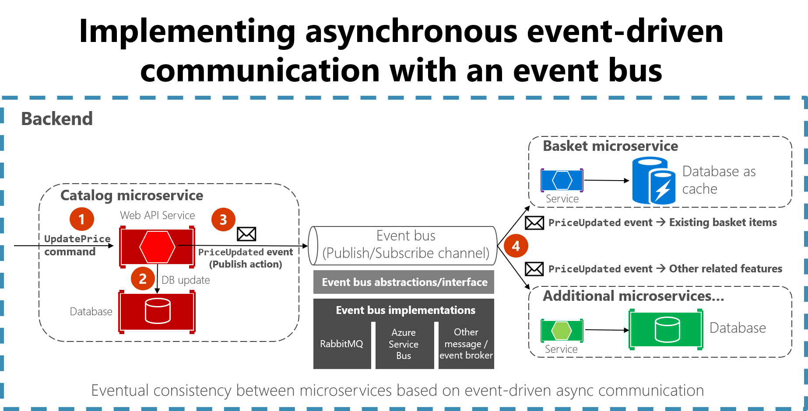
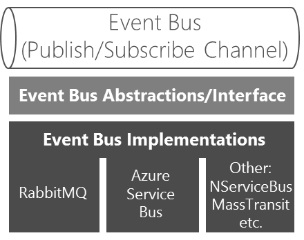

# Implementing event-based communication between microservices (integration events)

As described earlier, when you use event-based communication, a microservice publishes an event when something notable happens, such as when it updates a business entity. Other microservices subscribe to those events. When a microservice receives an event, it can update its own business entities, which might lead to more events being published. This publish/subscribe system is usually performed by using an implementation of an event bus. The event bus can be designed as an interface with the API needed to subscribe and unsubscribe to events and to publish events. It can also have one or more implementations based on any inter-process or messaging communication, such as a messaging queue or a service bus that supports asynchronous communication and a publish/subscribe model.

You can use events to implement business transactions that span multiple services, which gives you eventual consistency between those services. An eventually consistent transaction consists of a series of distributed actions. At each action, the microservice updates a business entity and publishes an event that triggers the next action.



**Figure 8-18**. Event-driven communication based on an event bus

This section describes how you can implement this type of communication with .NET by using a generic event bus interface, as shown in Figure 8-18. There are multiple potential implementations, each using a different technology or infrastructure such as RabbitMQ, Azure Service Bus, or any other third-party open source or commercial service bus.

## Using message brokers and services buses for production systems

As noted in the architecture section, you can choose from multiple messaging technologies for implementing your abstract event bus. But these technologies are at different levels. For instance, RabbitMQ, a messaging broker transport, is at a lower level than commercial products like Azure Service Bus, NServiceBus, MassTransit, or Brighter. Most of these products can work on top of either RabbitMQ or Azure Service Bus. Your choice of product depends on how many features and how much out-of-the-box scalability you need for your application.

For implementing just an event bus proof-of-concept for your development environment, as in the eShopOnContainers sample, a simple implementation on top of RabbitMQ running as a container might be enough. But for mission-critical and production systems that need high scalability, you might want to evaluate and use Azure Service Bus.

If you require high-level abstractions and richer features like [Sagas](https://docs.particular.net/nservicebus/sagas/) for long-running processes that make distributed development easier, other commercial and open-source service buses like NServiceBus, MassTransit, and Brighter are worth evaluating. In this case, the abstractions and API to use would usually be directly the ones provided by those high-level service buses instead of your own abstractions (like the [simple event bus abstractions provided at eShopOnContainers](https://github.com/dotnet-architecture/eShopOnContainers/blob/dev/src/BuildingBlocks/EventBus/EventBus/Abstractions/IEventBus.cs)). For that matter, you can research the [forked eShopOnContainers using NServiceBus](http://go.particular.net/eShopOnContainers) (additional derived sample implemented by Particular Software)

Of course, you could always build your own service bus features on top of lower-level technologies like RabbitMQ and Docker, but the work needed to “reinvent the wheel” might be too costly for a custom enterprise application.

## Integration events

Integration events are used for bringing domain state in sync across multiple microservices or external systems. This is done by publishing integration events outside the microservice. When an event is published to multiple receiver microservices (to as many microservices as are subscribed to the integration event), the appropriate event handler in each receiver microservice handles the event.

An integration event is basically a data-holding class, as in the following example:

```csharp
public class ProductPriceChangedIntegrationEvent : IntegrationEvent
{
    public int ProductId { get; private set; }
    public decimal NewPrice { get; private set; }
    public decimal OldPrice { get; private set; }

    public ProductPriceChangedIntegrationEvent(int productId, decimal newPrice,
        decimal oldPrice)
    {
        ProductId = productId;
        NewPrice = newPrice;
        OldPrice = oldPrice;
    }
}
```

The integration events can be defined at the application level of each microservice, so they are decoupled from other microservices, in a way comparable to how ViewModels are defined in the server and client. What is not recommended is sharing a common integration events library across multiple microservices; doing that would be coupling those microservices with a single event definition data library. You do not want to do that for the same reasons that you do not want to share a common domain model across multiple microservices: microservices must be completely autonomous.

There are only a few kinds of libraries you should share across microservices. One is libraries that are final application blocks, like the [Event Bus client API](https://github.com/dotnet-architecture/eShopOnContainers/tree/master/src/BuildingBlocks/EventBus), as in eShopOnContainers. Another is libraries that constitute tools that could also be shared as NuGet components, like JSON serializers.

## The event bus

An event bus allows publish/subscribe-style communication between microservices without requiring the components to explicitly be aware of each other, as shown in Figure 8-19.


**Figure 8-19**. Publish/subscribe basics with an event bus

The event bus is related to the Observer pattern and the publish-subscribe pattern.

### Observer pattern

In the [Observer pattern](https://en.wikipedia.org/wiki/Observer_pattern), your primary object (known as the Observable) notifies other interested objects (known as Observers) with relevant information (events).

### Publish-subscribe (Pub/Sub) pattern 

The purpose of the [Pub/Sub pattern](https://msdn.microsoft.com/library/ff649664.aspx) is the same as the Observer pattern: you want to notify other services when certain events take place. But there is an important difference between the Observer and Pub/Sub patterns. In the observer pattern, the broadcast is performed directly from the observable to the observers, so they “know” each other. But when using a Pub/Sub pattern, there is a third component, called broker or message broker or event bus, which is known by both the publisher and subscriber. Therefore, when using the Pub/Sub pattern the publisher and the subscribers are precisely decoupled thanks to the mentioned event bus or message broker.

### The middleman or event bus 

How do you achieve anonymity between publisher and subscriber? An easy way is let a middleman take care of all the communication. An event bus is one such middleman.

An event bus is typically composed of two parts:

-   The abstraction or interface.

-   One or more implementations.

In Figure 8-19 you can see how, from an application point of view, the event bus is nothing more than a Pub/Sub channel. The way you implement this asynchronous communication can vary. It can have multiple implementations so that you can swap between them, depending on the environment requirements (for example, production versus development environments).

In Figure 8-20 you can see an abstraction of an event bus with multiple implementations based on infrastructure messaging technologies like RabbitMQ, Azure Service Bus, or other event/message broker. 



**Figure 8- 20.** Multiple implementations of an event bus

However, and as mentioned previously, using your own abstractions (the event bus interface) is good only if you need basic event bus features supported by your abstractions. If you need richer service bus features, you should probably use the API and abstractions provided by your preferred commercial service bus instead of your own abstractions. 

### Defining an event bus interface

Let’s start with some implementation code for the event bus interface and possible implementations for exploration purposes. The interface should be generic and straightforward, as in the following interface.

```csharp
public interface IEventBus
{
    void Publish(IntegrationEvent @event);

    void Subscribe<T, TH>()
        where T : IntegrationEvent
        where TH : IIntegrationEventHandler<T>;

    void SubscribeDynamic<TH>(string eventName)
        where TH : IDynamicIntegrationEventHandler;

    void UnsubscribeDynamic<TH>(string eventName)
        where TH : IDynamicIntegrationEventHandler;

    void Unsubscribe<T, TH>()
        where TH : IIntegrationEventHandler<T>
        where T : IntegrationEvent;
}
```

The `Publish` method is straightforward. The event bus will broadcast the integration event passed to it to any microservice, or even an external application, subscribed to that event. This method is used by the microservice that is publishing the event.

The `Subscribe` methods (you can have several implementations depending on the arguments) are used by the microservices that want to receive events. This method has two arguments. The first is the integration event to subscribe to (`IntegrationEvent`). The second argument is the integration event handler (or callback method), named `IIntegrationEventHandler<T>`, to be executed when the receiver microservice gets that integration event message.


>[!div class="step-by-step"]
[Previous] (database-server-container.md)
[Next] (rabbitmq-event-bus-development-test-environment.md)
