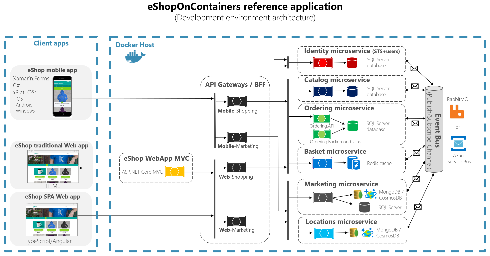
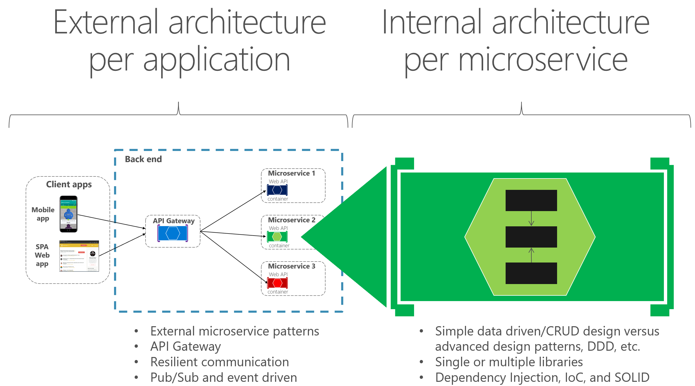
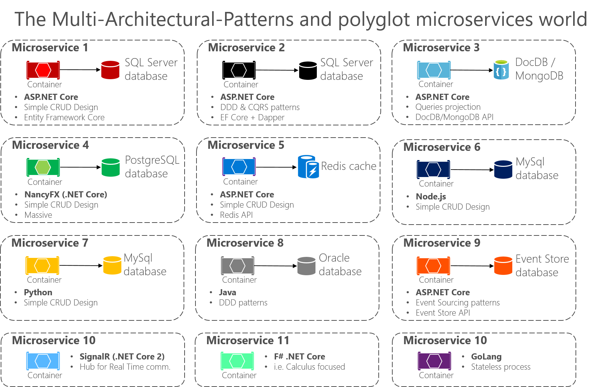

# Designing a microservice-oriented application

This section focuses on developing a hypothetical server-side enterprise application.

## Application specifications

The hypothetical application handles requests by executing business logic, accessing databases, and then returning HTML, JSON, or XML responses. We will say that the application must support a variety of clients, including desktop browsers running Single Page Applications (SPAs), traditional web apps, mobile web apps, and native mobile apps. The application might also expose an API for third parties to consume. It should also be able to integrate its microservices or external applications asynchronously, so that approach will help resiliency of the microservices in the case of partial failures.

The application will consist of these types of components:

-   Presentation components. These are responsible for handling the UI and consuming remote services.

-   Domain or business logic. This is the application’s domain logic.

-   Database access logic. This consists of data access components responsible for accessing databases (SQL or NoSQL).

-   Application integration logic. This includes a messaging channel, mainly based on message brokers.

The application will require high scalability, while allowing its vertical subsystems to scale out autonomously, because certain subsystems will require more scalability than others.

The application must be able to be deployed in multiple infrastructure environments (multiple public clouds and on-premises) and ideally should be cross-platform, able to move from Linux to Windows (or vice versa) easily.

## Development team context

We also assume the following about the development process for the application:

-   You have multiple dev teams focusing on different business areas of the application.

-   New team members must become productive quickly, and the application must be easy to understand and modify.

-   The application will have a long-term evolution and ever-changing business rules.

-   You need good long-term maintainability, which means having agility when implementing new changes in the future while being able to update multiple subsystems with minimum impact on the other subsystems.

-   You want to practice continuous integration and continuous deployment of the application.

-   You want to take advantage of emerging technologies (frameworks, programming languages, etc.) while evolving the application. You do not want to make full migrations of the application when moving to new technologies, because that would result in high costs and impact the predictability and stability of the application.

## Choosing an architecture

What should the application deployment architecture be? The specifications for the application, along with the development context, strongly suggest that you should architect the application by decomposing it into autonomous subsystems in the form of collaborating microservices and containers, where a microservice is a container.

In this approach, each service (container) implements a set of cohesive and narrowly related functions. For example, an application might consist of services such as the catalog service, ordering service, basket service, user profile service, etc.

Microservices communicate using protocols such as HTTP (REST), but also asynchronously (for example, using AMQP) whenever possible, especially when propagating updates with integration events.

Microservices are developed and deployed as containers independently of one another. This means that a development team can be developing and deploying a certain microservice without impacting other subsystems.

Each microservice has its own database, allowing it to be fully decoupled from other microservices. When necessary, consistency between databases from different microservices is achieved using application-level integration events (through a logical event bus), as handled in Command and Query Responsibility Segregation (CQRS). Because of that, the business constraints must embrace eventual consistency between the multiple microservices and related databases.

### eShopOnContainers: A reference application for .NET Core and microservices deployed using containers

So that you can focus on the architecture and technologies instead of thinking about a hypothetic business domain that you might not know, we have selected a well-known business domain—namely, a simplified e-commerce (e-shop) application that presents a catalog of products, takes orders from customers, verifies inventory, and performs other business functions. This container-based application source code is available in the [eShopOnContainers](http://aka.ms/MicroservicesArchitecture) GitHub repo.

The application consists of multiple subsystems, including several store UI front ends (a Web application and a native mobile app), along with the back-end microservices and containers for all the required server-side operations. Figure 8-1 shows the architecture of the reference application.

**Figure 8-1**. The eShopOnContainers reference application, showing a direct client-to-microservice communication and the event bus

**Hosting environment**. In Figure 8-1, you see several containers deployed within a single Docker host. That would be the case when deploying to a single Docker host with the docker-compose up command. However, if you are using an orchestrator or container cluster, each container could be running in a different host (node), and any node could be running any number of containers, as we explained earlier in the architecture section.

**Communication architecture**. The eShopOnContainers application uses two communication types, depending on the kind of the functional action (queries versus updates and transactions):

-   Direct client-to-microservice communication. This is used for queries and when accepting update or transactional commands from the client apps.

-   Asynchronous event-based communication. This occurs through an event bus to propagate updates across microservices or to integrate with external applications. The event bus can be implemented with any messaging-broker infrastructure technology like RabbitMQ, or using higher-level service buses like Azure Service Bus, NServiceBus, MassTransit, or Brighter.

The application is deployed as a set of microservices in the form of containers. Client apps can communicate with those containers as well as communicate between microservices. As mentioned, this initial architecture is using a direct client-to-microservice communication architecture, which means that a client application can make requests to each of the microservices directly. Each microservice has a public endpoint like https://servicename.applicationname.companyname. If required, each microservice can use a different TCP port. In production, that URL would map to the microservices’ load balancer, which distributes requests across the available microservice instances.

**Important note on API Gateway vs. Direct Communication in eShopOnContainers.** As explained in the architecture section of this guide, the direct client-to-microservice communication architecture can have drawbacks when you are building a large and complex microservice-based application. But it can be good enough for a small application, such as in the eShopOnContainers application, where the goal is to focus on a simpler getting started Docker container-based application and we didn’t want to create a single monolithic API Gateway that can impact the microservices’ development autonomy.

But, if you are going to design a large microservice-based application with dozens of microservices, we strongly recommend that you consider the API Gateway pattern, as we explained in the architecture section.
This architectural decision could be refactored once thinking about production-ready applications and specially-made facades for remote clients. Having multiple custom API Gateways depending on the client apps' form-factor can provide benefits in regard to different data aggregation per client app plus you can hide internal microservices or APIs to the client apps and authorize in that single tier. 

However, and as mentioned, beware against large and monolithic API Gateways that might kill your microservices' development autonomy.

### Data sovereignty per microservice

In the sample application, each microservice owns its own database or data source, and each database or data source is deployed as another container. This design decision was made only to make it easy for a developer to get the code from GitHub, clone it, and open it in Visual Studio or Visual Studio Code. Or alternatively, it makes it easy to compile the custom Docker images using .NET Core CLI and the Docker CLI, and then deploy and run them in a Docker development environment. Either way, using containers for data sources lets developers build and deploy in a matter of minutes without having to provision an external database or any other data source with hard dependencies on infrastructure (cloud or on-premises).

In a real production environment, for high availability and for scalability, the databases should be based on database servers in the cloud or on-premises, but not in containers.

Therefore, the units of deployment for microservices (and even for databases in this application) are Docker containers, and the reference application is a multi-container application that embraces microservices principles.

### Additional resources

-   **eShopOnContainers GitHub repo. Source code for the reference application**
    *https://aka.ms/eShopOnContainers/*

## Benefits of a microservice-based solution

A microservice based solution like this has many benefits:

**Each microservice is relatively small—easy to manage and evolve**. Specifically:

-   It is easy for a developer to understand and get started quickly with good productivity.

-   Containers start fast, which makes developers more productive.

-   An IDE like Visual Studio can load smaller projects fast, making developers productive.

-   Each microservice can be designed, developed, and deployed independently of other microservices, which provides agility because it is easier to deploy new versions of microservices frequently.

**It is possible to scale out individual areas of the application**. For instance, the catalog service or the basket service might need to be scaled out, but not the ordering process. A microservices infrastructure will be much more efficient with regard to the resources used when scaling out than a monolithic architecture would be.

**You can divide the development work between multiple teams**. Each service can be owned by a single development team. Each team can manage, develop, deploy, and scale their service independently of the rest of the teams.

**Issues are more isolated**. If there is an issue in one service, only that service is initially impacted (except when the wrong design is used, with direct dependencies between microservices), and other services can continue to handle requests. In contrast, one malfunctioning component in a monolithic deployment architecture can bring down the entire system, especially when it involves resources, such as a memory leak. Additionally, when an issue in a microservice is resolved, you can deploy just the affected microservice without impacting the rest of the application.

**You can use the latest technologies**. Because you can start developing services independently and run them side by side (thanks to containers and .NET Core), you can start using the latest technologies and frameworks expediently instead of being stuck on an older stack or framework for the whole application.

## Downsides of a microservice-based solution

A microservice based solution like this also has some drawbacks:

**Distributed application**. Distributing the application adds complexity for developers when they are designing and building the services. For example, developers must implement interservice communication using protocols like HTTP or AMPQ, which adds complexity for testing and exception handling. It also adds latency to the system.

**Deployment complexity**. An application that has dozens of microservices types and needs high scalability (it needs to be able to create many instances per service and balance those services across many hosts) means a high degree of deployment complexity for IT operations and management. If you are not using a microservice-oriented infrastructure (like an orchestrator and scheduler), that additional complexity can require far more development efforts than the business application itself.

**Atomic transactions**. Atomic transactions between multiple microservices usually are not possible. The business requirements have to embrace eventual consistency between multiple microservices.

**Increased global resource needs** (total memory, drives, and network resources for all the servers or hosts). In many cases, when you replace a monolithic application with a microservices approach, the amount of global resources needed by the new microservice-based application will be larger than the infrastructure needs of the original monolithic application. This is because the higher degree of granularity and distributed services requires more global resources. However, given the low cost of resources in general and the benefit of being able to scale out just certain areas of the application compared to long-term costs when evolving monolithic applications, the increased use of resources is usually a good tradeoff for large, long-term applications.

**Issues with direct client‑to‑microservice communication**. When the application is large, with dozens of microservices, there are challenges and limitations if the application requires direct client-to-microservice communications. One problem is a potential mismatch between the needs of the client and the APIs exposed by each of the microservices. In certain cases, the client application might need to make many separate requests to compose the UI, which can be inefficient over the Internet and would be impractical over a mobile network. Therefore, requests from the client application to the back-end system should be minimized.

Another problem with direct client-to-microservice communications is that some microservices might be using protocols that are not Web-friendly. One service might use a binary protocol, while another service might use AMQP messaging. Those protocols are not firewall‑friendly and are best used internally. Usually, an application should use protocols such as HTTP and WebSockets for communication outside of the firewall.

Yet another drawback with this direct client‑to‑service approach is that it makes it difficult to refactor the contracts for those microservices. Over time developers might want to change how the system is partitioned into services. For example, they might merge two services or split a service into two or more services. However, if clients communicate directly with the services, performing this kind of refactoring can break compatibility with client apps.

As mentioned in the architecture section, when designing and building a complex application based on microservices, you might consider the use of multiple fine-grained API Gateways instead of the simpler direct client‑to‑microservice communication approach.

**Partitioning the microservices**. Finally, no matter which approach you take for your microservice architecture, another challenge is deciding how to partition an end-to-end application into multiple microservices. As noted in the architecture section of the guide, there are several techniques and approaches you can take. Basically, you need to identify areas of the application that are decoupled from the other areas and that have a low number of hard dependencies. In many cases, this is aligned to partitioning services by use case. For example, in our e-shop application, we have an ordering service that is responsible for all the business logic related to the order process. We also have the catalog service and the basket service that implement other capabilities. Ideally, each service should have only a small set of responsibilities. This is similar to the single responsibility principle (SRP) applied to classes, which states that a class should only have one reason to change. But in this case, it is about microservices, so the scope will be larger than a single class. Most of all, a microservice has to be completely autonomous, end to end, including responsibility for its own data sources.

## External versus internal architecture and design patterns

The external architecture is the microservice architecture composed by multiple services, following the principles described in the architecture section of this guide. However, depending on the nature of each microservice, and independently of high-level microservice architecture you choose, it is common and sometimes advisable to have different internal architectures, each based on different patterns, for different microservices. The microservices can even use different technologies and programming languages. Figure 8-2 illustrates this diversity.

**Figure 8-2**. External versus internal architecture and design

For instance, in our *eShopOnContainers* sample, the catalog, basket, and user profile microservices are simple (basically, CRUD subsystems). Therefore, their internal architecture and design is straightforward. However, you might have other microservices, such as the ordering microservice, which is more complex and represents ever-changing business rules with a high degree of domain complexity. In cases like these, you might want to implement more advanced patterns within a particular microservice, like the ones defined with domain-driven design (DDD) approaches, as we are doing in the *eShopOnContainers* ordering microservice. (We will review these DDD patterns in the section later that explains the implementation of the *eShopOnContainers* ordering microservice.)

Another reason for a different technology per microservice might be the nature of each microservice. For example, it might be better to use a functional programming language like F\#, or even a language like R if you are targeting AI and machine learning domains, instead of a more object-oriented programming language like C\#.

The bottom line is that each microservice can have a different internal architecture based on different design patterns. Not all microservices should be implemented using advanced DDD patterns, because that would be over-engineering them. Similarly, complex microservices with ever-changing business logic should not be implemented as CRUD components, or you can end up with low-quality code.

## The new world: multiple architectural patterns and polyglot microservices

There are many architectural patterns used by software architects and developers. The following are a few (mixing architecture styles and architecture patterns):

-   Simple CRUD, single-tier, single-layer.

-   [Traditional N-Layered](https://msdn.microsoft.com/library/ee658109.aspx#Layers).

-   [Domain-Driven Design N-layered](https://blogs.msdn.microsoft.com/cesardelatorre/2011/07/03/published-first-alpha-version-of-domain-oriented-n-layered-architecture-v2-0/).

-   [Clean Architecture](https://8thlight.com/blog/uncle-bob/2012/08/13/the-clean-architecture.html) (as used with [eShopOnWeb](http://aka.ms/WebAppArchitecture))

-   [Command and Query Responsibility Segregation](https://martinfowler.com/bliki/CQRS.html) (CQRS).

-   [Event-Driven Architecture](https://en.wikipedia.org/wiki/Event-driven_architecture) (EDA).

You can also build microservices with many technologies and languages, such as ASP.NET Core Web APIs, NancyFx, ASP.NET Core SignalR (available with .NET Core 2), F\#, Node.js, Python, Java, C++, GoLang, and more.

The important point is that no particular architecture pattern or style, nor any particular technology, is right for all situations. Figure 8-3 shows some approaches and technologies (although not in any particular order) that could be used in different microservices.

**Figure 8-3**. Multi-architectural patterns and the polyglot microservices world

As shown in Figure 8-3, in applications composed of many microservices (Bounded Contexts in domain-driven design terminology, or simply “subsystems” as autonomous microservices), you might implement each microservice in a different way. Each might have a different architecture pattern and use different languages and databases depending on the application’s nature, business requirements, and priorities. In some cases, the microservices might be similar. But that is not usually the case, because each subsystem’s context boundary and requirements are usually different.

For instance, for a simple CRUD maintenance application, it might not make sense to design and implement DDD patterns. But for your core domain or core business, you might need to apply more advanced patterns to tackle business complexity with ever-changing business rules.

Especially when you deal with large applications composed by multiple sub-systems, you should not apply a single top-level architecture based on a single architecture pattern. For instance, CQRS should not be applied as a top-level architecture for a whole application, but might be useful for a specific set of services.

There is no silver bullet or a right architecture pattern for every given case. You cannot have “one architecture pattern to rule them all.” Depending on the priorities of each microservice, you must choose a different approach for each, as explained in the following sections.

>[!div class="step-by-step"]
[Previous] (index.md)
[Next] (data-driven-crud-microservice.md)
