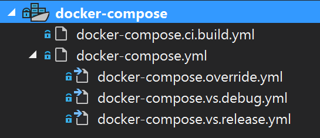
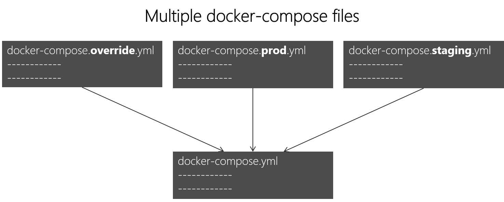
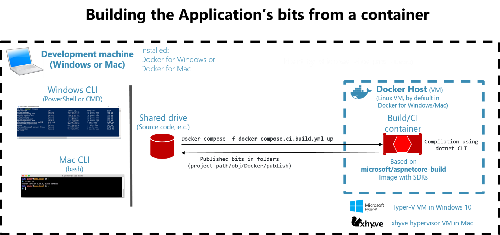
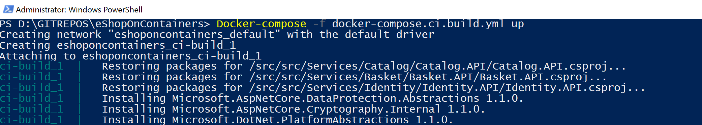
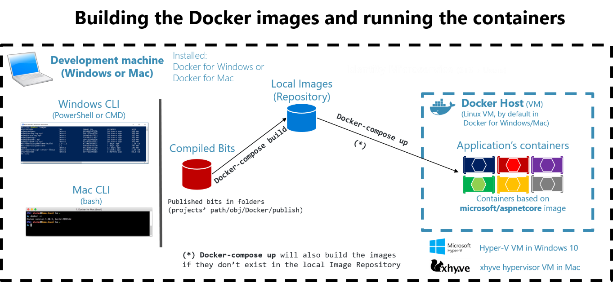

# Defining your multi-container application with docker-compose.yml 

In this guide, the [docker-compose.yml](https://docs.docker.com/compose/compose-file/) file was introduced in the section [Step 4. Define your services in docker-compose.yml when building a multi-container Docker application](#step4_define_svcs_in_docker_compose_yml). However, there are additional ways to use the docker-compose files that are worth exploring in further detail.

For example, you can explicitly describe how you want to deploy your multi-container application in the docker-compose.yml file. Optionally, you can also describe how you are going to build your custom Docker images. (Custom Docker images can also be built with the Docker CLI.)

Basically, you define each of the containers you want to deploy plus certain characteristics for each container deployment. Once you have a multi-container deployment description file, you can deploy the whole solution in a single action orchestrated by the [docker-compose up](https://docs.docker.com/compose/overview/) CLI command, or you can deploy it transparently from Visual Studio. Otherwise, you would need to use the Docker CLI to deploy container-by-container in multiple steps by using the docker run command from the command line. Therefore, each service defined in docker-compose.yml must specify exactly one image or build. Other keys are optional, and are analogous to their docker run command-line counterparts.

The following YAML code is the definition of a possible global but single docker-compose.yml file for the eShopOnContainers sample. This is not the actual docker-compose file from eShopOnContainers. Instead, it is a simplified and consolidated version in a single file, which is not the best way to work with docker-compose files, as will be explained later.

```yml
version: '2'

services:
  webmvc:
    image: eshop/webmvc
    environment:
      - CatalogUrl=http://catalog.api
      - OrderingUrl=http://ordering.api
      - BasketUrl=http://basket.api
    ports:
      - "5100:80"
    depends_on:
      - catalog.api
      - ordering.api
      - basket.api

  catalog.api:
    image: eshop/catalog.api
    environment:
      - ConnectionString=Server=sql.data;Initial Catalog=CatalogData;User Id=sa;Password=your@password
    expose:
      - "80"
    ports:
      - "5101:80"
    #extra hosts can be used for standalone SQL Server or services at the dev PC
    extra_hosts:
      - "CESARDLSURFBOOK:10.0.75.1"
    depends_on:
      - sql.data

  ordering.api:
    image: eshop/ordering.api
    environment:
      - ConnectionString=Server=sql.data;Database=Services.OrderingDb;User Id=sa;Password=your@password
    ports:
      - "5102:80"
    #extra hosts can be used for standalone SQL Server or services at the dev PC
    extra_hosts:
      - "CESARDLSURFBOOK:10.0.75.1"
    depends_on:
      - sql.data

  basket.api:
    image: eshop/basket.api
    environment:
      - ConnectionString=sql.data
    ports:
      - "5103:80"
    depends_on:
      - sql.data

  sql.data:
    environment:
      - SA_PASSWORD=your@password
      - ACCEPT_EULA=Y
    ports:
      - "5434:1433"

  basket.data:
    image: redis
```

The root key in this file is services. Under that key you define the services you want to deploy and run when you execute the docker-compose up command or when you deploy from Visual Studio by using this docker-compose.yml file. In this case, the docker-compose.yml file has multiple services defined, as described in the following list.

-   webmvc
    Container including the ASP.NET Core MVC application consuming the microservices from server-side C\#

-   catalog.api
    Container including the Catalog ASP.NET Core Web API microservice

-   ordering.api
    Container including the Ordering ASP.NET Core Web API microservice

-   sql.data
    Container running SQL Server for Linux, holding the microservices databases

-   basket.api
    Container with the Basket ASP.NET Core Web API microservice

-   basket.data
    Container running the REDIS cache service, with the basket database as a REDIS cache

### A simple Web Service API container

Focusing on a single container, the catalog.api container-microservice has a straightforward definition:

```yml
  catalog.api:
    image: eshop/catalog.api
    environment:
      - ConnectionString=Server=catalog.data;Initial Catalog=CatalogData;User Id=sa;Password=your@password
    expose:
      - "80"
    ports:
      - "5101:80"
    #extra hosts can be used for standalone SQL Server or services at the dev PC
    extra_hosts:
      - "CESARDLSURFBOOK:10.0.75.1"
    depends_on:
      - sql.data
```

This containerized service has the following basic configuration:

-   It is based on the custom eshop/catalog.api image. For simplicity’s sake, there is no build: key setting in the file. This means that the image must have been previously built (with docker build) or have been downloaded (with the docker pull command) from any Docker registry.

-   It defines an environment variable named ConnectionString with the connection string to be used by Entity Framework to access the SQL Server instance that contains the catalog data model. In this case, the same SQL Server container is holding multiple databases. Therefore, you need less memory in your development machine for Docker. However, you could also deploy one SQL Server container for each microservice database.

-   The SQL Server name is sql.data, which is the same name used for the container that is running the SQL Server instance for Linux. This is convenient; being able to use this name resolution (internal to the Docker host) will resolve the network address so you don’t need to know the internal IP for the containers you are accessing from other containers.

Because the connection string is defined by an environment variable, you could set that variable through a different mechanism and at a different time. For example, you could set a different connection string when deploying to production in the final hosts, or by doing it from your CI/CD pipelines in VSTS or your preferred DevOps system.

-   It exposes port 80 for internal access to the catalog.api service within the Docker host. The host is currently a Linux VM because it is based on a Docker image for Linux, but you could configure the container to run on a Windows image instead.

-   It forwards the exposed port 80 on the container to port 5101 on the Docker host machine (the Linux VM).

-   It links the web service to the sql.data service (the SQL Server instance for Linux database running in a container). When you specify this dependency, the catalog.api container will not start until the sql.data container has already started; this is important because catalog.api needs to have the SQL Server database up and running first. However, this kind of container dependency is not enough in many cases, because Docker checks only at the container level. Sometimes the service (in this case SQL Server) might still not be ready, so it is advisable to implement retry logic with exponential backoff in your client microservices. That way, if a dependency container is not ready for a short time, the application will still be resilient.

-   It is configured to allow access to external servers: the extra\_hosts setting allows you to access external servers or machines outside of the Docker host (that is, outside the default Linux VM which is a development Docker host), such as a local SQL Server instance on your development PC.

There are also other, more advanced docker-compose.yml settings that we will discuss in the following sections.

### Using docker-compose files to target multiple environments

The docker-compose.yml files are definition files and can be used by multiple infrastructures that understand that format. The most straightforward tool is the docker-compose command, but other tools like orchestrators (for example, Docker Swarm) also understand that file.

Therefore, by using the docker-compose command you can target the following main scenarios.

#### Development environments

When you develop applications, it is important to be able to run an application in an isolated development environment. You can use the docker-compose CLI command to create that environment or use Visual Studio which uses docker-compose under the covers.

The docker-compose.yml file allows you to configure and document all your application’s service dependencies (other services, cache, databases, queues, etc.). Using the docker-compose CLI command, you can create and start one or more containers for each dependency with a single command (docker-compose up).

The docker-compose.yml files are configuration files interpreted by Docker engine but also serve as convenient documentation files about the composition of your multi-container application.

#### Testing environments

An important part of any continuous deployment (CD) or continuous integration (CI) process are the unit tests and integration tests. These automated tests require an isolated environment so they are not impacted by the users or any other change in the application’s data.

With Docker Compose you can create and destroy that isolated environment very easily in a few commands from your command prompt or scripts, like the following commands:

```
docker-compose up -d
./run_unit_tests
docker-compose down
```

#### Production deployments

You can also use Compose to deploy to a remote Docker Engine. A typical case is to deploy to a single Docker host instance (like a production VM or server provisioned with [Docker Machine](https://docs.docker.com/machine/overview/)). But it could also be an entire [Docker Swarm](https://docs.docker.com/swarm/overview/) cluster, because clusters are also compatible with the docker-compose.yml files.

If you are using any other orchestrator (Azure Service Fabric, Mesos DC/OS, Kubernetes, etc.), you might need to add setup and metadata configuration settings like those in docker-compose.yml, but in the format required by the other orchestrator.

In any case, docker-compose is a convenient tool and metadata format for development, testing and production workflows, although the production workflow might vary on the orchestrator you are using.

### Using multiple docker-compose files to handle several environments

When targeting different environments, you should use multiple compose files. This lets you create multiple configuration variants depending on the environment.

#### Overriding the base docker-compose file

You could use a single docker-compose.yml file as in the simplified examples shown in previous sections. However, that is not recommended for most applications.

By default, Compose reads two files, a docker-compose.yml and an optional docker-compose.override.yml file. As shown in Figure 8-11, when you are using Visual Studio and enabling Docker support, Visual Studio also creates an additional docker-compose.ci.build,yml file for you to use from your CI/CD pipelines like in VSTS.



**Figure 8-11**. docker-compose files in Visual Studio 2017

You can edit the docker-compose files with any editor, like Visual Studio Code or Sublime, and run the application with the docker-compose up command.

By convention, the docker-compose.yml file contains your base configuration and other static settings. That means that the service configuration should not change depending on the deployment environment you are targeting.

The docker-compose.override.yml file, as its name suggests, contains configuration settings that override the base configuration, such as configuration that depends on the deployment environment. You can have multiple override files with different names also. The override files usually contain additional information needed by the application but specific to an environment or to a deployment.

#### Targeting multiple environments

A typical use case is when you define multiple compose files so you can target multiple environments, like production, staging, CI, or development. To support these differences, you can split your Compose configuration into multiple files, as shown in Figure 8-12.



**Figure 8-12**. Multiple docker-compose files overriding values in the base docker-compose.yml file

You start with the base docker-compose.yml file. This base file has to contain the base or static configuration settings that do not change depending on the environment. For example, the eShopOnContainers has the following docker-compose.yml file as the base file.

```yml
#docker-compose.yml (Base)
version: '3'
services:
  basket.api:
    image: eshop/basket.api:${TAG:-latest}
    build:
      context: ./src/Services/Basket/Basket.API
      dockerfile: Dockerfile    
    depends_on:
      - basket.data
      - identity.api
      - rabbitmq

  catalog.api:
    image: eshop/catalog.api:${TAG:-latest}
    build:
      context: ./src/Services/Catalog/Catalog.API
      dockerfile: Dockerfile    
    depends_on:
      - sql.data
      - rabbitmq

  marketing.api:
    image: eshop/marketing.api:${TAG:-latest}
    build:
      context: ./src/Services/Marketing/Marketing.API
      dockerfile: Dockerfile    
    depends_on:
      - sql.data
      - nosql.data
      - identity.api
      - rabbitmq

  webmvc:
    image: eshop/webmvc:${TAG:-latest}
    build:
      context: ./src/Web/WebMVC
      dockerfile: Dockerfile    
    depends_on:
      - catalog.api
      - ordering.api
      - identity.api
      - basket.api
      - marketing.api

  sql.data:
    image: microsoft/mssql-server-linux:2017-latest

  nosql.data:
    image: mongo

  basket.data:
    image: redis
      
  rabbitmq:
    image: rabbitmq:3-management

```

The values in the base docker-compose.yml file should not change because of different target deployment environments.

If you focus on the webmvc service definition, for instance, you can see how that information is much the same no matter what environment you might be targeting. You have the following information:

-   The service name: webmvc.

-   The container’s custom image: eshop/webmvc.

-   The command to build the custom Docker image, indicating which Dockerfile to use.

-   Dependencies on other services, so this container does not start until the other dependency containers have started.

You can have additional configuration, but the important point is that in the base docker-compose.yml file, you just want to set the information that is common across environments. Then in the docker-compose.override.yml or similar files for production or staging, you should place configuration that is specific for each environment.

Usually, the docker-compose.override.yml is used for your development environment, as in the following example from eShopOnContainers:

```yml
#docker-compose.override.yml (Extended config for DEVELOPMENT env.)
version: '3'

services: 
# Simplified number of services here: 
      
  basket.api:
    environment:
      - ASPNETCORE_ENVIRONMENT=Development
      - ASPNETCORE_URLS=http://0.0.0.0:80
      - ConnectionString=${ESHOP_AZURE_REDIS_BASKET_DB:-basket.data}
      - identityUrl=http://identity.api              
      - IdentityUrlExternal=http://${ESHOP_EXTERNAL_DNS_NAME_OR_IP}:5105
      - EventBusConnection=${ESHOP_AZURE_SERVICE_BUS:-rabbitmq}
      - EventBusUserName=${ESHOP_SERVICE_BUS_USERNAME}
      - EventBusPassword=${ESHOP_SERVICE_BUS_PASSWORD}      
      - AzureServiceBusEnabled=False
      - ApplicationInsights__InstrumentationKey=${INSTRUMENTATION_KEY}
      - OrchestratorType=${ORCHESTRATOR_TYPE}
      - UseLoadTest=${USE_LOADTEST:-False}

    ports:
      - "5103:80"

  catalog.api:
    environment:
      - ASPNETCORE_ENVIRONMENT=Development
      - ASPNETCORE_URLS=http://0.0.0.0:80
      - ConnectionString=${ESHOP_AZURE_CATALOG_DB:-Server=sql.data;Database=Microsoft.eShopOnContainers.Services.CatalogDb;User Id=sa;Password=Pass@word}
      - PicBaseUrl=${ESHOP_AZURE_STORAGE_CATALOG_URL:-http://localhost:5101/api/v1/catalog/items/[0]/pic/}   
      - EventBusConnection=${ESHOP_AZURE_SERVICE_BUS:-rabbitmq}
      - EventBusUserName=${ESHOP_SERVICE_BUS_USERNAME}
      - EventBusPassword=${ESHOP_SERVICE_BUS_PASSWORD}         
      - AzureStorageAccountName=${ESHOP_AZURE_STORAGE_CATALOG_NAME}
      - AzureStorageAccountKey=${ESHOP_AZURE_STORAGE_CATALOG_KEY}
      - UseCustomizationData=True
      - AzureServiceBusEnabled=False
      - AzureStorageEnabled=False
      - ApplicationInsights__InstrumentationKey=${INSTRUMENTATION_KEY}
      - OrchestratorType=${ORCHESTRATOR_TYPE}
    ports:
      - "5101:80"

  marketing.api:
    environment:
      - ASPNETCORE_ENVIRONMENT=Development
      - ASPNETCORE_URLS=http://0.0.0.0:80
      - ConnectionString=${ESHOP_AZURE_MARKETING_DB:-Server=sql.data;Database=Microsoft.eShopOnContainers.Services.MarketingDb;User Id=sa;Password=Pass@word}
      - MongoConnectionString=${ESHOP_AZURE_COSMOSDB:-mongodb://nosql.data}
      - MongoDatabase=MarketingDb
      - EventBusConnection=${ESHOP_AZURE_SERVICE_BUS:-rabbitmq}
      - EventBusUserName=${ESHOP_SERVICE_BUS_USERNAME}
      - EventBusPassword=${ESHOP_SERVICE_BUS_PASSWORD}          
      - identityUrl=http://identity.api              
      - IdentityUrlExternal=http://${ESHOP_EXTERNAL_DNS_NAME_OR_IP}:5105
      - CampaignDetailFunctionUri=${ESHOP_AZUREFUNC_CAMPAIGN_DETAILS_URI}
      - PicBaseUrl=${ESHOP_AZURE_STORAGE_MARKETING_URL:-http://localhost:5110/api/v1/campaigns/[0]/pic/}
      - AzureStorageAccountName=${ESHOP_AZURE_STORAGE_MARKETING_NAME}
      - AzureStorageAccountKey=${ESHOP_AZURE_STORAGE_MARKETING_KEY}
      - AzureServiceBusEnabled=False
      - AzureStorageEnabled=False
      - ApplicationInsights__InstrumentationKey=${INSTRUMENTATION_KEY}
      - OrchestratorType=${ORCHESTRATOR_TYPE}
      - UseLoadTest=${USE_LOADTEST:-False}
    ports:
      - "5110:80"

  webmvc:
    environment:
      - ASPNETCORE_ENVIRONMENT=Development
      - ASPNETCORE_URLS=http://0.0.0.0:80
      - CatalogUrl=http://catalog.api
      - OrderingUrl=http://ordering.api
      - BasketUrl=http://basket.api
      - LocationsUrl=http://locations.api
      - IdentityUrl=http://10.0.75.1:5105
      - MarketingUrl=http://marketing.api                                                    
      - CatalogUrlHC=http://catalog.api/hc
      - OrderingUrlHC=http://ordering.api/hc
      - IdentityUrlHC=http://identity.api/hc     
      - BasketUrlHC=http://basket.api/hc
      - MarketingUrlHC=http://marketing.api/hc
      - PaymentUrlHC=http://payment.api/hc
      - UseCustomizationData=True
      - ApplicationInsights__InstrumentationKey=${INSTRUMENTATION_KEY}
      - OrchestratorType=${ORCHESTRATOR_TYPE}
      - UseLoadTest=${USE_LOADTEST:-False}
    ports:
      - "5100:80"
  sql.data:
    environment:
      - MSSQL_SA_PASSWORD=Pass@word
      - ACCEPT_EULA=Y
      - MSSQL_PID=Developer
    ports:
      - "5433:1433"
  nosql.data:
    ports:
      - "27017:27017"
  basket.data:
    ports:
      - "6379:6379"      
  rabbitmq:
    ports:
      - "15672:15672"
      - "5672:5672"

```

In this example, the development override configuration exposes some ports to the host, defines environment variables with redirect URLs, and specifies connection strings for the development environment. These settings are all just for the development environment.

When you run `docker-compose up` (or launch it from Visual Studio), the command reads the overrides automatically as if it were merging both files.

Suppose that you want another Compose file for the production environment, with different configuration values, ports or connection strings. You can create another override file, like file named `docker-compose.prod.yml` with different settings and environment variables.  That file might be stored in a different Git repo or managed and secured by a different team.

#### How to deploy with a specific override file

To use multiple override files, or an override file with a different name, you can use the -f option with the docker-compose command and specify the files. Compose merges files in the order they are specified on the command line. The following example shows how to deploy with override files.

```
docker-compose -f docker-compose.yml -f docker-compose.prod.yml up -d
```

#### Using environment variables in docker-compose files

It is convenient, especially in production environments, to be able to get configuration information from environment variables, as we have shown in previous examples. You reference an environment variable in your docker-compose files using the syntax \${MY\_VAR}. The following line from a docker-compose.prod.yml file shows how to reference the value of an environment variable.

```yml
IdentityUrl=http://${ESHOP_PROD_EXTERNAL_DNS_NAME_OR_IP}:5105
```

Environment variables are created and initialized in different ways, depending on your host environment (Linux, Windows, Cloud cluster, etc.). However, a convenient approach is to use an .env file. The docker-compose files support declaring default environment variables in the .env file. These values for the environment variables are the default values. But they can be overridden by the values you might have defined in each of your environments (host OS or environment variables from your cluster). You place this .env file in the folder where the docker-compose command is executed from.

The following example shows an .env file like the [.env](https://github.com/dotnet-architecture/eShopOnContainers/blob/master/.env) file for the eShopOnContainers application.

```
# .env file

ESHOP_EXTERNAL_DNS_NAME_OR_IP=localhost

ESHOP_PROD_EXTERNAL_DNS_NAME_OR_IP=10.121.122.92
```

Docker-compose expects each line in an .env file to be in the format &lt;variable&gt;=&lt;value&gt;.

Note that the values set in the runtime environment always override the values defined inside the .env file. In a similar way, values passed via command-line command arguments also override the default values set in the .env file.

#### Additional resources

-   **Overview of Docker Compose**
    [*https://docs.docker.com/compose/overview/*](https://docs.docker.com/compose/overview/)

-   **Multiple Compose files**
    [*https://docs.docker.com/compose/extends/\#multiple-compose-files*](https://docs.docker.com/compose/extends/#multiple-compose-files)

### Building optimized ASP.NET Core Docker images

If you are exploring Docker and .NET Core on sources on the Internet, you will find Dockerfiles that demonstrate the simplicity of building a Docker image by copying your source into a container. These examples suggest that by using a simple configuration, you can have a Docker image with the environment packaged with your application. The following example shows a simple Dockerfile in this vein.

```
FROM microsoft/dotnet

WORKDIR /app

ENV ASPNETCORE_URLS http://+:80

EXPOSE 80

COPY . .

RUN dotnet restore

ENTRYPOINT ["dotnet", "run"]
```

A Dockerfile like this will work. However, you can substantially optimize your images, especially your production images.

In the container and microservices model, you are constantly starting containers. The typical way of using containers does not restart a sleeping container, because the container is disposable. Orchestrators (like Docker Swarm, Kubernetes, DCOS or Azure Service Fabric) simply create new instances of images. What this means is that you would need to optimize by precompiling the application when it is built so the instantiation process will be faster. When the container is started, it should be ready to run. You should not restore and compile at run time, using dotnet restore and dotnet build commands from the dotnet CLI that, as you see in many blog posts about .NET Core and Docker.

The .NET team has been doing important work to make .NET Core and ASP.NET Core a container-optimized framework. Not only is .NET Core a lightweight framework with a small memory footprint; the team has focused on startup performance and produced some optimized Docker images, like the [microsoft/aspnetcore](https://hub.docker.com/r/microsoft/aspnetcore/) image available at [Docker Hub](https://hub.docker.com/r/microsoft/aspnetcore/), in comparison to the regular [microsoft/dotnet](https://hub.docker.com/r/microsoft/dotnet/) or [microsoft/nanoserver](https://github.com/dotnet/dotnet-docker/blob/master/1.0/nanoserver/runtime/Dockerfile) images. The [microsoft/aspnetcore](https://hub.docker.com/r/microsoft/aspnetcore/) image provides automatic setting of aspnetcore\_urls to port 80 and the pre-ngend cache of assemblies; both of these settings result in faster startup.

#### Additional resources

-   **Building Optimized Docker Images with ASP.NET Core**
    [*https://blogs.msdn.microsoft.com/stevelasker/2016/09/29/building-optimized-docker-images-with-asp-net-core/*](https://blogs.msdn.microsoft.com/stevelasker/2016/09/29/building-optimized-docker-images-with-asp-net-core/)

### Building the application from a build (CI) container

Another benefit of Docker is that you can build your application from a preconfigured container, as shown in Figure 8-13, so you do not need to create a build machine or VM to build your application. You can use or test that build container by running it at your development machine. But what is even more interesting is that you can use the same build container from your CI (Continuous Integration) pipeline.



**Figure 8-13**. Docker build-container compiling your .NET binaries 

For this scenario, we provide the [microsoft/aspnetcore-build](https://hub.docker.com/r/microsoft/aspnetcore-build/) image, which you can use to compile and build your ASP.NET Core apps. The output is placed in an image based on the [microsoft/aspnetcore](https://hub.docker.com/r/microsoft/aspnetcore/) image, which is an optimized runtime image, as previously noted.

The aspnetcore-build image contains everything you need in order to compile an ASP.NET Core application, including .NET Core, the ASP.NET SDK, npm, Bower, Gulp, etc.

We need these dependencies at build time. But we do not want to carry these with the application at runtime, because it would make the image unnecessarily large. In the eShopOnContainers application, you can build the application from a container by just running the following docker-compose command.

```
  docker-compose -f docker-compose.ci.build.yml up
```

Figure 8-14 shows this command running at the command line.



**Figure 8-14.** Building your .NET application from a container

As you can see, the container that is running is the ci-build\_1 container. This is based on the aspnetcore-build image so that it can compile and build your whole application from within that container instead of from your PC. That is why in reality it is building and compiling the .NET Core projects in Linux—because that container is running on the default Docker Linux host.

The [docker-compose.ci.build.yml](https://github.com/dotnet/eShopOnContainers/blob/master/docker-compose.ci.build.yml) file for that image (part of eShopOnContainers) contains the following code. You can see that it starts a build container using the [microsoft/aspnetcore-build](https://hub.docker.com/r/microsoft/aspnetcore-build/) image.

```yml
version: '3'

services:

  ci-build:

    image: microsoft/aspnetcore-build:2.0

    volumes:
      - .:/src

    working_dir: /src

    command: /bin/bash -c "pushd ./src/Web/WebSPA && npm rebuild node-sass && popd && dotnet restore ./eShopOnContainers-ServicesAndWebApps.sln && dotnet publish ./eShopOnContainers-ServicesAndWebApps.sln -c Release -o ./obj/Docker/publish"

```

* Starting with **.NET Core 2.0**, `dotnet restore` command executes automatically when the `dotnet publish` command is executed.

Once the build container is up and running, it runs the .NET SDK dotnet restore and dotnet publish commands against all the projects in the solution in order to compile the .NET bits. In this case, because eShopOnContainers also has an SPA based on TypeScript and Angular for the client code, it also needs to check JavaScript dependencies with npm, but that action is not related to the .NET bits.

The dotnet publish command builds and publishes the compiled output within each project’s folder to the ../obj/Docker/publish folder, as shown in Figure 8-15.


**Figure 8-15.** Binary files generated by the dotnet publish command

#### Creating the Docker images from the CLI

Once the application output is published to the related folders (within each project), the next step is to actually build the Docker images. To do this, you use the docker-compose build and docker-compose up commands, as shown in Figure 8-16.



**Figure 8-16.** Building Docker images and running the containers

In Figure 8-17, you can see how the docker-compose build command runs.


**Figure 8-17**. Building the Docker images with the docker-compose build command

The difference between the docker-compose build and docker-compose up commands is that docker-compose up both builds and starts the images.

When you use Visual Studio, all these steps are performed under the covers. Visual Studio compiles your .NET application, creates the Docker images, and deploys the containers into the Docker host. Visual Studio offers additional features, like the ability to debug your containers running in Docker, directly from Visual Studio.

The overall takeway here is that you are able to build your application the same way your CI/CD pipeline should build it—from a container instead of from a local machine. After having the images created, then you just need to run the Docker images using the docker-compose up command.

#### Additional resources

-   **Building bits from a container: Setting the eShopOnContainers solution up in a Windows CLI environment (dotnet CLI, Docker CLI and VS Code)**
    [*https://github.com/dotnet/eShopOnContainers/wiki/03.-Setting-the-eShopOnContainers-solution-up-in-a-Windows-CLI-environment-(dotnet-CLI,-Docker-CLI-and-VS-Code)*](https://github.com/dotnet/eShopOnContainers/wiki/03.-Setting-the-eShopOnContainers-solution-up-in-a-Windows-CLI-environment-(dotnet-CLI,-Docker-CLI-and-VS-Code))


>[!div class="step-by-step"]
[Previous] (data-driven-crud-microservice.md)
[Next] (database-server-container.md)
