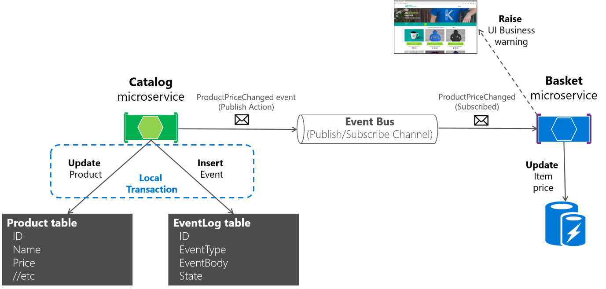
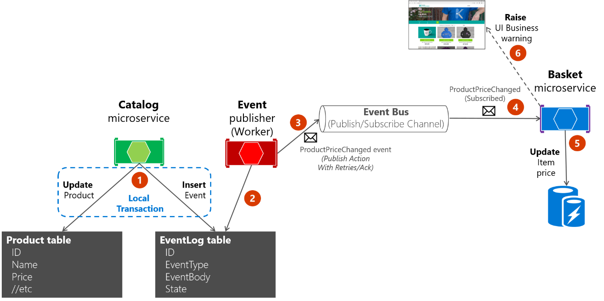
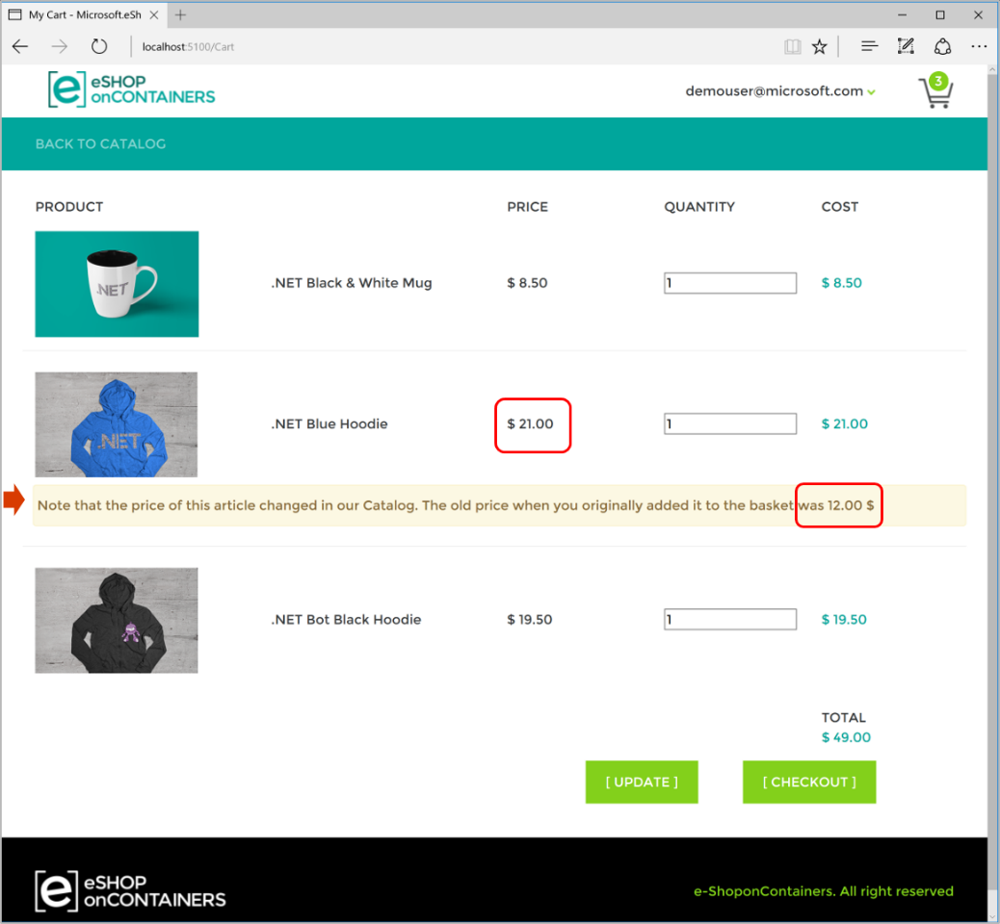

# Subscribing to events

The first step for using the event bus is to subscribe the microservices to the events they want to receive. That should be done in the receiver microservices.

The following simple code shows what each receiver microservice needs to implement when starting the service (that is, in the `Startup` class) so it subscribes to the events it needs. In this case, the `basket.api` microservice needs to subscribe to `ProductPriceChangedIntegrationEvent` and the `OrderStartedIntegrationEvent` messages. 

For instance, when subscribing to the `ProductPriceChangedIntegrationEvent` event, that makes the basket microservice aware of any changes to the product price and lets it warn the user about the change if that product is in the user’s basket.

```csharp
var eventBus = app.ApplicationServices.GetRequiredService<IEventBus>();

eventBus.Subscribe<ProductPriceChangedIntegrationEvent, 
                   ProductPriceChangedIntegrationEventHandler>();

eventBus.Subscribe<OrderStartedIntegrationEvent, 
                   OrderStartedIntegrationEventHandler>();

```

After this code runs, the subscriber microservice will be listening through RabbitMQ channels. When any message of type ProductPriceChangedIntegrationEvent arrives, the code invokes the event handler that is passed to it and processes the event.

## Publishing events through the event bus

Finally, the message sender (origin microservice) publishes the integration events with code similar to the following example. (This is a simplified example that does not take atomicity into account.) You would implement similar code whenever an event must be propagated across multiple microservices, usually right after committing data or transactions from the origin microservice.

First, the event bus implementation object (based on RabbitMQ or based on a service bus) would be injected at the controller constructor, as in the following code:

```csharp
[Route("api/v1/[controller]")]
public class CatalogController : ControllerBase
{
    private readonly CatalogContext _context;
    private readonly IOptionsSnapshot<Settings> _settings;
    private readonly IEventBus _eventBus;

    public CatalogController(CatalogContext context,
        IOptionsSnapshot<Settings> settings,
        IEventBus eventBus)
    {
        _context = context;
        _settings = settings;
        _eventBus = eventBus;
    }
    // ...
}
```

Then you use it from your controller’s methods, like in the UpdateProduct method:

```csharp
[Route("update")]
[HttpPost]
public async Task<IActionResult> UpdateProduct([FromBody]CatalogItem product)
{
    var item = await _context.CatalogItems.SingleOrDefaultAsync(
        i => i.Id == product.Id);
    // ...
    if (item.Price != product.Price)
    {
        var oldPrice = item.Price;
        item.Price = product.Price;
        _context.CatalogItems.Update(item);
        var @event = new ProductPriceChangedIntegrationEvent(item.Id,
            item.Price,
            oldPrice);
        // Commit changes in original transaction
        await _context.SaveChangesAsync();
        // Publish integration event to the event bus
        // (RabbitMQ or a service bus underneath)
        _eventBus.Publish(@event);
        // ...
    }
    // ...
}
```

In this case, since the origin microservice is a simple CRUD microservice, that code is placed right into a Web API controller. 
 
In more advanced microservices, like when using CQRS approaches, it can be implemented in the `CommandHandler` class, within the `Handle()` method. 


### Designing atomicity and resiliency when publishing to the event bus

When you publish integration events through a distributed messaging system like your event bus, you have the problem of atomically updating the original database and publishing an event. For instance, in the simplified example shown earlier, the code commits data to the database when the product price is changed and then publishes a ProductPriceChangedIntegrationEvent message. Initially, it might look essential that these two operations be performed atomically. However, if you are using a distributed transaction involving the database and the message broker, as you do in older systems like [Microsoft Message Queuing (MSMQ)](https://msdn.microsoft.com/library/ms711472(v=vs.85).aspx), this is not recommended for the reasons described by the [CAP theorem](https://www.quora.com/What-Is-CAP-Theorem-1).

Basically, you use microservices to build scalable and highly available systems. Simplifying somewhat, the CAP theorem says that you cannot build a database (or a microservice that owns its model) that is continually available, strongly consistent, *and* tolerant to any partition. You must choose two of these three properties.

In microservices-based architectures, you should choose availability and tolerance, and you should deemphasize strong consistency. Therefore, in most modern microservice-based applications, you usually do not want to use distributed transactions in messaging, as you do when you implement [distributed transactions](https://msdn.microsoft.com/library/ms978430.aspx#bdadotnetasync2_topic3c) based on the Windows Distributed Transaction Coordinator (DTC) with [MSMQ](https://msdn.microsoft.com/library/ms711472(v=vs.85).aspx).

Let’s go back to the initial issue and its example. If the service crashes after the database is updated (in this case, right after the line of code with \_context.SaveChangesAsync()), but before the integration event is published, the overall system could become inconsistent. This might be business critical, depending on the specific business operation you are dealing with.

As mentioned earlier in the architecture section, you can have several approaches for dealing with this issue:

-   Using the full [Event Sourcing pattern](https://msdn.microsoft.com/library/dn589792.aspx).

-   Using [transaction log mining](https://www.scoop.it/t/sql-server-transaction-log-mining).

-   Using the [Outbox pattern](http://gistlabs.com/2014/05/the-outbox/). This is a transactional table to store the integration events (extending the local transaction).

For this scenario, using the full Event Sourcing (ES) pattern is one of the best approaches, if not *the* best. However, in many application scenarios, you might not be able to implement a full ES system. ES means storing only domain events in your transactional database, instead of storing current state data. Storing only domain events can have great benefits, such as having the history of your system available and being able to determine the state of your system at any moment in the past. However, implementing a full ES system requires you to rearchitect most of your system and introduces many other complexities and requirements. For example, you would want to use a database specifically made for event sourcing, such as [Event Store](https://geteventstore.com/), or a document-oriented database such as Azure Cosmos DB, MongoDB, Cassandra, CouchDB, or RavenDB. ES is a great approach for this problem, but not the easiest solution unless you are already familiar with event sourcing.

The option to use transaction log mining initially looks very transparent. However, to use this approach, the microservice has to be coupled to your RDBMS transaction log, such as the SQL Server transaction log. This is probably not desirable. Another drawback is that the low-level updates recorded in the transaction log might not be at the same level as your high-level integration events. If so, the process of reverse-engineering those transaction log operations can be difficult.

A balanced approach is a mix of a transactional database table and a simplified ES pattern. You can use a state such as “ready to publish the event,” which you set in the original event when you commit it to the integration events table. You then try to publish the event to the event bus. If the publish-event action succeeds, you start another transaction in the origin service and move the state from “ready to publish the event” to “event already published.”

If the publish-event action in the event bus fails, the data still will not be inconsistent within the origin microservice—it is still marked as “ready to publish the event,” and with respect to the rest of the services, it will eventually be consistent. You can always have background jobs checking the state of the transactions or integration events. If the job finds an event in the “ready to publish the event” state, it can try to republish that event to the event bus.

Notice that with this approach, you are persisting only the integration events for each origin microservice, and only the events that you want to communicate to other microservices or external systems. In contrast, in a full ES system, you store all domain events as well.

Therefore, this balanced approach is a simplified ES system. You need a list of integration events with their current state (“ready to publish” versus “published”). But you only need to implement these states for the integration events. And in this approach, you do not need to store all your domain data as events in the transactional database, as you would in a full ES system.

If you are already using a relational database, you can use a transactional table to store integration events. To achieve atomicity in your application, you use a two-step process based on local transactions. Basically, you have an IntegrationEvent table in the same database where you have your domain entities. That table works as an insurance for achieving atomicity so that you include persisted integration events into the same transactions that are committing your domain data.

Step by step, the process goes like this: the application begins a local database transaction. It then updates the state of your domain entities and inserts an event into the integration event table. Finally, it commits the transaction. You get the desired atomicity.

When implementing the steps of publishing the events, you have these choices:

-   Publish the integration event right after committing the transaction and use another local transaction to mark the events in the table as being published. Then, use the table just as an artifact to track the integration events in case of issues in the remote microservices, and perform compensatory actions based on the stored integration events.

-   Use the table as a kind of queue. A separate application thread or process queries the integration event table, publishes the events to the event bus, and then uses a local transaction to mark the events as published.

Figure 8-22 shows the architecture for the first of these approaches.



**Figure 8-22**. Atomicity when publishing events to the event bus

The approach illustrated in Figure 8-22 is missing an additional worker microservice that is in charge of checking and confirming the success of the published integration events. In case of failure, that additional checker worker microservice can read events from the table and republish them.

About the second approach: you use the EventLog table as a queue and always use a worker microservice to publish the messages. In that case, the process is like that shown in Figure 8-23. This shows an additional microservice, and the table is the single source when publishing events.



**Figure 8-23**. Atomicity when publishing events to the event bus with a worker microservice

For simplicity, the eShopOnContainers sample uses the first approach (with no additional processes or checker microservices) plus the event bus. However, the eShopOnContainers is not handling all possible failure cases. In a real application deployed to the cloud, you must embrace the fact that issues will arise eventually, and you must implement that check and resend logic. Using the table as a queue can be more effective than the first approach if you have that table as a single source of events when publishing them through the event bus.

### Implementing atomicity when publishing integration events through the event bus

The following code shows how you can create a single transaction involving multiple DbContext objects—one context related to the original data being updated, and the second context related to the IntegrationEventLog table.

Note that the transaction in the example code below will not be resilient if connections to the database have any issue at the time when the code is running. This can happen in cloud-based systems like Azure SQL DB, which might move databases across servers. For implementing resilient transactions across multiple contexts, see the [Implementing resilient Entity Framework Core SQL connections](#implementing_resilient_EFCore_SQL_conns) section later in this guide.

For clarity, the following example shows the whole process in a single piece of code. However, the eShopOnContainers implementation is actually refactored and split this logic into multiple classes so it is easier to maintain.

```csharp
// Update Product from the Catalog microservice
//
public async Task<IActionResult> UpdateProduct([FromBody]CatalogItem productToUpdate) 
{
  var catalogItem = 
       await _catalogContext.CatalogItems.SingleOrDefaultAsync(i => i.Id == 
                                                               productToUpdate.Id); 
  if (catalogItem == null) return NotFound();

  bool raiseProductPriceChangedEvent = false; 
  IntegrationEvent priceChangedEvent = null; 

  if (catalogItem.Price != productToUpdate.Price) 
          raiseProductPriceChangedEvent = true; 

  if (raiseProductPriceChangedEvent) // Create event if price has changed
  {
      var oldPrice = catalogItem.Price; 
      priceChangedEvent = new ProductPriceChangedIntegrationEvent(catalogItem.Id,
                                                                  productToUpdate.Price, 
                                                                  oldPrice); 
  }
  // Update current product
  catalogItem = productToUpdate; 

  // Just save the updated product if the Product's Price hasn't changed.
  if !(raiseProductPriceChangedEvent) 
  {
      await _catalogContext.SaveChangesAsync();
  }
  else  // Publish to event bus only if product price changed
  {
        // Achieving atomicity between original DB and the IntegrationEventLog 
        // with a local transaction
        using (var transaction = _catalogContext.Database.BeginTransaction())
        {
           _catalogContext.CatalogItems.Update(catalogItem); 
           await _catalogContext.SaveChangesAsync();

           // Save to EventLog only if product price changed
           if(raiseProductPriceChangedEvent) 
               await _integrationEventLogService.SaveEventAsync(priceChangedEvent); 

           transaction.Commit();
        }   

      // Publish the intergation event through the event bus
      _eventBus.Publish(priceChangedEvent); 

      integrationEventLogService.MarkEventAsPublishedAsync(
                                                priceChangedEvent); 
  }

  return Ok();
}

```

After the ProductPriceChangedIntegrationEvent integration event is created, the transaction that stores the original domain operation (update the catalog item) also includes the persistence of the event in the EventLog table. This makes it a single transaction, and you will always be able to check whether event messages were sent.

The event log table is updated atomically with the original database operation, using a local transaction against the same database. If any of the operations fail, an exception is thrown and the transaction rolls back any completed operation, thus maintaining consistency between the domain operations and the event messages sent.

### Receiving messages from subscriptions: event handlers in receiver microservices

In addition to the event subscription logic, you need to implement the internal code for the integration event handlers (like a callback method). The event handler is where you specify where the event messages of a certain type will be received and processed.

An event handler first receives an event instance from the event bus. Then it locates the component to be processed related to that integration event, propagating and persisting the event as a change in state in the receiver microservice. For example, if a ProductPriceChanged event originates in the catalog microservice, it is handled in the basket microservice and changes the state in this receiver basket microservice as well, as shown in the following code.

```csharp
namespace Microsoft.eShopOnContainers.Services.Basket.API.IntegrationEvents.EventHandling
{
    public class ProductPriceChangedIntegrationEventHandler :
        IIntegrationEventHandler<ProductPriceChangedIntegrationEvent>
    {
        private readonly IBasketRepository _repository;

        public ProductPriceChangedIntegrationEventHandler(
            IBasketRepository repository)
        {
            _repository = repository;
        }

        public async Task Handle(ProductPriceChangedIntegrationEvent @event)
        {
            var userIds = await _repository.GetUsers();
            foreach (var id in userIds)
            {
                var basket = await _repository.GetBasket(id);
                await UpdatePriceInBasketItems(@event.ProductId, @event.NewPrice, basket);
            }
        }

        private async Task UpdatePriceInBasketItems(int productId, decimal newPrice,
            CustomerBasket basket)
        {
            var itemsToUpdate = basket?.Items?.Where(x => int.Parse(x.ProductId) ==
                productId).ToList();
            if (itemsToUpdate != null)
            {
                foreach (var item in itemsToUpdate)
                {
                    if(item.UnitPrice != newPrice)
                    {
                        var originalPrice = item.UnitPrice;
                        item.UnitPrice = newPrice;
                        item.OldUnitPrice = originalPrice;
                    }
                }
                await _repository.UpdateBasket(basket);
            }
        }
    }
}
```

The event handler needs to verify whether the product exists in any of the basket instances. It also updates the item price for each related basket line item. Finally, it creates an alert to be displayed to the user about the price change, as shown in Figure 8-24.



**Figure 8-24**. Displaying an item price change in a basket, as communicated by integration events

## Idempotency in update message events

An important aspect of update message events is that a failure at any point in the communication should cause the message to be retried. Otherwise a background task might try to publish an event that has already been published, creating a race condition. You need to make sure that the updates are either idempotent or that they provide enough information to ensure that you can detect a duplicate, discard it, and send back only one response.

As noted earlier, idempotency means that an operation can be performed multiple times without changing the result. In a messaging environment, as when communicating events, an event is idempotent if it can be delivered multiple times without changing the result for the receiver microservice. This may be necessary because of the nature of the event itself, or because of the way the system handles the event. Message idempotency is important in any application that uses messaging, not just in applications that implement the event bus pattern.

An example of an idempotent operation is a SQL statement that inserts data into a table only if that data is not already in the table. It does not matter how many times you run that insert SQL statement; the result will be the same—the table will contain that data. Idempotency like this can also be necessary when dealing with messages if the messages could potentially be sent and therefore processed more than once. For instance, if retry logic causes a sender to send exactly the same message more than once, you need to make sure that it is idempotent.

It is possible to design idempotent messages. For example, you can create an event that says "set the product price to \$25" instead of "add \$5 to the product price." You could safely process the first message any number of times and the result will be the same. That is not true for the second message. But even in the first case, you might not want to process the first event, because the system could also have sent a newer price-change event and you would be overwriting the new price.

Another example might be an order-completed event being propagated to multiple subscribers. It is important that order information be updated in other systems just once, even if there are duplicated message events for the same order-completed event.

It is convenient to have some kind of identity per event so that you can create logic that enforces that each event is processed only once per receiver.

Some message processing is inherently idempotent. For example, if a system generates image thumbnails, it might not matter how many times the message about the generated thumbnail is processed; the outcome is that the thumbnails are generated and they are the same every time. On the other hand, operations such as calling a payment gateway to charge a credit card may not be idempotent at all. In these cases, you need to ensure that processing a message multiple times has the effect that you expect.

### Additional resources

-   **Honoring message idempotency** (subhead on this page)
    [*https://msdn.microsoft.com/library/jj591565.aspx*](https://msdn.microsoft.com/library/jj591565.aspx)

## Deduplicating integration event messages

You can make sure that message events are sent and processed just once per subscriber at different levels. One way is to use a deduplication feature offered by the messaging infrastructure you are using. Another is to implement custom logic in your destination microservice. Having validations at both the transport level and the application level is your best bet.

### Deduplicating message events at the EventHandler level

One way to make sure that an event is processed just once by any receiver is by implementing certain logic when processing the message events in event handlers. For example, that is the approach used in the eShopOnContainers application, as you can see in the [source code](https://github.com/dotnet-architecture/eShopOnContainers/blob/master/src/Services/Ordering/Ordering.API/Controllers/OrdersController.cs) of the OrdersController class when it receives a CreateOrderCommand command. (In this case we use an HTTP request command, not a message-based command, but the logic you need to make a message-based command idempotent is similar.)

### Deduplicating messages when using RabbitMQ

When intermittent network failures happen, messages can be duplicated, and the message receiver must be ready to handle these duplicated messages. If possible, receivers should handle messages in an idempotent way, which is better than explicitly handling them with deduplication.

According to the [RabbitMQ documentation](https://www.rabbitmq.com/reliability.html#consumer), “If a message is delivered to a consumer and then requeued (because it was not acknowledged before the consumer connection dropped, for example) then RabbitMQ will set the redelivered flag on it when it is delivered again (whether to the same consumer or a different one).

If the “redelivered” flag is set, the receiver must take that into account, because the message might already have been processed. But that is not guaranteed; the message might never have reached the receiver after it left the message broker, perhaps because of network issues. On the other hand, if the “redelivered” flag is not set, it is guaranteed that the message has not been sent more than once. Therefore, the receiver needs to deduplicate messages or process messages in an idempotent way only if the “redelivered” flag is set in the message.

### Additional resources

-   **Forked eShopOnContainers using NServiceBus (Particular Software)**
    [*http://go.particular.net/eShopOnContainers*](http://go.particular.net/eShopOnContainers)

-   **Event Driven Messaging**
    [*http://soapatterns.org/design\_patterns/event\_driven\_messaging*](http://soapatterns.org/design_patterns/event_driven_messaging)

-   **Jimmy Bogard. Refactoring Towards Resilience: Evaluating Coupling**
    [*https://jimmybogard.com/refactoring-towards-resilience-evaluating-coupling/*](https://jimmybogard.com/refactoring-towards-resilience-evaluating-coupling/)

-   **Publish-Subscribe channel**
    [*http://www.enterpriseintegrationpatterns.com/patterns/messaging/PublishSubscribeChannel.html*](http://www.enterpriseintegrationpatterns.com/patterns/messaging/PublishSubscribeChannel.html)

-   **Communicating Between Bounded Contexts**
    [*https://msdn.microsoft.com/library/jj591572.aspx*](https://msdn.microsoft.com/library/jj591572.aspx)

-   **Eventual Consistency**
    [*https://en.wikipedia.org/wiki/Eventual\_consistency*](https://en.wikipedia.org/wiki/Eventual_consistency)

-   **Philip Brown. Strategies for Integrating Bounded Contexts**
    [*http://culttt.com/2014/11/26/strategies-integrating-bounded-contexts/*](http://culttt.com/2014/11/26/strategies-integrating-bounded-contexts/)

-   **Chris Richardson. Developing Transactional Microservices Using Aggregates, Event Sourcing and CQRS - Part 2**
    [*https://www.infoq.com/articles/microservices-aggregates-events-cqrs-part-2-richardson*](https://www.infoq.com/articles/microservices-aggregates-events-cqrs-part-2-richardson)

-   **Chris Richardson. Event Sourcing pattern**
    [*https://microservices.io/patterns/data/event-sourcing.html*](https://microservices.io/patterns/data/event-sourcing.html)

-   **Introducing Event Sourcing**
    [*https://msdn.microsoft.com/library/jj591559.aspx*](https://msdn.microsoft.com/library/jj591559.aspx)

-   **Event Store database**. Official site.
    [*https://geteventstore.com/*](https://geteventstore.com/)

-   **Patrick Nommensen. Event-Driven Data Management for Microservices**
    *<https://dzone.com/articles/event-driven-data-management-for-microservices-1> *

-   **The CAP Theorem**
    [*https://en.wikipedia.org/wiki/CAP\_theorem*](https://en.wikipedia.org/wiki/CAP_theorem)

-   **What is CAP Theorem?**
    [*https://www.quora.com/What-Is-CAP-Theorem-1*](https://www.quora.com/What-Is-CAP-Theorem-1)

-   **Data Consistency Primer**
    [*https://msdn.microsoft.com/library/dn589800.aspx*](https://msdn.microsoft.com/library/dn589800.aspx)

-   **Rick Saling. The CAP Theorem: Why “Everything is Different” with the Cloud and Internet**
    [*https://blogs.msdn.microsoft.com/rickatmicrosoft/2013/01/03/the-cap-theorem-why-everything-is-different-with-the-cloud-and-internet/*](https://blogs.msdn.microsoft.com/rickatmicrosoft/2013/01/03/the-cap-theorem-why-everything-is-different-with-the-cloud-and-internet/)

-   **Eric Brewer. CAP Twelve Years Later: How the "Rules" Have Changed**
    [*https://www.infoq.com/articles/cap-twelve-years-later-how-the-rules-have-changed*](https://www.infoq.com/articles/cap-twelve-years-later-how-the-rules-have-changed)

-   **Participating in External (DTC) Transactions** (MSMQ)
    [*https://msdn.microsoft.com/library/ms978430.aspx\#bdadotnetasync2\_topic3c*](https://msdn.microsoft.com/library/ms978430.aspx%23bdadotnetasync2_topic3c)

-   **Azure Service Bus. Brokered Messaging: Duplicate Detection**
    [*https://code.msdn.microsoft.com/Brokered-Messaging-c0acea25*](https://code.msdn.microsoft.com/Brokered-Messaging-c0acea25)

-   **Reliability Guide** (RabbitMQ documentation)
    [*https://www.rabbitmq.com/reliability.html\#consumer*](https://www.rabbitmq.com/reliability.html%23consumer)


>[!div class="step-by-step"]
[Previous] (rabbitmq-event-bus-development-test-environment.md)
[Next] (test-aspnet-core-services-web-apps.md)
