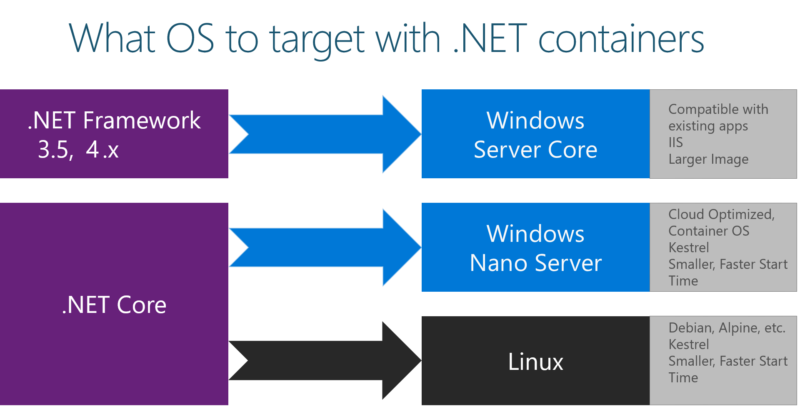

# What OS to target with .NET containers

Given the diversity of operating systems supported by Docker and the differences between .NET Framework and .NET Core, you should target a specific OS and specific versions depending on the framework you are using. 

For Windows, you can use Windows Server Core or Windows Nano Server. These Windows versions provide different characteristics (IIS in Windows Server Core versus a self-hosted web server like Kestrel in Nano Server) that might be needed by .NET Framework or .NET Core, respectively. 

For Linux, multiple distros are available and supported in official .NET Docker images (like Debian).

In Figure 3-1 you can see the possible OS version depending on the .NET framework used.

**Figure 3-1.** Operating systems to target depending on versions of the .NET framework

You can also create your own Docker image in cases where you want to use a different Linux distro or where you want an image with versions not provided by Microsoft. For example, you might create an image with ASP.NET Core running on the traditional .NET Framework and Windows Server Core, which is a not-so-common scenario for Docker.

When you add the image name to your Dockerfile file, you can select the operating system and version depending on the tag you use, as in the following examples:

-   microsoft/**dotnet:2.0.0-runtime-jessie**

        .NET Core 2.0 runtime-only on Linux

-   microsoft/**dotnet:2.0.0-runtime-nanoserver-1709** 

        .NET Core 2.0 runtime-only on Windows Nano Server (Windows Server 2016 Fall Creators Update version 1709)

-   microsoft/**aspnetcore:2.0**
    
        .NET Core 2.0 multi-architecture: Supports Linux and Windows Nano Server depending on the Docker host.
        The aspnetcore image has a few optimizations for ASP.NET Core. 

>[!div class="step-by-step"]
[Previous] (container-framework-choice-factors.md)
[Next] (official-net-docker-images.md)
