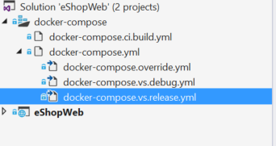

# Deploying Single-Container-Based .NET Core Web Applications on Linux or Windows Nano Server Hosts

*You can use Docker containers for monolithic deployment of simpler web applications. This improves continuous integration and continuous deployment pipelines and helps achieve deployment-to-production success. No more “It works in my machine, why does not work in production?”*

A microservices-based architecture has many benefits, but those benefits come at a cost of increased complexity. In some cases, the costs outweigh the benefits, and you will be better served with a monolithic deployment application running in a single container or in just a few containers. 

A monolithic application might not be easily decomposable into well-separated microservices. You have learned that these should be partitioned by function: microservices should work independently of each other to provide a more resilient application. If you cannot deliver feature slices of the application, separating it only adds complexity.

An application might not yet need to scale features independently. Let’s suppose that early in the life of our eShopOnContainers reference application, the traffic did not justify separating features into different microservices. Traffic was small enough that adding resources to one service typically meant adding resources to all services. The additional work to separate the application into discrete services provided minimal benefit.

Also, early in the development of an application you might not have a clear idea where the natural functional boundaries are. As you develop a minimum viable product, the natural separation might not yet have emerged.

Some of these conditions might be temporary. You might start by creating a monolithic application, and later separate some features to be developed and deployed as microservices. Other conditions might be essential to the application’s problem space, meaning that the application might never be broken into multiple microservices.

Separating an application into many discrete processes also introduces overhead. There is more complexity in separating features into different processes. The communication protocols become more complex. Instead of method calls, you must use asynchronous communications between services. As you move to a microservices architecture, you need to add many of the building blocks implemented in the microservices version of the eShopOnContainers application: event bus handling, message resiliency and retries, eventual consistency, and more.

A much-simplified version of eShopOnContainers (named [eShopWeb](https://github.com/dotnet-architecture/eShopOnContainers/tree/master/src/Web/WebMonolithic) and included in the same GitHub repo) runs as a monolithic MVC application, and as just described, there are advantages offered by that design choice. You can download the source for this application from GitHub and run it locally. Even this monolithic application benefits from being deployed in a container environment.

For one, the containerized deployment means that every instance of the application runs in the same environment. This includes the developer environment where early testing and development take place. The development team can run the application in a containerized environment that matches the production environment.

In addition, containerized applications scale out at lower cost. As you saw earlier, the container environment enables greater resource sharing than traditional VM environments.

Finally, containerizing the application forces a separation between the business logic and the storage server. As the application scales out, the multiple containers will all rely on a single physical storage medium. This would typically be a high-availability server running a SQL Server database.

## Application tour

The [eShopWeb](https://github.com/dotnet-architecture/eShopOnContainers/tree/master/src/Web/WebMonolithic) application represents some of the eShopOnContainers application running as a monolithic application—an ASP.NET Core MVC based application running on .NET Core. It mainly provides the catalog browsing capabilities that we described in earlier sections.

The application uses a SQL Server database for the catalog storage. In container-based deployments, this monolithic application can access the same data store as the microservices-based application. The application is configured to run SQL Server in a container alongside the monolithic application. In a production environment, SQL Server would run on a high-availability machine, outside of the Docker host. For convenience in a dev or test environment, we recommend running SQL Server in its own container.

The initial feature set only enables browsing the catalog. Updates would enable the full feature set of the containerized application. A more advanced monolithic web application architecture is described in the [ASP.NET Web Application architecture practices](https://aka.ms/webappebook) e-book and related [eShopOnWeb sample application](http://aka.ms/WebAppArchitecture), although in that case it is not running on Docker containers because that scenario focuses on plain web development with ASP.NET Core.

However, the simplified version available in eShopOnContainers (eShopWeb) runs in a Docker container.

## Docker support

The eShopOnWeb project runs on .NET Core. Therefore, it can run in either Linux-based or Windows-based containers. Note that for Docker deployment, you want to use the same host type for SQL Server. Linux-based containers allow a smaller footprint and are preferred.

Visual Studio provides a project template that adds support for Docker to a solution. You right-click the project, click **Add** followed by **Docker Support**. The template adds a Dockerfile to your project, and a new **docker-compose** project that provides a starter docker-compose.yml file. This step has already been done in the eShopOnWeb project downloaded from GitHub. You will see that the solution contains the **eShopOnWeb** project and the **docker-compose** project as shown in Figure 6-1.



**Figure 6-1**. The **docker-compose** project in a single-container web application

These files are standard docker-compose files, consistent with any Docker project. You can use them with Visual Studio or from the command line. This application runs on .NET Core and uses Linux containers, so you can also code, build, and run on a Mac or on a Linux machine.

The docker-compose.yml file contains information about what images to build and what containers to launch. The templates specify how to build the eshopweb image and launch the application’s containers. You need to add the dependency on SQL Server by including an image for it (for example, mssql-server-linux), and a service for the sql.data image for Docker to build and launch that container. These settings are shown in the following example:

```yml
version: '2'

services:
  eshopweb:
    image: eshop/web
    build:
    context: ./eShopWeb
    dockerfile: Dockerfile
    depends_on:
      - sql.data

  sql.data:
    image: microsoft/mssql-server-linux
```

The depends\_on directive tells Docker that the eShopWeb image depends on the sql.data image. Lines below that are the instructions to build an image tagged sql.data using the microsoft/mssql-server-linux image.

The **docker-compose** project displays the other docker-compose files under the main docker-compose.yml node to provide a visual indication that these files are related. The docker-compose-override.yml file contains settings for both services, such as connection strings and other application settings.

The following example shows the docker-compose.vs.debug.yml file, which contains settings used for debugging in Visual Studio. In that file, the eshopweb image has the dev tag appended to it. That helps separate debug from release images so that you do not accidentally deploy the debug information to a production environment:

```yml
version: '2'
  
services:
  eshopweb:
    image: eshop/web:dev
    build:
    args:
    source: ${DOCKER_BUILD_SOURCE}
    environment:
      - DOTNET_USE_POLLING_FILE_WATCHER=1
    volumes:
      - ./eShopWeb:/app
      - ~/.nuget/packages:/root/.nuget/packages:ro
      - ~/clrdbg:/clrdbg:ro
    entrypoint: tail -f /dev/null
    labels:
      - "com.microsoft.visualstudio.targetoperatingsystem=linux"
```

The last file added is docker-compose.ci.build.yml. This would be used from the command line to build the project from a CI server. This compose file starts a Docker container that builds the images needed for your application. The following example shows the contents of the docker-compose.ci.build.yml file.

```yml
version: '2'
  
services:
  ci-build:
    image: microsoft/aspnetcore-build:latest
    volumes:
      - .:/src
    working_dir: /src
  command: /bin/bash -c "dotnet restore ./eShopWeb.sln && dotnet publish  ./eShopWeb.sln -c Release -o ./obj/Docker/publish"
```

**Note**: Starting with .NET Core 2.0, the dotnet restore command executes automatically when dotnet publish is executed.

Notice that the image is an ASP.NET Core build image. That image includes the SDK and build tools to build your application and create the required images. Running the **docker-compose** project using this file starts the build container from the image, then builds your application’s image in that container. You specify that docker-compose file as part of the command line to build your application in a Docker container, then launch it.

In Visual Studio, you can run your application in Docker containers by selecting the **docker-compose** project as the startup project, and then pressing Ctrl+F5 (F5 to debug), as you can with any other application. When you start the **docker-compose** project, Visual Studio runs **docker-compose** using the docker-compose.yml file, the docker-compose.override.yml file, and one of the docker-compose.vs.\* files. Once the application has started, Visual Studio launches the browser for you.

If you launch the application in the debugger, Visual Studio will attach to the running application in Docker.

## Troubleshooting

This section describes a few issues that might arise when your run containers locally and suggests some fixes.

### Stopping Docker containers 

After you launch the containerized application, the containers continue to run, even after you have stopped debugging. You can run the docker ps command from the command line to see which containers are running. The docker stop command stops a running container, as shown in Figure 6-2.


**Figure 6-2**. Listing and stopping containers with the docker ps and docker stop CLI commands

You might need to stop running processes when you switch between different configurations. Otherwise, the container that is running the web application is using the port for your application (5106 in this example).

### Adding Docker to your projects

The wizard that adds Docker support communicates with the running Docker process. The wizard will not run correctly if Docker is not running when you start the wizard. In addition, the wizard examines your current container choice to add the correct Docker support. If you want to add support for Windows Containers, you need to run the wizard while you have Docker running with Windows Containers configured. If you want to add support for Linux containers, run the wizard while you have Docker running with Linux containers configured.

>[!div class="step-by-step"]
[Previous] (../docker-application-development-process/docker-app-development-workflow.md)
[Next] (../containerize-net-framework-applications/index.md)
