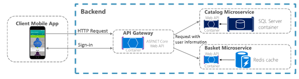
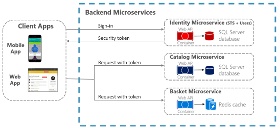

# Securing .NET Microservices and Web Applications

It is often necessary for resources and APIs exposed by a service to be limited to certain trusted users or clients. The first step to making these sorts of API-level trust decisions is authentication. Authentication is the process of reliably ascertaining a user’s identity.

In microservice scenarios, authentication is typically handled centrally. If you are using an API Gateway, the gateway is a good place to authenticate, as shown in Figure 11-1. If you use this approach, make sure that the individual microservices cannot be reached directly (without the API Gateway) unless additional security is in place to authenticate messages whether they come from the gateway or not.



**Figure 11-1**. Centralized authentication with an API Gateway

If services can be accessed directly, an authentication service like Azure Active Directory or a dedicated authentication microservice acting as a security token service (STS) can be used to authenticate users. Trust decisions are shared between services with security tokens or cookies. (These can be shared between applications, if needed, in ASP.NET Core with [data protection services](https://docs.microsoft.com/aspnet/core/security/data-protection/compatibility/cookie-sharing#sharing-authentication-cookies-between-applications).) This pattern is illustrated in Figure 11-2.



**Figure 11-2**. Authentication by identity microservice; trust is shared using an authorization token

## Authenticating using ASP.NET Core Identity

The primary mechanism in ASP.NET Core for identifying an application’s users is the [ASP.NET Core Identity](https://docs.microsoft.com/aspnet/core/security/authentication/identity) membership system. ASP.NET Core Identity stores user information (including sign-in information, roles, and claims) in a data store configured by the developer. Typically, the ASP.NET Core Identity data store is an Entity Framework store provided in the Microsoft.AspNetCore.Identity.EntityFrameworkCore package. However, custom stores or other third-party packages can be used to store identity information in Azure Table Storage, DocumentDB, or other locations.

The following code is taken from the ASP.NET Core Web Application project template with individual user account authentication selected. It shows how to configure ASP.NET Core Identity using EntityFramework.Core in the Startup.ConfigureServices method.

```csharp
services.AddDbContext<ApplicationDbContext>(options =>
    options.UseSqlServer(Configuration.GetConnectionString("DefaultConnection")));
    services.AddIdentity<ApplicationUser, IdentityRole>()
        .AddEntityFrameworkStores<ApplicationDbContext>()
        .AddDefaultTokenProviders();
```

Once ASP.NET Core Identity is configured, you enable it by calling app.UseIdentity in the service’s Startup.Configure method.

Using ASP.NET Code Identity enables several scenarios:

-   Create new user information using the UserManager type (userManager.CreateAsync).

-   Authenticate users using the SignInManager type. You can use signInManager.SignInAsync to sign in directly, or signInManager.PasswordSignInAsync to confirm the user’s password is correct and then sign them in.

-   Identify a user based on information stored in a cookie (which is read by ASP.NET Core Identity middleware) so that subsequent requests from a browser will include a signed-in user’s identity and claims.

ASP.NET Core Identity also supports [two-factor authentication](https://docs.microsoft.com/aspnet/core/security/authentication/2fa).

For authentication scenarios that make use of a local user data store and that persist identity between requests using cookies (as is typical for MVC web applications), ASP.NET Core Identity is a recommended solution.

## Authenticating using external providers

ASP.NET Core also supports using [external authentication providers](https://docs.microsoft.com/aspnet/core/security/authentication/social/) to let users log in via [OAuth 2.0](https://www.digitalocean.com/community/tutorials/an-introduction-to-oauth-2) flows. This means that users can log in using existing authentication processes from providers like Microsoft, Google, Facebook, or Twitter and associate those identities with an ASP.NET Core identity in your application.

To use external authentication, you include the appropriate authentication middleware in your application’s HTTP request processing pipeline. This middleware is responsible for handling requests to return URI routes from the authentication provider, capturing identity information, and making it available via the SignInManager.GetExternalLoginInfo method.

Popular external authentication providers and their associated NuGet packages are shown below.

**Microsoft:** Microsoft.AspNetCore.Authentication.MicrosoftAccount

**Google:** Microsoft.AspNetCore.Authentication.Google

**Facebook:** Microsoft.AspNetCore.Authentication.Facebook

**Twitter:** Microsoft.AspNetCore.Authentication.Twitter

In all cases, the middleware is registered with a call to a registration method similar to app.Use{ExternalProvider}Authentication in Startup.Configure. These registration methods take an options object that contains an application ID and secret information (a password, for instance), as needed by the provider. External authentication providers require the application to be registered (as explained in [ASP.NET Core documentation](https://docs.microsoft.com/aspnet/core/security/authentication/social/)) so that they can inform the user what application is requesting access to their identity.

Once the middleware is registered in Startup.Configure, you can prompt users to log in from any controller action. To do this, you create an AuthenticationProperties object that includes the authentication provider’s name and a redirect URL. You then return a Challenge response that passes the AuthenticationProperties object. The following code shows an example of this.

```csharp
var properties = _signInManager.ConfigureExternalAuthenticationProperties(provider,
    redirectUrl);
return Challenge(properties, provider);
```

The redirectUrl parameter includes the URL that the external provider should redirect to once the user has authenticated. The URL should represent an action that will sign the user in based on external identity information, as in the following simplified example:

```csharp
// Sign in the user with this external login provider if the user
// already has a login.
var result = await _signInManager.ExternalLoginSignInAsync(info.LoginProvider, info.ProviderKey, isPersistent: false);

if (result.Succeeded)
{
    return RedirectToLocal(returnUrl);
}
else
{
    ApplicationUser newUser = new ApplicationUser
    {
        // The user object can be constructed with claims from the
        // external authentication provider, combined with information
        // supplied by the user after they have authenticated with
        // the external provider.
        UserName = info.Principal.FindFirstValue(ClaimTypes.Name),
        Email = info.Principal.FindFirstValue(ClaimTypes.Email)
    };
    var identityResult = await _userManager.CreateAsync(newUser);
    if (identityResult.Succeeded)
    {
        identityResult = await _userManager.AddLoginAsync(newUser, info);
        if (identityResult.Succeeded)
        {
            await _signInManager.SignInAsync(newUser, isPersistent: false);
        }
        return RedirectToLocal(returnUrl);
    }
}
```

If you choose the **Individual User Account** authentication option when you create the ASP.NET Code web application project in Visual Studio, all the code necessary to sign in with an external provider is already in the project, as shown in Figure 11-3.


**Figure 11-3**. Selecting an option for using external authentication when creating a web application project

In addition to the external authentication providers listed previously, third-party packages are available that provide middleware for using many more external authentication providers. For a list, see the [AspNet.Security.OAuth.Providers](https://github.com/aspnet-contrib/AspNet.Security.OAuth.Providers/tree/dev/src) repo on GitHub.

It is also possible, of course, to create your own external authentication middleware.

## Authenticating with bearer tokens

Authenticating with ASP.NET Core Identity (or Identity plus external authentication providers) works well for many web application scenarios in which storing user information in a cookie is appropriate. In other scenarios, though, cookies are not a natural means of persisting and transmitting data.

For example, in an ASP.NET Core Web API that exposes RESTful endpoints that might be accessed by Single Page Applications (SPAs), by native clients, or even by other Web APIs, you typically want to use bearer token authentication instead. These types of applications do not work with cookies, but can easily retrieve a bearer token and include it in the authorization header of subsequent requests. To enable token authentication, ASP.NET Core supports several options for using [OAuth 2.0](https://oauth.net/2/) and [OpenID Connect](https://openid.net/connect/).

## Authenticating with an OpenID Connect or OAuth 2.0 Identity provider

If user information is stored in Azure Active Directory or another identity solution that supports OpenID Connect or OAuth 2.0, you can use the Microsoft.AspNetCore.Authentication.OpenIdConnect package to authenticate using the OpenID Connect workflow. For example, to [authenticate against Azure Active Directory](https://azure.microsoft.com/resources/samples/active-directory-dotnet-webapp-openidconnect-aspnetcore/), an ASP.NET Core web application can use middleware from that package as shown in the following example:

```csharp
// Configure the OWIN pipeline to use OpenID Connect auth
app.UseOpenIdConnectAuthentication(new OpenIdConnectOptions
{
    ClientId = Configuration["AzureAD:ClientId"],
    Authority = String.Format(Configuration["AzureAd:AadInstance"],
    Configuration["AzureAd:Tenant"]),
    ResponseType = OpenIdConnectResponseType.IdToken,
    PostLogoutRedirectUri = Configuration["AzureAd:PostLogoutRedirectUri"]
});
```

The configuration values are Azure Active Directory values that are created when your application is [registered as an Azure AD client](https://docs.microsoft.com/azure/active-directory/develop/active-directory-authentication-scenarios#basics-of-registering-an-application-in-azure-ad). A single client ID can be shared among multiple microservices in an application if they all need to authenticate users authenticated via Azure Active Directory.

Note that when you use this workflow, the ASP.NET Core Identity middleware is not needed, because all user information storage and authentication is handled by Azure Active Directory.

## Issuing security tokens from an ASP.NET Core service

If you prefer to issue security tokens for local ASP.NET Core Identity users rather than using an external identity provider, you can take advantage of some good third-party libraries.

[IdentityServer4](https://github.com/IdentityServer/IdentityServer4) and [OpenIddict](https://github.com/openiddict/openiddict-core) are OpenID Connect providers that integrate easily with ASP.NET Core Identity to let you issue security tokens from an ASP.NET Core service. The [IdentityServer4 documentation](https://identityserver4.readthedocs.io/en/release/) has in-depth instructions for using the library. However, the basic steps to using IdentityServer4 to issue tokens are as follows.

1.  You call app.UseIdentityServer in the Startup.Configure method to add IdentityServer4 to the application’s HTTP request processing pipeline. This lets the library serve requests to OpenID Connect and OAuth2 endpoints like /connect/token.

2.  You configure IdentityServer4 in Startup.ConfigureServices by making a call to services.AddIdentityServer.

3.  You configure identity server by providing the following data:

-   The [credentials](https://identityserver4.readthedocs.io/en/release/topics/crypto.html) to use for signing.

-   The [Identity and API resources](https://identityserver4.readthedocs.io/en/release/topics/resources.html) that users might request access to:

<!-- -->

-   API resources represent protected data or functionality that a user can access with an access token. An example of an API resource would be a web API (or set of APIs) that requires authorization.

-   Identity resources represent information (claims) that are given to a client to identify a user. The claims might include the user name, email address, and so on.

<!-- -->

-   The [clients](https://identityserver4.readthedocs.io/en/release/topics/clients.html) that will be connecting in order to request tokens.

-   The storage mechanism for user information, such as [ASP.NET Core Identity](https://identityserver4.readthedocs.io/en/release/quickstarts/6_aspnet_identity.html) or an alternative.

When you specify clients and resources for IdentityServer4 to use, you can pass an IEnumerable&lt;T&gt; collection of the appropriate type to methods that take in-memory client or resource stores. Or for more complex scenarios, you can provide client or resource provider types via Dependency Injection.

A sample configuration for IdentityServer4 to use in-memory resources and clients provided by a custom IClientStore type might look like the following example:

```csharp
// Add IdentityServer services
services.AddSingleton<IClientStore, CustomClientStore>();
services.AddIdentityServer()
    .AddSigningCredential("CN=sts")
    .AddInMemoryApiResources(MyApiResourceProvider.GetAllResources())
    .AddAspNetIdentity<ApplicationUser>();
```

## Consuming security tokens

Authenticating against an OpenID Connect endpoint or issuing your own security tokens covers some scenarios. But what about a service that simply needs to limit access to those users who have valid security tokens that were provided by a different service?

For that scenario, authentication middleware that handles JWT tokens is available in the Microsoft.AspNetCore.Authentication.JwtBearer package. JWT stands for "[JSON Web Token](https://tools.ietf.org/html/rfc7519)" and is a common security token format (defined by RFC 7519) for communicating security claims. A simple example of how to use middleware to consume such tokens might look like the following example. This code must precede calls to ASP.NET Core MVC middleware (app.UseMvc).

```csharp
app.UseJwtBearerAuthentication(new JwtBearerOptions()
{
    Audience = "http://localhost:5001/",
    Authority = "http://localhost:5000/",
    AutomaticAuthenticate = true
});
```

The parameters in this usage are:

-   Audience represents the receiver of the incoming token or the resource that the token grants access to. If the value specified in this parameter does not match the aud parameter in the token, the token will be rejected.

-   Authority is the address of the token-issuing authentication server. The JWT bearer authentication middleware uses this URI to get the public key that can be used to validate the token's signature. The middleware also confirms that the iss parameter in the token matches this URI.

-   AutomaticAuthenticate is a Boolean value that indicates whether the user defined by the token should be automatically signed in.

Another parameter, RequireHttpsMetadata, is not used in this example. It is useful for testing purposes; you set this parameter to false so that you can test in environments where you do not have certificates. In real-world deployments, JWT bearer tokens should always be passed only over HTTPS.

With this middleware in place, JWT tokens are automatically extracted from authorization headers. They are then deserialized, validated (using the values in the Audience and Authority parameters), and stored as user information to be referenced later by MVC actions or authorization filters.

The JWT bearer authentication middleware can also support more advanced scenarios, such as using a local certificate to validate a token if the authority is not available. For this scenario, you can specify a TokenValidationParameters object in the JwtBearerOptions object.

## Additional resources

-   **Sharing cookies between applications**
    [*https://docs.microsoft.com/aspnet/core/security/data-protection/compatibility/cookie-sharing\#sharing-authentication-cookies-between-applications*](https://docs.microsoft.com/aspnet/core/security/data-protection/compatibility/cookie-sharing#sharing-authentication-cookies-between-applications)

-   **Introduction to Identity**
    [*https://docs.microsoft.com/aspnet/core/security/authentication/identity*](https://docs.microsoft.com/aspnet/core/security/authentication/identity)

-   **Rick Anderson. Two-factor authentication with SMS**
    [*https://docs.microsoft.com/aspnet/core/security/authentication/2fa*](https://docs.microsoft.com/aspnet/core/security/authentication/2fa)

-   **Enabling authentication using Facebook, Google and other external providers**
    [*https://docs.microsoft.com/aspnet/core/security/authentication/social/*](https://docs.microsoft.com/aspnet/core/security/authentication/social/)

-   **Michell Anicas. An Introduction to OAuth 2**
    [*https://www.digitalocean.com/community/tutorials/an-introduction-to-oauth-2*](https://www.digitalocean.com/community/tutorials/an-introduction-to-oauth-2)

-   **AspNet.Security.OAuth.Providers** (GitHub repo for ASP.NET OAuth providers.
    [*https://github.com/aspnet-contrib/AspNet.Security.OAuth.Providers/tree/dev/src*](https://github.com/aspnet-contrib/AspNet.Security.OAuth.Providers/tree/dev/src)

-   **Danny Strockis. Integrating Azure AD into an ASP.NET Core web app**
    [*https://azure.microsoft.com/resources/samples/active-directory-dotnet-webapp-openidconnect-aspnetcore/*](https://azure.microsoft.com/resources/samples/active-directory-dotnet-webapp-openidconnect-aspnetcore/)

-   **IdentityServer4. Official documentation**
    [*https://identityserver4.readthedocs.io/en/release/*](https://identityserver4.readthedocs.io/en/release/)


>[!div class="step-by-step"]
[Previous] (../implement-resilient-applications/monitor-app-health.md)
[Next] (authorization-net-microservices-web-applications.md)
