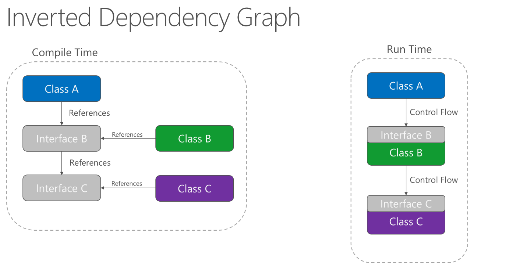

# Architectural Principles

> "If builders built buildings the way programmers wrote programs, then the first woodpecker that came along would destroy civilization."  
> _\- Gerald Weinberg_

## Summary

You should architect and design software solutions with maintainability in mind. The principles outlined in this section can help guide you toward architectural decisions that will result in clean, maintainable applications. Generally, these principles will guide you toward building applications out of discrete components that are not tightly coupled to other parts of your application, but rather communicate through explicit interfaces or messaging systems.

## Common design principles

### Separation of Concerns

A guiding principle when developing is **Separation of Concerns**. This principle asserts that software should be separated based on the kinds of work it performs. For instance, consider an application that includes logic for identifying noteworthy items to display to the user, and which formats such items in a particular way to make them more noticeable. The behavior responsible for choosing which items to format should be kept separate from the behavior responsible for formatting the items, since these are separate concerns that are only coincidentally related to one another.

Architecturally, applications can be logically built to follow this principle by separating core business behavior from infrastructure and user interface logic. Ideally, business rules and logic should reside in a separate project, which should not depend on other projects in the application. This helps ensure that the business model is easy to test and can evolve without being tightly coupled to low-level implementation details. Separation of concerns is a key consideration behind the use of layers in application architectures.

### Encapsulation

Different parts of an application should use **encapsulation** to insulate them from other parts of the application. Application components and layers should be able to adjust their internal implementation without breaking their collaborators as long as external contracts are not violated. Proper use of encapsulation helps achieve loose coupling and modularity in application designs, since objects and packages can be replaced with alternative implementations so long as the same interface is maintained.

In classes, encapsulation is achieved by limiting outside access to the class's internal state. If an outside actor wants to manipulate the state of the object, it should do so through a well-defined function (or property setter), rather than having direct access to the private state of the object. Likewise, application components and applications themselves should expose well-defined interfaces for their collaborators to use, rather than allowing their state to be modified directly. This frees the application's internal design to evolve over time without worrying that doing so will break collaborators, so long as the public contracts are maintained.

### Dependency Inversion

The direction of dependency within the application should be in the direction of abstraction, not implementation details. Most applications are written such that compile-time dependency flows in the direction of runtime execution. This produces a direct dependency graph. That is, if module A calls a function in module B, which calls a function in module C, then at compile time A will depend on B which will depend on C, as shown in Figure 4-1.

**Figure 4-1.** Direct dependency graph.

Applying the dependency inversion principle allows A to call methods on an abstraction that B implements, making it possible for A to call B at runtime, but for B to depend on an interface controlled by A at compile time (thus, *inverting* the typical compile-time dependency). At run time, the flow of program execution remains unchanged, but the introduction of interfaces means that different implementations of these interfaces can easily be plugged in.

**Figure 4-2.** Inverted dependency graph.

**Dependency inversion** is a key part of building loosely-coupled applications, since implementation details can be written to depend on and implement higher level abstractions, rather than the other way around. The resulting applications are more testable, modular, and maintainable as a result. The practice of *dependency injection* is made possible by following the dependency inversion principle.

### Explicit Dependencies

**Methods and classes should explicitly require any collaborating objects they need in order to function correctly.** Class constructors provide an opportunity for classes to identify the things they need in order to be in a valid state and to function properly. If you define classes that can be constructed and called, but which will only function properly if certain global or infrastructure components are in place, these classes are being *dishonest* with their clients. The constructor contract is telling the client that it only needs the things specified (possibly nothing if the class is just using a default constructor), but then at runtime it turns out the object really did need something else.

By following the explicit dependencies principle, your classes and methods are being honest with their clients about what they need in order to function. This makes your code more self-documenting and your coding contracts more user-friendly, since users will come to trust that as long as they provide what's required in the form of method or constructor parameters, the objects they're working with will behave correctly at runtime.

### Single Responsibility

The single responsibility principle applies to object-oriented design, but can also be considered as an architectural principle similar to separation of concerns. It states that objects should have only one responsibility and that they should have only one reason to change. Specifically, the only situation in which the object should change is if the manner in which it performs its one responsibility must be updated. Following this principle helps to produce more loosely-coupled and modular systems, since many kinds of new behavior can be implemented as new classes, rather than by adding additional responsibility to existing classes. Adding new classes is always safer than changing existing classes, since no code yet depends on the new classes.

In a monolithic application, we can apply the single responsibility principle at a high level to the layers in the application. Presentation responsibility should remain in the UI project, while data access responsibility should be kept within an infrastructure project. Business logic should be kept in the application core project, where it can be easily tested and can evolve independently from other responsibilities.

When this principle is applied to application architecture, and taken to its logical endpoint, you get microservices. A given microservice should have a single responsibility. If you need to extend the behavior of a system, it's usually better to do it by adding additional microservices, rather than by adding responsibility to an existing one.

[Learn more about microservices architecture](http://aka.ms/MicroservicesEbook)

### Don't Repeat Yourself (DRY)

The application should avoid specifying behavior related to a particular concept in multiple places as this is a frequent source of errors. At some point, a change in requirements will require changing this behavior and the likelihood that at least one instance of the behavior will fail to be updated will result in inconsistent behavior of the system.

Rather than duplicating logic, encapsulate it in a programming construct. Make this construct the single authority over this behavior, and have any other part of the application that requires this behavior use the new construct.

> [!NOTE]
> Avoid binding together behavior that is only coincidentally repetitive. For example, just because two different constants both have the same value, that doesn't mean you should have only one constant, if conceptually they're referring to different things.

### Persistence Ignorance

**Persistence ignorance** (PI) refers to types that need to be persisted, but whose code is unaffected by the choice of persistence technology. Such types in .NET are sometimes referred to as Plain Old CLR Objects (POCOs), because they do not need to inherit from a particular base class or implement a particular interface. Persistence ignorance is valuable because it allows the same business model to be persisted in multiple ways, offering additional flexibility to the application. Persistence choices might change over time, from one database technology to another, or additional forms of persistence might be required in addition to whatever the application started with (for example, using a Redis cache or Azure DocumentDb in addition to a relational database).

Some examples of violations of this principle include:

-   A required base class

-   A required interface implementation

-   Classes responsible for saving themselves (such as the Active Record pattern)

-   Required default constructor

-   Properties requiring virtual keyword

-   Persistence-specific required attributes

The requirement that classes have any of the above features or behaviors adds coupling between the types to be persisted and the choice of persistence technology, making it more difficult to adopt new data access strategies in the future.

### Bounded Contexts

**Bounded contexts** are a central pattern in Domain-Driven Design. They provide a way of tackling complexity in large applications or organizations by breaking it up into separate conceptual modules. Each conceptual module then represents a context which is separated from other contexts (hence, bounded), and can evolve independently. Each bounded context should ideally be free to choose its own names for concepts within it, and should have exclusive access to its own persistence store.

At a minimum, individual web applications should strive to be their own bounded context, with their own persistence store for their business model, rather than sharing a database with other applications. Communication between bounded contexts occurs through programmatic interfaces, rather than through a shared database, which allows for business logic and events to take place in response to changes that take place. Bounded contexts map closely to microservices, which also are ideally implemented as their own individual bounded contexts.

> ### References – Modern Web Applications
> - **Separation of Concerns**  
> <http://deviq.com/separation-of-concerns/>
> - **Encapsulation** <http://deviq.com/encapsulation/>
> - **Dependency Inversion Principle**  
> <http://deviq.com/dependency-inversion-principle/>
> - **Explicit Dependencies Principle**  
> <http://deviq.com/explicit-dependencies-principle/>
> - **Don't Repeat Yourself**  
> <http://deviq.com/don-t-repeat-yourself/>
> - **Persistence Ignorance**  
> <http://deviq.com/persistence-ignorance/>
> - **Bounded Context**  
> <https://martinfowler.com/bliki/BoundedContext.html>

> [!div class="step-by-step"]
[Previous] (choose-between-traditional-web-and-single-page-apps.md)
[Next] (common-web-application-architectures.md)
