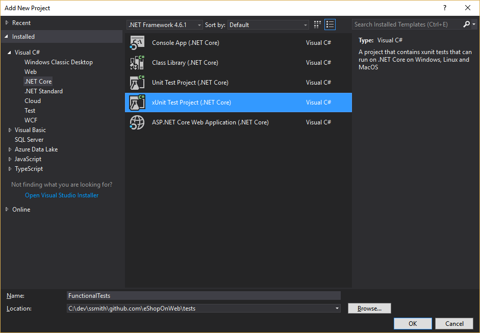

# Test ASP.NET Core MVC Apps

> _"If you don't like unit testing your product, most likely your customers won't like to test it, either."_
> _- Anonymous-

## Summary

Software of any complexity can fail in unexpected ways in response to changes. Thus, testing after making changes is required for all but the most trivial (or least critical) applications. Manual testing is the slowest, least reliable, most expensive way to test software. Unfortunately, if applications are not designed to be testable, it can be the only means available. Applications written following the architectural principles laid out in chapter X should be unit testable, and ASP.NET Core applications support automated integration and functional testing as well.

## Kinds of Automated Tests

There are many kinds of automated tests for software applications. The simplest, lowest level test is the unit test. At a slightly higher level there are integration tests and functional tests. Other kinds of tests, like UI tests, load tests, stress tests, and smoke tests, are beyond the scope of this document.

### Unit Tests

A unit test tests a single part of your application's logic. One can further describe it by listing some of the things that it isn't. A unit test doesn't test how your code works with dependencies or infrastructure – that's what integration tests are for. A unit test doesn't test the framework your code is written on – you should assume it works or, if you find it doesn't, file a bug and code a workaround. A unit test runs completely in memory and in process. It doesn't communicate with the file system, the network, or a database. Unit tests should only test your code.

Unit tests, by virtue of the fact that they test only a single unit of your code, with no external dependencies, should execute extremely quickly. Thus, you should be able to run test suites of hundreds of unit tests in a few seconds. Run them frequently, ideally before every push to a shared source control repository, and certainly with every automated build on your build server.

### Integration Tests

Although it's a good idea to encapsulate your code that interacts with infrastructure like databases and file systems, you will still have some of that code, and you will probably want to test it. Additionally, you should verify that your code's layers interact as you expect when your application's dependencies are fully resolved. This is the responsibility of integration tests. Integration tests tend to be slower and more difficult to set up than unit tests, because they often depend on external dependencies and infrastructure. Thus, you should avoid testing things that could be tests with unit tests in integration tests. If you can test a given scenario with a unit test, you should test it with a unit test. If you can't, then consider using an integration test.

Integration tests will often have more complex setup and teardown procedures than unit tests. For example, an integration test that goes against an actual database will need a way to return the database to a known state before each test run. As new tests are added and the production database schema evolves, these test scripts will tend to grow in size and complexity. In many large systems, it is impractical to run full suites of integration tests on developer workstations before checking in changes to shared source control. In these cases, integration tests may be run on a build server.

The LocalFileImageService implementation class implements the logic for fetching and returning the bytes of an image file from a particular folder given an id:

```cs
public class LocalFileImageService : IImageService
{
    private readonly IHostingEnvironment _env;
    public LocalFileImageService(IHostingEnvironment env)
    {
        _env = env;
    }
    public byte[] GetImageBytesById(int id)
    {
        try
        {
            var contentRoot = _env.ContentRootPath + "//Pics";
            var path = Path.Combine(contentRoot, id + ".png");
            return File.ReadAllBytes(path);
```

### Functional Tests

Integration tests are written from the perspective of the developer, to verify that some components of the system work correctly together. Functional tests are written from the perspective of the user, and verify the correctness of the system based on its requirements. The following excerpt offers a useful analogy for how to think about functional tests, compared to unit tests:

> "Many times the development of a system is likened to the building of a house. While this analogy isn't quite correct, we can extend it for the purposes of understanding the difference between unit and functional tests. Unit testing is analogous to a building inspector visiting a house's construction site. He is focused on the various internal systems of the house, the foundation, framing, electrical, plumbing, and so on. He ensures (tests) that the parts of the house will work correctly and safely, that is, meet the building code. Functional tests in this scenario are analogous to the homeowner visiting this same construction site. He assumes that the internal systems will behave appropriately, that the building inspector is performing his task. The homeowner is focused on what it will be like to live in this house. He is concerned with how the house looks, are the various rooms a comfortable size, does the house fit the family's needs, are the windows in a good spot to catch the morning sun. The homeowner is performing functional tests on the house. He has the user's perspective. The building inspector is performing unit tests on the house. He has the builder's perspective."

Source: [Unit Testing versus Functional Tests](http://www.softwaretestingtricks.com/2007/01/unit-testing-versus-functional-tests.html)

I'm fond of saying "As developers, we fail in two ways: we build the thing wrong, or we build the wrong thing." Unit tests ensure you are building the thing right; functional tests ensure you are building the right thing.

Since functional tests operate at the system level, they may require some degree of UI automation. Like integration tests, they usually work with some kind of test infrastructure as well. This makes them slower and more brittle than unit and integration tests. You should have only as many functional tests as you need to be confident the system is behaving as users expect.

### Testing Pyramid

Martin Fowler wrote about the testing pyramid, an example of which is shown in Figure 9-1.


Figure 9-1 Testing Pyramid

The different layers of the pyramid, and their relative sizes, represent different kinds of tests and how many you should write for your application. As you can see, the recommendation is to have a large base of unit tests, supported by a smaller layer of integration tests, with an even smaller layer of functional tests. Each layer should ideally only have tests in it that cannot be performed adequately at a lower layer. Keep the testing pyramid in mind when you are trying to decide which kind of test you need for a particular scenario.

### What to Test

A common problem for developers who are inexperienced with writing automated tests is coming up with what to test. A good starting point is to test conditional logic. Anywhere you have a method with behavior that changes based on a conditional statement (if-else, switch, etc.), you should be able to come up at least a couple of tests that confirm the correct behavior for certain conditions. If your code has error conditions, it's good to write at least one test for the "happy path" through the code (with no errors), and at least one test for the "sad path" (with errors or atypical results) to confirm your application behaves as expected in the face of errors. Finally, try to focus on testing things that can fail, rather than focusing on metrics like code coverage. More code coverage is better than less, generally. However, writing a few more tests of a very complex and business-critical method is usually a better use of time than writing tests for auto-properties just to improve test code coverage metrics.

## Organizing Test Projects

Test projects can be organized however works best for you. It's a good idea to separate tests by type (unit test, integration test) and by what they are testing (by project, by namespace). Whether this separation consists of folders within a single test project, or multiple test projects, is a design decision. One project is simplest, but for large projects with many tests, or in order to more easily run different sets of tests, you might want to have several different test projects. Many teams organize test projects based on the project they are testing, which for applications with more than a few projects can result in a large number of test projects, especially if you still break these down according to what kind of tests are in each project. A compromise approach is to have one project per kind of test, per application, with folders inside the test projects to indicate the project (and class) being tested.

A common approach is to organize the application projects under a ‘src' folder, and the application's test projects under a parallel ‘tests' folder. You can create matching solution folders in Visual Studio, if you find this organization useful.


Figure 9-2 Test organization in your solution

You can use whichever test framework you prefer. The xUnit framework works well and is what all of the ASP.NET Core and EF Core tests are written in. You can add an xUnit test project in Visual Studio using the template shown in Figure 9-3, or from the CLI using dotnet new xunit.



Figure 9-3 Add an xUnit Test Project in Visual Studio

### Test Naming

You should name your tests in a consistent fashion, with names that indicate what each test does. One approach I've had great success with is to name test classes according to the class and method they are testing. This results in many small test classes, but it makes it extremely clear what each test is responsible for. With the test class name set up to identify the class and method to be tested, the test method name can be used to specify the behavior being tested. This should include the expected behavior and any inputs or assumptions that should yield this behavior. Some example test names:

-   CatalogControllerGetImage.CallsImageServiceWithId

-   CatalogControllerGetImage.LogsWarningGivenImageMissingException

-   CatalogControllerGetImage.ReturnsFileResultWithBytesGivenSuccess

-   CatalogControllerGetImage.ReturnsNotFoundResultGivenImageMissingException

A variation of this approach ends each test class name with "Should" and modifies the tense slightly:

-   CatalogControllerGetImage**Should**.**Call**ImageServiceWithId

-   CatalogControllerGetImage**Should**.**Log**WarningGivenImageMissingException

Some teams find the second naming approach clearer, though slightly more verbose. In any case, try to use a naming convention that provides insight into test behavior, so that when one or more tests fail, it's obvious from their names what cases have failed. Avoid naming you tests vaguely, such as ControllerTests.Test1, as these offer no value when you see them in test results.

If you follow a naming convention like the one above that produces many small test classes, it's a good idea to further organize your tests using folders and namespaces. Figure 9-4 shows one approach to organizing tests by folder within several test projects.


**Figure 9-4.** Organizing test classes by folder based on class being tested.

Of course, if a particular application class has many methods being tested (and thus many test classes), it may make sense to place these in a folder corresponding to the application class. This organization is no different than how you might organize files into folders elsewhere. If you have more than three or four related files in a folder containing many other files, it's often helpful to move them into their own subfolder.

## Unit Testing ASP.NET Core Apps

In a well-designed ASP.NET Core application, most of the complexity and business logic will be encapsulated in business entities and a variety of services. The ASP.NET Core MVC app itself, with its controllers, filters, viewmodels, and views, should require very few unit tests. Much of the functionality of a given action lies outside the action method itself. Testing whether routing works correctly, or global error handling, cannot be done effectively with a unit test. Likewise, any filters, including model validation and authentication and authorization filters, cannot be unit tested. Without these sources of behavior, most action methods should be trivially small, delegating the bulk of their work to services that can be tested independent of the controller that uses them.

Sometimes you'll need to refactor your code in order to unit test it. Frequently this involves identifying abstractions and using dependency injection to access the abstraction in the code you'd like to test, rather than coding directly against infrastructure. For example, consider this simple action method for displaying images:

```cs
[HttpGet("[controller]/pic/{id}")]
public IActionResult GetImage(int id)
{
    var contentRoot = _env.ContentRootPath + "//Pics";
    var path = Path.Combine(contentRoot, id + ".png");
    Byte[] b = System.IO.File.ReadAllBytes(path);
    return File(b, "image/png");
}
```

Unit testing this method is made difficult by its direct dependency on System.IO.File, which it uses to read from the file system. You can test this behavior to ensure it works as expected, but doing so with real files is an integration test. It's worth noting you can't test this method's route – you'll see how to do this with a functional test shortly.

If you can't unit test the file system behavior directly, and you can't test the route, what is there to test? Well, after refactoring to make unit testing possible, you may discover some test cases and missing behavior, such as error handling. What does the method do when a file isn't found? What should it do? In this example, the refactored method looks like this:

```cs
[HttpGet("[controller]/pic/{id}")\]
public IActionResult GetImage(int id)
{
    byte[] imageBytes;
    try
    {
        imageBytes = _imageService.GetImageBytesById(id);
    }
    catch (CatalogImageMissingException ex)
    {
        _logger.LogWarning($"No image found for id: {id}");
        return NotFound();
    }
    return File(imageBytes, "image/png");
}
```

The \_logger and \_imageService are both injected as dependencies. Now you can test that the same id that is passed to the action method is passed to the \_imageService, and that the resulting bytes are returned as part of the FileResult. You can also test that error logging is happening as expected, and that a NotFound result is returned if the image is missing, assuming this is important application behavior (that is, not just temporary code the developer added to diagnose an issue). The actual file logic has moved into a separate implementation service, and has been augmented to return an application-specific exception for the case of a missing file. You can test this implementation independently, using an integration test.

## Integration Testing ASP.NET Core Apps

```cs
    }
        catch (FileNotFoundException ex)
        {
            throw new CatalogImageMissingException(ex);
        }
    }
}
```

This service uses the IHostingEnvironment, just as the CatalogController code did before it was refactored into a separate service. Since this was the only code in the controller that used IHostingEnvironment, that dependency was removed from CatalogController's constructor.

To test that this service works correctly, you need to create a known test image file and verify that the service returns it given a specific input. You should take care not to use mock objects on the behavior you actually want to test (in this case, reading from the file system). However, mock objects may still be useful to set up integration tests. In this case, you can mock IHostingEnvironment so that its ContentRootPath points to the folder you're going to use for your test image. The complete working integration test class is shown here:

```cs
public class LocalFileImageServiceGetImageBytesById
{
    private byte[] _testBytes = new byte[] { 0x01, 0x02, 0x03 };
    private readonly Mock<IHostingEnvironment> _mockEnvironment = new Mock<IHostingEnvironment>();
    private int _testImageId = 123;
    private string _testFileName = "123.png";
    public LocalFileImageServiceGetImageBytesById()
    {
        // create folder if necessary
        Directory.CreateDirectory(Path.Combine(GetFileDirectory(), "Pics"));
        string filePath = GetFilePath(_testFileName);
        System.IO.File.WriteAllBytes(filePath, _testBytes);
        _mockEnvironment.SetupGet<string>(m => m.ContentRootPath).Returns(GetFileDirectory());
    }
    private string GetFilePath(string fileName)
    {
        return Path.Combine(GetFileDirectory(), "Pics", fileName);
        }
            private string GetFileDirectory()
        {
            var location = System.Reflection.Assembly.GetEntryAssembly().Location;
            return Path.GetDirectoryName(location);
        }

        [Fact]
        public void ReturnsFileContentResultGivenValidId()
        {
            var fileService = new LocalFileImageService(_mockEnvironment.Object);
            var result = fileService.GetImageBytesById(_testImageId);
            Assert.Equal(_testBytes, result);
        }
    }
```

> [!NOTE]
> that the test itself is very simple – the bulk of the code is necessary to configure the system and create the testing infrastructure (in this case, an actual file to be read from disk). This is typical for integration tests, which often require more complex setup work than unit tests.

## Functional Testing ASP.NET Core Apps

For ASP.NET Core applications, the TestServer class makes functional tests fairly easy to write. You configure a TestServer using a WebHostBuilder, just as you normally do for your application. This WebHostBuilder should be configured just like your application's real host, but you can modify any aspects of it that make testing easier. Most of the time, you'll reuse the same TestServer for many test cases, so you can encapsulate it in a reusable method (perhaps in a base class):

```cs
public abstract class BaseWebTest
{
    protected readonly HttpClient _client;
    protected string _contentRoot;

    public BaseWebTest()
    {
        _client = GetClient();
    }
    
    protected HttpClient GetClient()
    {
        var startupAssembly = typeof(Startup).GetTypeInfo().Assembly;
        _contentRoot = GetProjectPath("src", startupAssembly);
        var builder = new WebHostBuilder()
        .UseContentRoot(_contentRoot)
        .UseStartup&lt;Startup&gt;();
        var server = new TestServer(builder);
        var client = server.CreateClient();
        return client;
    }
}
```

The GetProjectPath method simply returns the physical path to the web project (download sample solution). The WebHostBuilder in this case simply specifies where the content root for the web application is, and references the same Startup class the real web application uses. To work with the TestServer, you use the standard System.Net.HttpClient type to make requests to it. TestServer exposes a helpful CreateClient method that provides a pre-configured client that is ready to make requests to the application running on the TestServer. You use this client (set to the protected \_client member on the base test above) when writing functional tests for your ASP.NET Core application:

```cs
public class CatalogControllerGetImage : BaseWebTest
{
    [Fact]
    public async Task ReturnsFileContentResultGivenValidId()
    {
        var testFilePath = Path.Combine(_contentRoot, "pics//1.png");
        var expectedFileBytes = File.ReadAllBytes(testFilePath);
        var response = await _client.GetAsync("/catalog/pic/1");
        response.EnsureSuccessStatusCode();
        var streamResponse = await response.Content.ReadAsStreamAsync();
        byte[] byteResult;
        using (var ms = new MemoryStream())
        {
            streamResponse.CopyTo(ms);
            byteResult = ms.ToArray();
        }
        Assert.Equal(expectedFileBytes, byteResult);
    }
}
```

This functional test exercises the full ASP.NET Core MVC application stack, including all middleware, filters, binders, etc. that may be in place. It verifies that a given route ("/catalog/pic/1") returns the expected byte array for a file in a known location. It does so without setting up a real web server, and so avoids much of the brittleness that using a real web server for testing can experience (for example, problems with firewall settings). Functional tests that run against TestServer are usually slower than integration and unit tests, but are much faster than tests that would run over the network to a test web server.

>[!div class="step-by-step"]
[Previous] (work-with-data-in-asp-net-core-apps.md)
[Next] (development-process-for-azure.md)
