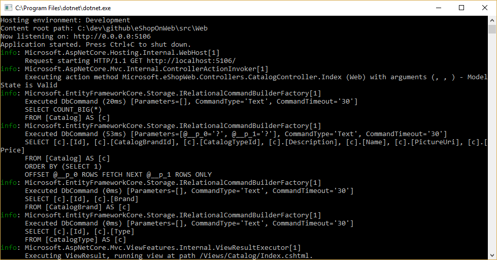

# Working with Data in ASP.NET Core Apps

> "Data is a precious thing and will last longer than the systems themselves."

Tim Berners-Lee

## Summary

Data access is an important part of almost any software application. ASP.NET Core supports a variety of data access options, including Entity Framework Core (and Entity Framework 6 as well), and can work with any .NET data access framework. The choice of which data access framework to use depends on the application's needs. Abstracting these choices from the ApplicationCore and UI projects, and encapsulating implementation details in Infrastructure, helps to produce loosely coupled, testable software.

## Entity Framework Core (for relational databases)

If you're writing a new ASP.NET Core application that needs to work with relational data, then Entity Framework Core (EF Core) is the recommended way for your application to access its data. EF Core is an object-relational mapper (O/RM) that enables .NET developers to persist objects to and from a data source. It eliminates the need for most of the data access code developers would typically need to write. Like ASP.NET Core, EF Core has been rewritten from the ground up to support modular cross-platform applications. You add it to your application as a NuGet package, configure it in Startup, and request it through dependency injection wherever you need it.

To use EF Core with a SQL Server database, run the following dotnet CLI command:

dotnet add package Microsoft.EntityFrameworkCore.SqlServer

To add support for an InMemory data source, for testing:

dotnet add package Microsoft.EntityFrameworkCore.InMemory

### The DbContext

To work with EF Core, you need a subclass of DbContext. This class holds properties representing collections of the entities your application will work with. The eShopOnWeb sample includes a CatalogContext with collections for items, brands, and types:

```csharp
public class CatalogContext : DbContext
{
    public CatalogContext(DbContextOptions<CatalogContext> options) : base(options)
    {

    }

    public DbSet<CatalogItem> CatalogItems { get; set; }

    public DbSet<CatalogBrand> CatalogBrands { get; set; }

    public DbSet<CatalogType> CatalogTypes { get; set; }
}
```

Your DbContext must have a constructor that accepts DbContextOptions and pass this argument to the base DbContext constructor. Note that if you have only one DbContext in your application, you can pass an instance of DbContextOptions, but if you have more than one you must use the generic DbContextOptions<T> type, passing in your DbContext type as the generic parameter.

### Configuring EF Core

In your ASP.NET Core application, you'll typically configure EF Core in your ConfigureServices method. EF Core uses a DbContextOptionsBuilder, which supports several helpful extension methods to streamline its configuration. To configure CatalogContext to use a SQL Server database with a connection string defined in Configuration, you would add the following code to ConfigureServices:

```csharp
services.AddDbContext<CatalogContext>(options => options.UseSqlServer (Configuration.GetConnectionString("DefaultConnection")));
```

To use the in-memory database:

```csharp
services.AddDbContext<CatalogContext>(options =>
    options.UseInMemoryDatabase());
```

Once you have installed EF Core, created a DbContext child type, and configured it in ConfigureServices, you are ready to use EF Core. You can request an instance of your DbContext type in any service that needs it, and start working with your persisted entities using LINQ as if they were simply in a collection. EF Core does the work of translating your LINQ expressions into SQL queries to store and retrieve your data.

You can see the queries EF Core is executing by configuring a logger and ensuring its level is set to at least Information, as shown in Figure 8-1.



Figure 8-1 Logging EF Core queries to the console

### Fetching and Storing Data

To retrieve data from EF Core, you access the appropriate property and use LINQ to filter the result. You can also use LINQ to perform projection, transforming the result from one type to another. The following example would retrieve CatalogBrands, ordered by name, filtered by their Enabled property, and projected onto a SelectListItem type:

```csharp
var brandItems = await _context.CatalogBrands
    .Where(b => b.Enabled)
    .OrderBy(b => b.Name)
    .Select(b => new SelectListItem {
        Value = b.Id, Text = b.Name })
    .ToListAsync();
```

It's important in the above example to add the call to ToListAsync in order to execute the query immediately. Otherwise, the statement will assign an IQueryable<SelectListItem> to brandItems, which will not be executed until it is enumerated. There are pros and cons to returning IQueryable results from methods. It allows the query EF Core will construct to be further modified, but can also result in errors that only occur at runtime, if operations are added to the query that EF Core cannot translate. It's generally safer to pass any filters into the method performing the data access, and return back an in-memory collection (for example, List<T>) as the result.

EF Core tracks changes on entities it fetches from persistence. To save changes to a tracked entity, you just call the SaveChanges method on the DbContext, making sure it's the same DbContext instance that was used to fetch the entity. Adding and removing entities is directly on the appropriate DbSet property, again with a call to SaveChanges to execute the database commands. The following example demonstrates adding, updating, and removing entities from persistence.

```csharp
// create
var newBrand = new CatalogBrand() { Brand = "Acme" };
_context.Add(newBrand);
await _context.SaveChangesAsync();

// read and update
var existingBrand = _context.CatalogBrands.Find(1);
existingBrand.Brand = "Updated Brand";
await _context.SaveChangesAsync();

// read and delete (alternate Find syntax)
var brandToDelete = _context.Find<CatalogBrand>(2);
_context.CatalogBrands.Remove(brandToDelete);
await _context.SaveChangesAsync();
```

EF Core supports both synchronous and async methods for fetching and saving. In web applications, it's recommended to use the async/await pattern with the async methods, so that web server threads are not blocked while waiting for data access operations to complete.

### Fetching Related Data

When EF Core retrieves entities, it populates all of the properties that are stored directly with that entity in the database. Navigation properties, such as lists of related entities, are not populated and may have their value set to null. This ensures EF Core is not fetching more data than is needed, which is especially important for web applications, which must quickly process requests and return responses in an efficient manner. To include relationships with an entity using *eager loading*, you specify the property using the Include extension method on the query, as shown:

```csharp
// .Include requires using Microsoft.EntityFrameworkCore
var brandsWithItems = await _context.CatalogBrands
    .Include(b => b.Items)
    .ToListAsync();
```

You can include multiple relationships, and you can also include sub-relationships using ThenInclude. EF Core will execute a single query to retrieve the resulting set of entities.

Another option for loading related data is to use *explicit loading*. Explicit loading allows you to load additional data into an entity that has already been retrieved. Since this involves a separate request to the database, it's not recommended for web applications, which should minimize the number of database round trips made per request.

*Lazy loading* is a feature that automatically loads related data as it is referenced by the application. It's not currently supported by EF Core, but as with explicit loading it should typically be disabled for web applications.

### Resilient Connections

External resources like SQL databases may occasionally be unavailable. In cases of temporary unavailability, applications can use retry logic to avoid raising an exception. This technique is commonly referred to as *connection resiliency*. You can implement your [own retry with exponential backoff](https://docs.microsoft.com/azure/architecture/patterns/retry) technique by attempting to rety with an exponentially increasing wait time, until a maximum retry count has been reached. This technique embraces the fact that cloud resources might intermittently be unavailable for short periods of time, resulting in failure of some requests.

For Azure SQL DB, Entity Framework Core already provides internal database connection resiliency and retry logic. But you need to enable the Entity Framework execution strategy for each DbContext connection if you want to have resilient EF Core connections.

For instance, the following code at the EF Core connection level enables resilient SQL connections that are retried if the connection fails.

```csharp
// Startup.cs from any ASP.NET Core Web API
public class Startup
{
    public IServiceProvider ConfigureServices(IServiceCollection services)
    {
        //...
        services.AddDbContext<OrderingContext>(options =>
        {
            options.UseSqlServer(Configuration["ConnectionString"],
            sqlServerOptionsAction: sqlOptions =>
        {
            sqlOptions.EnableRetryOnFailure(
            maxRetryCount: 5,
            maxRetryDelay: TimeSpan.FromSeconds(30), 
            errorNumbersToAdd: null); 
        });
    });
}
//...
```

  #### Execution strategies and explicit transactions using BeginTransaction and multiple DbContexts 
  
  When retries are enabled in EF Core connections, each operation you perform using EF Core becomes its own retriable operation. Each query and each call to SaveChanges will be retried as a unit if a transient failure occurs.
  
  However, if your code initiates a transaction using BeginTransaction, you are defining your own group of operations that need to be treated as a unit—everything inside the transaction has be rolled back if a failure occurs. You will see an exception like the following if you attempt to execute that transaction when using an EF execution strategy (retry policy) and you include several SaveChanges from multiple DbContexts in it.

System.InvalidOperationException: The configured execution strategy 'SqlServerRetryingExecutionStrategy' does not support user initiated transactions. Use the execution strategy returned by 'DbContext.Database.CreateExecutionStrategy()' to execute all the operations in the transaction as a retriable unit.

The solution is to manually invoke the EF execution strategy with a delegate representing everything that needs to be executed. If a transient failure occurs, the execution strategy will invoke the delegate again. The following code shows how to implement this approach:

```csharp
// Use of an EF Core resiliency strategy when using multiple DbContexts
// within an explicit transaction
// See:
// https://docs.microsoft.com/ef/core/miscellaneous/connection-resiliency
var strategy = _catalogContext.Database.CreateExecutionStrategy(); 
await strategy.ExecuteAsync(async () =>
{
    // Achieving atomicity between original Catalog database operation and the
    // IntegrationEventLog thanks to a local transaction
    using (var transaction = _catalogContext.Database.BeginTransaction())
    {
        _catalogContext.CatalogItems.Update(catalogItem);
        await _catalogContext.SaveChangesAsync();
        
        // Save to EventLog only if product price changed
        if (raiseProductPriceChangedEvent)
        await _integrationEventLogService.SaveEventAsync(priceChangedEvent);
        transaction.Commit();
    }
});
```

The first DbContext is the \_catalogContext and the second DbContext is within the \_integrationEventLogService object. Finally, the Commit action would be performed multiple DbContexts and using an EF Execution Strategy.

> ### References – Entity Framework Core
> - **EF Core Docs**  
> <https://docs.microsoft.com/ef/>
> - **EF Core: Related Data**  
> <https://docs.microsoft.com/ef/core/querying/related-data>
> - **Avoid Lazy Loading Entities in ASPNET Applications**  
> <https://ardalis.com/avoid-lazy-loading-entities-in-asp-net-applications>

## EF Core or micro-ORM?

While EF Core is a great choice for managing persistence, and for the most part encapsulates database details from application developers, it is not the only choice. Another popular open source alternative is [Dapper](https://github.com/StackExchange/Dapper), a so-called micro-ORM. A micro-ORM is a lightweight, less full-featured tool for mapping objects to data structures. In the case of Dapper, its design goals focus on performance, rather than fully encapsulating the underlying queries it uses to retrieve and update data. Because it doesn't abstract SQL from the developer, Dapper is "closer to the metal" and lets developers write the exact queries they want to use for a given data access operation.

EF Core has two significant features it provides which separate it from Dapper but also add to its performance overhead. The first is translation from LINQ expressions into SQL. These translations are cached, but even so there is overhead in performing them the first time. The second is change tracking on entities (so that efficient update statements can be generated). This behavior can be turned off for specific queries by using the AsNotTracking extension. EF Core also generates SQL queries that usually are very efficient and in any case perfectly acceptable from a performance standpoint, but if you need fine control over the precise query to be executed, you can pass in custom SQL (or execute a stored procedure) using EF Core, too. In this case, Dapper still outperforms EF Core, but only slightly. Julie Lerman presents some performance data in her May 2016 MSDN article [Dapper, Entity Framework, and Hybrid Apps](https://msdn.microsoft.com/magazine/mt703432.aspx). Additional performance benchmark data for a variety of data access methods can be found on [the Dapper site](https://github.com/StackExchange/Dapper).

To see how the syntax for Dapper varies from EF Core, consider these two versions of the same method for retrieving a list of items:

```csharp
// EF Core
private readonly CatalogContext _context;
public async Task<IEnumerable<CatalogType>> GetCatalogTypes()
{
    return await _context.CatalogTypes.ToListAsync();
}

// Dapper
private readonly SqlConnection _conn;
public async Task<IEnumerable<CatalogType>> GetCatalogTypesWithDapper()
{
    return await _conn.QueryAsync<CatalogType>("SELECT * FROM CatalogType");
}
```

If you need to build more complex object graphs with Dapper, you need to write the associated queries yourself (as opposed to adding an Include as you would in EF Core). This is supported through a variety of syntaxes, including a feature called Multi Mapping that lets you map individual rows to multiple mapped objects. For example, given a class Post with a property Owner of type User, the following SQL would return all of the necessary data:

```sql
select * from #Posts p
left join #Users u on u.Id = p.OwnerId
Order by p.Id
```

Each returned row includes both User and Post data. Since the User data should be attached to the Post data via its Owner property, the following function is used:

```csharp
(post, user) => { post.Owner = user; return post; }
```

The full code listing to return a collection of posts with their Owner property populated with the associated user data would be:

```csharp
var sql = @"select * from #Posts p
left join #Users u on u.Id = p.OwnerId
Order by p.Id";
var data = connection.Query<Post, User, Post>(sql,
(post, user) => { post.Owner = user; return post;});
```

Because it offers less encapsulation, Dapper requires developers know more about how their data is stored, how to query it efficiently, and write more code to fetch it. When the model changes, instead of simply creating a new migration (another EF Core feature), and/or updating mapping information in one place in a DbContext, every query that is impacted must be updated. These queries have not compile time guarantees, so they may break at runtime in response to changes to the model or database, making errors more difficult to detect quickly. In exchange for these tradeoffs, Dapper offers extremely fast performance.

For most applications, and most parts of almost all applications, EF Core offers acceptable performance. Thus, its developer productivity benefits are likely to outweigh its performance overhead. For queries that can benefit from caching, the actual query may only be executed a tiny percentage of the time, making relatively small query performance differences moot.

## SQL or NoSQL

Traditionally, relational databases like SQL Server have dominated the marketplace for persistent data storage, but they are not the only solution available. NoSQL databases like [MongoDB](https://www.mongodb.com/what-is-mongodb) offer a different approach to storing objects. Rather than mapping objects to tables and rows, another option is to serialize the entire object graph, and store the result. The benefits of this approach, at least initially, are simplicity and performance. It's certainly simpler to store a single serialized object with a key than to decompose the object into many tables with relationships and update and rows that may have changed since the object was last retrieved from the database. Likewise, fetching and deserializing a single object from a key-based store is typically much faster and easier than complex joins or multiple database queries required to fully compose the same object from a relational database. The lack of locks or transactions or a fixed schema also makes NoSQL databases very amenable to scaling across many machines, supporting very large datasets.

On the other hand, NoSQL databases (as they are typically called) have their drawbacks. Relational databases use normalization to enforce consistency and avoid duplication of data. This reduces the total size of the database and ensures that updates to shared data are available immediately throughout the database. In a relational database, an Address table might reference a Country table by ID, such that if a country's name were changed, the address records would benefit from the update without themselves having to be updated. However, in a NoSQL database, Address and its associated Country might be serialized as part of many stored objects. An update to a country name would require all such objects to be updated, rather than a single row. Relational databases can also ensure relational integrity by enforcing rules like foreign keys. NoSQL databases typically do not offer such constraints on their data.

Another complexity NoSQL databases must deal with is versioning. When an object's properties change, it may not be able to be deserialized from past versions that were stored. Thus, all existing objects that have a serialized (previous) version of the object must be updated to conform to its new schema. This is not conceptually different from a relational database, where schema changes sometimes require update scripts or mapping updates. However, the number of entries that must be modified is often much greater in the NoSQL approach, because there is more duplication of data.

It's possible in NoSQL databases to store multiple versions of objects, something fixed schema relational databases typically do not support. However, in this case your application code will need to account for the existence of previous versions of objects, adding additional complexity.

NoSQL databases typically do not enforce [ACID](https://en.wikipedia.org/wiki/ACID), which means they have both performance and scalability benefits over relational databases. They're well-suited to extremely large datasets and objects that are not well-suited to storage in normalized table structures. There is no reason why a single application cannot take advantage of both relational and NoSQL databases, using each where it is best suited.

## Azure DocumentDB

Azure DocumentDB is a fully managed NoSQL database service that offers cloud-based schema-free data storage. DocumentDB is built for fast and predictable performance, high availability, elastic scaling, and global distribution. Despite being a NoSQL database, developers can use rich and familiar SQL query capabilities on JSON data. All resources in DocumentDB are stored as JSON documents. Resources are managed as *items*, which are documents containing metadata, and *feeds*, which are collections of items. Figure 8-2 shows the relationship between different DocumentDB resources.


**Figure 8-2.** DocumentDB resource organization.

The DocumentDB query language is a simple yet powerful interface for querying JSON documents. The language supports a subset of ANSI SQL grammar and adds deep integration of JavaScript object, arrays, object construction, and function invocation.

**References – DocumentDB**

-   DocumentDB Introduction\
    <https://docs.microsoft.com/azure/documentdb/documentdb-introduction>

## Other Persistence Options

In addition to relational and NoSQL storage options, ASP.NET Core applications can use Azure Storage to store a variety of data formats and files in a cloud-based, scalable fashion. Azure Storage is massively scalable, so you can start out storing small amounts of data and scale up to storing hundreds or terabytes if your application requires it. Azure Storage supports four kinds of data:

-   Blob Storage for unstructured text or binary storage, also referred to as object storage.

-   Table Storage for structured datasets, accessible via row keys.

-   Queue Storage for reliable queue-based messaging.

-   File Storage for shared file access between Azure virtual machines and on-premises applications.

**References – Azure Storage**

-   Azure Storage Introduction\
    <https://docs.microsoft.com/azure/storage/storage-introduction>

## Caching

In web applications, each web request should be completed in the shortest time possible. One way to achieve this is to limit the number of external calls the server must make to complete the request. Caching involves storing a copy of data on the server (or another data store that is more easily queried than the source of the data). Web applications, and especially non-SPA traditional web applications, need to build the entire user interface with every request. This frequently involves making many of the same database queries repeatedly from one user request to the next. In most cases, this data changes rarely, so there is little reason to constantly request it from the database. ASP.NET Core supports response caching, for caching entire pages, and data caching, which supports more granular caching behavior.

When implementing caching, it's important to keep in mind separation of concerns. Avoid implementing caching logic in your data access logic, or in your user interface. Instead, encapsulate caching in its own classes, and use configuration to manage its behavior. This follows the Open/Closed and Single Responsibility principles, and will make it easier for you to manage how you use caching in your application as it grows.

### ASP.NET Core Response Caching

ASP.NET Core supports two levels of response caching. The first level does not cache anything on the server, but adds HTTP headers that instruct clients and proxy servers to cache responses. This is implemented by adding the ResponseCache attribute to individual controllers or actions:

```csharp
    [ResponseCache(Duration = 60)]
    public IActionResult Contact()
    { }
    
    ViewData["Message"] = "Your contact page.";
    return View();
}

The above example will result in the following header being added to the response, instructing clients to cache the result for up to 60 seconds.

Cache-Control: public,max-age=60

In order to add server-side in-memory caching to the application, you must reference the Microsoft.AspNetCore.ResponseCaching NuGet package, and then add the Response Caching middleware. This middleware is configured in both ConfigureServices and Configure in Startup:

```csharp
public void ConfigureServices(IServiceCollection services)
{
    services.AddResponseCaching();
}

public void Configure(IApplicationBuilder app)
{
    app.UseResponseCaching();
}
```

The Response Caching Middleware will automatically cache responses based on a set of conditions, which you can customize. By default, only 200 (OK) responses requested via GET or HEAD methods are cached. In addition, requests must have a response with a Cache-Control: public header, and cannot include headers for Authorization or Set-Cookie. See a [complete list of the caching conditions used by the response caching middleware](https://docs.microsoft.com/aspnet/core/performance/caching/middleware#conditions-for-caching).

### Data Caching

Rather than (or in addition to) caching full web responses, you can cache the results of individual data queries. For this, you can use in memory caching on the web server, or use [a distributed cache](https://docs.microsoft.com/aspnet/core/performance/caching/distributed). This section will demonstrate how to implement in memory caching.

You add support for memory (or distributed) caching in ConfigureServices:

```csharp
public void ConfigureServices(IServiceCollection services)
{
    services.AddMemoryCache();
    services.AddMvc();
}
```

Be sure to add the Microsoft.Extensions.Caching.Memory NuGet package as well.

Once you've added the service, you request IMemoryCache via dependency injection wherever you need to access the cache. In this example, the CachedCatalogService is using the Proxy (or Decorator) design pattern, by providing an alternative implementation of ICatalogService that controls access to (or adds behavior to) the underlying CatalogService implementation.

```csharp
public class CachedCatalogService : ICatalogService
{
    private readonly IMemoryCache _cache;
    private readonly CatalogService _catalogService;
    private static readonly string _brandsKey = "brands";
    private static readonly string _typesKey = "types";
    private static readonly string _itemsKeyTemplate = "items-{0}-{1}-{2}-{3}";
    private static readonly TimeSpan _defaultCacheDuration = TimeSpan.FromSeconds(30);
    public CachedCatalogService(IMemoryCache cache,
    CatalogService catalogService)
    {
        _cache = cache;
        _catalogService = catalogService;
    }
    
    public async Task<IEnumerable<SelectListItem>> GetBrands()
    {
        return await _cache.GetOrCreateAsync(_brandsKey, async entry =>
        {
            entry.SlidingExpiration = _defaultCacheDuration;
            return await _catalogService.GetBrands();
        });
    }
    
    public async Task<Catalog> GetCatalogItems(int pageIndex, int itemsPage, int? brandID, int? typeId)
    {
        string cacheKey = String.Format(_itemsKeyTemplate, pageIndex, itemsPage, brandID, typeId);
        return await _cache.GetOrCreateAsync(cacheKey, async entry =>
        {
            entry.SlidingExpiration = _defaultCacheDuration;
            return await _catalogService.GetCatalogItems(pageIndex, itemsPage, brandID, typeId);
        });
    }
    
    public async Task<IEnumerable<SelectListItem>> GetTypes()
    {
        return await _cache.GetOrCreateAsync(_typesKey, async entry =>
        {
            entry.SlidingExpiration = _defaultCacheDuration;
            return await _catalogService.GetTypes();
        });
    }
}
```

To configure the application to use the cached version of the service, but still allow the service to get the instance of CatalogService it needs in its constructor, you would add the following in ConfigureServices:

```csharp
services.AddMemoryCache();
services.AddScoped<ICatalogService, CachedCatalogService>();
services.AddScoped<CatalogService>();
```

With this in place, the database calls to fetch the catalog data will only be made once per minute, rather than on every request. Depending on the traffic to the site, this can have a very significant impact on the number of queries made to the database, and the average page load time for the home page that currently depends on all three of the queries exposed by this service.

An issue that arises when caching is implemented is *stale data* – that is, data that has changed at the source but an out of date version remains in the cache. A simple way to mitigate this issue is to use small cache durations, since for a busy application there is limited additional benefit to extending the length data is cached. For example, consider a page that makes a single database query, and is requested 10 times per second. If this page is cached for one minute, it will result in the number of database queries made per minute to drop from 600 to 1, a reduction of 99.8%. If instead the cache duration were made one hour, the overall reduction would be 99.997%, but now the likelihood and potential age of stale data are both increased dramatically.

Another approach is to proactively remove cache entries when the data they contain is updated. Any individual entry can be removed if its key is known:

```csharp
_cache.Remove(cacheKey);
```

If your application exposes functionality for updating entries that it caches, you can remove the corresponding cache entries in your code that performs the updates. Sometimes there may be many different entries that depend on a particular set of data. In that case, it can be useful to create dependencies between cache entries, by using a CancellationChangeToken. With a CancellationChangeToken, you can expire multiple cache entries at once by cancelling the token.

```csharp
// configure CancellationToken and add entry to cache
var cts = new CancellationTokenSource();
_cache.Set("cts", cts);
_cache.Set(cacheKey,
itemToCache,
new CancellationChangeToken(cts.Token));

// elsewhere, expire the cache by cancelling the token\
_cache.Get<CancellationTokenSource>("cts").Cancel();
```

>[!div class="step-by-step"]
[Previous] (develop-asp-net-core-mvc-apps.md)
[Next] (test-asp-net-core-mvc-apps.md)
