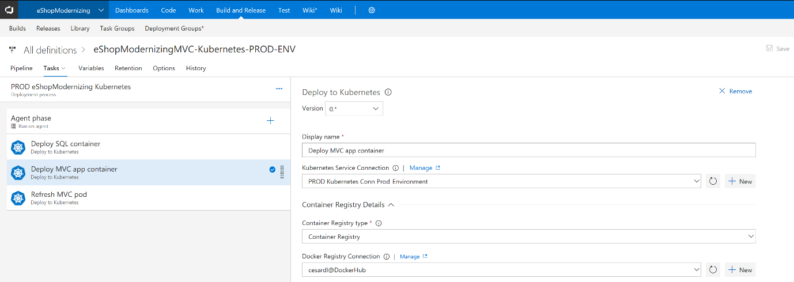

# Modernize your app's lifecycle with CI/CD pipelines and DevOps tools in the cloud

Today’s businesses need to innovate at a rapid pace to be competitive in the marketplace. Delivering high-quality, modern applications requires DevOps tools and processes that are critical to implement this constant cycle of innovation. With the right DevOps tools, developers can streamline continuous deployment and get innovative applications into the hands of users more quickly.

Although continuous integration and deployment practices are well established, the introduction of containers introduces new considerations, particularly when you are working with multi-container applications.

Visual Studio Team Services supports continuous integration and deployment of multi-container applications to a variety of environments through the official Team Services deployment tasks:

-   [Deploy to standalone Docker Host VM](https://docs.microsoft.com/vsts/build-release/apps/cd/deploy-docker-windowsvm) (Linux or Windows Server 2016 or later)

-   [Deploy to Service Fabric](https://docs.microsoft.com/azure/service-fabric/service-fabric-tutorial-deploy-app-with-cicd-vsts)

-   [Deploy to Azure Container Service – Kubernetes](https://docs.microsoft.com/vsts/build-release/apps/cd/azure/deploy-container-kubernetes)

But you also can deploy to [Docker Swarm](https://blogs.msdn.microsoft.com/jcorioland/2016/11/29/full-ci-cd-pipeline-to-deploy-multi-containers-application-on-azure-container-service-docker-swarm-using-visual-studio-team-services/) or DC/OS by using Team Services script-based tasks.

To continue facilitating deployment agility, these tools provide excellent dev-to-test-to-production deployment experiences for container workloads, with a choice of development and CI/CD solutions.

Figure 4-12 shows a continuous deployment pipeline that deploys to a Kubernetes cluster in Azure Container Service.

> **Figure 4-12.** Visual Studio Team Services continuous deployment pipeline, deploying to a Kubernetes cluster

>[!div class="step-by-step"]
[Previous](modernize-your-apps-with-monitoring-and-telemetry.md)
[Next](migrate-to-hybrid-cloud-scenarios.md)
