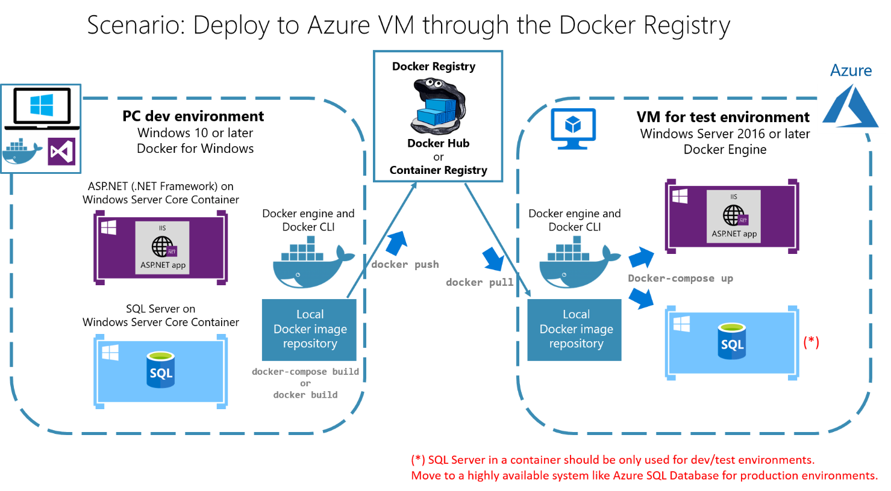
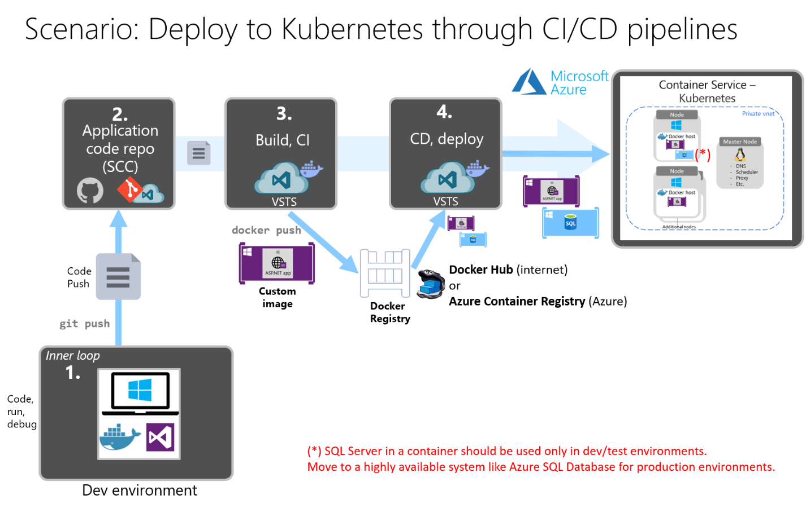
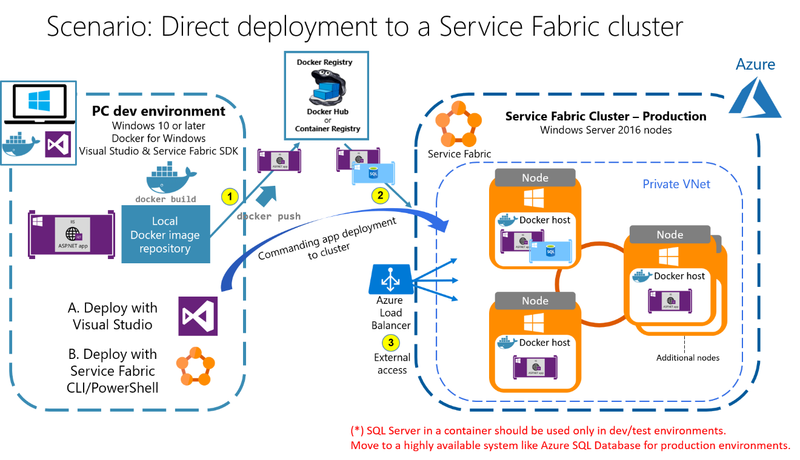
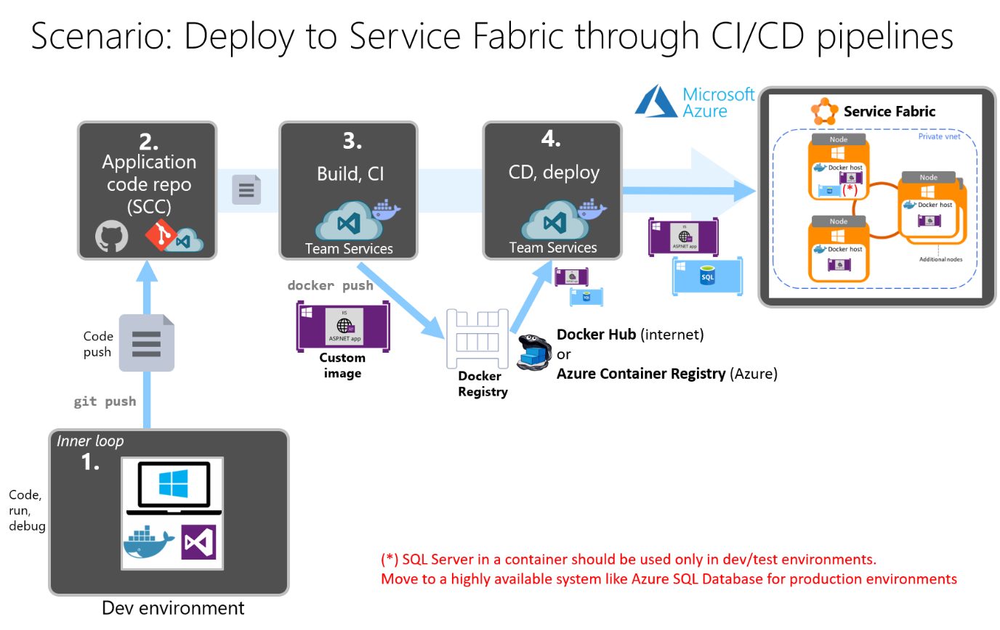

# Walkthroughs and technical get started overview

To limit the size of this e-book, additional technical documentation and the full walkthroughs were made available in a GitHub repository. The online series of walkthroughs that is described in this chapter covers the step-by-step setup of the multiple environments that are based on Windows Containers, and deployment to Azure.

The following sections explain what each walkthrough is about, its objectives and high-level vision, and provides a diagram of the tasks that are involved. You can get the walkthroughs themselves in the *eShopModernizing* apps GitHub repo wiki at [https://github.com/dotnet-architecture/eShopModernizing/wiki](https://github.com/dotnet-architecture/eShopModernizing/wiki).

## Technical walkthrough list

The following get-started walkthroughs provide consistent and comprehensive technical guidance for sample apps that you can lift and shift by using containers, and then move by using multiple deployment choices in Azure.

Each of the following walkthroughs uses the new sample eShopLegacy and eShopModernizing apps, which are available on GitHub at [https://github.com/dotnet-architecture/eShopModernizing](https://github.com/dotnet-architecture/eShopModernizing).

- **Tour of eShop legacy apps**

- **Containerize your existing .NET applications with Windows Containers**

- **Deploy your Windows Containers-based app to Azure VMs**

- **Deploy your Windows Containers-based apps to Kubernetes in Azure Container Service**

- **Deploy your Windows Containers-based apps to Azure Service Fabric**

## Walkthrough 1: Tour of eShop legacy apps

### Technical walkthrough availability

The full technical walkthrough is available in the eShopModernizing GitHub repo wiki:

[https://github.com/dotnet-architecture/eShopModernizing/wiki/01.-Tour-on-eShopModernizing-apps-implementation-code](https://github.com/dotnet-architecture/eShopModernizing/wiki/01.-Tour-on-eShopModernizing-apps-implementation-code)

### Overview

In this walkthrough, you can explore the initial implementation of two sample legacy applications. Both sample apps have a monolithic architecture, and were created by using classic ASP.NET. One application is based on ASP.NET 4.x MVC; the second application is based on ASP.NET 4.x Web Forms. Both applications are in the [eShopModernizing GitHub repo](https://github.com/dotnet-architecture/eShopModernizing).

You can containerize both sample apps, similar to the way you can containerize a classic [Windows Communication Foundation](../../framework/wcf/whats-wcf.md) (WCF) application to be consumed as a desktop application. For an example, see [eShopModernizingWCFWinForms](https://github.com/dotnet-architecture/eShopModernizingWCFWinForms).

### Goals

The main goal of this walkthrough is simply to get familiar with these apps, and with their code and configuration. You can configure the apps so that they generate and use mock data, without using the SQL database, for testing purposes. This optional config is based on dependency injection, in a decoupled way.

### Scenario

Figure 5-1 shows the simple scenario of the original legacy applications.

> 
>
> **Figure 5-1.** Simple architecture scenario of the original legacy applications

From a business domain perspective, both apps offer the same catalog management features. Members of the eShop enterprise team would use the app to view and edit the product catalog. Figure 5-2 shows the initial app screenshots.

> **Figure 5-2.** ASP.NET MVC and ASP.NET Web Forms applications (existing/legacy technologies)

These are web applications that are used to browse and modify catalog entries. The fact that both apps deliver the same business/functional features is simply for comparison purposes. You can see a similar modernization process for apps that were created by using the ASP.NET MVC and ASP.NET Web Forms frameworks.

Dependencies in ASP.NET 4.x or earlier versions (either for MVC or for Web Forms) means that these applications won't run on .NET Core unless the code is fully rewritten by using ASP.NET Core MVC. This demonstrates the point that if you don't want to re-architect or rewrite code, you can containerize existing applications, and still use the same .NET technologies and the same code. You can see how you can run applications like these in containers, without any changes to legacy code.

### Benefits

The benefits of this walkthrough are simple: Just get familiar with the code and application configuration, based on dependency injection. Then, you can experiment with this approach when you containerize and deploy to multiple environments in the future.

### Next steps

Explore this content more in-depth on the GitHub wiki:

[https://github.com/dotnet-architecture/eShopModernizing/wiki/01.-Tour-on-eShopModernizing-apps-implementation-code](https://github.com/dotnet-architecture/eShopModernizing/wiki/01.-Tour-on-eShopModernizing-apps-implementation-code)

## Walkthrough 2: Containerize your existing .NET applications with Windows Containers

### Technical walkthrough availability

The full technical walkthrough is available in the eShopModernizing GitHub repo wiki:

[https://github.com/dotnet-architecture/eShopModernizing/wiki/02.-How-to-containerize-the-.NET-Framework-web-apps-with-Windows-Containers-and-Docker](https://github.com/dotnet-architecture/eShopModernizing/wiki/02.-How-to-containerize-the-.NET-Framework-web-apps-with-Windows-Containers-and-Docker)

### Overview

Use Windows Containers to improve deployment of existing .NET applications, like those based on MVC, Web Forms, or WCF, to production, development, and test environments.

### Goals

The goal of this walkthrough is to show you several options for containerizing an existing .NET Framework application. You can:

- Containerize your application by using [Visual Studio 2017 Tools for Docker](/aspnet/core/host-and-deploy/docker/visual-studio-tools-for-docker) (Visual Studio 2017 or later versions).

- Containerize your application by manually adding a [Dockerfile](https://docs.docker.com/engine/reference/builder/), and then using the [Docker CLI](https://docs.docker.com/engine/reference/commandline/cli/).

- Containerize your application by using the [Img2Docker](https://github.com/docker/communitytools-image2docker-win) tool (an open-source tool from Docker).

This walkthrough focuses on the Visual Studio 2017 Tools for Docker approach, but the other two approaches are fairly similar in regard to using Dockerfiles.

### Scenario

Figure 5-3 shows the scenario for containerized eShop legacy applications.

> 
>
> **Figure 5-3.** Simplified architecture diagram of containerized applications in a development environment

### Benefits

There are advantages to running your monolithic application in a container. First, you create an image for the application. From that point on, every deployment runs in the same environment. Every container uses the same OS version, has the same version of dependencies installed, uses the same .NET framework version, and is built by using the same process. Basically, you control the dependencies of your application by using a Docker image. The dependencies travel with the application when you deploy the containers.

An additional benefit is that developers can run the application in the consistent environment that's provided by Windows Containers. Issues that appear only with certain versions can be spotted immediately, instead of surfacing in a staging or production environment. Differences in development environments used by members of the development team matter less when applications run in containers.

Containerized applications also have a flatter scale-out curve. Containerized apps enable you to have more application and service instances (based on containers) in a VM or physical machine compared to regular application deployments per machine. This translates to higher density and fewer required resources, especially when you use orchestrators like Kubernetes or Service Fabric.

Containerization, in ideal situations, does not require making any changes to the application code (C\#). In most scenarios, you just need the Docker deployment metadata files (Dockerfiles and Docker Compose files).

### Next steps

Explore this content more in-depth on the GitHub wiki:
[https://github.com/dotnet-architecture/eShopModernizing/wiki/02.-How-to-containerize-the-.NET-Framework-web-apps-with-Windows-Containers-and-Docker](https://github.com/dotnet-architecture/eShopModernizing/wiki/02.-How-to-containerize-the-.NET-Framework-web-apps-with-Windows-Containers-and-Docker)

## Walkthrough 3: Deploy your Windows Containers-based app to Azure VMs

### Technical walkthrough availability

The full technical walkthrough is available in the eShopModernizing GitHub repo wiki:

[https://github.com/dotnet-architecture/eShopModernizing/wiki/03.-How-to-deploy-your-Windows-Containers-based-app-into-Azure-VMs-(Including-CI-CD)](https://github.com/dotnet-architecture/eShopModernizing/wiki/03.-How-to-deploy-your-Windows-Containers-based-app-into-Azure-VMs-(Including-CI-CD))

### Overview

Deploying to a Docker host on a Windows Server 2016 Virtual Machine (VM) in Azure lets you quickly set up development/test/staging environments. It also gives you a common place for testers or business users to validate the app. VMs also can be valid Infrastucture as a Service (IaaS) production environments.

### Goals

The goal of this walkthrough is to show you the multiple alternatives you have when you deploy Windows Containers to Azure VMs that are based on Windows Server 2016 or later versions.

### Scenarios

Several scenarios are covered in this walkthrough.

#### Scenario A: Deploy to an Azure VM from a dev PC through Docker Engine connection

> **Figure 5-4.** Deploy to an Azure VM from a dev PC through a Docker Engine connection

#### Scenario B: Deploy to an Azure VM through a Docker Registry

> **Figure 5-5.** Deploy to an Azure VM through a Docker Registry

#### Scenario C: Deploy to an Azure VM from CI/CD pipelines in Visual Studio Team Services

> **Figure 5-6.** Deploy to an Azure VM from CI/CD pipelines in Visual Studio Team Services

### Azure VMs for Windows Containers

Azure VMs for Windows Containers are VMs based on Windows Server 2016, Windows 10, or later versions, both with Docker Engine set up. In most cases, Windows Server 2016 is used in the Azure VMs.

Azure currently provides a VM named **Windows Server 2016 with Containers**. You can use this VM to try the new Windows Server Container feature, with either Windows Server Core or Windows Nano Server. Container OS images are installed, and then the VM is ready to use with Docker.

### Benefits

Although Windows Containers can be deployed to on-premises Windows Server 2016 VMs, when you deploy to Azure, you get an easier way to get started, with ready-to-use Windows Server Container VMs. You also get a common online location that’s accessible to testers, and automatic scalability through Azure virtual machine scale sets.

### Next steps

Explore this content more in-depth on the GitHub wiki:

[https://github.com/dotnet-architecture/eShopModernizing/wiki/03.-How-to-deploy-your-Windows-Containers-based-app-into-Azure-VMs-(Including-CI-CD)](https://github.com/dotnet-architecture/eShopModernizing/wiki/03.-How-to-deploy-your-Windows-Containers-based-app-into-Azure-VMs-(Including-CI-CD))

## Walkthrough 4: Deploy your Windows Containers-based apps to Kubernetes in Azure Container Service

### Technical walkthrough availability

The full technical walkthrough is available in the eShopModernizing GitHub repo wiki:

[https://github.com/dotnet-architecture/eShopModernizing/wiki/04.-How-to-deploy-your-Windows-Containers-based-apps-into-Kubernetes-in-Azure-Container-Service-(Including-C-CD)](https://github.com/dotnet-architecture/eShopModernizing/wiki/04.-How-to-deploy-your-Windows-Containers-based-apps-into-Kubernetes-in-Azure-Container-Service-(Including-C-CD))

### Overview

An application that's based on Windows Containers will quickly need to use platforms, moving even further away from IaaS VMs. This is needed to easily achieve high scalability and better automated scalability, and for a significant improvement in automated deployments and versioning. You can achieve these goals by using the orchestrator [Kubernetes](https://kubernetes.io/), available in [Azure Container Services](https://azure.microsoft.com/services/container-service/).

### Goals

The goal of this walkthrough is to learn how to deploy a Windows Container–based application to Kubernetes (also called *K8s*) in Azure Container Service. Deploying to Kubernetes from scratch is a two-step process:

1.  Deploy a Kubernetes cluster to Azure Container Service.

2.  Deploy the application and related resources to the Kubernetes cluster.

### Scenarios

#### Scenario A: Deploy directly to a Kubernetes cluster from a dev environment

> **Figure 5-7.** Deploy directly to a Kubernetes cluster from a development environment

#### Scenario B: Deploy to a Kubernetes cluster from CI/CD pipelines in Team Services

> **Figure 5-8.** Deploy to a Kubernetes cluster from CI/CD pipelines in Team Services

### Benefits

There are many benefits to deploying to a cluster in Kubernetes. The biggest benefit is that you get a production-ready environment in which you can scale out the application based on the number of container instances you want to use (inner-scalability in the existing nodes), and based on the number of nodes or VMs in the cluster (global scalability of the cluster).

Azure Container Service optimizes popular open-source tools and technologies specifically for Azure. You get an open solution that offers portability, both for your containers and for your application configuration. You select the size, the number of hosts, and the orchestrator tools-Container Service handles everything else.

With Kubernetes, developers can progress from thinking about physical and virtual machines, to planning a container-centric infrastructure that facilitates the following capabilities, among others:

- Applications based on multiple containers

- Replicating container instances and horizontal autoscaling

- Naming and discovering (for example, internal DNS)

- Balancing loads

- Rolling updates

- Distributing secrets

- Application health checks

## Next steps

Explore this content more in-depth on the GitHub wiki: [https://github.com/dotnet-architecture/eShopModernizing/wiki/04.-How-to-deploy-your-Windows-Containers-based-apps-into-Kubernetes-in-Azure-Container-Service-(Including-C-CD)](https://github.com/dotnet-architecture/eShopModernizing/wiki/04.-How-to-deploy-your-Windows-Containers-based-apps-into-Kubernetes-in-Azure-Container-Service-(Including-C-CD))

## Walkthrough 5: Deploy your Windows Containers-based apps to Azure Service Fabric

### Technical walkthrough availability

The full technical walkthrough is available in the eShopModernizing GitHub repo wiki:

[https://github.com/dotnet-architecture/eShopModernizing/wiki/05.-How-to-deploy-your-Windows-Containers-based-apps-into-Azure-Service-Fabric-(Including-CI-CD)](https://github.com/dotnet-architecture/eShopModernizing/wiki/05.-How-to-deploy-your-Windows-Containers-based-apps-into-Azure-Service-Fabric-(Including-CI-CD))

### Overview

An application based on Windows Containers quickly needs to use platforms, moving even further away from IaaS VMs. This is needed to easily achieve high scalability and better automated scalability, and for a significant improvement in automated deployments and versioning. You can achieve these goals by using the orchestrator Azure Service Fabric, which is available in the Azure cloud, but also available to use on-premises, or even in a different public cloud.

### Goals

The goal of this walkthrough is to learn how to deploy a Windows Container–based application to a Service Fabric cluster in Azure. Deploying to Service Fabric from scratch is a two-step process:

1.  Deploy a Service Fabric cluster to Azure (or to a different environment).

2.  Deploy the application and related resources to the Service Fabric cluster.

### Scenarios

#### Scenario A: Deploy directly to a Service Fabric cluster from a dev environment

> **Figure 5-9.** Deploy directly to a Service Fabric cluster from a development environment

### Scenario B: Deploy to a Service Fabric cluster from CI/CD pipelines in Team Services

> **Figure 5-10.** Deploy to a Service Fabric cluster from CI/CD pipelines in Visual Studio Team Services

## Benefits

The benefits of deploying to a cluster in Service Fabric are similar to the benefits of using Kubernetes. One difference, though, is that Service Fabric is a more mature production environment for Windows applications compared to Kubernetes, which is in a beta phase for Windows Containers in Kubernetes version 1.9 (December 2017). Kubernetes is a more mature environment for Linux.

The main benefit of using Azure Service Fabric is that you get a production-ready environment in which you can scale out the application based on the number of container instances you want to use (inner-scalability in the existing nodes), and based on the number of nodes or VMs in the cluster (global scalability of the cluster).

Azure Service Fabric offers portability both for your containers and for your application configuration. You can have a Service Fabric cluster in Azure, or install it on-premises in your own datacenter. You can even install a Service Fabric cluster in a different cloud, like [Amazon AWS](https://blogs.msdn.microsoft.com/azureservicefabric/2017/05/18/tutorial-how-to-create-a-service-fabric-standalone-cluster-with-aws-ec2-instances/).

With Service Fabric, developers can progress from thinking about physical and virtual machines to planning a container-centric infrastructure that facilitates the following capabilities, among others:

- Applications based on multiple containers.

- Replicating container instances and horizontal autoscaling.

- Naming and discovering (for example, internal DNS).

- Balancing loads.

- Rolling updates.

- Distributing secrets.

- Application health checks.

The following capabilities are exclusive in Service Fabric (compared to other orchestrators):

- Stateful services capability, through the Reliable Services application model.

- Actors pattern, through the Reliable Actors application model.

- Deploy bare-bone processes, in addition to Windows or Linux containers.

- Advanced rolling updates and health checks.

### Next steps

Explore this content more in-depth on the GitHub wiki:

[https://github.com/dotnet-architecture/eShopModernizing/wiki/05.-How-to-deploy-your-Windows-Containers-based-apps-into-Azure-Service-Fabric-(Including-CI-CD)](https://github.com/dotnet-architecture/eShopModernizing/wiki/05.-How-to-deploy-your-Windows-Containers-based-apps-into-Azure-Service-Fabric-(Including-CI-CD))

>[!div class="step-by-step"]
[Previous](lift-and-shift-existing-apps-devops/migrate-to-hybrid-cloud-scenarios.md)
[Next](conclusions.md)
