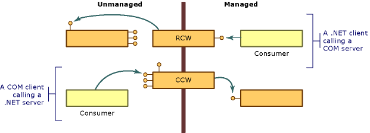

# COM Wrappers
COM differs from the .NET runtime object model in several important ways:  
  
- Clients of COM objects must manage the lifetime of those objects; the common language runtime manages the lifetime of objects in its environment.  
  
- Clients of COM objects discover whether a service is available by requesting an interface that provides that service and getting back an interface pointer, or not. Clients of .NET objects can obtain a description of an object's functionality using reflection.  
  
- NET objects reside in memory managed by the .NET runtime execution environment. The execution environment can move objects around in memory for performance reasons and update all references to the objects it moves. Unmanaged clients, having obtained a pointer to an object, rely on the object to remain at the same location. These clients have no mechanism for dealing with an object whose location is not fixed.  
  
 To overcome these differences, the runtime provides wrapper classes to make both managed and unmanaged clients think they are calling objects within their respective environment. Whenever your managed client calls a method on a COM object, the runtime creates a [runtime callable wrapper](runtime-callable-wrapper.md) (RCW). RCWs abstract the differences between managed and unmanaged reference mechanisms, among other things. The runtime also creates a [COM callable wrapper](com-callable-wrapper.md) (CCW) to reverse the process, enabling a COM client to seamlessly call a method on a .NET object. As the following illustration shows, the perspective of the calling code determines which wrapper class the runtime creates.  
  
   
  
 In most cases, the standard RCW or CCW generated by the runtime provides adequate marshaling for calls that cross the boundary between COM and the .NET runtime. Using custom attributes, you can optionally adjust the way the runtime represents managed and unmanaged code.  
  
## See also

- [Advanced COM Interoperability in .NET Framework](https://docs.microsoft.com/previous-versions/dotnet/netframework-4.0/bd9cdfyx(v=vs.100))
- [Runtime Callable Wrapper](runtime-callable-wrapper.md)
- [COM Callable Wrapper](com-callable-wrapper.md)
- [Customizing Standard Wrappers in .NET Framework](https://docs.microsoft.com/previous-versions/dotnet/netframework-4.0/h7hx9abd(v=vs.100))
- [How to: Customize Runtime Callable Wrappers in .NET Framework](https://docs.microsoft.com/previous-versions/dotnet/netframework-4.0/56kh4hy7(v=vs.100))
