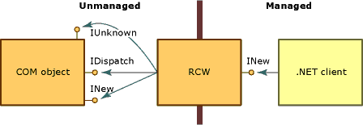

# Runtime Callable Wrapper

The common language runtime exposes COM objects through a proxy called the runtime callable wrapper (RCW). Although the RCW appears to be an ordinary object to .NET clients, its primary function is to marshal calls between a .NET client and a COM object.  
  
 The runtime creates exactly one RCW for each COM object, regardless of the number of references that exist on that object. The runtime maintains a single RCW per process for each object.  If you create an RCW in one application domain or apartment, and then pass a reference to another application domain or apartment, a proxy to the first object will be used. Note that this proxy is a new managed object and not the same as the initial RCW; this means the two managed objects are not equal but do represent the same COM object.  As the following illustration shows, any number of managed clients can hold a reference to the COM objects that expose `INew` and `INewer` interfaces.  

The following image shows the process for accessing COM objects through the runtime callable wrapper:

   

 Using metadata derived from a type library, the runtime creates both the COM object being called and a wrapper for that object. Each RCW maintains a cache of interface pointers on the COM object it wraps and releases its reference on the COM object when the RCW is no longer needed. The runtime performs garbage collection on the RCW.  
  
 Among other activities, the RCW marshals data between managed and unmanaged code, on behalf of the wrapped object. Specifically, the RCW provides marshalling for method arguments and method return values whenever the client and server have different representations of the data passed between them.  
  
 The standard wrapper enforces built-in marshalling rules. For example, when a .NET client passes a `string` type as part of an argument to an unmanaged object, the wrapper converts the `string` to a `BSTR` type. Should the COM object return a `BSTR` to its managed caller, the caller receives a `string`. Both the client and the server send and receive data that is familiar to them. Other types require no conversion. For instance, a standard wrapper will always pass a 4-byte integer between managed and unmanaged code without converting the type.
  
## Marshalling selected interfaces  

 The primary goal of the runtime callable wrapper (RCW) is to hide the differences between the managed and unmanaged programming models. To create a seamless transition, the RCW consumes selected COM interfaces without exposing them to the .NET client, as shown in the following illustration.

 The following image shows COM interfaces and the runtime callable wrapper:
  
   
  
 When created as an early-bound object, the RCW is a specific type. It implements the interfaces that the COM object implements and exposes the methods, properties, and events from the object's interfaces. In the illustration, the RCW exposes the INew interface but consumes the **IUnknown** and **IDispatch** interfaces. Further, the RCW exposes all members of the INew interface to the .NET client.  
  
 The RCW consumes the interfaces listed in the following table, which are exposed by the object it wraps.  
  
|Interface|Description|  
|---------------|-----------------|  
|**IDispatch**|For late binding to COM objects through reflection.|  
|**IErrorInfo**|Provides a textual description of the error, its source, a Help file, Help context, and the GUID of the interface that defined the error (always **GUID_NULL** for .NET classes).|  
|**IProvideClassInfo**|If the COM object being wrapped implements **IProvideClassInfo**, the RCW extracts the type information from this interface to provide better type identity.|  
|**IUnknown**|For object identity, type coercion, and lifetime management:   -   Object identity      The runtime distinguishes between COM objects by comparing the value of the **IUnknown** interface for each object. -   Type coercion      The RCW recognizes the dynamic type discovery performed by the **QueryInterface** method. -   Lifetime management      Using the **QueryInterface** method, the RCW gets and holds a reference to an unmanaged object until the runtime performs garbage collection on the wrapper, which releases the unmanaged object.|  
  
 The RCW optionally consumes the interfaces listed in the following table, which are exposed by the object it wraps.  
  
|Interface|Description|  
|---------------|-----------------|  
|**IConnectionPoint** and **IConnectionPointContainer**|The RCW converts objects that expose the connection-point event style to delegate-based events.|  
|**IDispatchEx** (.NET Framework Only) |If the class implements **IDispatchEx**, the RCW implements **IExpando**. The **IDispatchEx** interface is an extension of the **IDispatch** interface that, unlike **IDispatch**, enables enumeration, addition, deletion, and case-sensitive calling of members.|  
|**IEnumVARIANT**|Enables COM types that support enumerations to be treated as collections.|  
  
## See also

- [COM Wrappers](com-wrappers.md)
- [COM Callable Wrapper](com-callable-wrapper.md)
- [Type Library to Assembly Conversion Summary](/previous-versions/dotnet/netframework-4.0/k83zzh38(v=vs.100))
- [Importing a Type Library as an Assembly](../../framework/interop/importing-a-type-library-as-an-assembly.md)
