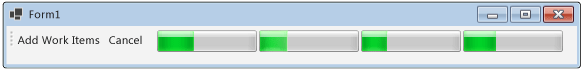

# How to: Cancel a Dataflow Block
This document demonstrates how to enable cancellation in your application. This example uses Windows Forms to show where work items are active in a dataflow pipeline and also the effects of cancellation.  

[!INCLUDE [tpl-install-instructions](../../../includes/tpl-install-instructions.md)]
  
## To Create the Windows Forms Application  
  
1.  Create a C# or Visual Basic **Windows Forms Application** project. In the following steps, the project is named `CancellationWinForms`.  
  
2.  On the form designer for the main form, Form1.cs (Form1.vb for [!INCLUDE[vbprvb](../../../includes/vbprvb-md.md)]), add a <xref:System.Windows.Forms.ToolStrip> control.  
  
3.  Add a <xref:System.Windows.Forms.ToolStripButton> control to the <xref:System.Windows.Forms.ToolStrip> control. Set the <xref:System.Windows.Forms.ToolStripItem.DisplayStyle%2A> property to <xref:System.Windows.Forms.ToolStripItemDisplayStyle.Text> and the <xref:System.Windows.Forms.ToolStripItem.Text%2A> property to **Add Work Items**.  
  
4.  Add a second <xref:System.Windows.Forms.ToolStripButton> control to the <xref:System.Windows.Forms.ToolStrip> control. Set the <xref:System.Windows.Forms.ToolStripItem.DisplayStyle%2A> property to <xref:System.Windows.Forms.ToolStripItemDisplayStyle.Text>, the <xref:System.Windows.Forms.ToolStripItem.Text%2A> property to **Cancel**, and the <xref:System.Windows.Forms.ToolStripItem.Enabled%2A> property to `False`.  
  
5.  Add four <xref:System.Windows.Forms.ToolStripProgressBar> objects to the <xref:System.Windows.Forms.ToolStrip> control.  
  
## Creating the Dataflow Pipeline  
 This section describes how to create the dataflow pipeline that processes work items and updates the progress bars.  
  
### To Create the Dataflow Pipeline  
  
1.  In your project, add a reference to System.Threading.Tasks.Dataflow.dll.  
  
2.  Ensure that Form1.cs (Form1.vb for [!INCLUDE[vbprvb](../../../includes/vbprvb-md.md)]) contains the following `using` statements (`Imports` in [!INCLUDE[vbprvb](../../../includes/vbprvb-md.md)]).  
  
     [!code-csharp[TPLDataflow_CancellationWinForms#1](../../../samples/snippets/csharp/VS_Snippets_Misc/tpldataflow_cancellationwinforms/cs/cancellationwinforms/form1.cs#1)]
     [!code-vb[TPLDataflow_CancellationWinForms#1](../../../samples/snippets/visualbasic/VS_Snippets_Misc/tpldataflow_cancellationwinforms/vb/cancellationwinforms/form1.vb#1)]  
  
3.  Add the `WorkItem` class as an inner type of the `Form1` class.  
  
     [!code-csharp[TPLDataflow_CancellationWinForms#2](../../../samples/snippets/csharp/VS_Snippets_Misc/tpldataflow_cancellationwinforms/cs/cancellationwinforms/form1.cs#2)]
     [!code-vb[TPLDataflow_CancellationWinForms#2](../../../samples/snippets/visualbasic/VS_Snippets_Misc/tpldataflow_cancellationwinforms/vb/cancellationwinforms/form1.vb#2)]  
  
4.  Add the following data members to the `Form1` class.  
  
     [!code-csharp[TPLDataflow_CancellationWinForms#3](../../../samples/snippets/csharp/VS_Snippets_Misc/tpldataflow_cancellationwinforms/cs/cancellationwinforms/form1.cs#3)]
     [!code-vb[TPLDataflow_CancellationWinForms#3](../../../samples/snippets/visualbasic/VS_Snippets_Misc/tpldataflow_cancellationwinforms/vb/cancellationwinforms/form1.vb#3)]  
  
5.  Add the following method, `CreatePipeline`, to the `Form1` class.  
  
     [!code-csharp[TPLDataflow_CancellationWinForms#4](../../../samples/snippets/csharp/VS_Snippets_Misc/tpldataflow_cancellationwinforms/cs/cancellationwinforms/form1.cs#4)]
     [!code-vb[TPLDataflow_CancellationWinForms#4](../../../samples/snippets/visualbasic/VS_Snippets_Misc/tpldataflow_cancellationwinforms/vb/cancellationwinforms/form1.vb#4)]  
  
 Because the `incrementProgress` and `decrementProgress` dataflow blocks act on the user interface, it is important that these actions occur on the user-interface thread. To accomplish this, during construction these objects each provide a <xref:System.Threading.Tasks.Dataflow.ExecutionDataflowBlockOptions> object that has the <xref:System.Threading.Tasks.Dataflow.DataflowBlockOptions.TaskScheduler%2A> property set to <xref:System.Threading.Tasks.TaskScheduler.FromCurrentSynchronizationContext%2A?displayProperty=nameWithType>. The <xref:System.Threading.Tasks.TaskScheduler.FromCurrentSynchronizationContext%2A?displayProperty=nameWithType> method creates a <xref:System.Threading.Tasks.TaskScheduler> object that performs work on the current synchronization context. Because the `Form1` constructor is called from the user-interface thread, the actions for the `incrementProgress` and `decrementProgress` dataflow blocks also run on the user-interface thread.  
  
 This example sets the <xref:System.Threading.Tasks.Dataflow.DataflowBlockOptions.CancellationToken%2A> property when it constructs the members of the pipeline. Because the <xref:System.Threading.Tasks.Dataflow.DataflowBlockOptions.CancellationToken%2A> property permanently cancels dataflow block execution, the whole pipeline must be recreated after the user cancels the operation and then wants to add more work items to the pipeline. For an example that demonstrates an alternative way to cancel a dataflow block so that other work can be performed after an operation is canceled, see [Walkthrough: Using Dataflow in a Windows Forms Application](../../../docs/standard/parallel-programming/walkthrough-using-dataflow-in-a-windows-forms-application.md).  
  
## Connecting the Dataflow Pipeline to the User Interface  
 This section describes how to connect the dataflow pipeline to the user interface. Both creating the pipeline and adding work items to the pipeline are controlled by the event handler for the **Add Work Items** button. Cancellation is initiated by the **Cancel** button. When the user clicks either of these buttons, the appropriate action is initiated in an asynchronous manner.  
  
### To Connect the Dataflow Pipeline to the User Interface  
  
1.  On the form designer for the main form, create an event handler for the <xref:System.Windows.Forms.ToolStripItem.Click> event for the **Add Work Items** button.  
  
2.  Implement the <xref:System.Windows.Forms.ToolStripItem.Click> event for the **Add Work Items** button.  
  
     [!code-csharp[TPLDataflow_CancellationWinForms#5](../../../samples/snippets/csharp/VS_Snippets_Misc/tpldataflow_cancellationwinforms/cs/cancellationwinforms/form1.cs#5)]
     [!code-vb[TPLDataflow_CancellationWinForms#5](../../../samples/snippets/visualbasic/VS_Snippets_Misc/tpldataflow_cancellationwinforms/vb/cancellationwinforms/form1.vb#5)]  
  
3.  On the form designer for the main form, create an event handler for the <xref:System.Windows.Forms.ToolStripItem.Click> event handler for the **Cancel** button.  
  
4.  Implement the <xref:System.Windows.Forms.ToolStripItem.Click> event handler for the **Cancel** button.  
  
     [!code-csharp[TPLDataflow_CancellationWinForms#6](../../../samples/snippets/csharp/VS_Snippets_Misc/tpldataflow_cancellationwinforms/cs/cancellationwinforms/form1.cs#6)]
     [!code-vb[TPLDataflow_CancellationWinForms#6](../../../samples/snippets/visualbasic/VS_Snippets_Misc/tpldataflow_cancellationwinforms/vb/cancellationwinforms/form1.vb#6)]  
  
## Example  
 The following example shows the complete code for Form1.cs (Form1.vb for [!INCLUDE[vbprvb](../../../includes/vbprvb-md.md)]).  
  
 [!code-csharp[TPLDataflow_CancellationWinForms#100](../../../samples/snippets/csharp/VS_Snippets_Misc/tpldataflow_cancellationwinforms/cs/cancellationwinforms/form1.cs#100)]
 [!code-vb[TPLDataflow_CancellationWinForms#100](../../../samples/snippets/visualbasic/VS_Snippets_Misc/tpldataflow_cancellationwinforms/vb/cancellationwinforms/form1.vb#100)]  
  
 The following illustration shows the running application.  
  
   

## See Also  
 [Dataflow](../../../docs/standard/parallel-programming/dataflow-task-parallel-library.md)
