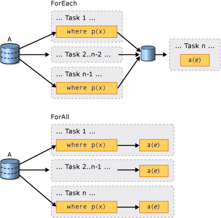

# Introduction to PLINQ
## What is a Parallel Query?  
 Language-Integrated Query (LINQ) was introduced in the [!INCLUDE[net_v35_long](../../../includes/net-v35-long-md.md)].  It features a unified model for querying any <xref:System.Collections.IEnumerable?displayProperty=nameWithType> or <xref:System.Collections.Generic.IEnumerable%601?displayProperty=nameWithType> data source in a type-safe manner. LINQ to Objects is the name for LINQ queries that are run against in-memory collections such as <xref:System.Collections.Generic.List%601> and arrays. This article assumes that you have a basic understanding of LINQ. For more information, see [LINQ (Language-Integrated Query)](https://msdn.microsoft.com/library/a73c4aec-5d15-4e98-b962-1274021ea93d).  
  
 Parallel LINQ (PLINQ) is a parallel implementation of the LINQ pattern. A PLINQ query in many ways resembles a non-parallel LINQ to Objects query. PLINQ queries, just like sequential [!INCLUDE[vbteclinq](../../../includes/vbteclinq-md.md)] queries, operate on any in-memory <xref:System.Collections.IEnumerable> or <xref:System.Collections.Generic.IEnumerable%601> data source, and have deferred execution, which means they do not begin executing until the query is enumerated. The primary difference is that PLINQ attempts to make full use of all the processors on the system. It does this by partitioning the data source into segments, and then executing the query on each segment on separate worker threads in parallel on multiple processors. In many cases, parallel execution means that the query runs significantly faster.  
  
 Through parallel execution, PLINQ can achieve significant performance improvements over legacy code for certain kinds of queries, often just by adding the <xref:System.Linq.ParallelEnumerable.AsParallel%2A> query operation to the data source. However, parallelism can introduce its own complexities, and not all query operations run faster in PLINQ. In fact, parallelization actually slows down certain queries. Therefore, you should understand how issues such as ordering affect parallel queries. For more information, see [Understanding Speedup in PLINQ](../../../docs/standard/parallel-programming/understanding-speedup-in-plinq.md).  
  
> [!NOTE]
>  This documentation uses lambda expressions to define delegates in PLINQ. If you are not familiar with lambda expressions in C# or Visual Basic, see [Lambda Expressions in PLINQ and TPL](../../../docs/standard/parallel-programming/lambda-expressions-in-plinq-and-tpl.md).  
  
 The remainder of this article gives an overview of the main PLINQ classes, and discusses how to create PLINQ queries. Each section contains links to more detailed information and code examples.  
  
## The ParallelEnumerable Class  
 The <xref:System.Linq.ParallelEnumerable?displayProperty=nameWithType> class exposes almost all of PLINQ's functionality.  It and the rest of the <xref:System.Linq?displayProperty=nameWithType> namespace types are compiled into the System.Core.dll assembly. The default C# and Visual Basic projects in Visual Studio both reference the assembly and import the namespace.  
  
 <xref:System.Linq.ParallelEnumerable> includes implementations of all the standard query operators that LINQ to Objects supports, although it does not attempt to parallelize each one. If you are not familiar with [!INCLUDE[vbteclinq](../../../includes/vbteclinq-md.md)], see [Introduction to LINQ](https://msdn.microsoft.com/library/24dddf19-12a0-4707-a4bc-eba4fa7f219e).  
  
 In addition to the standard query operators, the <xref:System.Linq.ParallelEnumerable> class contains a set of methods that enable behaviors specific to parallel execution. These PLINQ-specific methods are listed in the following table.  
  
|ParallelEnumerable Operator|Description|  
|---------------------------------|-----------------|  
|<xref:System.Linq.ParallelEnumerable.AsParallel%2A>|The entry point for PLINQ. Specifies that the rest of the query should be parallelized, if it is possible.|  
|<xref:System.Linq.ParallelEnumerable.AsSequential%2A>|Specifies that the rest of the query should be run sequentially, as a non-parallel LINQ query.|  
|<xref:System.Linq.ParallelEnumerable.AsOrdered%2A>|Specifies that PLINQ should preserve the ordering of the source sequence for the rest of the query, or until the ordering is changed, for example by the use of an orderby (Order By in Vlsual Basic) clause.|  
|<xref:System.Linq.ParallelEnumerable.AsUnordered%2A>|Specifies that PLINQ for the rest of the query is not required to preserve the ordering of the source sequence.|  
|<xref:System.Linq.ParallelEnumerable.WithCancellation%2A>|Specifies that PLINQ should periodically monitor the state of the provided cancellation token and cancel execution if it is requested.|  
|<xref:System.Linq.ParallelEnumerable.WithDegreeOfParallelism%2A>|Specifies the maximum number of processors that PLINQ should use to parallelize the query.|  
|<xref:System.Linq.ParallelEnumerable.WithMergeOptions%2A>|Provides a hint about how PLINQ should, if it is possible, merge parallel results back into just one sequence on the consuming thread.|  
|<xref:System.Linq.ParallelEnumerable.WithExecutionMode%2A>|Specifies whether PLINQ should parallelize the query even when the default behavior would be to run it sequentially.|  
|<xref:System.Linq.ParallelEnumerable.ForAll%2A>|A multithreaded enumeration method that, unlike iterating over the results of the query, enables results to be processed in parallel without first merging back to the consumer thread.|  
|<xref:System.Linq.ParallelEnumerable.Aggregate%2A> overload|An overload that is unique to PLINQ and enables intermediate aggregation over thread-local partitions, plus a final aggregation function to combine the results of all partitions.|  
  
## The Opt-in Model  
 When you write a query, opt in to PLINQ by invoking the <xref:System.Linq.ParallelEnumerable.AsParallel%2A?displayProperty=nameWithType> extension method on the data source, as shown in the following example.  
  
 [!code-csharp[PLINQ#1](../../../samples/snippets/csharp/VS_Snippets_Misc/plinq/cs/plinq2_cs.cs#1)]
 [!code-vb[PLINQ#1](../../../samples/snippets/visualbasic/VS_Snippets_Misc/plinq/vb/plinq2_vb.vb#1)]  
  
 The <xref:System.Linq.ParallelEnumerable.AsParallel%2A> extension method binds the subsequent query operators, in this case, `where` and `select`, to the <xref:System.Linq.ParallelEnumerable?displayProperty=nameWithType> implementations.  
  
## Execution Modes  
 By default, PLINQ is conservative. At run time, the PLINQ infrastructure analyzes the overall structure of the query. If the query is likely to yield speedups by parallelization, PLINQ partitions the source sequence into tasks that can be run concurrently. If it is not safe to parallelize a query, PLINQ just runs the query sequentially. If PLINQ has a choice between a potentially expensive parallel algorithm or an inexpensive sequential algorithm, it chooses the sequential algorithm by default. You can use the <xref:System.Linq.ParallelEnumerable.WithExecutionMode%2A> method and the <xref:System.Linq.ParallelExecutionMode?displayProperty=nameWithType> enumeration to instruct PLINQ to select the parallel algorithm. This is useful when you know by testing and measurement that a particular query executes faster in parallel. For more information, see [How to: Specify the Execution Mode in PLINQ](../../../docs/standard/parallel-programming/how-to-specify-the-execution-mode-in-plinq.md).  
  
## Degree of Parallelism  
 By default, PLINQ uses all of the processors on the host computer. You can instruct PLINQ to use no more than a specified number of processors by using the <xref:System.Linq.ParallelEnumerable.WithDegreeOfParallelism%2A> method. This is useful when you want to make sure that other processes running on the computer receive a certain amount of CPU time. The following snippet limits the query to utilizing a maximum of two processors.  
  
 [!code-csharp[PLINQ#5](../../../samples/snippets/csharp/VS_Snippets_Misc/plinq/cs/plinqsamples.cs#5)]
 [!code-vb[PLINQ#5](../../../samples/snippets/visualbasic/VS_Snippets_Misc/plinq/vb/plinq2_vb.vb#5)]  
  
 In cases where a query is performing a significant amount of non-compute-bound work such as File I/O, it might be beneficial to specify a degree of parallelism greater than the number of cores on the machine.  
  
## Ordered Versus Unordered Parallel Queries  
 In some queries, a query operator must produce results that preserve the ordering of the source sequence. PLINQ provides the <xref:System.Linq.ParallelEnumerable.AsOrdered%2A> operator for this purpose. <xref:System.Linq.ParallelEnumerable.AsOrdered%2A> is distinct from <xref:System.Linq.ParallelEnumerable.AsSequential%2A>. An <xref:System.Linq.ParallelEnumerable.AsOrdered%2A> sequence is still processed in parallel, but its results are buffered and sorted. Because order preservation typically involves extra work, an <xref:System.Linq.ParallelEnumerable.AsOrdered%2A> sequence might be processed more slowly than the default <xref:System.Linq.ParallelEnumerable.AsUnordered%2A> sequence. Whether a particular ordered parallel operation is faster than a sequential version of the operation depends on many factors.  
  
 The following code example shows how to opt in to order preservation.  
  
 [!code-csharp[PLINQ#3](../../../samples/snippets/csharp/VS_Snippets_Misc/plinq/cs/plinq2_cs.cs#3)]
 [!code-vb[PLINQ#3](../../../samples/snippets/visualbasic/VS_Snippets_Misc/plinq/vb/plinq2_vb.vb#3)]  
  
 For more information, see [Order Preservation in PLINQ](../../../docs/standard/parallel-programming/order-preservation-in-plinq.md).  
  
## Parallel vs. Sequential Queries  
 Some operations require that the source data be delivered in a sequential manner. The <xref:System.Linq.ParallelEnumerable> query operators revert to sequential mode automatically when it is required. For user-defined query operators and user delegates that require sequential execution, PLINQ provides the <xref:System.Linq.ParallelEnumerable.AsSequential%2A> method. When you use <xref:System.Linq.ParallelEnumerable.AsSequential%2A>, all subsequent operators in the query are executed sequentially until <xref:System.Linq.ParallelEnumerable.AsParallel%2A> is called again. For more information, see [How to: Combine Parallel and Sequential LINQ Queries](../../../docs/standard/parallel-programming/how-to-combine-parallel-and-sequential-linq-queries.md).  
  
## Options for Merging Query Results  
 When a PLINQ query executes in parallel, its results from each worker thread must be merged back onto the main thread for consumption by a `foreach` loop (`For Each` in [!INCLUDE[vbprvb](../../../includes/vbprvb-md.md)]), or insertion into a list or array. In some cases, it might be beneficial to specify a particular kind of merge operation, for example, to begin producing results more quickly. For this purpose, PLINQ supports the <xref:System.Linq.ParallelEnumerable.WithMergeOptions%2A> method, and the <xref:System.Linq.ParallelMergeOptions> enumeration. For more information, see [Merge Options in PLINQ](../../../docs/standard/parallel-programming/merge-options-in-plinq.md).  
  
## The ForAll Operator  
 In sequential [!INCLUDE[vbteclinq](../../../includes/vbteclinq-md.md)] queries, execution is deferred until the query is enumerated either in a `foreach` (`For Each` in [!INCLUDE[vbprvb](../../../includes/vbprvb-md.md)]) loop or by invoking a method such as <xref:System.Linq.ParallelEnumerable.ToList%2A> , <xref:System.Linq.ParallelEnumerable.ToArray%2A> , or <xref:System.Linq.ParallelEnumerable.ToDictionary%2A>. In PLINQ, you can also use `foreach` to execute the query and iterate through the results. However, `foreach` itself does not run in parallel, and therefore, it requires that the output from all parallel tasks be merged back into the thread on which the loop is running. In PLINQ, you can use `foreach` when you must preserve the final ordering of the query results, and also whenever you are processing the results in a serial manner, for example when you are calling `Console.WriteLine` for each element. For faster query execution when order preservation is not required and when the processing of the results can itself be parallelized, use the <xref:System.Linq.ParallelEnumerable.ForAll%2A> method to execute a PLINQ query. <xref:System.Linq.ParallelEnumerable.ForAll%2A> does not perform this final merge step. The following code example shows how to use the <xref:System.Linq.ParallelEnumerable.ForAll%2A> method. <xref:System.Collections.Concurrent.ConcurrentBag%601?displayProperty=nameWithType> is used here because it is optimized for multiple threads adding concurrently without attempting to remove any items.  
  
 [!code-csharp[PLINQ#4](../../../samples/snippets/csharp/VS_Snippets_Misc/plinq/cs/plinq2_cs.cs#4)]
 [!code-vb[PLINQ#4](../../../samples/snippets/visualbasic/VS_Snippets_Misc/plinq/vb/plinq2_vb.vb#4)]  
  
 The following illustration shows the difference between `foreach` and <xref:System.Linq.ParallelEnumerable.ForAll%2A> with regard to query execution.  
  
   
  
## Cancellation  
 PLINQ is integrated with the cancellation types in [!INCLUDE[net_v40_short](../../../includes/net-v40-short-md.md)]. (For more information, see [Cancellation in Managed Threads](../../../docs/standard/threading/cancellation-in-managed-threads.md).) Therefore, unlike sequential LINQ to Objects queries, PLINQ queries can be canceled. To create a cancelable PLINQ query, use the <xref:System.Linq.ParallelEnumerable.WithCancellation%2A> operator on the query and provide a <xref:System.Threading.CancellationToken> instance as the argument. When the <xref:System.Threading.CancellationToken.IsCancellationRequested%2A> property on the token is set to true, PLINQ will notice it, stop processing on all threads, and throw an <xref:System.OperationCanceledException>.  
  
 It is possible that a PLINQ query might continue to process some elements after the cancellation token is set.  
  
 For greater responsiveness, you can also respond to cancellation requests in long-running user delegates. For more information, see [How to: Cancel a PLINQ Query](../../../docs/standard/parallel-programming/how-to-cancel-a-plinq-query.md).  
  
## Exceptions  
 When a PLINQ query executes, multiple exceptions might be thrown from different threads simultaneously. Also, the code to handle the exception might be on a different thread than the code that threw the exception. PLINQ uses the <xref:System.AggregateException> type to encapsulate all the exceptions that were thrown by a query, and marshal those exceptions back to the calling thread. On the calling thread, only one try-catch block is required. However, you can iterate through all of the exceptions that are encapsulated in the <xref:System.AggregateException> and catch any that you can safely recover from. In rare cases, some exceptions may be thrown that are not wrapped in an <xref:System.AggregateException>, and <xref:System.Threading.ThreadAbortException>s  are also not wrapped.  
  
 When exceptions are allowed to bubble up back to the joining thread, then it is possible that a query may continue to process some items after the exception is raised.  
  
 For more information, see [How to: Handle Exceptions in a PLINQ Query](../../../docs/standard/parallel-programming/how-to-handle-exceptions-in-a-plinq-query.md).  
  
## Custom Partitioners  
 In some cases, you can improve query performance by writing a custom partitioner that takes advantage of some characteristic of the source data. In the query, the custom partitioner itself is the enumerable object that is queried.  
  
 [!code-csharp[PLINQ#2](../../../samples/snippets/csharp/VS_Snippets_Misc/plinq/cs/plinq2_cs.cs#2)]
 [!code-vb[PLINQ#2](../../../samples/snippets/visualbasic/VS_Snippets_Misc/plinq/vb/plinq3.vb#2)]  
  
 PLINQ supports a fixed number of partitions (although data may be dynamically reassigned to those partitions during run time for load balancing.). <xref:System.Threading.Tasks.Parallel.For%2A> and <xref:System.Threading.Tasks.Parallel.ForEach%2A> support only dynamic partitioning, which means that the number of partitions changes at run time. For more information, see [Custom Partitioners for PLINQ and TPL](../../../docs/standard/parallel-programming/custom-partitioners-for-plinq-and-tpl.md).  
  
## Measuring PLINQ Performance  
 In many cases, a query can be parallelized, but the overhead of setting up the parallel query outweighs the performance benefit gained. If a query does not perform much computation or if the data source is small, a PLINQ query may be slower than a sequential LINQ to Objects query. You can use the Parallel Performance Analyzer in Visual Studio Team Server to compare the performance of various queries, to locate processing bottlenecks, and to determine whether your query is running in parallel or sequentially. For more information, see [Concurrency Visualizer](/visualstudio/profiling/concurrency-visualizer) and [How to: Measure PLINQ Query Performance](../../../docs/standard/parallel-programming/how-to-measure-plinq-query-performance.md).  
  
## See Also  
 [Parallel LINQ (PLINQ)](../../../docs/standard/parallel-programming/parallel-linq-plinq.md)  
 [Understanding Speedup in PLINQ](../../../docs/standard/parallel-programming/understanding-speedup-in-plinq.md)
