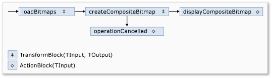
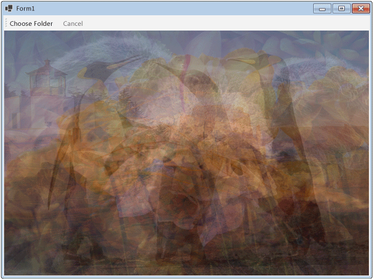

# Walkthrough: Using Dataflow in a Windows Forms Application
This document demonstrates how to create a network of dataflow blocks that perform image processing in a Windows Forms application.  
  
 This example loads image files from the specified folder, creates a composite image, and displays the result. The example uses the dataflow model to route images through the network. In the dataflow model, independent components of a program communicate with one another by sending messages. When a component receives a message, it performs some action and then passes the result to another component. Compare this with the control flow model, in which an application uses control structures, for example, conditional statements, loops, and so on, to control the order of operations in a program.  
  
## Prerequisites  
 Read [Dataflow](../../../docs/standard/parallel-programming/dataflow-task-parallel-library.md) before you start this walkthrough.  

[!INCLUDE [tpl-install-instructions](../../../includes/tpl-install-instructions.md)]

## Sections  
 This walkthrough contains the following sections:  
  
-   [Creating the Windows Forms Application](#winforms)  
  
-   [Creating the Dataflow Network](#network)  
  
-   [Connecting the Dataflow Network to the User Interface](#ui)  
  
-   [The Complete Example](#complete)  
  
   
## Creating the Windows Forms Application  
 This section describes how to create the basic Windows Forms application and add controls to the main form.  
  
#### To Create the Windows Forms Application  
  
1.  In [!INCLUDE[vsprvs](../../../includes/vsprvs-md.md)], create a [!INCLUDE[csprcs](../../../includes/csprcs-md.md)] or Visual Basic **Windows Forms Application** project. In this document, the project is named `CompositeImages`.  
  
2.  On the form designer for the main form, Form1.cs (Form1.vb for [!INCLUDE[vbprvb](../../../includes/vbprvb-md.md)]), add a <xref:System.Windows.Forms.ToolStrip> control.  
  
3.  Add a <xref:System.Windows.Forms.ToolStripButton> control to the <xref:System.Windows.Forms.ToolStrip> control. Set the <xref:System.Windows.Forms.ToolStripItem.DisplayStyle%2A> property to <xref:System.Windows.Forms.ToolStripItemDisplayStyle.Text> and the <xref:System.Windows.Forms.ToolStripItem.Text%2A> property to **Choose Folder**.  
  
4.  Add a second <xref:System.Windows.Forms.ToolStripButton> control to the <xref:System.Windows.Forms.ToolStrip> control. Set the <xref:System.Windows.Forms.ToolStripItem.DisplayStyle%2A> property to <xref:System.Windows.Forms.ToolStripItemDisplayStyle.Text>, the <xref:System.Windows.Forms.ToolStripItem.Text%2A> property to **Cancel**, and the <xref:System.Windows.Forms.ToolStripItem.Enabled%2A> property to `False`.  
  
5.  Add a <xref:System.Windows.Forms.PictureBox> object to the main form. Set the <xref:System.Windows.Forms.Control.Dock%2A> property to <xref:System.Windows.Forms.DockStyle.Fill>.  
  
   
## Creating the Dataflow Network  
 This section describes how to create the dataflow network that performs image processing.  
  
#### To Create the Dataflow Network  
  
1.  Add a reference to System.Threading.Tasks.Dataflow.dll to your project.  
  
2.  Ensure that Form1.cs (Form1.vb for [!INCLUDE[vbprvb](../../../includes/vbprvb-md.md)]) contains the following `using` (`Using` in [!INCLUDE[vbprvb](../../../includes/vbprvb-md.md)]) statements:  
  
     [!code-csharp[TPLDataflow_CompositeImages#1](../../../samples/snippets/csharp/VS_Snippets_Misc/tpldataflow_compositeimages/cs/compositeimages/form1.cs#1)]  
  
3.  Add the following data members to the `Form1` class:  
  
     [!code-csharp[TPLDataflow_CompositeImages#2](../../../samples/snippets/csharp/VS_Snippets_Misc/tpldataflow_compositeimages/cs/compositeimages/form1.cs#2)]  
  
4.  Add the following method, `CreateImageProcessingNetwork`, to the `Form1` class. This method creates the image processing network.  
  
     [!code-csharp[TPLDataflow_CompositeImages#3](../../../samples/snippets/csharp/VS_Snippets_Misc/tpldataflow_compositeimages/cs/compositeimages/form1.cs#3)]  
  
5.  Implement the `LoadBitmaps` method.  
  
     [!code-csharp[TPLDataflow_CompositeImages#4](../../../samples/snippets/csharp/VS_Snippets_Misc/tpldataflow_compositeimages/cs/compositeimages/form1.cs#4)]  
  
6.  Implement the `CreateCompositeBitmap` method.  
  
     [!code-csharp[TPLDataflow_CompositeImages#5](../../../samples/snippets/csharp/VS_Snippets_Misc/tpldataflow_compositeimages/cs/compositeimages/form1.cs#5)]  
  
    > [!NOTE]
    >  The C# version of the `CreateCompositeBitmap` method uses pointers to enable efficient processing of the <xref:System.Drawing.Bitmap?displayProperty=nameWithType> objects. Therefore, you must enable the **Allow unsafe code** option in your project in order to use the [unsafe](~/docs/csharp/language-reference/keywords/unsafe.md) keyword. For more information about how to enable unsafe code in a [!INCLUDE[csprcs](../../../includes/csprcs-md.md)] project, see [Build Page, Project Designer (C#)](/visualstudio/ide/reference/build-page-project-designer-csharp).  
  
 The following table describes the members of the network.  
  
|Member|Type|Description|  
|------------|----------|-----------------|  
|`loadBitmaps`|<xref:System.Threading.Tasks.Dataflow.TransformBlock%602>|Takes a folder path as input and produces a collection of <xref:System.Drawing.Bitmap> objects as output.|  
|`createCompositeBitmap`|<xref:System.Threading.Tasks.Dataflow.TransformBlock%602>|Takes a collection of <xref:System.Drawing.Bitmap> objects as input and produces a composite bitmap as output.|  
|`displayCompositeBitmap`|<xref:System.Threading.Tasks.Dataflow.ActionBlock%601>|Displays the composite bitmap on the form.|  
|`operationCancelled`|<xref:System.Threading.Tasks.Dataflow.ActionBlock%601>|Displays an image to indicate that the operation is canceled and enables the user to select another folder.|  
  
 To connect the dataflow blocks to form a network, this example uses the <xref:System.Threading.Tasks.Dataflow.ISourceBlock%601.LinkTo%2A> method. The <xref:System.Threading.Tasks.Dataflow.ISourceBlock%601.LinkTo%2A> method contains an overloaded version that takes a <xref:System.Predicate%601> object that determines whether the target block accepts or rejects a message. This filtering mechanism enables message blocks to receive only certain values. In this example, the network can branch in one of two ways. The main branch loads the images from disk, creates the composite image, and displays that image on the form. The alternate branch cancels the current operation. The <xref:System.Predicate%601> objects enable the dataflow blocks along the main branch to switch to the alternative branch by rejecting certain messages. For example, if the user cancels the operation, the dataflow block `createCompositeBitmap` produces `null` (`Nothing` in [!INCLUDE[vbprvb](../../../includes/vbprvb-md.md)]) as its output. The dataflow block `displayCompositeBitmap` rejects `null` input values, and therefore, the message is offered to `operationCancelled`. The dataflow block `operationCancelled` accepts all messages and therefore, displays an image to indicate that the operation is canceled.  
  
 The following illustration shows the image processing network.  
  
   
  
 Because the `displayCompositeBitmap` and `operationCancelled` dataflow blocks act on the user interface, it is important that these actions occur on the user-interface thread. To accomplish this, during construction, these objects each provide a <xref:System.Threading.Tasks.Dataflow.ExecutionDataflowBlockOptions> object that has the <xref:System.Threading.Tasks.Dataflow.DataflowBlockOptions.TaskScheduler%2A> property set to <xref:System.Threading.Tasks.TaskScheduler.FromCurrentSynchronizationContext%2A?displayProperty=nameWithType>. The <xref:System.Threading.Tasks.TaskScheduler.FromCurrentSynchronizationContext%2A?displayProperty=nameWithType> method creates a <xref:System.Threading.Tasks.TaskScheduler> object that performs work on the current synchronization context. Because the `CreateImageProcessingNetwork` method is called from the handler of the **Choose Folder** button, which runs on the user-interface thread, the actions for the `displayCompositeBitmap` and `operationCancelled` dataflow blocks also run on the user-interface thread.  
  
 This example uses a shared cancellation token instead of setting the <xref:System.Threading.Tasks.Dataflow.DataflowBlockOptions.CancellationToken%2A> property because the <xref:System.Threading.Tasks.Dataflow.DataflowBlockOptions.CancellationToken%2A> property permanently cancels dataflow block execution. A cancellation token enables this example to reuse the same dataflow network multiple times, even when the user cancels one or more operations. For an example that uses <xref:System.Threading.Tasks.Dataflow.DataflowBlockOptions.CancellationToken%2A> to permanently cancel the execution of a dataflow block, see [How to: Cancel a Dataflow Block](../../../docs/standard/parallel-programming/how-to-cancel-a-dataflow-block.md).  
  
   
## Connecting the Dataflow Network to the User Interface  
 This section describes how to connect the dataflow network to the user interface. The creation of the composite image and cancellation of the operation are initiated from the **Choose Folder** and **Cancel** buttons. When the user chooses either of these buttons, the appropriate action is initiated in an asynchronous manner.  
  
#### To Connect the Dataflow Network to the User Interface  
  
1.  On the form designer for the main form, create an event handler for the <xref:System.Windows.Forms.ToolStripItem.Click> event for the **Choose Folder** button.  
  
2.  Implement the <xref:System.Windows.Forms.ToolStripItem.Click> event for the **Choose Folder** button.  
  
     [!code-csharp[TPLDataflow_CompositeImages#6](../../../samples/snippets/csharp/VS_Snippets_Misc/tpldataflow_compositeimages/cs/compositeimages/form1.cs#6)]  
  
3.  On the form designer for the main form, create an event handler for the <xref:System.Windows.Forms.ToolStripItem.Click> event for the **Cancel** button.  
  
4.  Implement the <xref:System.Windows.Forms.ToolStripItem.Click> event for the **Cancel** button.  
  
     [!code-csharp[TPLDataflow_CompositeImages#7](../../../samples/snippets/csharp/VS_Snippets_Misc/tpldataflow_compositeimages/cs/compositeimages/form1.cs#7)]  
  
   
## The Complete Example  
 The following example shows the complete code for this walkthrough.  
  
 [!code-csharp[TPLDataflow_CompositeImages#100](../../../samples/snippets/csharp/VS_Snippets_Misc/tpldataflow_compositeimages/cs/compositeimages/form1.cs#100)]  
  
 The following illustration shows typical output for the common \Sample Pictures\ folder.  
  
   

## See Also  
 [Dataflow](../../../docs/standard/parallel-programming/dataflow-task-parallel-library.md)
