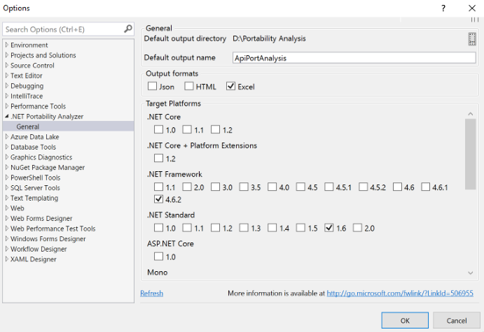
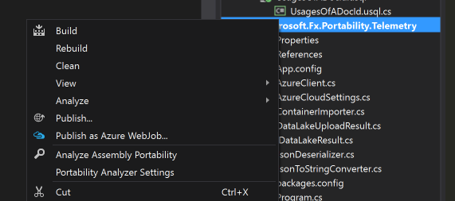

# The .NET Portability Analyzer

Want to make your libraries multi-platform? Want to see how much work is required to make your application compatible with other .NET platforms? The [.NET Portability Analyzer](http://go.microsoft.com/fwlink/?LinkID=507467) is a tool that provides you with a detailed report on how flexible your program is across .NET platforms by analyzing assemblies. The Portability Analyzer is offered as a Visual Studio Extension and as a console app.

## New targets

*   [.NET Core](https://www.dotnetfoundation.org/netcore): Has a modular design, employs side-by-side, and targets cross-platform scenarios. Side-by-side allows you to adopt new .NET Core versions without breaking other apps.
*   [ASP.NET Core](https://www.dotnetfoundation.org/aspnet-core): is a modern web-framework built on .NET Core thus giving developers the same benefits.
*   [.NET Native](https://blogs.msdn.microsoft.com/dotnet/2014/04/24/net-native-performance): Improve performance of your Windows Store apps that run on x64 and ARM machines by using .NET Native’s static compilation.

## How to use Portability Analyzer

To begin using the .NET Portability Analyzer, you first need to download and install the extension from the [Visual Studio Gallery](http://go.microsoft.com/fwlink/?LinkID=507467). You can configure it in Visual Studio via **Tools** > **Options** > **.NET Portability Analyzer** and select your Target Platforms. For now, use ASP.NET Core as a proxy for all .NET Core-based platforms (for example, [Windows 10 .NET UAP apps](http://blogs.windows.com/buildingapps/2015/03/02/a-first-look-at-the-windows-10-universal-app-platform/)).

To analyze your entire project, right-click on your project in **Solution Explorer** and select **Analyze** > **Analyze Assembly Portability**. Otherwise, go to the **Analyze** menu and select **Analyze Assembly Portability**. From there, select your project’s executable or DLL.

After running the analysis, you will see your .NET Portability Report. Only types that are unsupported by a target platform will appear in the list and you can review recommendations in the **Messages** tab in the **Error List**. You can also jump to problem areas directly from the **Messages** tab.

Don’t want to use Visual Studio? You can also use the Portability Analyzer from the command prompt. Just download the [API Portability Analyzer](http://www.microsoft.com/download/details.aspx?id=42678).

*   Type the following command to analyze the current directory: `\...\ApiPort.exe .`
*   To analyze a specific list of .dll files, type the following command: `\...\ApiPort.exe first.dll second.dll third.dll`

Your .NET Portability Report will be saved as an Excel file (*.xlsx*) in your current directory. The **Details** tab in the Excel Workbook will contain more information.

For more info on the .NET Portability Analyzer, see the article [Leveraging existing code across .NET platforms](https://blogs.msdn.microsoft.com/dotnet/2014/08/06/leveraging-existing-code-across-net-platforms/) on the .NET blog.
