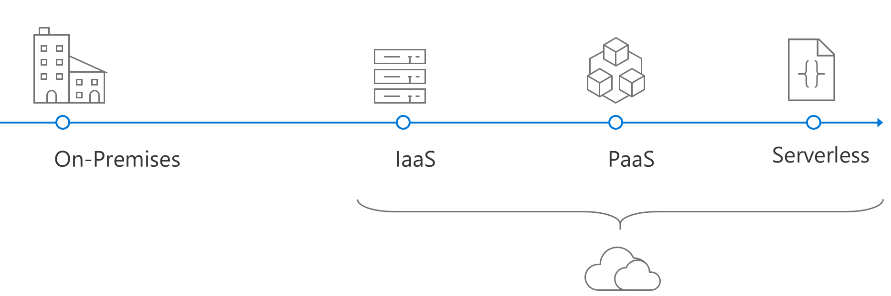

> TODO: Add cover

# Serverless Apps. Architecture, Patterns, and Azure Implementation

DOWNLOAD available at: **TBD**

PUBLISHED BY

Microsoft Developer Division, .NET and Visual Studio product teams

A division of Microsoft Corporation

One Microsoft Way

Redmond, Washington 98052-6399

Copyright © 2017 by Microsoft Corporation

All rights reserved. No part of the contents of this book may be reproduced or transmitted in any form or by any means without the written permission of the publisher.

This book is provided "as-is" and expresses the author's views and opinions. The views, opinions and information expressed in this book, including URL and other Internet website references, may change without notice.

Some examples depicted herein are provided for illustration only and are fictitious. No real association or connection is intended or should be inferred.

Microsoft and the trademarks listed at http://www.microsoft.com on the "Trademarks" webpage are trademarks of the Microsoft group of companies.

Mac and macOS are trademarks of Apple Inc.

The Docker whale logo is a registered trademark of Docker, Inc. Used by permission.

All other marks and logos are property of their respective owners.

Author:

> **Jeremy Likness**, Sr. Cloud Developer Advocate, APEX, Microsoft Corp.

Editors:

Participants and reviewers:

## Introduction

Serverless is the evolution of cloud platforms in the direction of pure cloud native code that brings developers closer to business logic while insulating them from infrastructure concerns. It's a pattern that doesn't imply "no server" but rather, "less server". Serverless code is event-driven. Code may be triggered by anything from a traditional HTTP web request to a timer or the result of uploading a file. The infrastructure behind serverless allows for instant scale to meet elastic demands and offers micro-billing to truly "pay for what you use." Serverless requires a new way thinking and approach to building applications and is not the right solution for every problem. As a developer, you must decide:

* What are the pros and cons of serverless?
* Why should you consider serverless for your own applications?
* How can you build, test, deploy, and maintain your serverless code?
* Where does it make sense to migrate code to serverless in existing applications, and what is the best way to accomplish transformation?

## About this guide

This guide focuses on cloud native development of applications that use serverless. It highlights the benefits and exposes the potential drawbacks of developing serverless apps and provides a survey of serverless architectures. It illustrates numerous examples of how serverless can be used and details various serverless design patterns.

This guide explains the components of the Azure serverless platform and focuses specifically on implementation of serverless using [Azure Functions](https://docs.microsoft.com/azure/azure-functions/functions-overview). You will learn about triggers and bindings as well as how to implement serverless apps that rely on state using durable functions. Finally, business examples and case studies will help provide context and a frame of reference to determine whether serverless is the right approach for your projects.

## Evolution of cloud platforms

Serverless is the culmination of several iterations of cloud platforms.

Before the cloud a discernable boundary existed between development and operations. Deploying an application meant answering myriad questions like:

* What hardware should be installed?
* How is physical access secured to the machine?
* Does the data center require an Uninterruptible Power Supply (UPS)?
* Where are storage backups sent?
* Should there be redundant power?

The list goes on and the overhead was enormous. In many situations, IT departments were forced to deal with incredible waste. The waste was due to over-allocation of servers as backup machines for disaster recovery and standby servers to enable scale out. Fortunately, the introduction of virtualization technology (like [Hyper-V](https://docs.microsoft.com/virtualization/hyper-v-on-windows/about/)) with Virtual Machines (VMs) gave rise to Infrastructure-as-a-Service (IaaS). Virtualized infrastructure allowed operations to stand up a standard set of servers as the backbone, leading to a flexible environment capable of provisioning unique servers "on demand." More important, virtualization set the stage for using the cloud to provide virtual machines "as a service." Companies could easily get out of the business of worrying about redundant power or physical machines. Instead, they focused on the virtual environment.

IaaS still requires heavy overhead because operation is still responsible for various tasks. These include patching and backing up servers, installing packages, keeping the operating, system up to date and monitoring the application. The next evolution solved the overhead by providing Platform-as-a-Service (PaaS). With PaaS, the cloud provider handles operating systems, security patches, and even the required packages to support a specific platform. Instead of building a VM then configuring the .NET Framework and standing up Internet Information Services (IIS) servers, developers simply choose a "platform target" such as "web application" or "API endpoint" and deploy code directly. The infrastructure questions are reduced to:

* What size services are needed?
* How do the services scale out?
* How do the services scale up?

Serverless further abstracts servers by focusing on event-driven code. Instead of a platform, developers can literally focus on a microservice that does one thing. The two key questions for building the serverless code are:

* What triggers the code?
* What does the code do?

With serverless, infrastructure is abstracted. In fact, in some cases the developer no longer must worry about the host at all. Whether or not an instance of IIS, Kestrel, Apache, or some other web server is running to manage web requests, the developer focuses on an HTTP trigger. The trigger provides the standard, cross-platform payload for a request and a response. The payload not only simplifies the development process, but facilitates testing and in some cases, makes the code easily portable across platforms.

Another feature of serverless is micro-billing. Imagine an application with 100 endpoints running on PaaS that is paid for to be available around the clock. If 99 APIs are mostly idle and a single API is called hundreds of millions of times per day, it may make sense to migrate the app to serverless and only pay for usage. Migration may in many circumstances dramatically reduce the ongoing cost to support the endpoints.

## What this guide does not cover

This guide specifically emphasizes architecture approaches and design patterns and is not a "deep dive" into the implementation details of Azure Functions, [Logic Apps](https://docs.microsoft.com/azure/logic-apps/logic-apps-what-are-logic-apps), or other serverless platforms. This guide does not cover, for example, advanced workflows with Logic Apps or features of Azure Functions such as configuring Cross-Origin Resource Sharing (CORS), applying custom domains, or uploading SSL certificates. These details are available through the online [Azure Functions documentation](https://docs.microsoft.com/azure/azure-functions/functions-reference).

### Additional resources

* [Azure Architecture center](https://docs.microsoft.com/azure/architecture/)
* [Best practices for cloud applications](https://docs.microsoft.com/azure/architecture/best-practices/api-design)

## Who should use the guide

This guide was written for developers and solution architects who want to build enterprise applications with .NET that may use serverless components either on premises or in the cloud. It is useful to developers, architects, and technical decision makers interested in:

* Understanding the pros and cons of serverless development
* Learning how to approach serverless architecture
* Interested in example implementations of serverless apps

## How to use the guide

The first part of this guide examines why serverless is a viable option by comparing several different architecture approaches. It examines both the technology and development lifecycle, because all aspects of software development are impacted by architecture decisions. The guide then examines use cases and design patterns and includes reference implementations using Azure Functions. Each section contains additional resources to learn more about a particular area. The guide concludes with resources for walkthroughs and hands-on exploration of serverless implementation.

## Send your feedback

The guide and related samples are constantly evolving, so your feedback is welcomed! If you have comments about how this guide can be improved, send them to:

[link tbd](mailto:)

>[!div class="step-by-step"]
[Next] (architecture-approaches/index.md)
