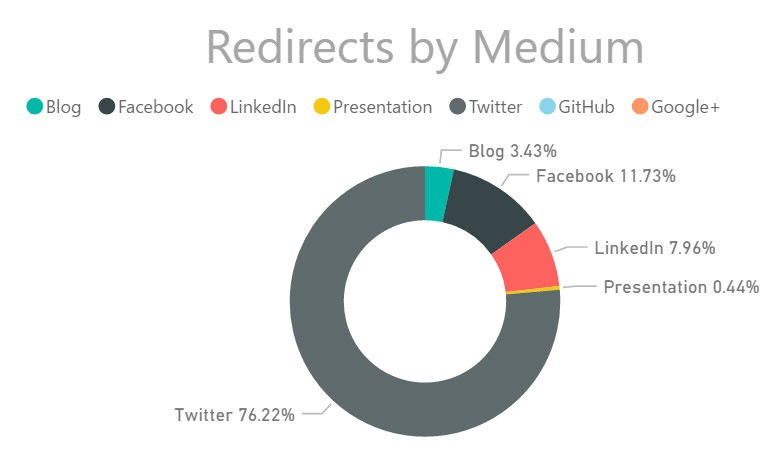

# Serverless business scenarios and use cases

There are many use cases and scenarios for serverless applications. This chapter contains samples that illustrate the different scenarios. The scenarios include links to related documentation and public source code repositories. The samples in this chapter will enable you to get started on your own building and implementing serverless solutions.

## Analyze and archive images

A console application allows you to pass a link to a URL on the web. The app publishes the URL as an event grid message. In parallel, a serverless function app and a logic app subscribe to the message. The serverless function app serializes the image to blob storage. It also stores information in Azure Table Storage about the original image URL and the name of the blob image. The logic app interacts with the Custom Vision API to analyze the image and create a machine-generated caption. The caption is stored in the metadata table.

A separate single page application (SPA) calls a serverless function to get a list of images and metadata. For each image, it calls another function that delivers the image data from the archive. The final result is a gallery with automatic captions.

The full repository and instructions to build the logic app are available here: [Event grid glue](https://github.com/JeremyLikness/Event-Grid-Glue).

## Parse a CSV and insert into a database

Extract, Transform, and Load (ETL) is a common business function that is often necessary for integration between different systems. Traditional approaches often involve setting up dedicated FTP servers then deploying scheduled jobs to parse files and translate them for business use. Serverless architecture makes the job easier because a trigger can fire when the file is uploaded. Azure Functions is composed of small pieces of code that focus on a specific problem and are ideal for tackling tasks like ETL.

For source code and a hands-on lab, see: [CSV import lab](https://github.com/JeremyLikness/azure-fn-file-process-hol).

## Shorten links and track metrics

Link shortening was originally used to encode URLs in short twitter posts to accommodate the 140 character limit. They have grown to encompass a variety of uses, most commonly to track click-throughs for analytics. The link shortener scenario is an entirely serverless application for managing links and reporting metrics.

Azure Functions is used to serve a Single Page Application (SPA) that allows you to paste the long URL and generate short URLs that are tagged to track things like campaigns (topics) and mediums (such as social networks that the links are posted to). The short code is stored in Azure Table Storage as the key, with the long URL as the value. When you click on the short link, another function looks up the long URL, performs a redirect, and places information about the event on a queue. Another Azure Function processes the queue and places the information into CosmosDB.

You can then create a PowerBI dashboard to gather insights about the data collected. On the backend, Application Insights provide important metrics including how long it takes for the average user to redirect and how long it takes to access Azure Table Storage.

The full link shortener repository with instructions is available here: [Serverless URL shortener](https://github.com/jeremylikness/serverless-url-shortener). You can read about a simplified version here: [Azure Storage for serverless .NET apps in minutes](https://blogs.msdn.microsoft.com/webdev/2018/01/25/azure-storage-for-serverless-net-apps-in-minutes/).

## Recommended Resources

* [Azure Storage for serverless .NET apps in minutes](https://blogs.msdn.microsoft.com/webdev/2018/01/25/azure-storage-for-serverless-net-apps-in-minutes/)
* [CSV import lab](https://github.com/JeremyLikness/azure-fn-file-process-hol)
* [Serverless URL shortener](https://github.com/jeremylikness/serverless-url-shortener)

>[!div class="step-by-step"]
[Previous] (../durable-azure-functions/index.md)
[Next] (../serverless-conclusion/index.md)
