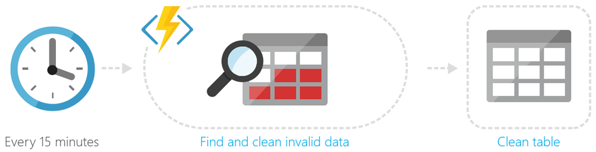
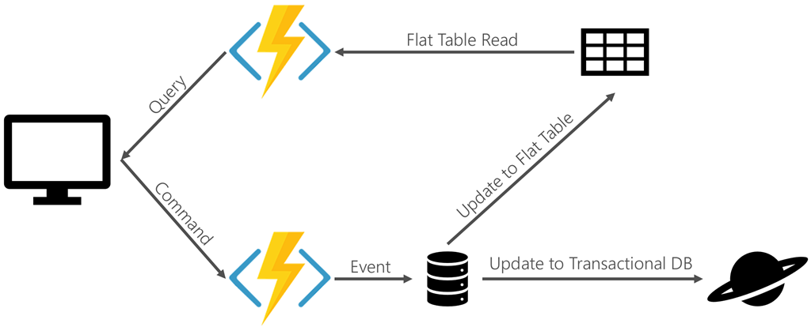
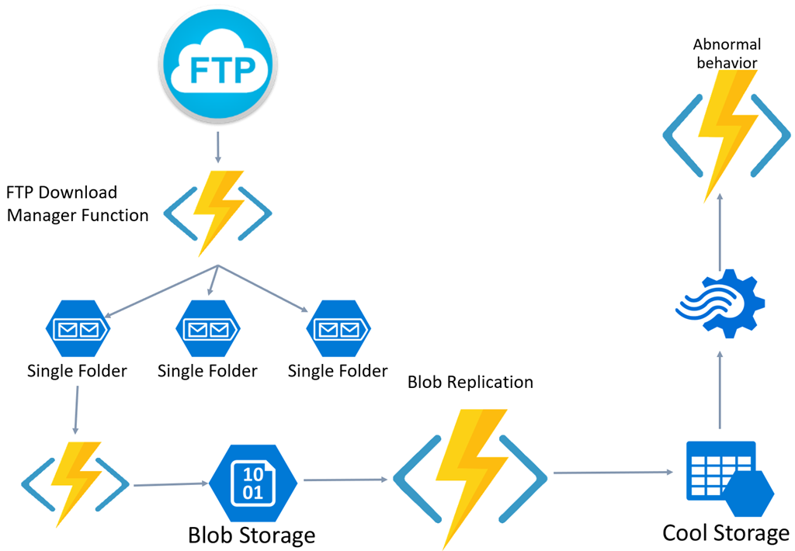

# Serverless design examples

There are many design patterns that exist for serverless. This section captures some common scenarios that use serverless. What all of the examples have in common is the fundamental combination of an event trigger and business logic.

## Scheduling

Scheduling tasks is a common function. The following diagram shows a legacy database that doesn't have appropriate integrity checks. The database must be scrubbed periodically. The serverless function finds invalid data and cleans it. The trigger is a timer that runs the code on a schedule.

## Command and Query Responsibility Segregation (CQRS)

Command and Query Responsibility Segregation (CQRS) is a pattern that provides different interfaces for reading (or querying) data and operations that modify data. It addresses several common problems. In traditional Create Read Update Delete (CRUD) based systems, conflicts can arise from high volume of both reads and writes to the same data store. Locking may frequently occur and dramatically slow down reads. Often, data is presented as a composite of several domain objects and read operations must combine data from different entities.

Using CQRS, a read might involve a special "flattened" entity that models data the way it's consumed. The read is handled differently than how it's stored. For example, although the database may store a contact as a header record with a child address record, the read could involve an entity with both header and address properties. There are myriad approaches to creating the read model. It might be materialized from views. Update operations could be encapsulated as isolated events that then trigger updates to two different models. Separate models exist for reading and writing.

Serverless can accommodate the CQRS pattern by providing the segregated endpoints. One serverless function accommodates queries or reads, and a different serverless function or set of functions handles update operations. A serverless function may also be responsible for keeping the read model up-to-date, and can be triggered by the database's [change feed](https://docs.microsoft.com/azure/cosmos-db/change-feed). Front-end development is simplified to connecting to the necessary endpoints. Processing of events is handled on the back end. This model also scales well for large projects because different teams may work on different operations.

## Event-based processing

In message-based systems, events are often collected in queues or publisher/subscriber topics to be acted upon. These events can trigger serverless functions to execute a piece of business logic. An example of event-based processing is event-sourced systems. An "event" is raised to mark a task as complete. A serverless function triggered by the event updates the appropriate database document. A second serverless function may use the event to update the read model for the system. [Azure Event Grid](https://docs.microsoft.com/azure/event-grid/overview) provides a way to integrate events with functions as subscribers.

> Events are informational messages. For more information, see [Event Sourcing pattern](https://docs.microsoft.com/azure/architecture/patterns/event-sourcing).

## File triggers and transformations

Extract, Transform, and Load (ETL) is a common business function. Serverless is a great solution for ETL because it allows code to be triggered as part of a pipeline. Individual code components can address various aspects. One serverless function may download the file, another applies the transformation, and another loads the data. The code can be tested and deployed independently, making it easier to maintain and scale where needed.

In the diagram, "cool storage" provides data that is parsed in [Azure Stream Analytics](https://docs.microsoft.com/azure/stream-analytics). Any issues encountered in the data stream trigger an Azure Function to address the anomaly.

## Asynchronous background processing and messaging

Asynchronous messaging and background processing allow applications to kick off processes without having to wait. An example of asynchronous processing is an OCR app. An image is submitted and queued for processing. Scanning the image to extract text may take time, and once it's finished a notification is sent. Serverless can handle both the invocation and the result in this scenario.

## Web apps and APIs

A popular scenario for serverless is N-tier applications, most commonly ones where the UI layer is a web app. The popularity of Single Page Applications (SPA) has surged recently. SPA apps render a single page, then rely on API calls and the returned data to dynamically render new UI without reloading a full page. Client-side rendering provides a much faster, more responsive application to the end user.

Serverless endpoints triggered by HTTP calls can be used to handle the API requests. For example, an ad services company may call a serverless function with user profile information to request custom advertising. The serverless function returns the custom ad and the web page renders it.

## Data pipeline

Serverless functions can be used to facilitate a data pipeline. In this example, a file triggers a function to translate data in a CSV file to data rows in a table. The organized table allows a Power BI dashboard to present analytics to the end user.

## Stream processing

Devices and sensors often generate streams of data that must be processed in real time. There are a number of technologies that can capture messages and streams from [Event Hubs](https://docs.microsoft.com/azure/event-hubs/event-hubs-what-is-event-hubs) and [IoT Hub](https://docs.microsoft.com/azure/iot-hub) to [Service Bus](/service-bus). Regardless of transport, serverless is an ideal mechanism for processing the messages and streams of data as they come in. Serverless can scale quickly to meet the demand of large volumes of data. The serverless code can apply business logic to parse the data and output in a structured format for action and analytics.

## API gateway

An API gateway provides a single point of entry for clients and then intelligently routes requests to back-end services. It's useful to manage large sets of services. It can also handle versioning and simplify development by easily connecting clients to disparate environments. Serverless can handle back-end scaling of individual microservices while presenting a single front end via an API gateway.

## Recommended resources

* [Azure Event Grid](https://docs.microsoft.com/azure/event-grid/overview)
* [Azure IoT Hub](https://docs.microsoft.com/azure/iot-hub)
* [Challenges and solutions for distributed data management](../microservices-architecture/architect-microservice-container-applications/distributed-data-management.md)
* [Designing microservices: identifying microservice boundaries](https://docs.microsoft.com/azure/architecture/microservices/microservice-boundaries)
* [Event Hubs](https://docs.microsoft.com/azure/event-hubs/event-hubs-what-is-event-hubs)
* [Event Sourcing pattern](https://docs.microsoft.com/azure/architecture/patterns/event-sourcing)
* [Implementing the Circuit Breaker pattern](../microservices-architecture/implement-resilient-applications/implement-circuit-breaker-pattern.md)
* [IoT Hub](https://docs.microsoft.com/azure/iot-hub)
* [Service Bus](https://docs.microsoft.com/azure/service-bus)
* [Working with the change feed support in Azure Cosmos DB](https://docs.microsoft.com/azure/cosmos-db/change-feed)

>[!div class="step-by-step"]
>[Previous](serverless-architecture-considerations.md)
>[Next](azure-serverless-platform.md)